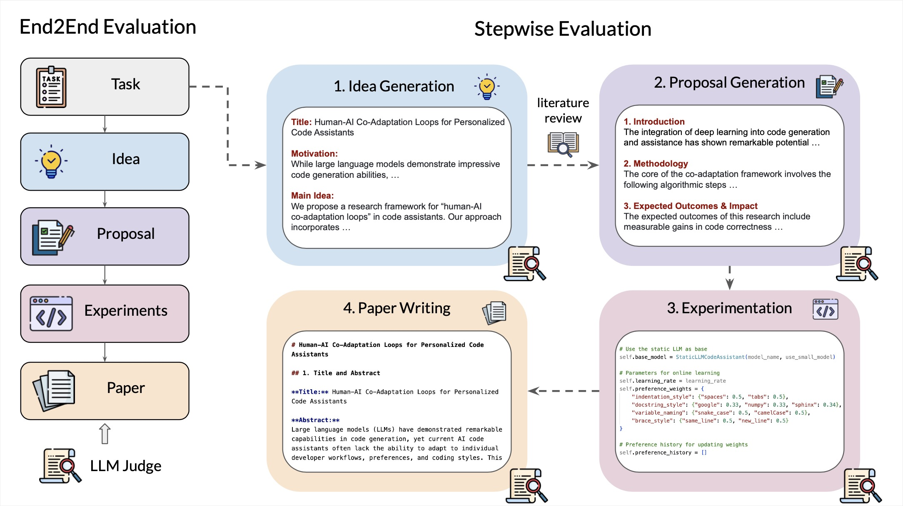
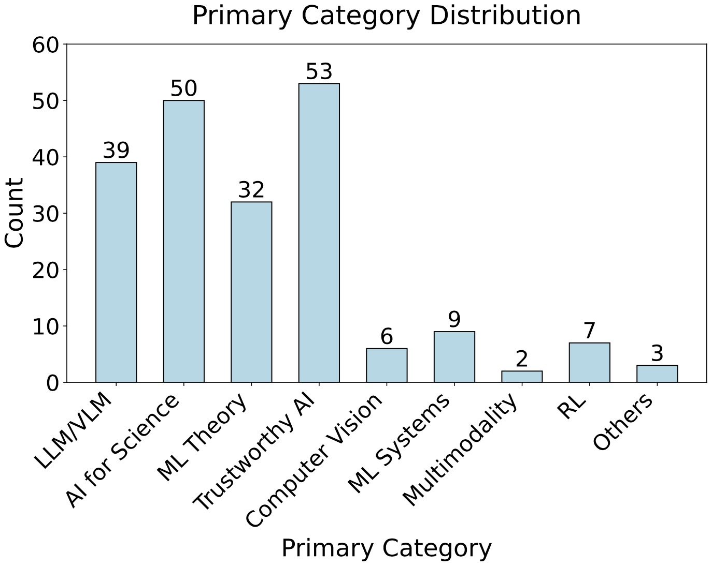

# 🤖️ MLR-Bench: Evaluating AI Agents on Open-Ended Machine Learning Research
[](https://opensource.org/license/mit-0)
[](https://arxiv.org/pdf/2505.19955)
[](https://huggingface.co/datasets/chchenhui/mlrbench-tasks)

## 💡 Introduction
**MLR-Bench** is a comprehensive benchmark for evaluating AI agents on open-ended machine learning research. It includes three key components: 
1. **Benchmark Dataset**: 201 research tasks sourced from NeurIPS, ICLR, and ICML workshops covering diverse ML topics;
2. **MLR-Agent**: a modular agent scaffold capable of completing research tasks through four stages: idea generation, proposal formulation, experimentation, and paper writing;
3. **MLR-Judge**: an automated evaluation framework combining LLM-based reviewers with carefully designed review rubrics to assess research quality.

<!-- *An overview of the framework of MLR-Bench, consisting of both an end-to-end evaluation (left) and a stepwise evaluation (right).* -->
<div align="center">
  </img>
  <br>
  <em>
      Figure 1: An overview of the framework of MLR-Bench, consisting of both an end-to-end evaluation (left) and a stepwise evaluation (right).
  </em>
</div>
<br>

## 📚 Benchmark Dataset
We colleted 201 tasks from ICLR/ICML/NeurIPS workshops over the past three years, as shown in ```tasks/```. Information of task metadata can be found in ```task_metadata.md```. This table show the number of tasks for different years.

|Year | Number |
|--------|------|
|2023 | 73 |
|2024 | 91 | 
|2025 | 37 |

The tasks can be categorized into 9 core ML topics: LLMs and Vision Language Models (VLMs), AI for Science, ML Theory, Trustworthy AI, Computer Vision, ML Systems, Multimodality, Reinforcement Learning (RL), and other emerging topics. Figure 2 shows the distribution.

<div align="center">
  </img>
  <br>
  <em>
      Figure 2: The number of tasks grouped by our ML primary categories.
  </em>
</div>
<br>

Our benchmark dataset is already released at Huggingface: [Link](https://huggingface.co/datasets/chchenhui/mlrbench-tasks). 

## 🛠️ Experimental Setup
Create a conda environment ```mlrbench``` and install all dependencies.
```bash
conda create -n mlrbench python=3.12
conda activate mlrbench
cd mlrbench
# pip install -r requirements.txt
pip install -e .
```

This work contains several frontier models such as ```o4-mini```, ```claude-3-7-sonnet``` and ```gemini-2.5-pro-preview```. We use OpenAI API and Anthropic API to access ```o4-mini``` and ```claude-3-7-sonnet```. We use OpenRouter API to access other models.
Please set up your API keys before starting the experiments:
```bash
export OPENAI_API_KEY="your-openai-api-key-here"
export ANTHROPIC_API_KEY="your-anthropic-api-key-here"
export OPENROUTER_API_KEY="your-openrouter-api-key-here"
```
Also, remember to ```huggingface-cli login``` for dataset/model downloads.

## 🚀 MLR Agent

If you want to run our agent in an end-to-end manner, please create ```your_task_folder``` and put ```your_task``` containing a ```task.md``` inside. Note that our agent will sequentially complete all tasks in ```your_task_folder```. Therefore, if you only need to complete one task, please place only that task in ```your_task_folder```.

```
.
└── <your_task_folder>
        ├── <your_task1>
        │      └── task.md
        └── <your_task2>
               └── task.md
```
Then, run the following command:
```bash
python run_mlr_agent.py --model_name <model_name> --task_folder <task_folder>
```

If you want to run the agent step by step, please set up your own configs in ```mlrbench/agent``` and then run
```bash
python mlrbench/agent/idea_generator.py
python mlrbench/agent/lit_review.py
python mlrbench/agent/proposal_generator.py
bash mlrbench/agent/claude.sh
python mlrbench/agent/paper_writer.py
```
Results will be saved in a ```Markdown``` file.

## 📝 MLR Judge
If you want to review the generated results, please look into ```mlrbench/evals``` and set up your own configs. 

For end-to-end evaluation, please run this command:
```bash
python mlrbench/evals/overall_review.py
```
For stepwise evaluation, please run
```bash
python mlrbench/evals/review_idea.py # review your idea
python mlrbench/evals/review_proposal.py # review your proposal
python mlrbench/evals/review_experiments.py # review your experimental results
python mlrbench/evals/review_writeup.py # review your writing
```
## Acknowledgement
Implementation of (multimodal) LLM engine in our codebase is inspired by the [VisionAgent](https://github.com/landing-ai/vision-agent.git) project. We are grateful for their pioneering efforts.

## Citation
Please cite our paper if you find our work helpful:
```bibtex
@article{chen2025mlrbench,
      title={MLR-Bench: Evaluating AI Agents on Open-Ended Machine Learning Research}, 
      author={Chen, Hui and Xiong, Miao and Lu, Yujie and Han, Wei and Deng, Ailin and He, Yufei and Wu, Jiaying and Li, Yibo and Liu, Yue and Hooi, Bryan},
      journal={arXiv preprint arXiv:2505.19955},
      year={2025}
}
```
Please feel free to contact hui.chen@nus.edu.sg if you have any questions.
