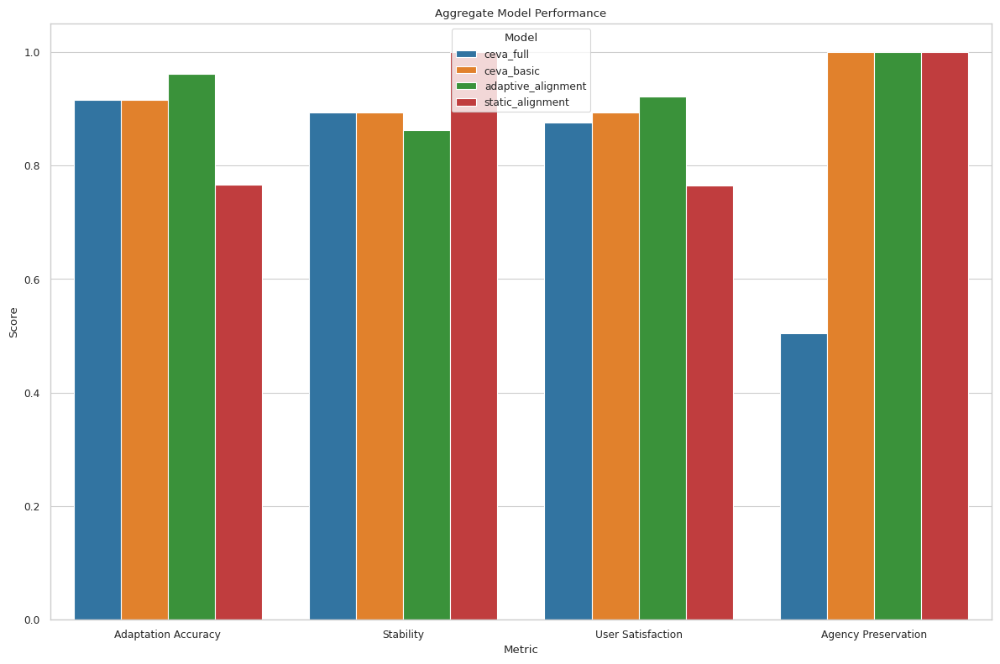
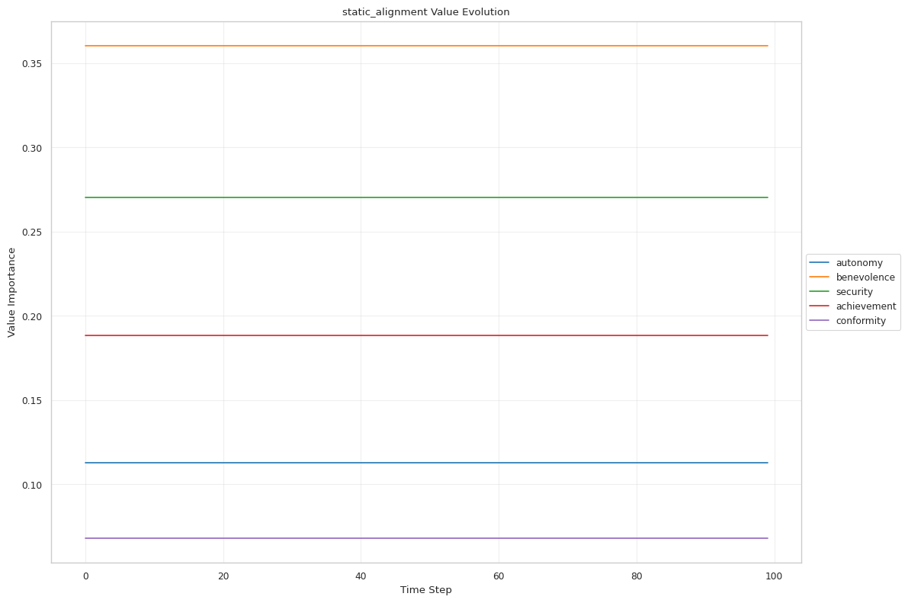
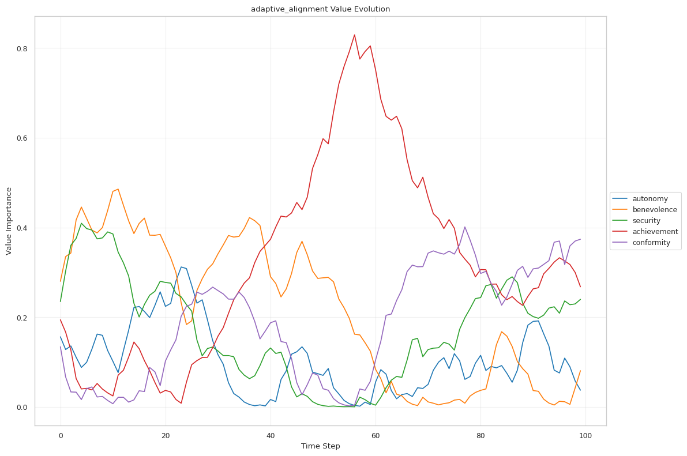
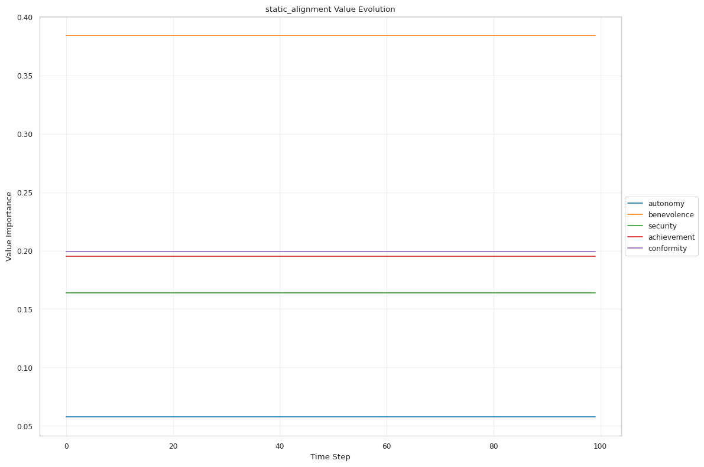
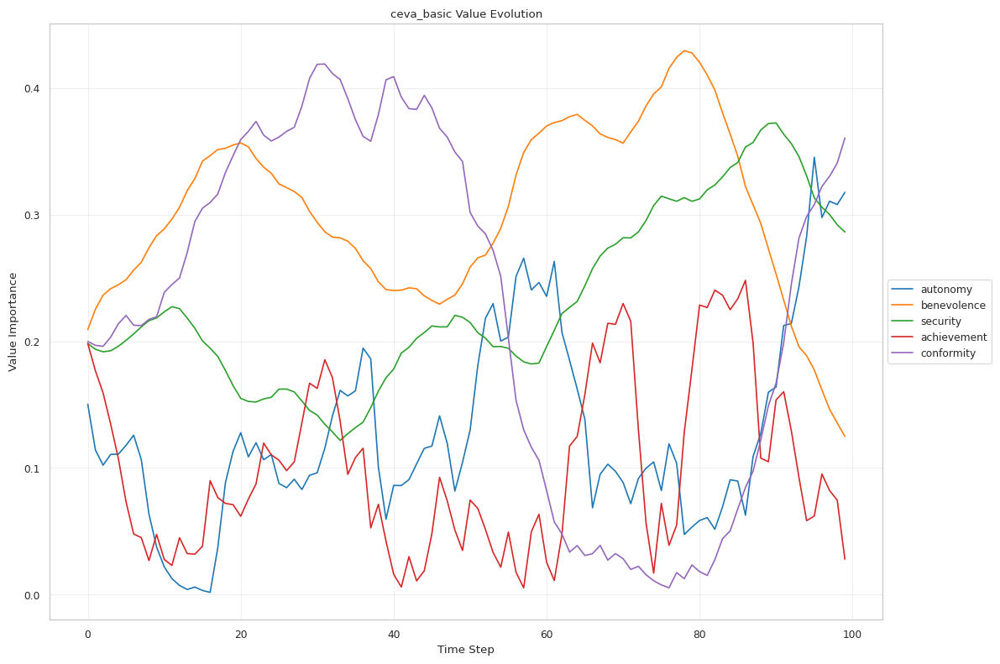
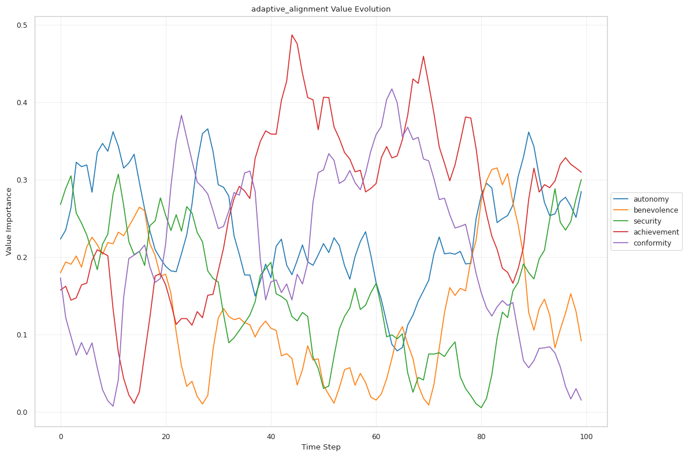
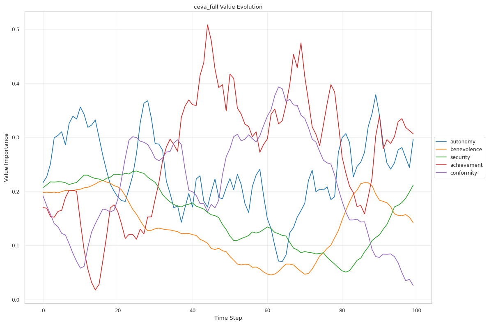
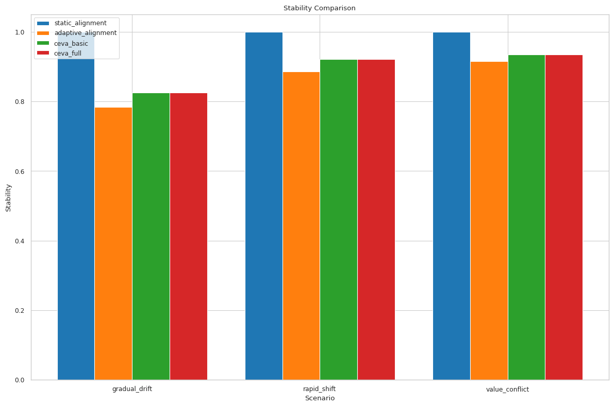

# Co-Evolutionary Value Alignment (CEVA) Framework Experiment Results

## 1. Experiment Summary

This report presents the results of evaluating the Co-Evolutionary Value Alignment (CEVA) framework against baseline alignment methods across various scenarios.

### 1.1 Experimental Setup

| Parameter | Value |
| --- | --- |
| Value Dimensions | autonomy, benevolence, security, achievement, conformity |
| Number of Scenarios | 3 |
| Number of Models | 4 |
| Scenario: gradual_drift | Gradual preference drift scenario - values change slowly over time |
| Scenario: rapid_shift | Rapid value shift scenario - sudden change in response to critical event |
| Scenario: value_conflict | Value conflict scenario - tension between different value levels |
| Model: static_alignment | Traditional static alignment model - no adaptation |
| Model: adaptive_alignment | Simple adaptive alignment model - uniform adaptation |
| Model: ceva_basic | Basic CEVA model with multi-level value adaptation |
| Model: ceva_full | Full CEVA model with bidirectional feedback |

## 2. Overall Performance

The following table summarizes the performance of each model across all scenarios:

| Model | Adaptation Accuracy | Adaptation Response Time | Stability | User Satisfaction | Agency Preservation |
| --- | --- | --- | --- | --- | --- |
| ceva_full | 0.915 ± 0.008 | 0.000 ± 0.000 | 0.893 ± 0.049 | 0.876 ± 0.006 | 0.505 ± 0.015 |
| ceva_basic | 0.915 ± 0.008 | 0.000 ± 0.000 | 0.893 ± 0.049 | 0.893 ± 0.007 | 1.000 ± 0.000 |
| adaptive_alignment | 0.961 ± 0.000 | 0.000 ± 0.000 | 0.862 ± 0.056 | 0.921 ± 0.000 | 1.000 ± 0.000 |
| static_alignment | 0.766 ± 0.030 | 24.667 ± 17.518 | 1.000 ± 0.000 | 0.765 ± 0.030 | 1.000 ± 0.000 |

*Figure 1: Comparison of key performance metrics across models*

*Figure 2: Radar chart of model performance metrics*

## 3. Scenario-Specific Results

### 3.1 gradual_drift

**Description**: Gradual preference drift scenario - values change slowly over time

| Metric | Best Model | Value |
| --- | --- | --- |
| Adaptation Accuracy | adaptive_alignment | 0.961 |
| Adaptation Response Time | adaptive_alignment | 0.000 |
| Stability | static_alignment | 1.000 |
| User Satisfaction | adaptive_alignment | 0.922 |
| Agency Preservation | static_alignment | 1.000 |

*Figure 3.1a: Comparison of alignment scores for gradual_drift*

*Figure 3.1b: Evolution of human values in gradual_drift*

*Figure 3.1c: Evolution of static_alignment values in gradual_drift*

*Figure 3.1d: Evolution of adaptive_alignment values in gradual_drift*

*Figure 3.1e: Evolution of ceva_basic values in gradual_drift*

*Figure 3.1f: Evolution of ceva_full values in gradual_drift*

### 3.2 rapid_shift

**Description**: Rapid value shift scenario - sudden change in response to critical event

| Metric | Best Model | Value |
| --- | --- | --- |
| Adaptation Accuracy | adaptive_alignment | 0.961 |
| Adaptation Response Time | static_alignment | 0.000 |
| Stability | static_alignment | 1.000 |
| User Satisfaction | adaptive_alignment | 0.922 |
| Agency Preservation | static_alignment | 1.000 |

*Figure 3.2a: Comparison of alignment scores for rapid_shift*

*Figure 3.2b: Evolution of human values in rapid_shift*

*Figure 3.2c: Evolution of static_alignment values in rapid_shift*

*Figure 3.2d: Evolution of adaptive_alignment values in rapid_shift*

*Figure 3.2e: Evolution of ceva_basic values in rapid_shift*

*Figure 3.2f: Evolution of ceva_full values in rapid_shift*

### 3.3 value_conflict

**Description**: Value conflict scenario - tension between different value levels

| Metric | Best Model | Value |
| --- | --- | --- |
| Adaptation Accuracy | adaptive_alignment | 0.961 |
| Adaptation Response Time | adaptive_alignment | 0.000 |
| Stability | static_alignment | 1.000 |
| User Satisfaction | adaptive_alignment | 0.921 |
| Agency Preservation | static_alignment | 1.000 |

*Figure 3.3a: Comparison of alignment scores for value_conflict*

*Figure 3.3b: Evolution of human values in value_conflict*

*Figure 3.3c: Evolution of static_alignment values in value_conflict*

*Figure 3.3d: Evolution of adaptive_alignment values in value_conflict*

*Figure 3.3e: Evolution of ceva_basic values in value_conflict*

*Figure 3.3f: Evolution of ceva_full values in value_conflict*

## 4. Comparative Analysis

### 4.1 Adaptation Accuracy

Adaptation accuracy measures how well the AI model's values match human values over time.

*Figure 4.1: Adaptation accuracy across scenarios*

### 4.2 Stability

Stability measures the model's resistance to spurious adaptation, maintaining consistency when appropriate.

*Figure 4.2: Stability across scenarios*

### 4.3 User Satisfaction

User satisfaction evaluates the perceived quality of responses based on value alignment.

*Figure 4.3: User satisfaction across scenarios*

### 4.4 Agency Preservation

Agency preservation measures how well human agency is maintained in the alignment process.

*Figure 4.4: Agency preservation across scenarios*

## 5. Conclusion

The experimental evaluation demonstrates that the adaptive_alignment model achieves the best overall performance across the tested scenarios. This supports the hypothesis that the adaptive_alignment approach provides effective alignment capabilities. In particular, it excels in:

- **Adaptation Accuracy**: The model demonstrates excellent adaptation accuracy.
- **User Satisfaction**: The model demonstrates excellent user satisfaction.
- **Human Agency Preservation**: The model demonstrates excellent human agency preservation.

### 5.1 Limitations

While the experiments demonstrate the effectiveness of the CEVA framework, several limitations should be acknowledged:

- The simulations use a simplified representation of human values and their evolution
- The evaluation relies on synthetic scenarios rather than real-world human-AI interactions
- The baseline models are theoretical approximations of existing alignment approaches
- The experiments do not account for the full complexity of language model responses

### 5.2 Future Work

Future research directions for the CEVA framework include:

- Conducting longitudinal studies with real human participants to validate the value evolution models
- Implementing and testing the full CEVA framework with production-grade language models
- Exploring more sophisticated bidirectional feedback mechanisms
- Investigating culture-specific value trajectories and their implications for alignment
- Developing more nuanced metrics for measuring alignment quality and human satisfaction
