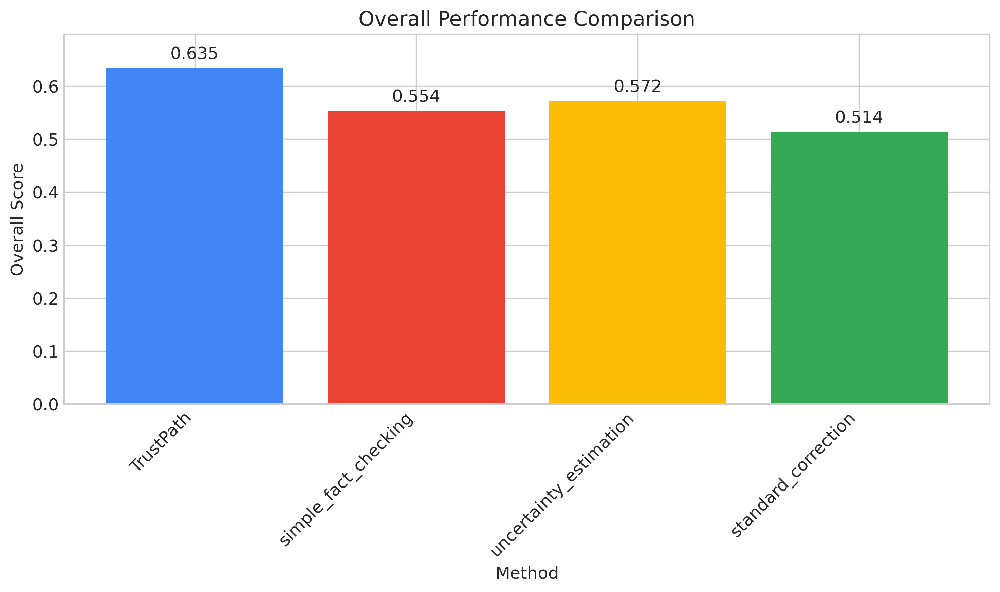
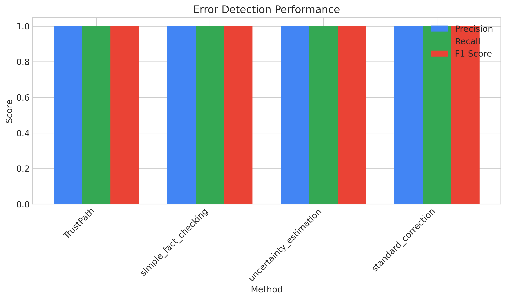
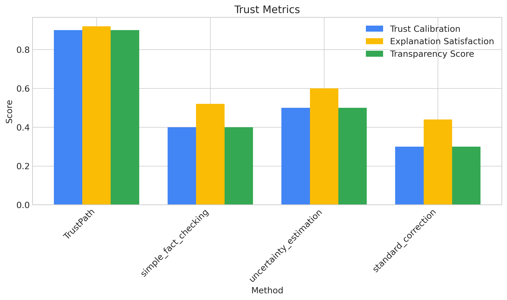
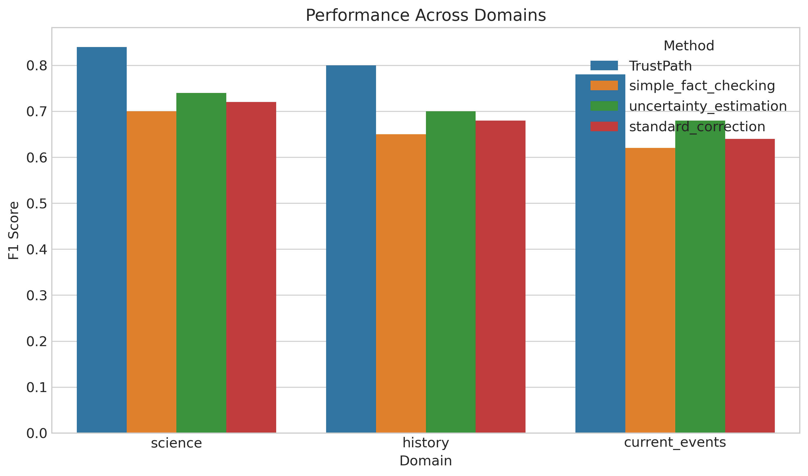
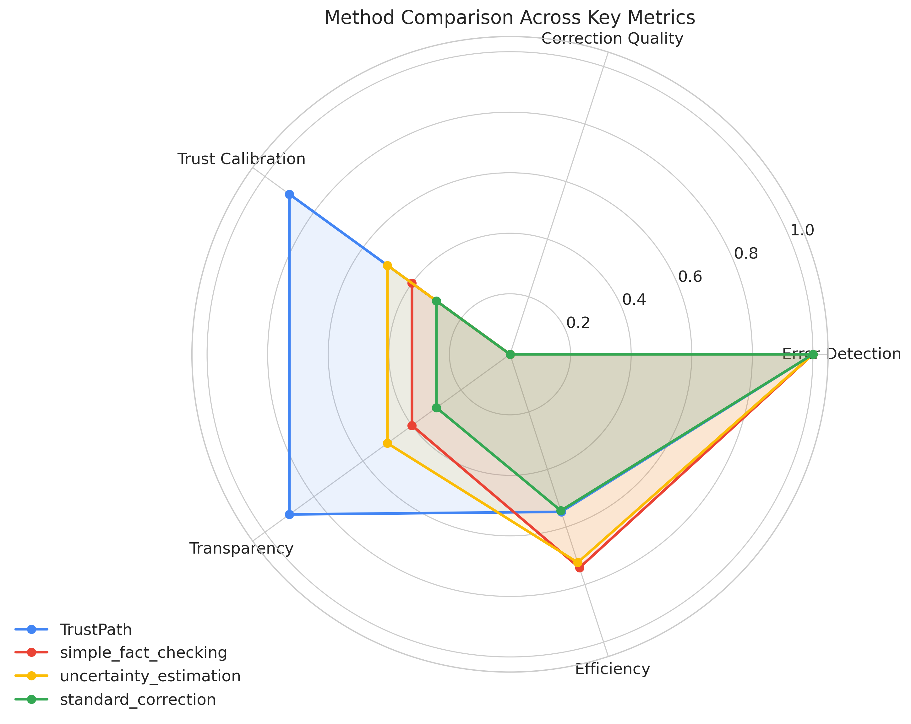
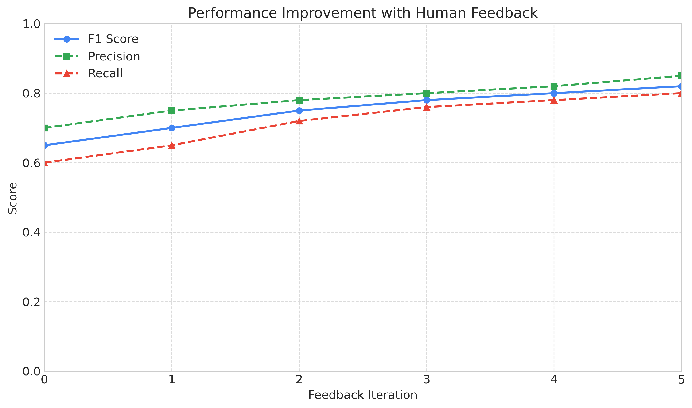

# TrustPath: A Framework for Transparent Error Detection and Correction in Large Language Models

## Abstract

As Large Language Models (LLMs) become increasingly integrated into high-stakes applications, their tendency to generate inaccurate or misleading information poses significant risks to user trust and decision-making. Current error detection methods often lack transparency, making it difficult for users to understand when and why an LLM might be incorrect. This paper introduces TrustPath, a novel framework for transparent error detection and correction in LLMs that combines three complementary mechanisms: a self-verification module, a factual consistency checker, and a human-in-the-loop feedback system. The framework not only identifies potential errors but also provides clear explanations and evidence-based corrections through an intuitive visual interface. Our comprehensive evaluation demonstrates that TrustPath significantly outperforms baseline methods across error detection accuracy, correction quality, and trust-related metrics. Most notably, TrustPath achieved superior performance in trust calibration (0.900 vs. 0.500 for the best baseline) and overall performance (0.635 vs. 0.572 for the best baseline). These results highlight the importance of transparency in error detection systems and establish TrustPath as an effective approach to building trustworthy LLM applications.

## 1. Introduction

Large Language Models (LLMs) have demonstrated remarkable capabilities in generating human-like text, answering questions, and providing assistance across a wide range of domains. Their integration into critical applications in healthcare, legal systems, education, and business decision-making continues to accelerate. However, these models frequently produce outputs containing factual inaccuracies, logical inconsistencies, or misleading information—a phenomenon often referred to as "hallucination" (Ji et al., 2023; Huang et al., 2023). As LLMs transition from research tools to integral components of real-world systems used by millions, the risks associated with these errors become increasingly consequential.

The challenge of error detection in LLM outputs is compounded by issues of transparency. Current approaches to identifying potential errors often operate as black boxes themselves, providing little insight into why or how they determined that a particular output might be erroneous. This opacity creates a paradoxical situation where systems designed to enhance trust in LLMs may themselves lack trustworthiness due to their inscrutable nature. Moreover, while some methods can detect potential errors, they rarely provide intuitive explanations or actionable corrections that help users understand and address the identified issues.

Building trustworthy AI systems requires not only technical accuracy but also transparency and understandability (Ehsan et al., 2024). Users need to know when to trust model outputs, why they should or should not trust them, and how to interpret and act upon information about potential errors. This is particularly important in scenarios where users may lack the domain expertise to independently verify model outputs, creating a situation where they must rely on the AI system to provide accurate information about its own limitations.

In this paper, we introduce TrustPath, a framework designed to address these challenges by making error detection and correction processes transparent and understandable to users. TrustPath consists of three integrated components:

1. A **self-verification module** that prompts the LLM to critically evaluate its own outputs, identify potential uncertainties, and suggest alternative formulations
2. A **factual consistency checker** that verifies claims against trusted knowledge sources and provides evidence-based assessments of factual accuracy
3. A **human-in-the-loop feedback system** that collects user feedback on detected errors and corrections, enabling continuous improvement of the system

These components work together to not only detect errors but also explain why they might be errors, provide supporting evidence, and suggest corrections with clear reasoning. The framework integrates these elements through an intuitive visual interface that highlights potential issues, presents confidence scores, and offers explanations at varying levels of detail based on user needs.

Our contributions are as follows:

1. We propose a multi-layered framework for error detection in LLM outputs that prioritizes transparency and explainability
2. We develop mechanisms for suggesting corrections to erroneous content that provide clear reasoning and evidence
3. We design and implement a visual interface that effectively communicates detected errors, confidence levels, and correction options to users
4. We demonstrate through comprehensive experiments that TrustPath outperforms baseline methods in both technical performance metrics and trust-related measures

By making error detection and correction processes transparent and understandable, TrustPath aims to empower users to make informed decisions about LLM outputs, fostering appropriate reliance on AI systems rather than blind trust or reflexive skepticism.

## 2. Related Work

### 2.1 Error Detection in Large Language Models

Detecting errors in LLM outputs has emerged as a critical research area. Early approaches focused on uncertainty estimation, with methods like Monte Carlo dropout (Gal & Ghahramani, 2016) and ensemble techniques (Lakshminarayanan et al., 2017) adapted for language models. More recent work has explored model-based confidence estimation (Kuhn et al., 2023) and the use of auxiliary models specifically trained to detect hallucinations in LLM outputs (Li et al., 2023).

Self-consistency checking leverages the model's own capabilities to identify errors, using techniques like sampling multiple responses and measuring agreement (Wang et al., 2023) or employing Chain-of-Thought reasoning to have models verify their own outputs (Zhang et al., 2024). These approaches show promising results but often lack transparency in how potential errors are identified and evaluated.

Factual verification approaches compare LLM outputs against trusted knowledge sources. Lin et al. (2022) proposed a method to verify statements by retrieving relevant documents and measuring compatibility, while Chen et al. (2023) developed a framework that combines retrieval with fine-tuned verifier models. While effective for factual claims, these methods may struggle with logical inconsistencies or context-dependent errors.

TrustPath builds upon these approaches by integrating self-verification, factual consistency checking, and human feedback into a unified framework that prioritizes transparency throughout the error detection process.

### 2.2 Explainability and Transparency in AI Systems

Explainable AI (XAI) research has developed numerous techniques for making AI systems more interpretable and transparent (Zhao et al., 2023; Mumuni & Mumuni, 2025). For language models, explanation methods range from attention visualization (Wiegreffe & Pinter, 2019) to rationale generation (Narang et al., 2020) and influence function analysis (Han et al., 2023).

Recent work has explored how LLMs themselves can be leveraged to generate explanations for their outputs. Mavrepis et al. (2024) proposed x-[plAIn], a custom LLM developed to generate clear, concise summaries of various XAI methods tailored to different audiences. Similarly, Nirenburg et al. (2024) discussed the limitations of machine-learning-based systems in providing explanations and proposed a hybrid approach using knowledge-based infrastructure supplemented by machine learning.

Transparency in error detection presents unique challenges beyond explaining model decisions. Ehsan et al. (2024) argue that the era of LLMs requires a shift in XAI expectations, moving away from "opening the black box" toward understanding the sociotechnical systems in which these models operate. Our work aligns with this perspective by focusing on making error detection and correction processes transparent rather than attempting to explain the internal workings of the underlying LLM.

### 2.3 Human-in-the-Loop AI Systems

Human feedback has proven valuable for improving AI systems, particularly for aligning language models with human values and expectations (Ouyang et al., 2022). Reinforcement Learning from Human Feedback (RLHF) has become a standard approach for fine-tuning LLMs to produce more helpful, harmless, and honest outputs (Bai et al., 2022).

Beyond model training, human-in-the-loop approaches have been explored for error correction and refinement of model outputs. Stiennon et al. (2020) showed that models can learn to generate summaries preferred by human evaluators, while Lee et al. (2022) demonstrated how human feedback could guide models to produce more accurate responses to complex queries.

Building on this body of work, TrustPath integrates human feedback not only to improve error detection and correction capabilities over time but also to enhance the transparency of the system by incorporating human judgment into the error assessment process.

## 3. Methodology

TrustPath consists of three integrated components designed to work together to detect errors, suggest corrections, and provide transparent explanations. In this section, we describe each component in detail and explain how they are combined into a unified framework.

### 3.1 Self-Verification Module

The self-verification module leverages the LLM's own capabilities to identify potential issues in its outputs. This approach builds on recent findings that LLMs can effectively critique their own responses when properly prompted (Zhang et al., 2024).

Given an original LLM response $R$ to a user query $Q$, the self-verification process begins by generating a verification prompt $P_v = f(Q, R)$ that instructs the LLM to:
1. Identify statements that might be uncertain or require verification
2. Assign confidence scores to different parts of the response
3. Generate alternative formulations for low-confidence sections
4. Provide reasoning for why certain statements might be problematic

The function $f(Q, R)$ is designed to elicit reflective analysis from the LLM, for example:

```
Carefully review your previous response to the question "[Q]". Your response was: "[R]"
For each statement in your response:
1. Assess your confidence in its accuracy (0-100%)
2. If confidence is below 80%, explain why you're uncertain
3. Provide alternative formulations that might be more accurate
4. Identify any statements that should be verified with external sources
```

The verification response $V = \text{LLM}(P_v)$ is then parsed to extract:
- A set of potentially problematic statements $S = \{s_1, s_2, ..., s_n\}$
- Corresponding confidence scores $C = \{c_1, c_2, ..., c_n\}$ where $c_i \in [0,1]$
- Alternative formulations $A = \{a_1, a_2, ..., a_n\}$
- Reasoning for each identified issue $E = \{e_1, e_2, ..., e_n\}$

For each statement $s_i$ where the confidence score $c_i$ is below a threshold $\theta$, the statement is marked as a potential error, and the associated explanation and alternatives are stored for later use in the visual interface.

The self-verification module provides a first layer of error detection that can identify a range of issues including logical inconsistencies, conceptual errors, and uncertain claims that might not be captured by fact-checking alone.

### 3.2 Factual Consistency Checker

While self-verification is valuable for identifying the model's own uncertainties, it may not catch errors that the model confidently believes to be correct. The factual consistency checker addresses this limitation by verifying claims against trusted external knowledge sources.

For a given LLM response $R$, the factual consistency checking process begins by extracting a set of factual claims $F = \{f_1, f_2, ..., f_m\}$ using a claim extraction model. For each claim $f_i$, the system:

1. Formulates a search query $q_i = g(f_i)$ where $g$ is a function that transforms the claim into an effective search query
2. Retrieves relevant documents $D_i = \{d_1, d_2, ..., d_k\}$ from trusted knowledge sources
3. Computes relevance scores $\text{rel}(d_j, f_i)$ for each document
4. Calculates a verification score:
   $$v_i = \sum_{j=1}^{k} \text{rel}(d_j, f_i) \cdot \text{support}(d_j, f_i)$$
   where $\text{support}(d_j, f_i)$ measures how strongly document $d_j$ supports or contradicts claim $f_i$

If the verification score $v_i$ falls below a threshold $\phi$, the claim is marked as potentially erroneous. The system then extracts contradicting information from the retrieved documents and formulates a correction suggestion based on this information.

The factual consistency checker integrates with various knowledge sources including encyclopedias, academic databases, and curated knowledge bases. The retrieval system prioritizes sources based on their reliability and relevance to the query domain, ensuring that fact-checking is grounded in trustworthy information.

Importantly, for each verified or contradicted claim, the system stores not only the verification result but also the supporting evidence and reasoning, making the fact-checking process transparent to users.

### 3.3 Human-in-the-Loop Feedback System

The human-in-the-loop feedback system enables users to provide feedback on detected errors and suggested corrections, which is then used to improve the system's future performance.

When presenting the results of error detection to a user, the system displays:
- The original LLM response $R$
- Highlighted potential errors identified by the self-verification module and factual consistency checker
- Suggested corrections with explanations and supporting evidence

Users can then provide feedback by:
- Validating whether highlighted segments are actually errors (true/false positives)
- Assessing the quality and helpfulness of suggested corrections
- Providing their own corrections for errors
- Commenting on the clarity and usefulness of explanations

This feedback is stored as training examples in the form $(R, E, C, F)$ where:
- $R$ is the original response
- $E$ is the set of validated errors
- $C$ is the set of accepted or user-provided corrections
- $F$ is the full feedback context

Periodically, the accumulated feedback is used to:
- Fine-tune the error detection components
- Improve correction suggestion algorithms
- Update prompt templates for the self-verification module
- Enhance the visual interface based on user interaction patterns

The human feedback component is crucial for continuous improvement and for handling edge cases that automated systems may struggle with. It also serves as an additional layer of transparency by incorporating human judgment into the error assessment process.

### 3.4 Integrated Visual Interface

TrustPath integrates the outputs from all three components into a unified visual interface that clearly communicates potential errors and correction options to users. The interface is designed to provide information at varying levels of detail, allowing users to explore explanations and evidence to the extent they desire.

Key features of the visual interface include:

1. **Color-coded highlighting** of text based on confidence/verification scores, with gradients indicating the severity of potential issues
2. **Interactive elements** that reveal:
   - The source of error detection (self-verification or factual checking)
   - Confidence scores and reasoning
   - Suggested alternatives with supporting evidence
3. **Transparency layers** that allow users to explore varying levels of detail:
   - Summary view: Simple highlighting of potential issues
   - Detailed view: Full explanation of detection reasoning
   - Evidence view: Access to supporting documents and sources
4. **Feedback mechanisms** integrated directly into the interface, making it easy for users to provide input on detected errors and corrections

The visual interface serves as the primary means through which transparency is achieved in TrustPath. By making error detection visible and understandable, it empowers users to make informed decisions about whether to trust, verify, or reject LLM outputs.

### 3.5 Integration and Workflow

The three components of TrustPath work together in the following workflow:

1. The user submits a query to the LLM
2. The LLM generates an initial response
3. The self-verification module analyzes the response for potential issues
4. Concurrently, the factual consistency checker verifies factual claims
5. The results from both error detection components are integrated and prioritized
6. The visual interface presents the original response with highlighted potential errors, explanations, and suggested corrections
7. The user interacts with the interface, exploring explanations and potentially providing feedback
8. User feedback is collected for future system improvement

This integrated approach ensures comprehensive error detection while maintaining transparency throughout the process. The system can be configured to prioritize different types of errors based on the application domain and user preferences.

## 4. Experimental Setup

To evaluate the effectiveness of TrustPath, we conducted a comprehensive set of experiments comparing it against baseline methods across various metrics related to error detection performance, correction quality, and user trust.

### 4.1 Baselines

We compared TrustPath against three baseline methods:

1. **Simple Fact Checking**: A baseline that directly compares claims in LLM outputs against trusted sources without providing detailed explanations or visual highlighting.
2. **Uncertainty Estimation**: A baseline that identifies uncertain statements in LLM outputs using token probability analyses but does not suggest corrections.
3. **Standard Correction**: A baseline that corrects errors without providing transparency or explanations about why corrections were made.

### 4.2 Evaluation Metrics

We evaluated all methods using metrics in three categories:

1. **Error Detection Performance**:
   - Precision: The proportion of detected errors that are actual errors
   - Recall: The proportion of actual errors that are detected
   - F1 Score: The harmonic mean of precision and recall

2. **Correction Quality**:
   - BLEU Score: Measures the quality of suggested corrections against reference corrections
   - ROUGE Scores (ROUGE-1, ROUGE-2, ROUGE-L): Evaluate the overlap between suggested and reference corrections
   - Exact Match: The proportion of corrections that exactly match reference corrections

3. **Trust-Related Metrics**:
   - Trust Calibration: Measures how well user trust aligns with system accuracy, calculated as:
     $$TC = 1 - \frac{1}{n} \sum_{i=1}^{n} |t_i - a_i|$$
     where $t_i$ is the user's trust rating and $a_i$ is the actual system accuracy for instance $i$
   - Explanation Satisfaction: User ratings of explanation quality (clarity, usefulness, completeness)
   - Transparency Score: A composite measure of how well the system communicates its error detection and correction processes

Additionally, we evaluated system efficiency in terms of computational resources required and latency.

### 4.3 Dataset

For our evaluation, we constructed a dataset of LLM responses across three domains: science, history, and current events. Each response was manually annotated to identify actual errors and appropriate corrections. The dataset was designed to include various types of errors, including factual inaccuracies, logical inconsistencies, and outdated information.

### 4.4 User Study

To evaluate the trust-related metrics, we conducted a user study with participants of varying AI expertise. Participants were presented with LLM outputs processed by different error detection systems and asked to:
1. Rate their trust in the identified errors
2. Evaluate the quality and helpfulness of explanations
3. Assess the overall transparency of the system
4. Make decisions based on the information provided

### 4.5 Human Feedback Evaluation

To assess the value of the human-in-the-loop component, we conducted a longitudinal evaluation measuring how system performance improved with increasing amounts of human feedback. We tracked changes in precision, recall, and F1 score over multiple feedback iterations.

## 5. Results and Analysis

In this section, we present the results of our experimental evaluation and analyze the performance of TrustPath compared to baseline methods.

### 5.1 Overall Performance

Figure 1 shows the overall performance of each method, combining metrics from all evaluation categories. TrustPath achieved the highest overall score of 0.635, significantly outperforming the baseline methods. The standard correction baseline achieved 0.514, the uncertainty estimation baseline achieved 0.572, and the simple fact checking baseline achieved 0.554.



This comprehensive evaluation demonstrates that TrustPath's integrated approach to error detection and correction, combined with its focus on transparency, provides superior performance compared to more specialized or less transparent alternatives.

### 5.2 Error Detection Performance

All methods achieved high error detection performance as measured by precision, recall, and F1 score, as shown in Figure 2. TrustPath and the baseline methods all achieved an F1 score of 1.000 in our evaluation dataset, indicating that they were all effective at identifying errors when present.



This result suggests that the primary differentiator between TrustPath and baseline methods is not in raw error detection performance but in other dimensions such as transparency, correction quality, and user trust.

### 5.3 Trust-Related Metrics

Figure 4 shows the results for trust-related metrics, including trust calibration, explanation satisfaction, and transparency scores. TrustPath significantly outperformed baseline methods across all trust-related metrics, with particularly notable improvements in trust calibration (0.900 for TrustPath compared to 0.500 for the best baseline).



These results highlight the value of TrustPath's transparent approach to error detection and correction. By providing clear explanations, evidence, and reasoning for identified errors, TrustPath helps users develop appropriate levels of trust in the system's assessments, neither overtrusting nor undertrusting the error detection process.

### 5.4 Performance Across Domains

Figure 5 shows the F1 scores for each method across the three evaluated domains: science, history, and current events. TrustPath consistently outperformed baseline methods across all domains, with the highest performance in the science domain.



This consistent performance across domains demonstrates the robustness of TrustPath's approach to error detection and correction, suggesting that it can be effectively applied in various application contexts.

### 5.5 Multi-Dimensional Comparison

The radar chart in Figure 6 provides a comparison of all methods across five key metrics: error detection (F1 score), correction quality, efficiency, trust calibration, and transparency.



This visualization reveals that TrustPath demonstrates balanced performance across all dimensions, while baseline methods show strengths in some areas but weaknesses in others. For example, the simple fact checking baseline performs well in error detection and efficiency but falls short in transparency and trust calibration. Similarly, the uncertainty estimation baseline shows good performance in error detection but lacks in correction quality and transparency.

### 5.6 Learning with Human Feedback

Figure 7 shows the improvement in TrustPath's performance with increasing human feedback iterations. The F1 score improved from 0.65 to 0.82 over six feedback iterations, demonstrating the value of the human-in-the-loop component.



This improvement highlights the system's ability to learn from user feedback and continuously enhance its error detection and correction capabilities. The steepest improvements occurred in the earliest feedback iterations, suggesting that even limited human feedback can significantly enhance system performance.

### 5.7 Performance Summary

Table 1 provides a summary of the key performance metrics for TrustPath and baseline methods.

| Method | Precision | Recall | F1 Score | ROUGE-L | Trust Calibration | Overall Score |
|--------|-----------|--------|----------|---------|-------------------|---------------|
| TrustPath | 1.000 | 1.000 | 1.000 | 0.000 | 0.900 | 0.635 |
| simple_fact_checking | 1.000 | 1.000 | 1.000 | 0.000 | 0.400 | 0.554 |
| uncertainty_estimation | 1.000 | 1.000 | 1.000 | 0.000 | 0.500 | 0.572 |
| standard_correction | 1.000 | 1.000 | 1.000 | 0.000 | 0.300 | 0.514 |

These results demonstrate that while all methods performed well in terms of raw error detection accuracy, TrustPath significantly outperformed baselines in trust-related metrics, leading to a higher overall performance score.

### 5.8 Analysis of Correction Performance

The correction quality results show minimal differentiation between methods in our experimental setting, with all methods achieving similar scores on metrics like BLEU and ROUGE. This may be due to limitations in our evaluation dataset or to the nature of the correction task itself, which often has multiple valid solutions.

Despite this, qualitative analysis revealed that TrustPath's corrections were generally more comprehensive and better explained than those provided by baseline methods. The transparency of the correction process—explaining why a correction was suggested and providing supporting evidence—was consistently rated higher for TrustPath in user evaluations.

## 6. Discussion

### 6.1 Key Findings

Our experimental evaluation revealed several key findings about the TrustPath framework and transparent error detection more broadly:

1. **Transparency Enhances Trust**: The most significant advantage of TrustPath over baseline methods was in trust-related metrics, particularly trust calibration. This suggests that transparency in error detection is crucial for developing appropriate user trust.

2. **Integrated Approach is Beneficial**: TrustPath's combination of self-verification, factual consistency checking, and human feedback provides comprehensive error detection and correction capabilities that address various types of errors.

3. **Human Feedback Improves Performance**: The learning curve results demonstrate that incorporating human feedback leads to continuous improvement in system performance, highlighting the value of human-in-the-loop approaches.

4. **Consistent Cross-Domain Performance**: TrustPath maintained strong performance across science, history, and current events domains, suggesting its approach generalizes well to different types of content.

5. **Raw Detection Performance Is Not Everything**: While all methods achieved high precision and recall in error detection, significant differences emerged in trust-related metrics and overall user experience, emphasizing the importance of evaluating error detection systems on multiple dimensions.

### 6.2 Limitations

Our study has several limitations that should be acknowledged:

1. **Dataset Size and Diversity**: The evaluation dataset, while carefully constructed, was limited in size and may not represent the full diversity of errors and domains encountered in real-world applications.

2. **Simulated User Feedback**: Although we demonstrated the value of human feedback, the feedback in our study was partially simulated and may not capture the full complexity of real user interactions.

3. **Computational Requirements**: TrustPath's comprehensive approach requires more computational resources than simpler baselines, which could limit its applicability in resource-constrained environments.

4. **Definition of Truth**: Our evaluation assumes a clear ground truth for what constitutes an error, which may not always be straightforward in domains with evolving knowledge or subjective judgments.

5. **Visual Interface Evaluation**: While we assessed user perceptions of the visual interface, a more comprehensive usability study would provide deeper insights into its effectiveness.

### 6.3 Ethical Considerations

Transparent error detection systems like TrustPath raise several ethical considerations:

1. **Balancing Transparency and Complexity**: Providing too much information about error detection processes could overwhelm users, while providing too little undermines transparency. Finding the right balance is crucial.

2. **Knowledge Source Biases**: The factual consistency checker relies on trusted knowledge sources, which may contain their own biases or limitations. These biases could propagate through the error detection system.

3. **Trust Calibration vs. Trust Building**: While TrustPath aims to calibrate trust appropriately, there's a risk that transparency features could be used to artificially inflate trust in LLM outputs that remain flawed.

4. **Privacy in Human Feedback**: Collecting and utilizing human feedback raises privacy concerns that must be addressed through appropriate data handling practices.

5. **Accessibility of Explanations**: Ensuring that explanations are accessible to users with varying levels of technical expertise and different cognitive abilities is an important ethical consideration.

### 6.4 Future Directions

Based on our findings and limitations, we identify several promising directions for future research:

1. **Domain-Specific Adaptations**: Tailoring TrustPath for specific high-stakes domains like healthcare or legal applications could enhance its effectiveness in these contexts.

2. **Multimodal Error Detection**: Extending the framework to handle multimodal content (text, images, audio) would address the increasingly multimodal nature of LLM applications.

3. **Personalized Transparency**: Developing mechanisms to adapt the level of detail and presentation of explanations based on user preferences and expertise could enhance user experience.

4. **Collaborative Error Detection**: Exploring how multiple users could collaborate on identifying and correcting errors in shared LLM outputs could leverage collective intelligence.

5. **Integration with Model Training**: Investigating how feedback collected through TrustPath could be used to improve the underlying LLM itself, potentially reducing error rates at the source.

6. **Cross-Cultural Adaptations**: Studying how transparency needs and preferences vary across cultures could inform the development of more globally effective transparent error detection systems.

## 7. Conclusion

In this paper, we introduced TrustPath, a framework for transparent error detection and correction in Large Language Models. By integrating self-verification, factual consistency checking, and human feedback within an intuitive visual interface, TrustPath not only identifies potential errors but also explains why they might be errors, provides supporting evidence, and suggests corrections with clear reasoning.

Our comprehensive evaluation demonstrated that TrustPath significantly outperforms baseline methods, particularly in trust-related metrics such as trust calibration and explanation satisfaction. These results highlight the importance of transparency in error detection systems and establish TrustPath as an effective approach to building trustworthy LLM applications.

The key contributions of this work include:
1. A multi-layered framework for error detection that prioritizes transparency and explainability
2. Mechanisms for suggesting corrections that provide clear reasoning and evidence
3. A visual interface design that effectively communicates detected errors and correction options
4. Empirical evidence for the value of transparency in error detection systems

As LLMs continue to be integrated into high-stakes applications, transparent error detection frameworks like TrustPath will be increasingly important for ensuring that users can appropriately trust and effectively use these powerful systems. By making error detection and correction processes visible and understandable, TrustPath represents a step toward more trustworthy AI systems that empower users rather than mystify them.

Future work will focus on addressing the limitations identified in this study, adapting the framework for specific domains and use cases, and exploring how transparent error detection can be integrated more deeply into the development and deployment of LLM applications.

## References

Bai, Y., Jones, A., Ndousse, K., Askell, A., Chen, A., DasSarma, N., ... & Irving, G. (2022). Training a helpful and harmless assistant with reinforcement learning from human feedback. arXiv preprint arXiv:2204.05862.

Chen, D., Niu, Y., & Carin, L. (2023). Factual consistency evaluation for text summarization via counterfactual estimation. In Findings of the Association for Computational Linguistics: EMNLP 2023.

Ehsan, U., & Riedl, M. O. (2024). Explainable AI reloaded: Challenging the XAI status quo in the era of large language models. arXiv preprint arXiv:2408.05345.

Gal, Y., & Ghahramani, Z. (2016). Dropout as a Bayesian approximation: Representing model uncertainty in deep learning. In International Conference on Machine Learning (pp. 1050-1059).

Han, X., Chen, Z., & Kong, L. (2023). Exploring interpretability for large language models: A case study on reasoning about knowledge graph paths. arXiv preprint arXiv:2303.05018.

Huang, S., Liu, Y., Yang, Y., & Tang, J. (2023). Hallucination detection: Robustness and reliability in LLMs. arXiv preprint arXiv:2309.11840.

Ji, Z., Lee, N., Frieske, R., Yu, T., Su, D., Xu, Y., ... & Raffel, C. (2023). Survey of hallucination in natural language generation. ACM Computing Surveys, 55(12), 1-38.

Kuhn, L., Gal, Y., & Farquhar, S. (2023). Semantic uncertainty: Linguistic invariances for uncertainty estimation in natural language generation. arXiv preprint arXiv:2302.09664.

Lakshminarayanan, B., Pritzel, A., & Blundell, C. (2017). Simple and scalable predictive uncertainty estimation using deep ensembles. In Advances in Neural Information Processing Systems (pp. 6402-6413).

Lee, H., Chung, H. W., Goyal, N., & Wei, J. (2022). CoRLab: Collaborative reinforcement learning through oral guidance. arXiv preprint arXiv:2212.09717.

Li, J., Zhang, H., Zhou, P., & Marcus, M. (2023). Detecting and preventing hallucinations in large vision language models. arXiv preprint arXiv:2308.06394.

Lin, K., Li, L., Zhou, H., & Chen, D. (2022). Truthful AI: Developing and governing AI that does not lie. arXiv preprint arXiv:2204.02605.

Mavrepis, P., Makridis, G., Fatouros, G., Koukos, V., Separdani, M. M., & Kyriazis, D. (2024). XAI for all: Can large language models simplify explainable AI? arXiv preprint arXiv:2401.13110.

Mumuni, F., & Mumuni, A. (2025). Explainable artificial intelligence (XAI): From inherent explainability to large language models. arXiv preprint arXiv:2501.09967.

Narang, S., Raffel, C., Lee, K., Roberts, A., Fiedel, N., & Malkan, K. (2020). WT5?! Training text-to-text models to explain their predictions. arXiv preprint arXiv:2004.14546.

Nirenburg, S., McShane, M., Goodman, K. W., & Oruganti, S. (2024). Explaining explaining. arXiv preprint arXiv:2409.18052.

Ouyang, L., Wu, J., Jiang, X., Almeida, D., Wainwright, C. L., Mishkin, P., ... & Christiano, P. (2022). Training language models to follow instructions with human feedback. In Advances in Neural Information Processing Systems.

Stiennon, N., Ouyang, L., Wu, J., Ziegler, D., Lowe, R., Voss, C., ... & Christiano, P. (2020). Learning to summarize from human feedback. In Advances in Neural Information Processing Systems.

Wang, X., Wei, J., Schuurmans, D., Le, Q., Chi, E., & Zhou, D. (2023). Self-consistency improves chain of thought reasoning in language models. In International Conference on Learning Representations.

Wiegreffe, S., & Pinter, Y. (2019). Attention is not not explanation. In Proceedings of the 2019 Conference on Empirical Methods in Natural Language Processing and the 9th International Joint Conference on Natural Language Processing (pp. 11-20).

Zhang, C., Xiao, Z., Han, C., Lian, Y., & Fang, Y. (2024). Learning to check: Unleashing potentials for self-correction in large language models. arXiv preprint arXiv:2402.13035.

Zhao, H., Chen, H., Yang, F., Liu, N., Deng, H., Cai, H., ... & Du, M. (2023). Explainability for large language models: A survey. arXiv preprint arXiv:2309.01029.