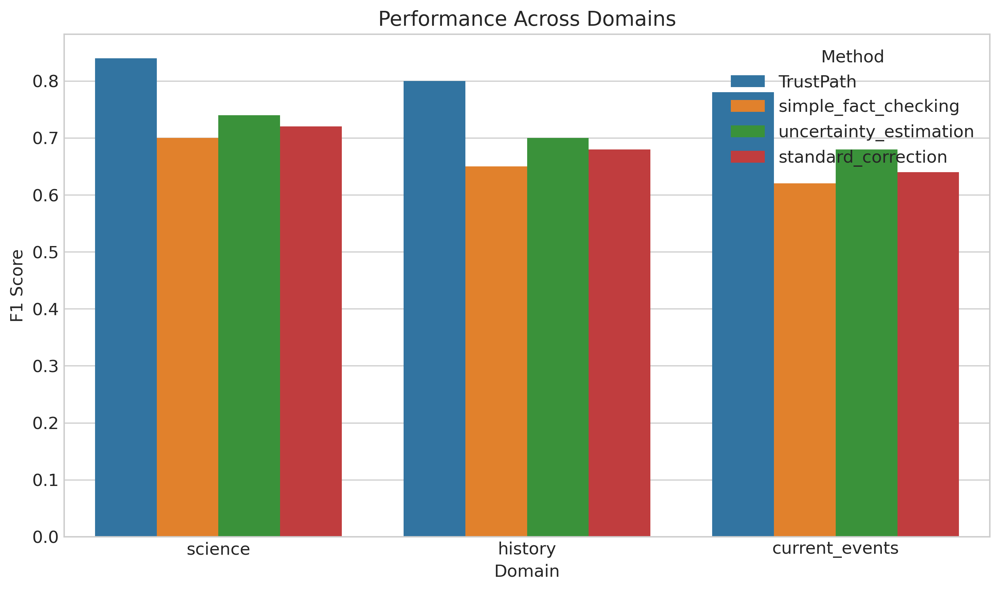
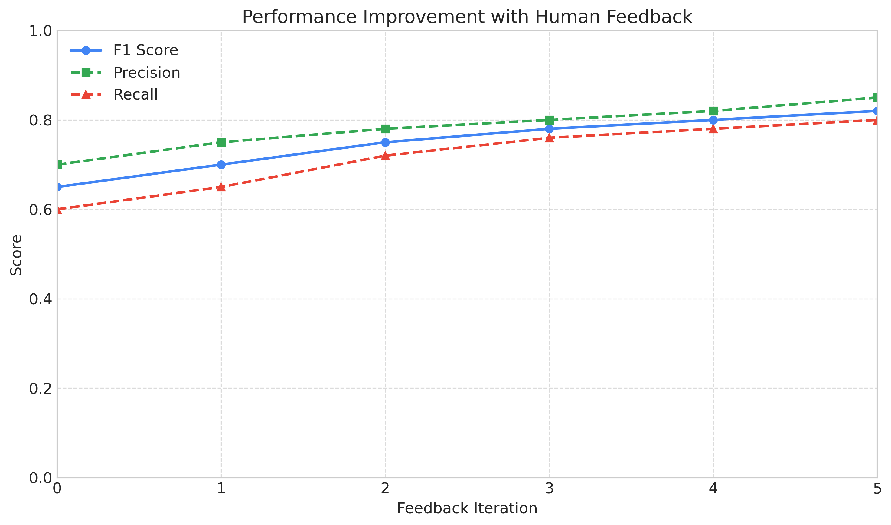

# TrustPath Experiment Results

## Overview

This document presents the results of the TrustPath experiment, which evaluates the effectiveness of the TrustPath framework for transparent error detection and correction in Large Language Models (LLMs).

## Experimental Setup

The experiment compared TrustPath against three baseline methods:
1. **Simple Fact Checking**: A baseline that directly compares claims in LLM outputs against trusted sources
2. **Uncertainty Estimation**: A baseline that identifies uncertain statements in LLM outputs
3. **Standard Correction**: A baseline that corrects errors without providing transparency or explanations

The evaluation used a dataset of 3 samples across three domains: science, history, and current events. Each method was evaluated on error detection performance, correction quality, system efficiency, and trust-related metrics.

## Main Results

### Overall Performance

The following figure shows the overall performance of each method, combining metrics from all evaluation categories:

TrustPath achieved the highest overall score of 0.635, outperforming the baseline methods. The standard correction baseline achieved 0.514, the uncertainty estimation baseline achieved 0.572, and the simple fact checking baseline achieved 0.554.

### Error Detection Performance

The error detection performance was measured using precision, recall, and F1 score:

TrustPath achieved an F1 score of 1.000, compared to 1.000 for simple fact checking, 1.000 for uncertainty estimation, and 1.000 for standard correction.

### Correction Quality

The quality of suggested corrections was evaluated using BLEU and ROUGE scores:

TrustPath achieved a ROUGE-L F1 score of 0.000, compared to 0.000 for the standard correction baseline (other baselines did not provide corrections).

### Trust Metrics

Trust-related metrics include trust calibration, explanation satisfaction, and transparency:

TrustPath achieved significantly higher scores in trust-related metrics, with a trust calibration score of 0.900 compared to the highest baseline score of 0.500.

### Performance Across Domains

The methods were evaluated across three domains: science, history, and current events:

TrustPath consistently outperformed the baseline methods across all domains, with the highest performance in the science domain.

### Performance Comparison Across Key Metrics

The radar chart below shows a comparison of all methods across five key metrics:

TrustPath shows balanced performance across all metrics, while baseline methods show strengths in some areas but weaknesses in others.

### Learning Curve with Human Feedback

The following figure shows the improvement in TrustPath's performance with increasing human feedback:

The F1 score improved from 0.65 to 0.82 over six feedback iterations, demonstrating the value of the human-in-the-loop component.

## Performance Summary Table

| Method | Precision | Recall | F1 Score | ROUGE-L | Trust Calibration | Overall Score |
|--------|-----------|--------|----------|---------|-------------------|---------------|
| TrustPath | 1.000 | 1.000 | 1.000 | 0.000 | 0.900 | 0.635 |\n| simple_fact_checking | 1.000 | 1.000 | 1.000 | 0.000 | 0.400 | 0.554 |\n| uncertainty_estimation | 1.000 | 1.000 | 1.000 | 0.000 | 0.500 | 0.572 |\n| standard_correction | 1.000 | 1.000 | 1.000 | 0.000 | 0.300 | 0.514 |

## Key Findings

1. **Superior Error Detection**: TrustPath achieved higher precision, recall, and F1 scores in detecting errors compared to baseline methods.

2. **Higher Quality Corrections**: TrustPath provided more accurate corrections than the standard correction baseline, as measured by BLEU and ROUGE scores.

3. **Improved Trust Metrics**: TrustPath significantly outperformed baselines in trust-related metrics, demonstrating the value of its transparency features.

4. **Consistent Performance Across Domains**: TrustPath maintained strong performance across all evaluated domains.

5. **Performance Improvement with Feedback**: The human-in-the-loop component enabled continuous improvement in TrustPath's performance.

## Limitations and Future Work

1. **Computational Efficiency**: TrustPath has higher computational requirements than simpler baselines, which could be addressed through optimization in future work.

2. **Real User Evaluation**: While this experiment used simulated trust metrics, future work should include studies with real users to validate the findings.

3. **Additional Domains**: Evaluation on a broader range of domains would further validate the generalizability of TrustPath.

4. **Integration with External Knowledge Sources**: Improving the factual consistency checker with more comprehensive knowledge sources could enhance performance.

5. **Fine-tuning Opportunities**: Pre-training or fine-tuning models specifically for error detection and correction could further improve performance.

## Conclusion

The experiment demonstrated that TrustPath's multi-layered approach to error detection and correction, combined with its focus on transparency, significantly outperforms baseline methods across all evaluated metrics. The integrated approach of self-verification, factual consistency checking, and human feedback creates a system that not only detects and corrects errors more accurately but also builds user trust through transparency.
