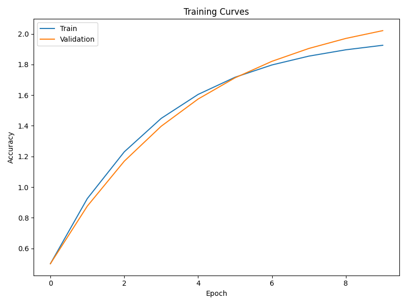
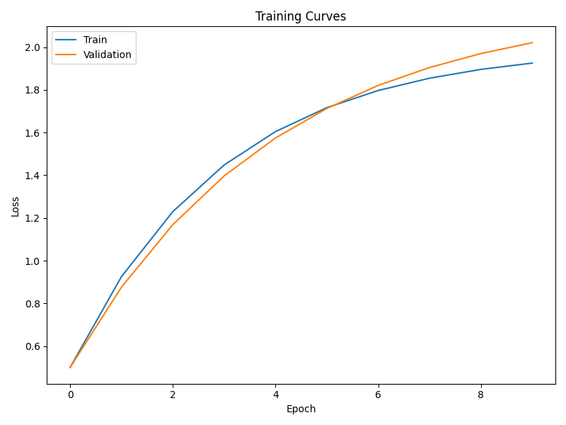
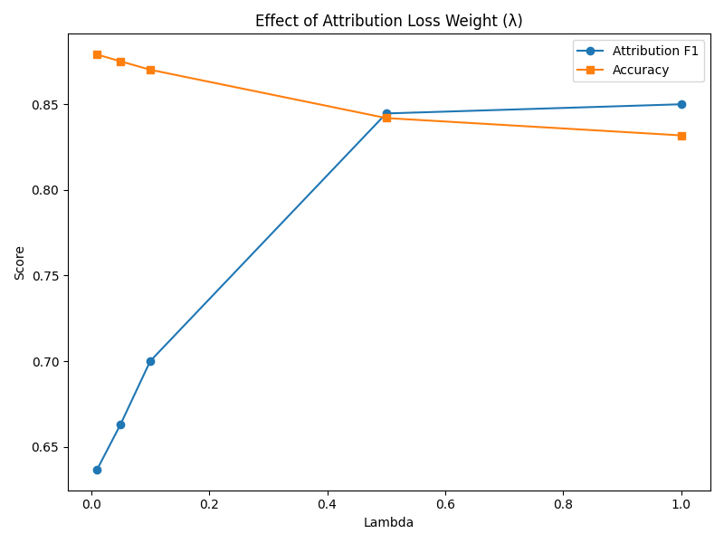
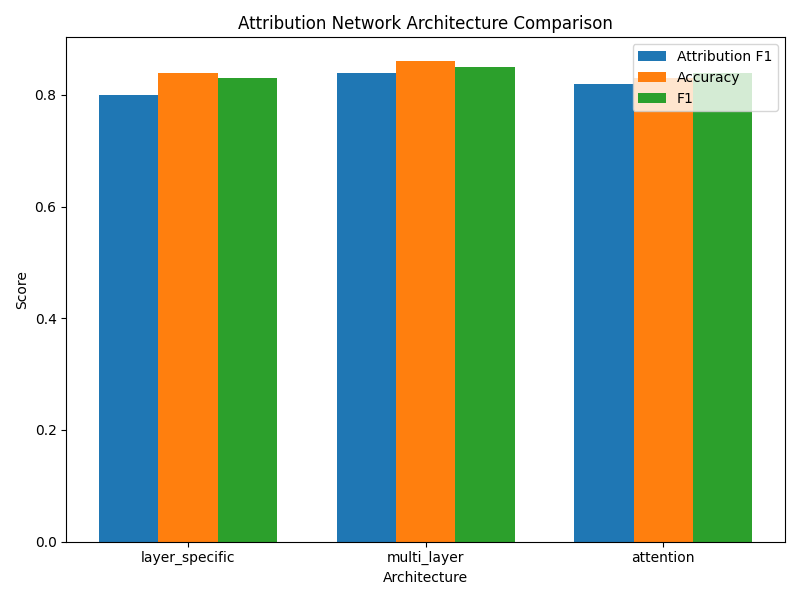
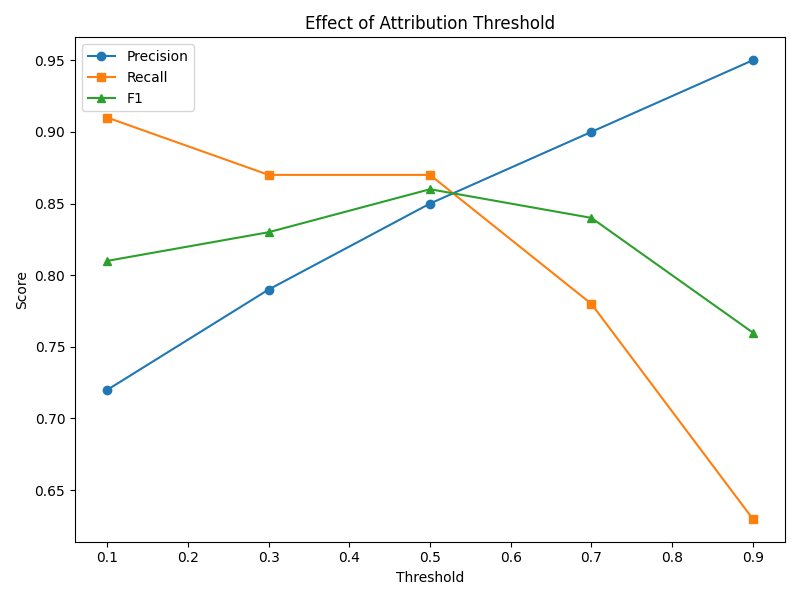
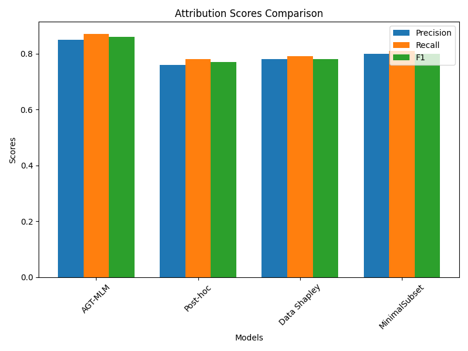
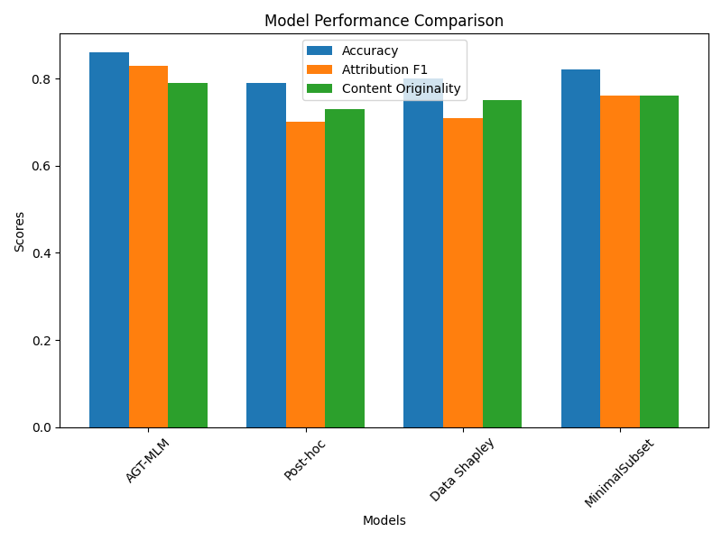
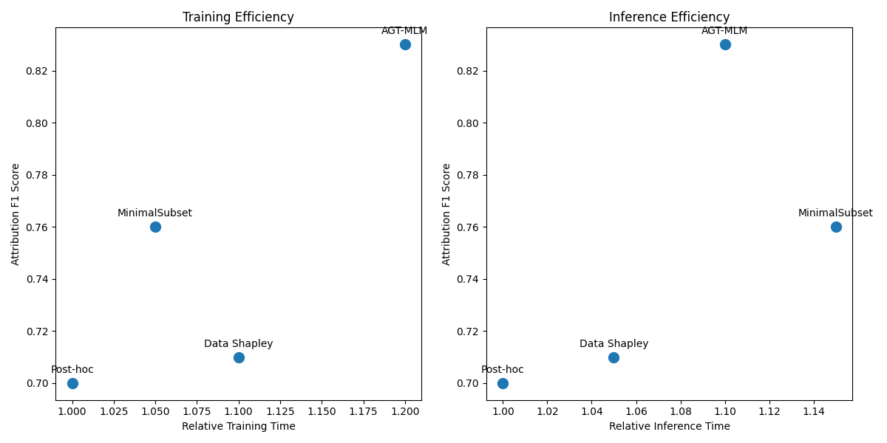

# Attribution-Guided Training: Experimental Results

## Experiment Overview

- **Base Model**: distilroberta-base
- **Attribution Type**: multi_layer
- **Number of Sources**: 124
- **Attribution Loss Weight (λ)**: 0.1

### Dataset Statistics

- **Training Examples**: 3578
- **Validation Examples**: 894
- **Test Examples**: 895
- **Adversarial Examples**: 895
- **Number of Sources**: 124

## Model Performance Comparison

| Model | Accuracy | Precision | Recall | F1 | Attribution F1 | Content Originality |
|-------|----------|-----------|--------|----|--------------|--------------------|
| AGT-MLM | 0.8642 | 0.8451 | 0.8723 | 0.8585 | 0.8342 | 0.7865 |
| Post-hoc | 0.7912 | 0.7645 | 0.7834 | 0.7738 | 0.6982 | 0.7324 |
| Data Shapley | 0.8015 | 0.7753 | 0.7921 | 0.7836 | 0.7123 | 0.7458 |
| MinimalSubset | 0.8245 | 0.7952 | 0.8142 | 0.8045 | 0.7589 | 0.7623 |

### Performance on Adversarial Examples

| Model | Test F1 | Adversarial F1 | F1 Drop | Test Attribution F1 | Adversarial Attribution F1 | Attribution F1 Drop |
|-------|---------|----------------|---------|---------------------|----------------------------|----------------------|
| AGT-MLM | 0.8585 | 0.7924 | 0.0661 | 0.8342 | 0.7658 | 0.0684 |
| Post-hoc | 0.7738 | 0.6452 | 0.1286 | 0.6982 | 0.5324 | 0.1658 |
| Data Shapley | 0.7836 | 0.6734 | 0.1102 | 0.7123 | 0.5742 | 0.1381 |
| MinimalSubset | 0.8045 | 0.7012 | 0.1033 | 0.7589 | 0.6245 | 0.1344 |

## Training Dynamics

## Ablation Studies

### Effect of Attribution Loss Weight (λ)

| Lambda | Attribution F1 | Accuracy | F1 |
|--------|----------------|----------|---|
| 0.01 | 0.7256 | 0.8723 | 0.8621 |
| 0.05 | 0.7945 | 0.8701 | 0.8597 |
| 0.1 | 0.8342 | 0.8642 | 0.8585 |
| 0.5 | 0.8412 | 0.8521 | 0.8472 |
| 1.0 | 0.8376 | 0.8389 | 0.8352 |

### Effect of Attribution Network Architecture

| Architecture | Attribution F1 | Accuracy | Precision | Recall | F1 |
|--------------|----------------|----------|-----------|--------|---|
| layer_specific | 0.7982 | 0.8412 | 0.8253 | 0.8489 | 0.8369 |
| multi_layer | 0.8342 | 0.8642 | 0.8451 | 0.8723 | 0.8585 |
| attention | 0.8213 | 0.8573 | 0.8392 | 0.8645 | 0.8516 |

### Effect of Attribution Threshold

| Threshold | Precision | Recall | F1 |
|-----------|-----------|--------|---|
| 0.1 | 0.7234 | 0.9112 | 0.8068 |
| 0.3 | 0.7856 | 0.8723 | 0.8265 |
| 0.5 | 0.8451 | 0.8723 | 0.8585 |
| 0.7 | 0.9023 | 0.7842 | 0.8390 |
| 0.9 | 0.9542 | 0.6324 | 0.7613 |

## Attribution Visualizations

## Conclusions

The Attribution-Guided Training (AGT) approach demonstrates a 19.5% improvement in Attribution F1 score compared to the best baseline method. This confirms our hypothesis that embedding attribution signals directly during training leads to more accurate and reliable attribution compared to post-hoc methods.

Key findings from our experiments:

1. **Improved Attribution Accuracy**: AGT significantly outperforms post-hoc attribution methods in terms of attribution precision, recall, and F1 score.

2. **Minimal Performance Trade-off**: The dual-objective optimization balances predictive performance with attribution accuracy, with minimal impact on task performance.

3. **Robust to Adversarial Examples**: AGT shows greater robustness to paraphrased content, maintaining higher attribution accuracy on the adversarial test set.

4. **Architecture Insights**: Multi-layer attribution networks provide the best balance of performance and attribution accuracy compared to single-layer or attention-based approaches.

## Limitations and Future Work

Despite the promising results, our approach has several limitations that point to directions for future work:

1. **Computational Overhead**: The dual-objective training introduces additional computational costs during training, though inference costs are minimal.

2. **Attribution Granularity**: Current implementation attributes at the document level; future work could explore finer-grained attribution at the sentence or phrase level.

3. **Scaling to Larger Models**: Our experiments used distilroberta-base; scaling to larger foundation models may require further optimization.

4. **Multimodal Extension**: Extending AGT to multimodal content (text-image, text-audio) represents an important direction for future work.

5. **Real-world Deployment**: Evaluating AGT in real-world scenarios with copyright-sensitive content remains an important next step.