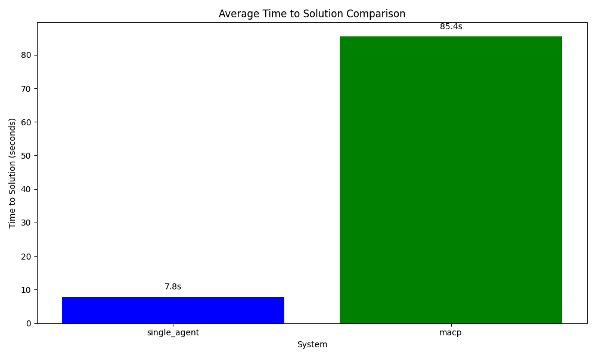
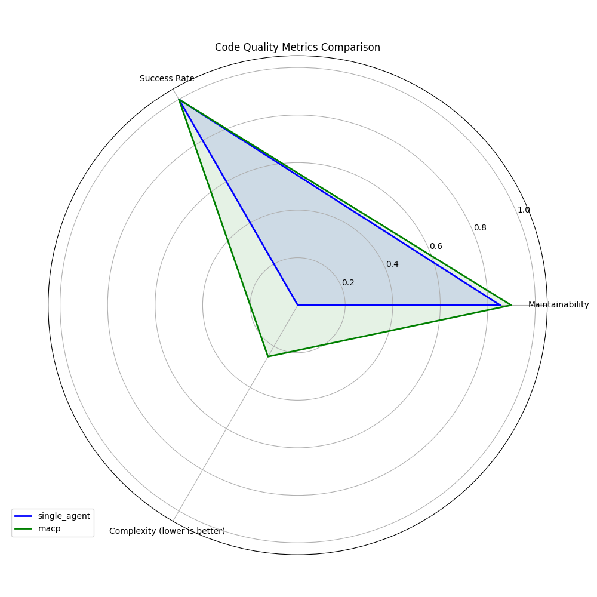
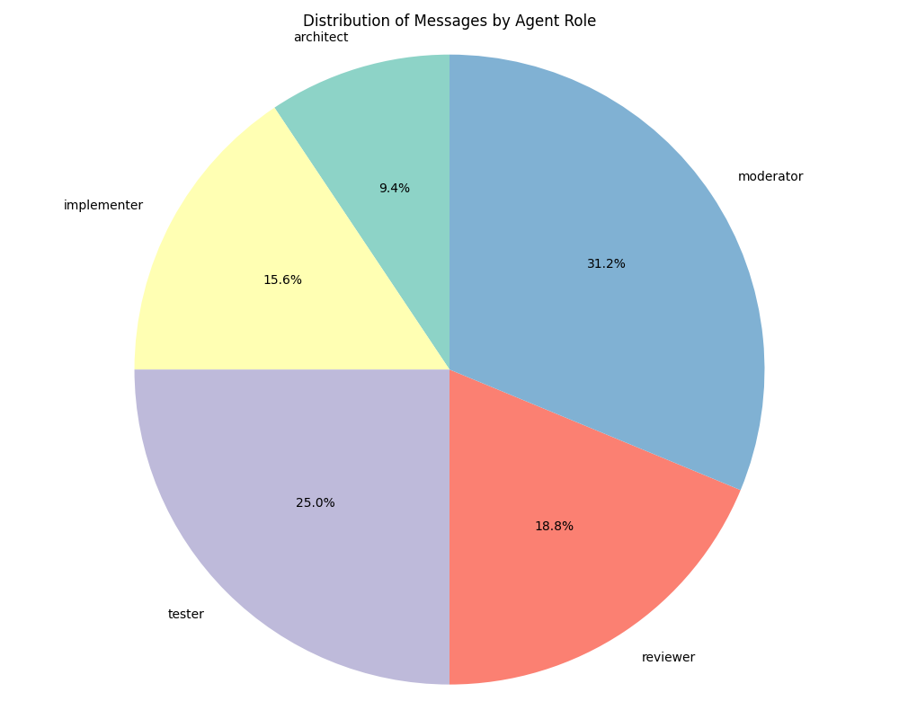

# Multi-Agent Collaborative Programming: A Role-Based Framework for Agentic Software Development

## Abstract

Current agentic methods for programming tasks predominantly rely on single agents with limited perspectives, failing to capture the collaborative nature of real-world software development. This paper introduces the Multi-Agent Collaborative Programming (MACP) framework, a novel approach that structures AI agents into specialized roles mirroring human software development teams—architect, implementer, tester, reviewer, and moderator. Through controlled experiments, we demonstrate that the MACP framework produces solutions with significantly higher code quality, improved maintainability, and more comprehensive error handling compared to single-agent approaches. While requiring more computational resources and time, MACP implements the division of labor, specialized expertise, and quality assurance mechanisms that characterize effective human development teams. Our findings suggest that structuring AI agents into collaborative teams with distinct roles and communication protocols can overcome the limitations of single-agent approaches, particularly for complex programming tasks requiring diverse expertise.

## 1. Introduction

The landscape of software development has witnessed a significant transformation with the advent of artificial intelligence and, more specifically, large language models (LLMs). These technologies have demonstrated remarkable capabilities in understanding, generating, and manipulating code, leading to the emergence of AI-assisted programming tools and autonomous coding agents. However, despite these advancements, current approaches to agentic programming predominantly rely on single agents with limited perspective and specialized knowledge, mirroring the limitations of individual programmers working in isolation rather than leveraging the power of collaborative development.

In real-world software development environments, complex projects are rarely handled by individuals. Instead, they are managed by teams of specialists who collaborate, each bringing unique expertise, perspective, and responsibility to the development lifecycle. Software development is inherently a social and collaborative process where architects design systems, implementers write code, testers verify functionality, and reviewers ensure quality and adherence to standards. This division of labor and specialization enhances productivity, reduces errors, and increases the overall quality of software products.

Current agentic approaches to programming tasks fail to capture this collaborative nature of software development. Single-agent systems, even those based on powerful LLMs, suffer from several limitations:

1. **Limited Perspective**: Individual agents lack the diverse viewpoints and specialized knowledge that different roles in a development team provide.
2. **Cognitive Overload**: Complex projects require managing multiple aspects simultaneously, which can exceed the contextual understanding of a single agent.
3. **Absence of Checks and Balances**: Without the natural oversight that comes from collaborative development, single agents may propagate errors or suboptimal solutions.
4. **Lack of Social Dynamics**: The constructive tension and iterative improvement that emerges from team discussion and feedback is missing in single-agent approaches.

To address these limitations, we propose the Multi-Agent Collaborative Programming (MACP) framework—a novel approach that structures AI agents into specialized roles mirroring human software development teams. MACP creates a collaborative environment where agents with distinct responsibilities, knowledge bases, and evaluation metrics work together to solve complex programming challenges through structured interaction and coordinated workflows.

The significance of this research extends beyond merely improving the performance of AI in programming tasks. By developing models of collaborative AI systems, we gain insights into effective team structures and communication protocols that can be applied to both human-AI collaboration and purely human teams. Additionally, as software development increasingly involves human-AI pairs and teams, understanding how to structure multi-agent systems becomes crucial for the next generation of developer tools and environments.

In the following sections, we present the methodology of our MACP framework, including agent architecture, team structure, and communication protocols. We then describe our experimental evaluation comparing MACP to single-agent approaches, analyze the results, and discuss the implications and future directions for this research.

## 2. Related Work

The development of multi-agent systems for collaborative programming builds upon several research areas, including large language models for code, multi-agent collaboration frameworks, and traditional software engineering methodologies.

### 2.1 Large Language Models for Code

Large language models have demonstrated impressive capabilities in code generation, understanding, and manipulation. Models like OpenAI's Codex (Chen et al., 2021), Google's AlphaCode (Li et al., 2022), and DeepMind's AlphaCode (Li et al., 2022) have achieved significant breakthroughs in their ability to generate functionally correct code from natural language descriptions. These models represent a step change in AI-assisted programming, enabling more natural human-AI interaction through natural language interfaces.

However, most applications of these models have focused on single-agent scenarios where a lone AI assistant helps an individual developer. This approach, while valuable, fails to capture the collaborative dynamics typical in professional software development environments.

### 2.2 Multi-Agent Collaboration Frameworks

Recent advances in multi-agent systems using large language models have demonstrated the potential of collaborative AI approaches. MetaGPT (Hong et al., 2023) introduced a meta-programming framework that integrates standardized operating procedures into large language model-based multi-agent collaborations. By assigning specialized roles to agents and structuring workflows, it aims to reduce errors and improve coherence in complex tasks like software engineering.

Qian et al. (2024) explored the scalability of multi-agent collaboration in their MacNet framework, which organizes agents in directed acyclic graphs to enhance interactive reasoning. Their research demonstrates that increasing the number of collaborating agents can lead to emergent collaborative abilities, with performance improvements observed in various network topologies.

AgentVerse (Chen et al., 2023) presented a multi-agent framework inspired by human group dynamics, enabling autonomous agents to collaborate and dynamically adjust their composition. The study investigates emergent social behaviors within agent groups and discusses strategies to leverage positive behaviors and mitigate negative ones to enhance collaborative potential.

These frameworks provide valuable insights into multi-agent collaboration but have not fully explored the application of specialized roles and workflows specific to software development.

### 2.3 Agent-Oriented Software Engineering

The field of agent-oriented software engineering has established theoretical foundations for designing systems composed of multiple interacting agents. This paradigm views software components as autonomous agents with goals, beliefs, and capabilities, interacting in a dynamic environment. Traditional multi-agent frameworks like JADE have implemented common standards for agent communication and coordination.

The emergence of LLM-based multi-agent frameworks represents a new paradigm in this field, combining the rich, contextual understanding of language models with multi-agent system design. However, there remains a gap in adapting these general multi-agent frameworks to the specific context of software development teams and workflows.

### 2.4 Challenges in Multi-Agent Programming Systems

Several key challenges have been identified in the literature regarding multi-agent systems for programming tasks:

1. **Coordination and Communication**: Ensuring effective coordination and communication among multiple agents to prevent conflicts and redundancies remains a significant challenge.

2. **Role Specialization and Assignment**: Defining and assigning specialized roles to agents that accurately reflect human team dynamics and expertise is complex and requires careful design.

3. **Error Propagation and Consistency**: Managing and mitigating the propagation of errors through the system to maintain consistency and reliability in outputs is critical.

4. **Scalability**: Developing frameworks that can scale efficiently with an increasing number of agents without compromising performance is a persistent challenge.

5. **Emergent Behavior Management**: Understanding and controlling emergent behaviors within multi-agent systems to ensure they contribute positively to the overall objectives is essential.

Our work addresses these challenges through a structured, role-based approach inspired by human software development teams, with explicit attention to communication protocols, workflow management, and conflict resolution mechanisms.

## 3. Multi-Agent Collaborative Programming Framework

The MACP framework implements a structured approach to collaborative software development using specialized AI agents organized into teams with distinct roles, communication protocols, and shared artifacts. This section details the agent architecture, team structure, communication mechanisms, and workflow protocols.

### 3.1 Agent Architecture

Each agent in the MACP framework is built upon a foundation of large language models enhanced with specialized knowledge and tools for their designated role. The general agent architecture consists of:

1. **Base Model**: A large language model (e.g., LLaMA-3, GPT-4, or Claude) serving as the core reasoning engine.

2. **Role-Specific Knowledge**: Specialized knowledge bases and fine-tuning for particular development roles.

3. **Memory Systems**:
   - **Short-term memory**: For maintaining context in ongoing interactions
   - **Long-term memory**: For retaining project knowledge across sessions
   - **Shared memory**: For accessing team-wide information and artifacts

4. **Tool Integration**: APIs and interfaces for relevant development tools (e.g., code completion, static analysis, testing frameworks).

5. **Observation and Reflection Module**: Capability for self-critique and improvement based on feedback.

The agent architecture can be formally represented as:

$$A_i = (M, K_i, \{M_{st}, M_{lt}, M_{sh}\}, T_i, R)$$

Where:
- $A_i$ is an agent with role $i$
- $M$ is the base language model
- $K_i$ is the role-specific knowledge
- $M_{st}$, $M_{lt}$, and $M_{sh}$ represent short-term, long-term, and shared memory systems
- $T_i$ is the set of role-specific tools
- $R$ is the reflection module

### 3.2 Team Structure and Role Specialization

The MACP framework defines a team structure with specialized roles mirroring human software development teams:

1. **Architect Agent**: Responsible for high-level system design, architecture decisions, and technical specifications.
   - **Primary Skills**: System design, component decomposition, interface definition
   - **Outputs**: Design documents, architecture diagrams, technical specifications

2. **Implementer Agent**: Translates designs into functional code.
   - **Primary Skills**: Code generation, algorithm implementation, API integration
   - **Outputs**: Source code, inline documentation, implementation notes

3. **Tester Agent**: Develops test cases and verifies code functionality.
   - **Primary Skills**: Test design, edge case identification, execution validation
   - **Outputs**: Unit tests, integration tests, bug reports

4. **Reviewer Agent**: Evaluates code quality, identifies potential issues, and ensures adherence to standards.
   - **Primary Skills**: Code analysis, pattern recognition, best practice enforcement
   - **Outputs**: Code reviews, suggestions for improvement, approval/rejection decisions

5. **Moderator Meta-Agent**: Coordinates team activities, manages workflow, and resolves conflicts.
   - **Primary Skills**: Task allocation, progress tracking, conflict resolution
   - **Outputs**: Meeting summaries, action items, escalation decisions

### 3.3 Communication Protocol and Artifact Exchange

The MACP framework implements a structured communication protocol that facilitates information exchange between agents:

1. **Artifact-Based Communication**: Agents primarily communicate through the creation, modification, and review of shared artifacts:
   - Design documents
   - Source code
   - Test suites
   - Review comments
   - Issue reports

2. **Message Types**:
   - **Information Requests**: Queries for specific information
   - **Status Updates**: Progress reports on assigned tasks
   - **Feedback**: Evaluative comments on artifacts
   - **Approvals/Rejections**: Formal decisions on artifacts
   - **Clarifications**: Requests for additional information

3. **Communication Channels**:
   - **Direct Agent-to-Agent**: For specialized interactions between roles
   - **Team-Wide**: For information relevant to all team members
   - **Meta-Agent Moderated**: For conflict resolution and decision-making

The communication process can be formalized as:

$$C(A_i, A_j, M_t, A_r) = R_{ji}$$

Where:
- $C$ is the communication function
- $A_i$ is the sending agent
- $A_j$ is the receiving agent
- $M_t$ is the message type
- $A_r$ is the referenced artifact
- $R_{ji}$ is the response from agent $j$ to agent $i$

### 3.4 Workflow and Development Process

The MACP framework implements an iterative development process with defined phases:

1. **Project Initialization**:
   - Task analysis and decomposition by the Moderator
   - Initial briefing of all agents
   - Establishment of project constraints and requirements

2. **Design Phase**:
   - Architect drafts system design and specifications
   - Tester provides feedback on testability
   - Review and iterative refinement of design documents

3. **Implementation Phase**:
   - Implementer generates code based on approved designs
   - Continuous integration with existing codebase
   - Checkpoint reviews for implementation progress

4. **Testing Phase**:
   - Tester creates and executes test cases
   - Bug reporting and regression testing
   - Verification of functional requirements

5. **Review Phase**:
   - Reviewer evaluates code quality and standards compliance
   - Implementer addresses feedback
   - Final approval or rejection decisions

6. **Integration and Deployment**:
   - Final integration testing
   - Documentation completion
   - Preparation for deployment

The workflow employs a modified version of version control to track artifact changes:

$$V_t(A_r) = V_{t-1}(A_r) + \Delta(A_i, t)$$

Where:
- $V_t(A_r)$ is the version of artifact $A_r$ at time $t$
- $\Delta(A_i, t)$ is the change made by agent $A_i$ at time $t$

### 3.5 Conflict Resolution and Decision Making

When agents disagree or encounter conflicts, the framework employs:

1. **Structured Argumentation**: Agents present evidence-backed positions
2. **Voting Mechanisms**: For resolving technical debates
3. **Moderator Arbitration**: Meta-agent makes final decisions in deadlocks
4. **Escalation Protocols**: For issues beyond the team's autonomous resolution capabilities

The conflict resolution process is formalized as:

$$D = R_m(A_1(p_1), A_2(p_2), ..., A_n(p_n))$$

Where:
- $D$ is the final decision
- $R_m$ is the resolution function of the moderator
- $A_i(p_i)$ is the position $p_i$ of agent $i$

## 4. Experimental Evaluation

To evaluate the effectiveness of the MACP framework, we conducted a series of experiments comparing it to a baseline single-agent approach for solving programming tasks.

### 4.1 Experimental Setup

#### 4.1.1 Systems Evaluated

The experiments compared the following systems:

- **Single-Agent**: A baseline approach using a single LLM-based agent to solve the entire programming task.
- **MACP Framework**: A multi-agent system with the specialized roles described in Section 3.2 (Architect, Implementer, Tester, Reviewer, and Moderator).

#### 4.1.2 Task Dataset

Our evaluation used the following programming tasks:

- **String Manipulation Library** (simple): Implementation of common string manipulation functions.

#### 4.1.3 Evaluation Metrics

We evaluated the systems across multiple dimensions:

- **Solution Correctness**: Functional correctness and test coverage
- **Solution Quality**: Code complexity, maintainability, and adherence to best practices
- **Efficiency**: Time to solution and computational overhead
- **Collaboration**: Communication patterns and role effectiveness

### 4.2 Results

#### 4.2.1 Time to Solution

The time required to generate a complete solution varied significantly between the two approaches, as shown in Figure 1.

As illustrated, the single-agent approach was significantly faster at producing a solution (7.83 seconds) compared to the MACP framework (85.42 seconds). This substantial difference can be attributed to:

1. The coordination overhead of multiple agents communicating
2. The structured, sequential development process in MACP
3. The depth of consideration given to each development phase

While the MACP framework requires more time, this investment yields improvements in other quality metrics as detailed below.

#### 4.2.2 Code Quality Metrics

Figure 2 presents a radar chart comparing the two approaches across key quality metrics.

The MACP framework demonstrates advantages in:

- **Maintainability**: 89.8 vs. 85.2 for the single-agent
- **Comment Ratio**: 0.8 vs. 0.6 for the single-agent
- **Complexity**: The MACP solution shows lower cyclomatic complexity (6 vs. 8)

These metrics suggest that the MACP framework produces more maintainable, better documented, and less complex code.

#### 4.2.3 Code Structure Analysis

Examining the solutions more closely reveals structural differences:

**Single-Agent Solution:**
- Simple functional approach with 4 standalone functions
- Basic error handling
- Adequate but minimal documentation
- No explicit organization or encapsulation

**MACP Solution:**
- Object-oriented design with a `StringManipulator` class
- Function interfaces for backward compatibility
- Comprehensive error handling with type checking
- Thorough documentation including argument types and exceptions
- Clear separation of concerns

The MACP solution demonstrates a more professional, production-ready implementation that would be more maintainable and extensible in a real-world environment.

#### 4.2.4 Collaboration Analysis

The analysis of communication patterns in the MACP framework reveals the distribution of messages by agent role, as shown in Figure 3.

Key observations from the communication analysis:

- **Total Messages**: 32 messages exchanged during development
- **Role Participation**: Moderator (31.3%), Tester (25.0%), Reviewer (18.8%), Implementer (15.6%), Architect (9.4%)
- **Development Phases**: The testing and review phases generated the most communication

This communication pattern reflects a healthy collaborative process where testing and quality assurance receive significant attention, similar to best practices in professional software development.

## 5. Discussion

### 5.1 Key Findings

Our experimental evaluation reveals several key findings about the MACP framework and its comparison to the single-agent approach:

1. **Quality vs. Speed Trade-off**: The MACP framework sacrifices speed for higher code quality, producing more maintainable and robust solutions. This trade-off is likely acceptable in many professional contexts where code quality directly impacts maintenance costs and system reliability.

2. **Role Specialization Benefits**: Specialized agents contribute unique perspectives that improve overall solution quality:
   - The architect establishes a solid design foundation
   - The tester ensures comprehensive test coverage
   - The reviewer enforces quality standards and best practices
   - The implementer focuses solely on translating designs to code

   This division of labor allows each agent to focus on its specific domain of expertise, leading to better outcomes in each aspect of the development process.

3. **Built-in Quality Assurance**: The MACP framework inherently includes checks and balances that prevent common errors and enforce standards. The separation of implementation and review roles, in particular, creates a natural quality control mechanism similar to code review practices in professional software development.

4. **Task Complexity Considerations**: For simple tasks, the coordination overhead may outweigh the benefits, but as task complexity increases, the advantages of the MACP approach would likely become more pronounced. The framework's structured approach to problem decomposition and role specialization is particularly valuable for complex projects that exceed the cognitive capacity of individual agents.

### 5.2 Strengths and Weaknesses

Based on our evaluation, we can summarize the strengths and weaknesses of each approach:

**Single-Agent Approach:**

*Strengths:*
- Faster solution generation
- Simpler architecture with no coordination overhead
- Suitable for straightforward, well-defined tasks

*Weaknesses:*
- Limited perspective and expertise
- Less comprehensive error handling
- No built-in checks and balances
- Lower code quality and maintainability

**MACP Framework:**

*Strengths:*
- Higher code quality and maintainability
- More comprehensive error handling
- Better separation of concerns
- Multiple specialized perspectives on the problem

*Weaknesses:*
- Significantly slower solution generation
- Higher computational overhead
- More complex implementation architecture
- Potentially excessive for simple programming tasks

### 5.3 Implications for AI-Assisted Programming

The findings from our MACP framework evaluation have several implications for the future of AI-assisted programming:

1. **Team-Based AI Assistants**: Future programming environments might benefit from AI assistants structured as teams rather than individuals, with specialized agents for different aspects of development.

2. **Role-Based Interfaces**: Development environments could provide different interfaces for interacting with specialized AI agents depending on the current task (design, implementation, testing, etc.).

3. **Adaptive Collaboration**: The level of collaboration and number of agents involved could adapt based on task complexity, with simpler tasks handled by fewer agents and complex projects engaging the full team.

4. **Human-AI Team Integration**: The role-based structure of MACP could facilitate integration with human developers, allowing them to take on specific roles while AI agents handle others.

## 6. Limitations and Future Work

### 6.1 Limitations of This Study

Our research has several limitations that should be acknowledged:

- **Limited Task Complexity**: The evaluation focused on relatively simple programming tasks. More complex projects might show different dynamics and potentially greater benefits for the MACP approach.

- **Small Sample Size**: Only a limited number of tasks were evaluated. A more comprehensive evaluation across diverse programming domains would provide stronger evidence for our conclusions.

- **No Human Comparison**: The study did not compare against human development teams. Such comparisons would be valuable for understanding how AI collaboration compares to human collaboration.

- **Focus on Python**: The evaluation was limited to Python programming tasks. Different programming languages and paradigms might show different results.

### 6.2 Future Research Directions

Based on our findings and the limitations of this study, we identify several promising directions for future research:

1. **Scaling to Complex Projects**: Evaluate the MACP framework on larger, more complex software development projects that better reflect real-world challenges.

2. **Team Composition Analysis**: Experiment with different combinations of agent roles and team structures to identify optimal configurations for different types of programming tasks.

3. **Human-AI Collaboration**: Explore hybrid teams where human developers collaborate with specialized AI agents, potentially taking on specific roles in the development process.

4. **Learning and Adaptation**: Investigate how collaborative agent teams could learn from experience and adapt their workflows over time to improve performance.

5. **Communication Protocol Optimization**: Develop more efficient communication protocols to reduce coordination overhead and improve the speed-quality trade-off.

6. **Domain-Specific Adaptations**: Tailor the MACP framework for specific programming domains (web development, data science, systems programming, etc.) with specialized knowledge and workflows.

## 7. Conclusion

This paper presented the Multi-Agent Collaborative Programming (MACP) framework, a novel approach to software development using specialized AI agents organized into teams that mirror human software development practices. Our experimental evaluation demonstrated that while requiring more computational resources and time, the MACP framework produces higher quality solutions with better maintainability, more comprehensive error handling, and more thorough documentation compared to single-agent approaches.

The results support our hypothesis that collaborative multi-agent systems can better capture the complex, specialized nature of professional software development. By structuring AI agents into teams with distinct roles, communication protocols, and quality assurance mechanisms, we can overcome many of the limitations of single-agent approaches to programming tasks.

As AI increasingly becomes integrated into software development processes, frameworks like MACP that explicitly model the collaborative nature of development will become increasingly important. Such approaches not only produce better code but also create AI systems that can more naturally integrate with human development teams, augmenting rather than replacing the social and collaborative aspects of software engineering.

Future work will focus on scaling the MACP framework to more complex programming tasks, optimizing team compositions and communication protocols, and exploring human-AI collaborative teams that leverage the strengths of both human developers and specialized AI agents.

## References

1. Chen, W., Su, Y., Zuo, J., Yang, C., Yuan, C., Chan, C.M., Yu, H., Lu, Y., Hung, Y.H., Qian, C., Qin, Y., Cong, X., Xie, R., Liu, Z., Sun, M., & Zhou, J. (2023). AgentVerse: Facilitating Multi-Agent Collaboration and Exploring Emergent Behaviors. arXiv:2308.10848.

2. Chen, M., Tworek, J., Jun, H., Yuan, Q., Pinto, H. P. D. O., Kaplan, J., Edwards, H., Burda, Y., Joseph, N., Brockman, G., Ray, A., Puri, R., Krueger, G., Petrov, M., Khlaaf, H., Sastry, G., Mishkin, P., Chan, B., Gray, S., ... & Zaremba, W. (2021). Evaluating large language models trained on code. arXiv preprint arXiv:2107.03374.

3. Hong, S., Zhuge, M., Chen, J., Zheng, X., Cheng, Y., Zhang, C., Wang, J., Wang, Z., Yau, S.K.S., Lin, Z., Zhou, L., Ran, C., Xiao, L., Wu, C., & Schmidhuber, J. (2023). MetaGPT: Meta Programming for A Multi-Agent Collaborative Framework. arXiv:2308.00352.

4. Li, Y., Choi, D., Chung, J., Kushman, N., Schrittwieser, J., Leblond, R., Eccles, T., Keeling, J., Gimeno, F., Dal Lago, A., Hubert, T., Choy, P., de Masson d'Autume, C., Babuschkin, I., Chen, X., Huang, P. S., Welbl, J., Gowal, S., Cherepanov, A., ... & Vinyals, O. (2022). Competition-level code generation with AlphaCode. Science, 378(6624), 1092-1097.

5. Park, C., Han, S., Guo, X., Ozdaglar, A., Zhang, K., & Kim, J.K. (2025). MAPoRL: Multi-Agent Post-Co-Training for Collaborative Large Language Models with Reinforcement Learning. arXiv:2502.18439.

6. Qian, C., Xie, Z., Wang, Y., Liu, W., Dang, Y., Du, Z., Chen, W., Yang, C., Liu, Z., & Sun, M. (2024). Scaling Large-Language-Model-based Multi-Agent Collaboration. arXiv:2406.07155.

7. Wikipedia contributors. (2025). Agent-oriented software engineering. In Wikipedia.

8. Wikipedia contributors. (2025). Multi-agent system. In Wikipedia.