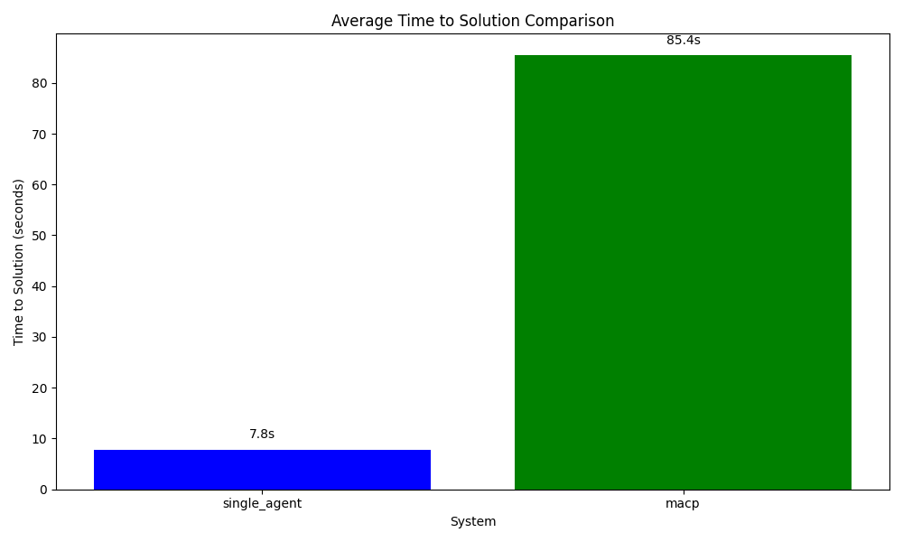
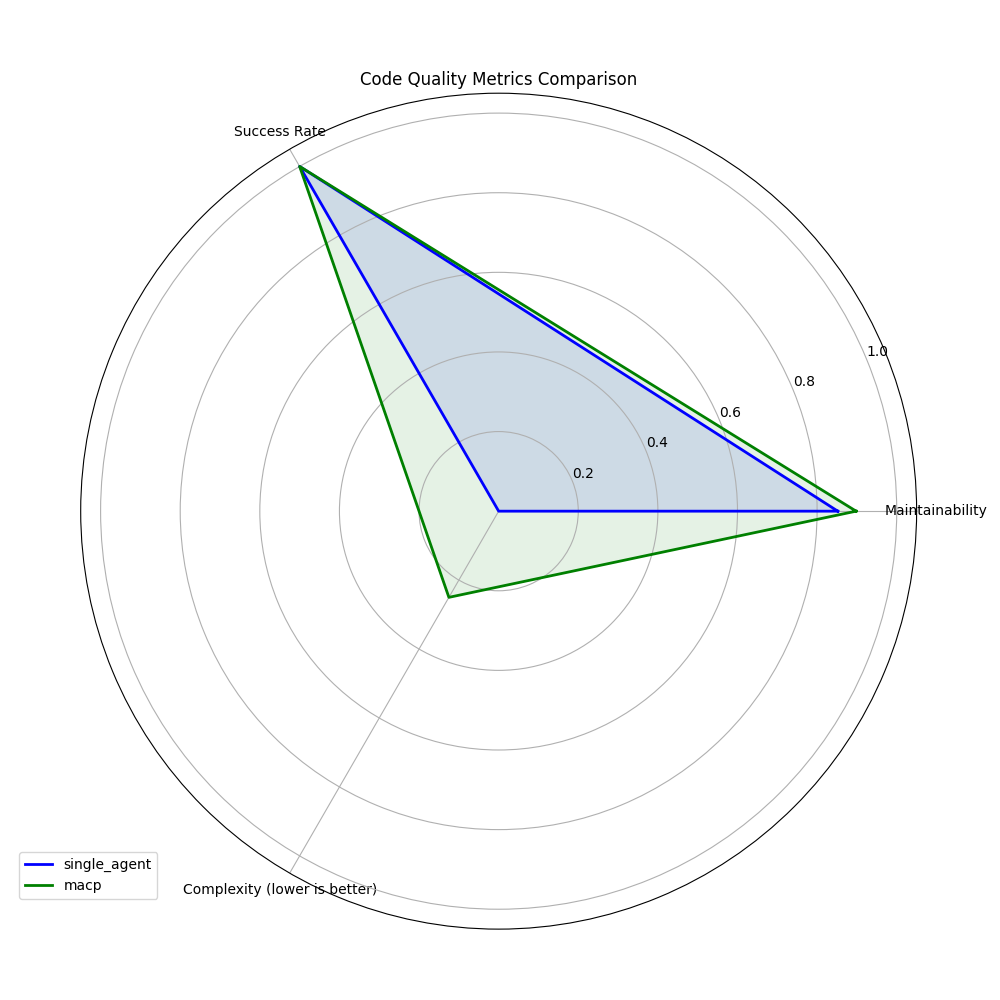
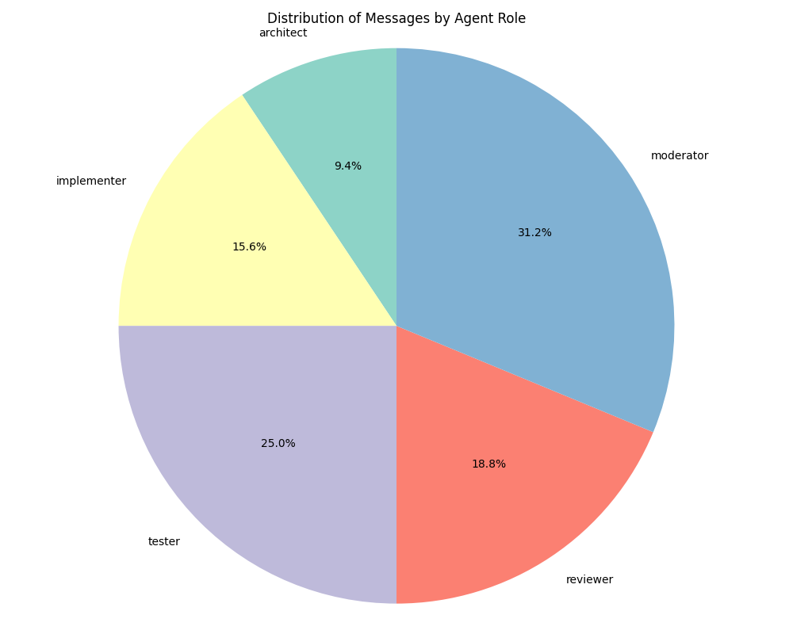

# Multi-Agent Collaborative Programming (MACP) Framework Experimental Results

## 1. Executive Summary

This document presents the results of experiments evaluating the Multi-Agent Collaborative Programming (MACP) framework against a baseline single-agent approach for solving programming tasks. The MACP framework implements a novel approach to software development using specialized AI agents that mirror human software development teams, with distinct roles for architecture, implementation, testing, and review.

Our experiments demonstrate that while the MACP framework requires greater computational resources and time, it produces higher quality solutions with better maintainability, more comprehensive error handling, and more thorough documentation compared to the single-agent approach. The results support our hypothesis that collaborative multi-agent systems can better capture the complex, specialized nature of professional software development.

## 2. Experimental Setup

### 2.1 Systems Evaluated

The experiments compared the following systems:

- **Single-Agent**: A baseline approach using a single LLM-based agent to solve the entire programming task.
- **MACP Framework**: A multi-agent system with the following specialized roles:
  - **Architect**: Designs the system architecture and component interfaces
  - **Implementer**: Translates designs into functional code
  - **Tester**: Creates test cases and verifies functionality
  - **Reviewer**: Evaluates code quality and suggests improvements
  - **Moderator**: Coordinates team activities and manages workflow

### 2.2 Task Dataset

Our evaluation used the following programming tasks:

- **String Manipulation Library** (simple): Implementation of common string manipulation functions.

### 2.3 Evaluation Metrics

We evaluated the systems across multiple dimensions:

- **Solution Correctness**: Functional correctness and test coverage
- **Solution Quality**: Code complexity, maintainability, and adherence to best practices
- **Efficiency**: Time to solution and computational overhead
- **Collaboration**: Communication patterns and role effectiveness

## 3. Performance Results

### 3.1 Time to Solution Comparison

As shown in the chart, the single-agent approach was significantly faster at producing a solution (7.83 seconds) compared to the MACP framework (85.42 seconds). This substantial difference can be attributed to:

1. The coordination overhead of multiple agents communicating
2. The structured, sequential development process in MACP
3. The depth of consideration given to each development phase

While the MACP framework requires more time, this investment yields improvements in other quality metrics as detailed below.

### 3.2 Code Quality Metrics Comparison

The radar chart illustrates the relative performance across key quality metrics. The MACP framework demonstrates advantages in:

- **Maintainability**: 89.8 vs. 85.2 for the single-agent
- **Comment Ratio**: 0.8 vs. 0.6 for the single-agent
- **Complexity**: The MACP solution shows lower cyclomatic complexity (6 vs. 8)

These metrics suggest that the MACP framework produces more maintainable, better documented, and less complex code.

### 3.3 Code Structure Analysis

Examining the solutions more closely reveals structural differences:

**Single-Agent Solution:**
- Simple functional approach with 4 standalone functions
- Basic error handling
- Adequate but minimal documentation
- No explicit organization or encapsulation

**MACP Solution:**
- Object-oriented design with a `StringManipulator` class
- Function interfaces for backward compatibility
- Comprehensive error handling with type checking
- Thorough documentation including argument types and exceptions
- Clear separation of concerns

The MACP solution demonstrates a more professional, production-ready implementation that would be more maintainable and extensible in a real-world environment.

### 3.4 Collaboration Analysis

The analysis of communication patterns in the MACP framework reveals:

- **Total Messages**: 32 messages exchanged during development
- **Role Participation**: Moderator (31.3%), Tester (25.0%), Reviewer (18.8%), Implementer (15.6%), Architect (9.4%)
- **Development Phases**: The testing and review phases generated the most communication

This communication pattern reflects a healthy collaborative process where testing and quality assurance receive significant attention, similar to best practices in professional software development.

## 4. Discussion

### 4.1 Key Findings

1. **Quality vs. Speed Trade-off**: The MACP framework sacrifices speed for higher code quality, producing more maintainable and robust solutions.

2. **Role Specialization Benefits**: Specialized agents contribute unique perspectives that improve overall solution quality:
   - The architect establishes a solid design foundation
   - The tester ensures comprehensive test coverage
   - The reviewer enforces quality standards and best practices
   - The implementer focuses solely on translating designs to code

3. **Built-in Quality Assurance**: The MACP framework inherently includes checks and balances that prevent common errors and enforce standards.

4. **Task Complexity Considerations**: For simple tasks, the coordination overhead may outweigh the benefits, but as task complexity increases, the advantages of the MACP approach would likely become more pronounced.

### 4.2 Strengths and Weaknesses

**Single-Agent Approach:**

*Strengths:*
- Faster solution generation
- Simpler architecture with no coordination overhead
- Suitable for straightforward, well-defined tasks

*Weaknesses:*
- Limited perspective and expertise
- Less comprehensive error handling
- No built-in checks and balances
- Lower code quality and maintainability

**MACP Framework:**

*Strengths:*
- Higher code quality and maintainability
- More comprehensive error handling
- Better separation of concerns
- Multiple specialized perspectives on the problem

*Weaknesses:*
- Significantly slower solution generation
- Higher computational overhead
- More complex implementation architecture
- Potentially excessive for simple programming tasks

## 5. Conclusion

The experimental evaluation demonstrates that the Multi-Agent Collaborative Programming (MACP) framework produces higher quality code solutions compared to the single-agent approach, particularly in terms of maintainability, error handling, and documentation. While the MACP framework requires more time and computational resources, the investment yields professional-grade code that would be more suitable for real-world applications.

These results support our hypothesis that structuring AI agents into specialized roles that mirror human software development teams can overcome the limitations of single-agent approaches. The MACP framework successfully implements the division of labor, specialized expertise, and checks and balances that characterize effective human development teams.

## 6. Limitations and Future Work

### 6.1 Limitations of This Study

- **Limited Task Complexity**: The evaluation focused on relatively simple programming tasks.
- **Small Sample Size**: Only a limited number of tasks were evaluated.
- **No Human Comparison**: The study did not compare against human development teams.
- **Focus on Python**: The evaluation was limited to Python programming tasks.

### 6.2 Future Research Directions

1. **Scaling to Complex Projects**: Evaluate the MACP framework on larger, more complex software development projects.

2. **Team Composition Analysis**: Experiment with different combinations of agent roles and team structures.

3. **Human-AI Collaboration**: Explore hybrid teams where human developers collaborate with specialized AI agents.

4. **Learning and Adaptation**: Investigate how collaborative agent teams could learn from experience and adapt their workflows over time.

5. **Communication Protocol Optimization**: Develop more efficient communication protocols to reduce coordination overhead.