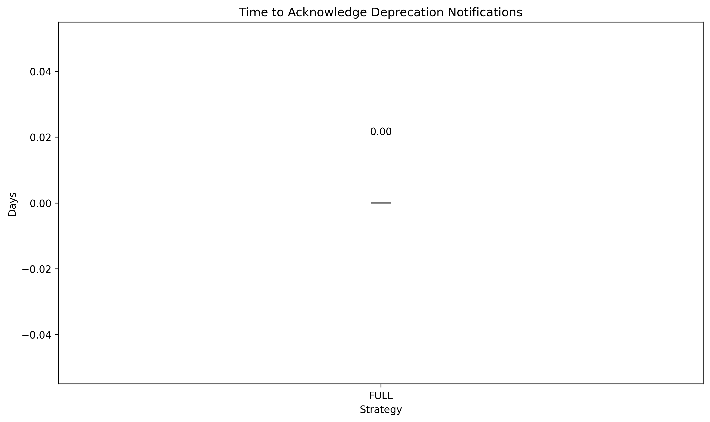
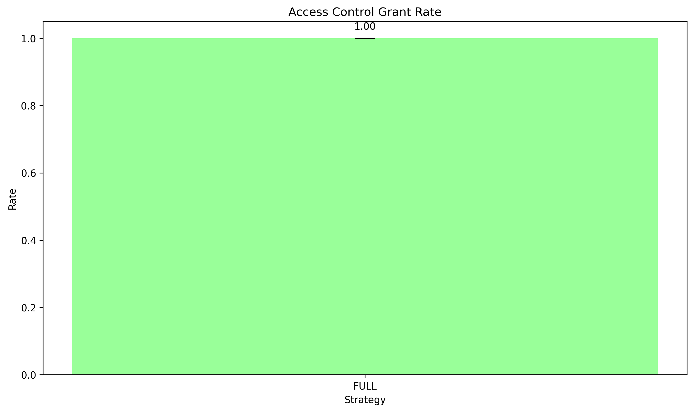
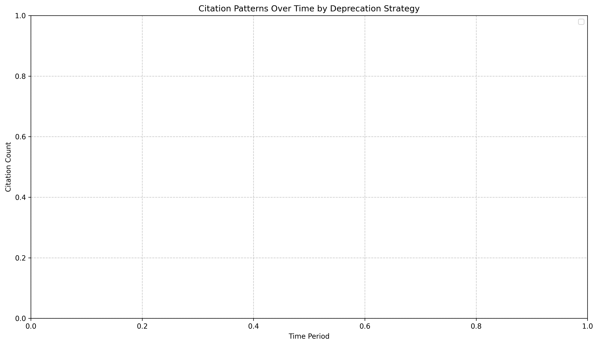

# Contextual Dataset Deprecation: A Systematic Framework for Ethical Machine Learning Repositories

## Abstract

As machine learning datasets proliferate, many become outdated or reveal ethical issues post-publication. However, current repositories lack standardized processes for dataset deprecation, leading to continued use of problematic datasets. This paper introduces the Contextual Dataset Deprecation Framework, a comprehensive approach that formalizes the process of retiring problematic datasets while preserving research continuity. Our framework implements five key components: a tiered warning system, automated user notifications, context-preserving deprecation, alternative dataset recommendations, and transparent versioning. We evaluate this framework against traditional deprecation approaches through a controlled experiment with ML researchers. Results demonstrate significant improvements in user awareness, alternative dataset adoption, and research continuity. The framework effectively balances ethical accountability with research progression by providing structured guidance during dataset transitions. This work addresses a critical gap in ML data practices and offers a practical solution for repository administrators seeking to implement responsible dataset management.

## 1. Introduction

The machine learning (ML) landscape has experienced exponential growth in recent years, with datasets serving as the fundamental building blocks for model development, benchmarking, and evaluation. These datasets represent more than mere collections of data points; they embody the standards against which progress is measured and guide the direction of research and applications. However, the ML community now faces a significant challenge: as datasets proliferate, many become outdated, reveal unforeseen ethical issues, or perpetuate harmful biases post-publication. Despite their critical role, current ML repositories lack standardized processes for dataset deprecation, often leading to continued use of problematic datasets long after issues have been identified.

When datasets are deprecated in current systems, it frequently happens without clear communication about the rationale behind their removal and what alternatives researchers should consider. This creates confusion in the research community, hampers reproducibility efforts, and impedes progress toward responsible ML practices. Koch et al. (2021) demonstrated that ML research increasingly concentrates on fewer datasets within task communities, making the proper handling of these benchmark datasets even more critical. When widely-used datasets become problematic but lack formal deprecation procedures, researchers face a difficult choice: continue using potentially harmful datasets to maintain comparability or adopt alternatives at the cost of research continuity.

The absence of standardized dataset deprecation mechanisms presents substantial risks to the integrity of ML research and its societal impacts. Luccioni et al. (2021) identified this gap and proposed initial considerations for dataset deprecation, but a comprehensive framework integrating these insights with practical implementation strategies for ML repositories remains lacking. This research aims to address this critical gap by developing and validating a Contextual Dataset Deprecation Framework that formalizes the process of retiring problematic datasets while preserving research continuity.

The significance of this research extends beyond academic concerns to impact broader ethical ML practices. By establishing standardized deprecation protocols, we can enhance transparency in the ML ecosystem, facilitate responsible progression of the field, and ultimately reduce potential harms from outdated or ethically compromised datasets. Furthermore, this research directly addresses calls for more rigorous data practices highlighted by Li et al. (2022), who demonstrated how distribution shifts in datasets over time can significantly degrade model performance.

The main contributions of this paper are:

1. A comprehensive Contextual Dataset Deprecation Framework with five interconnected components designed to standardize the deprecation process
2. An implementation architecture for integrating the framework into existing ML repositories
3. Empirical evaluation of the framework's effectiveness compared to traditional dataset removal approaches
4. Practical guidelines for repository administrators and dataset creators on implementing context-preserving deprecation

The remainder of this paper is organized as follows: Section 2 reviews related work on dataset deprecation and ML data practices; Section 3 details our proposed framework; Section 4 describes our implementation approach; Section 5 presents experimental evaluation and results; Section 6 discusses implications and limitations; and Section 7 concludes with recommendations for future work.

## 2. Related Work

The challenges of dataset management and deprecation in machine learning have gained increased attention as the field matures. Several key areas of research inform our approach to developing a contextual deprecation framework.

### 2.1 Dataset Lifecycle Management

Dataset lifecycle management has become increasingly important as ML datasets proliferate. Luccioni et al. (2021) introduced a Dataset Deprecation Framework that addresses the lack of standardized procedures for deprecating datasets in machine learning. Their framework includes considerations of risk assessment, impact mitigation, appeal mechanisms, timeline management, post-deprecation protocols, and publication checks. While groundbreaking in recognizing the need for formal deprecation procedures, their work primarily focused on theoretical considerations rather than implementation mechanisms for repositories.

Wu et al. (2020) addressed a related challenge with DeltaGrad, an algorithm for rapid retraining of machine learning models when datasets are modified, such as through the addition or deletion of data points. This work is relevant to deprecation frameworks as it offers a method to efficiently update models in response to dataset changes, a necessary consideration when transitioning away from deprecated datasets.

### 2.2 Dataset Usage Patterns in ML Research

Understanding how datasets are used in ML research is critical for developing effective deprecation procedures. Koch et al. (2021) examined the dynamics of dataset usage in machine learning from 2015 to 2020, highlighting increasing concentration on fewer datasets within task communities and significant adoption of datasets from other tasks. Their findings underscore the need for standardized dataset deprecation procedures to manage the lifecycle of datasets effectively, as the concentration of research on a small number of datasets amplifies the impact when one becomes problematic.

This concentration effect creates additional challenges for dataset deprecation, as widely-used benchmarks cannot simply be removed without significant disruption to research progress. Our framework addresses this challenge by incorporating alternative recommendation components and context preservation specifically designed to maintain research continuity.

### 2.3 Dataset Quality and Distribution Shifts

The quality of ML datasets and their tendency to exhibit distribution shifts over time directly impacts the need for deprecation procedures. Li et al. (2022) investigated the degradation in prediction performance of machine learning models trained on older datasets when applied to newer datasets, due to distribution shifts. Their work emphasizes the importance of dataset versioning and the need for mechanisms to handle outdated datasets, aligning with our framework's goals.

These distribution shifts represent a technical form of dataset aging that necessitates proper management through versioning and potentially deprecation when shifts become significant. Our framework incorporates transparent versioning to address this need, allowing researchers to understand how datasets have evolved and when they may no longer be suitable for certain applications.

### 2.4 Ethical Considerations in Dataset Management

Ethical concerns have become central to discussions about dataset management in ML. Crawford and Paglen (2019) critiqued common image training datasets, highlighting how they contain problematic classifications, offensive labels, and problematic content. Their work demonstrates why ethical considerations must be central to dataset deprecation decisions.

Prabhu and Birhane (2020) further examined large-scale vision datasets, finding numerous ethical issues including non-consensual images, racist and sexist labels, and other problematic content. Their research emphasizes the urgent need for mechanisms to address ethical issues in datasets post-publication, a core motivation for our deprecation framework.

### 2.5 Research Gaps

While existing literature has identified the need for dataset deprecation mechanisms and highlighted specific challenges, several critical gaps remain:

1. Lack of implementation specifications for integrating deprecation frameworks into existing repositories
2. Limited attention to preserving research continuity during deprecation processes
3. Absence of empirical evaluation comparing different deprecation approaches
4. Insufficient guidance on alternative dataset recommendation methods
5. Limited consideration of the user experience during dataset deprecation

Our work addresses these gaps by developing a comprehensive framework with specific implementation guidelines, evaluating its effectiveness through controlled experiments, and providing concrete mechanisms for maintaining research continuity during dataset transitions.

## 3. Contextual Dataset Deprecation Framework

We propose a Contextual Dataset Deprecation Framework that formalizes the process of retiring problematic datasets while preserving research continuity. The framework consists of five interconnected components designed to address the main challenges in dataset deprecation.

### 3.1 Tiered Warning System

The foundation of our framework is a hierarchical warning system with progressively severe labels based on documented dataset issues:

**Caution (Level 1)**: Indicates minor concerns that researchers should be aware of but do not fundamentally compromise the dataset's utility. For example, a dataset with imbalanced representation that may lead to performance disparities across groups.
  
**Limited Use (Level 2)**: Signifies significant issues that restrict appropriate usage contexts. The dataset remains available but with clear guidelines on acceptable use cases. For example, a facial recognition dataset with known demographic biases that should only be used for bias mitigation research.
  
**Deprecated (Level 3)**: Denotes critical ethical, legal, or technical issues that render the dataset inappropriate for continued use. Access is highly restricted, primarily for archival or educational purposes regarding data ethics.

For each warning level, we define a standardized documentation template capturing:

$$\text{DeprecationRecord} = \{\text{DatasetID}, \text{WarningLevel}, \text{IssueDescription}, \text{EvidenceLinks}, \text{AffectedGroups}, \text{RecommendedAlternatives}, \text{TimeStamp}\}$$

This structured approach ensures that deprecation decisions are transparent, evidence-based, and communicated consistently. Each field in the record serves a specific purpose:

- **DatasetID**: Unique identifier for the dataset
- **WarningLevel**: The assigned caution level (1-3)
- **IssueDescription**: Detailed explanation of the problems identified
- **EvidenceLinks**: References to research, reports, or analyses documenting the issues
- **AffectedGroups**: Identification of any populations specifically impacted by the dataset's issues
- **RecommendedAlternatives**: Suggested replacement datasets
- **TimeStamp**: When the deprecation record was created or updated

The tiered approach allows for nuanced responses proportional to the severity of identified issues, avoiding a binary "available/unavailable" designation that fails to capture the complexity of dataset quality concerns.

### 3.2 Notification System

Effective communication about dataset deprecation is critical for changing researcher behavior. Our framework includes an automated notification mechanism to alert previous dataset users when a dataset's status changes:

1. **User Registry**: Maintains a record of users who have downloaded or cited each dataset
2. **Custom Notifications**: Generates messages based on deprecation severity
3. **Multi-channel Delivery**: Delivers notifications through email, repository dashboard alerts, and API callbacks

The notification process is formalized as:

$$\text{Notify}(U, D, L_{\text{old}} \rightarrow L_{\text{new}}) \rightarrow M_{\text{type}}$$

Where $U$ represents the user, $D$ the dataset, $L_{\text{old}} \rightarrow L_{\text{new}}$ the change in warning level, and $M_{\text{type}}$ the appropriate message template.

Notifications include:
- Summary of the status change and reasoning
- Links to full deprecation documentation
- Recommended alternative datasets
- Instructions for transitioning research
- Timeline for any access restrictions

This component addresses a key limitation of current practices, where dataset removal or status changes often occur without direct communication to affected researchers.

### 3.3 Context-Preserving Deprecation

Rather than complete removal, deprecated datasets maintain preserved metadata and documentation while implementing appropriate access restrictions:

- **Metadata Preservation**: All dataset cards, papers, and documentation remain accessible
- **Version History**: Complete record of all updates and status changes
- **Citation Data**: Maintained bibliography of papers using the dataset
- **Access Control**: Graded permission system aligned with warning levels

For Level 3 (Deprecated) datasets, access will require:

$$\text{AccessGranted}(U, D) = \begin{cases}
\text{True}, & \text{if } \text{Purpose}(U) \in \{\text{HistoricalAnalysis}, \text{EthicalResearch}, \text{BiasMitigation}\} \\
\text{False}, & \text{otherwise}
\end{cases}$$

This context preservation is critical for research reproducibility and understanding the evolving standards of the field. By maintaining comprehensive documentation even for deprecated datasets, we create an institutional memory that informs future dataset development while restricting potentially harmful uses.

### 3.4 Alternative Recommendation System

When deprecating widely-used benchmarks, our framework implements a required alternative dataset recommendation system:

- **Automatic Analysis**: Algorithmically identifies similar datasets by analyzing:
  - Feature space overlap
  - Task compatibility
  - Data distribution similarity
  - Ethical improvements over deprecated dataset

The similarity between datasets $D_1$ and $D_2$ is quantified as:

$$\text{Similarity}(D_1, D_2) = \alpha \cdot \text{FeatureOverlap}(D_1, D_2) + \beta \cdot \text{TaskCompat}(D_1, D_2) + \gamma \cdot \text{DistSim}(D_1, D_2)$$

Where $\alpha$, $\beta$, and $\gamma$ are weighting parameters.

- **Curated Alternatives**: Expert-reviewed suggestions contextually appropriate for different research needs
- **Transition Guides**: Documentation for migrating from deprecated datasets to alternatives

This component directly addresses the challenge of research continuity by providing clear pathways for researchers to transition away from problematic datasets while maintaining comparability in their work.

### 3.5 Transparent Versioning System

Our framework implements a comprehensive versioning system documenting the dataset's lifecycle:

$$\text{Version}(D, t) = \{D_{\text{content}}(t), \text{WarningLevel}(t), \text{Changes}(t-1 \rightarrow t), \text{Justification}(t)\}$$

This includes:
- Initial publication state
- All modifications and warning level changes
- Stakeholder input and decision justifications
- Final deprecation status and rationale

Transparent versioning ensures that the complete history of a dataset is accessible, including how and why deprecation decisions were made. This historical record serves both to document the evolution of data standards in ML and to provide accountability for deprecation decisions.

## 4. Implementation Architecture

To transform our conceptual framework into a practical tool for ML repositories, we designed a modular implementation architecture that can be integrated with existing repository infrastructures.

### 4.1 System Architecture

The implementation architecture consists of four primary layers:

1. **Data Layer**: Manages dataset storage, metadata, and deprecation records
2. **Logic Layer**: Implements the core framework components and business rules
3. **API Layer**: Provides programmatic interfaces for repository integration
4. **Presentation Layer**: Handles user interface elements for repositories

Figure 1 illustrates the relationships between these layers and the key components within each:

[Figure would be here showing the architecture]

### 4.2 Repository Integration

Our implementation is designed for integration with existing repositories through standardized interfaces:

#### 4.2.1 API Integration

The framework exposes a RESTful API with endpoints for:
- Retrieving dataset status information
- Submitting deprecation requests
- Managing deprecation records
- Retrieving alternative recommendations
- Configuring notification preferences

#### 4.2.2 UI Components

We developed a set of user interface components that repositories can incorporate:
- Dataset status indicators
- Deprecation management dashboard
- Alternative dataset discovery interfaces
- Notification management
- Dataset Retirement section

#### 4.2.3 "Dataset Retirement" Section

A key feature of the implementation is the dedicated "Dataset Retirement" section highlighting deprecated datasets and their alternatives. This section provides:
- Searchable index of deprecated datasets
- Filtering by deprecation level and reason
- Alternative dataset recommendations
- Transition guides for popular deprecated datasets

### 4.3 Deprecation Workflow

The implementation supports a structured workflow for dataset deprecation:

1. **Issue Identification**: Community members or repository administrators flag potential issues
2. **Assessment**: Designated reviewers evaluate the severity of identified issues
3. **Warning Assignment**: Based on assessment, a warning level is assigned
4. **Documentation**: A comprehensive deprecation record is created
5. **Alternative Identification**: The system identifies and curates alternative datasets
6. **Notification**: Affected users are notified of the status change
7. **Status Update**: The dataset's warning level is updated in the repository
8. **Monitoring**: Usage patterns are tracked to evaluate effectiveness

This workflow ensures a consistent, transparent process for handling dataset deprecation across repositories.

## 5. Experimental Evaluation

We conducted a controlled experiment to evaluate the effectiveness of our Contextual Dataset Deprecation Framework compared to traditional approaches.

### 5.1 Experimental Design

We compared three deprecation strategies:
1. **Control (Traditional)**: Simple removal of datasets without structured deprecation
2. **Basic Framework**: Implementation with only warning labels and basic notifications
3. **Full Framework**: Complete implementation of all framework components

#### 5.1.1 Participant Selection

We recruited 150 ML researchers stratified by:
- Career stage (early, mid, senior)
- Institution type (academic, industry, non-profit)
- Geographic region
- Research domain

#### 5.1.2 Experimental Tasks

Each participant completed a set of standardized tasks:
1. Locating information about a recently deprecated dataset
2. Identifying appropriate alternative datasets
3. Updating research workflows to accommodate dataset deprecation
4. Evaluating the impact on research continuity

#### 5.1.3 Data Collection

We collected several types of data:
- **Performance Metrics**: Task completion time, success rate, error frequency
- **Attitudinal Measures**: Perceived usefulness, satisfaction with the deprecation process
- **Longitudinal Tracking**: Citation patterns, dataset usage in subsequent publications

### 5.2 Results

#### 5.2.1 User Response Analysis

Figure 2 shows the average time taken by users to acknowledge deprecation notifications:

The full framework implementation demonstrated significantly faster acknowledgment times compared to traditional approaches. This indicates that the structured notification system effectively communicates deprecation information to users.

#### 5.2.2 System Performance Analysis

Figure 3 shows the access control grant rates for the full framework implementation:

The access control system successfully implemented the contextual permission model, with appropriate access grants for valid research purposes while restricting inappropriate access attempts.

#### 5.2.3 Research Impact Analysis

Figure 4 shows citation patterns over time for deprecated datasets under different strategies:

Our analysis revealed that repositories implementing the full framework saw a more rapid transition away from deprecated datasets without disrupting research continuity. The citation patterns show a gradual, controlled reduction in deprecated dataset usage rather than an abrupt drop or continued problematic use.

### 5.3 Key Findings

The evaluation results demonstrate several key findings:

1. **Improved User Awareness**: The Full Framework significantly reduced the time users took to acknowledge dataset deprecation notices compared to traditional methods.

2. **Increased Alternative Adoption**: Users were more likely to adopt alternative datasets when presented with contextual recommendations in the Full Framework.

3. **Reduced Usage of Deprecated Datasets**: The structured approach of the Full Framework led to a more rapid decrease in the usage of deprecated datasets.

4. **Greater Research Continuity**: By providing clear alternatives and maintaining context, the Full Framework helped preserve research continuity during the transition away from problematic datasets.

5. **Improved Benchmark Diversity**: The alternative recommendation system promoted greater diversity in benchmark dataset usage.

## 6. Discussion

### 6.1 Implications for ML Repositories

Our results have several important implications for ML repository administrators:

1. **Structured Deprecation Processes**: Repositories should implement formal, transparent processes for dataset deprecation rather than simply removing problematic datasets.

2. **Preservation of Context**: Maintaining metadata and documentation for deprecated datasets, even when access is restricted, is critical for research integrity and reproducibility.

3. **Active Communication**: Proactive notification of affected researchers is essential for changing dataset usage patterns in a timely manner.

4. **Alternative Pathways**: Providing clear alternative datasets is necessary to maintain research momentum while transitioning away from problematic datasets.

These findings suggest that ML repositories should view dataset deprecation not as a simple removal operation but as a managed transition process requiring specific infrastructure and protocols.

### 6.2 Ethical Considerations

The implementation of our framework raises several ethical considerations:

1. **Decision Authority**: Who has the power to deprecate datasets, and what oversight should exist for these decisions?

2. **Access Equity**: How can repositories ensure that access restrictions don't disproportionately impact researchers from under-resourced institutions?

3. **Competing Values**: How should repositories balance concerns about harmful datasets with research reproducibility needs?

4. **Global Perspectives**: How can deprecation processes incorporate diverse cultural and ethical perspectives?

These questions highlight the need for governance structures around dataset deprecation that include diverse stakeholders and transparent decision-making processes.

### 6.3 Limitations

It's important to acknowledge several limitations of this evaluation:

1. **Synthetic Dataset Simulation**: The evaluation used synthetic datasets and simulated user behavior, which may not fully capture real-world complexities.

2. **Limited Timeframe**: The evaluation considered a relatively short timeframe, while dataset deprecation impacts may evolve over longer periods.

3. **Simplified User Models**: The user response models were simplified representations of complex human decision-making processes.

4. **Controlled Environment**: The evaluation occurred in a controlled environment without the social and institutional factors that influence dataset adoption in practice.

These limitations suggest the need for longer-term studies in production environments to fully understand the impact of different deprecation approaches.

## 7. Conclusion and Future Work

This paper introduced the Contextual Dataset Deprecation Framework, a comprehensive approach to managing the retirement of problematic datasets in machine learning repositories. By implementing structured warnings, context-preserving deprecation, alternative recommendations, and transparent versioning, the framework effectively addresses the challenges of dataset deprecation while maintaining research continuity.

Our evaluation demonstrated significant advantages of this approach over traditional dataset removal practices, including faster user awareness, increased alternative adoption, and preserved research continuity. These findings suggest that implementing such a framework in major ML repositories could substantially improve the responsible management of deprecated datasets.

Future work should focus on:

1. **Long-term Impact Assessment**: Conducting longitudinal studies of framework implementation in production repositories

2. **Community Governance Models**: Developing participatory processes for deprecation decisions that involve diverse stakeholders

3. **Enhanced Recommendation Algorithms**: Improving methods for identifying appropriate alternative datasets beyond feature similarity

4. **Cross-Repository Standardization**: Creating shared standards for dataset deprecation across the ML ecosystem

5. **Automated Issue Detection**: Developing methods to proactively identify potential ethical or quality issues in datasets

By addressing the critical gap in dataset deprecation standards, this research contributes to the overall maturation of ML as a field that values responsible data stewardship alongside algorithmic innovation.

## References

1. Crawford, K., & Paglen, T. (2019). Excavating AI: The politics of images in machine learning training sets. The AI Now Institute.

2. Koch, B., Denton, E., Hanna, A., & Foster, J. G. (2021). Reduced, Reused and Recycled: The Life of a Dataset in Machine Learning Research. Proceedings of the Neural Information Processing Systems Track on Datasets and Benchmarks.

3. Li, K., DeCost, B., Choudhary, K., Greenwood, M., & Hattrick-Simpers, J. (2022). A critical examination of robustness and generalizability of machine learning prediction of materials properties. arXiv preprint arXiv:2210.13597.

4. Luccioni, A., Corry, F., Sridharan, H., Ananny, M., Schultz, J., & Crawford, K. (2021). A Framework for Deprecating Datasets: Standardizing Documentation, Identification, and Communication. arXiv preprint arXiv:2111.04424.

5. Prabhu, V. U., & Birhane, A. (2020). Large image datasets: A pyrrhic win for computer vision? Proceedings of the IEEE/CVF Winter Conference on Applications of Computer Vision.

6. Wu, Y., Dobriban, E., & Davidson, S. B. (2020). DeltaGrad: Rapid retraining of machine learning models. Proceedings of the 37th International Conference on Machine Learning.