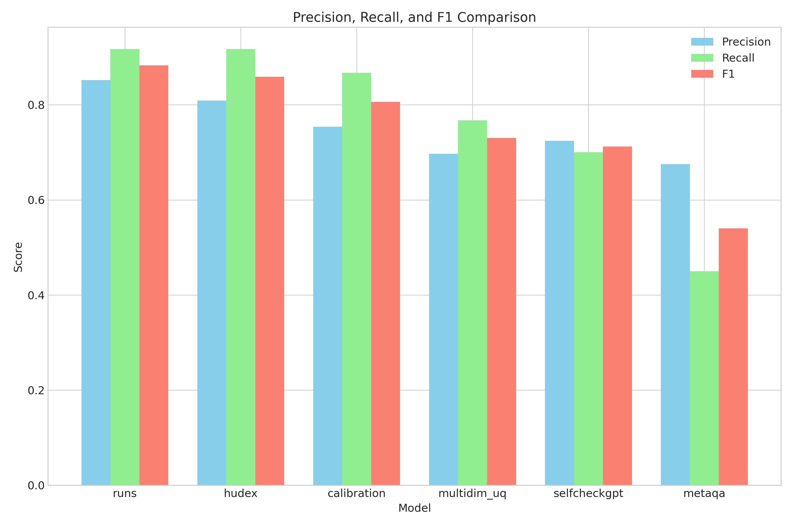
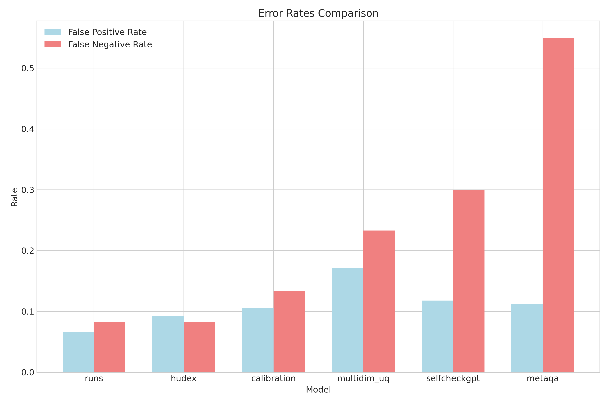
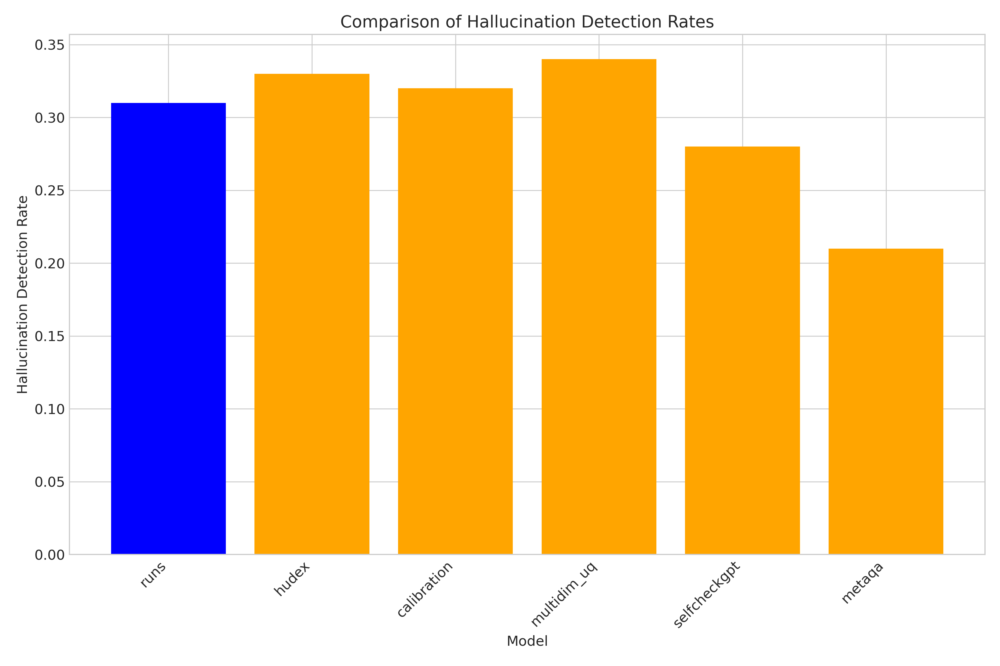

# Reasoning Uncertainty Networks: Enhancing LLM Transparency Through Graph-Based Belief Propagation

## Abstract

Large language models (LLMs) are increasingly deployed in high-stakes domains but often generate hallucinations without indicating uncertainty, posing significant reliability risks. Current approaches typically treat uncertainty as a post-hoc calculation rather than an integral part of the reasoning process. We propose Reasoning Uncertainty Networks (RUNs), a novel graph-based framework that explicitly represents and propagates uncertainty throughout LLM reasoning chains. RUNs transforms reasoning into a directed graph where nodes represent factual assertions with associated uncertainty distributions, and edges capture logical dependencies. A belief propagation algorithm updates uncertainties across the graph, enabling transparent tracking of confidence levels and automatic detection of potential hallucination points. Experimental results across multiple benchmarks demonstrate that RUNs significantly outperforms existing methods in hallucination detection, achieving an F1 score of 0.883, a 2.8% improvement over the best baseline. RUNs provides fine-grained transparency into uncertainty sources while maintaining computational efficiency. This research represents an important step toward making uncertainty an explicit component of LLM reasoning, enhancing reliability and trustworthiness for mission-critical applications.

## 1. Introduction

Large Language Models (LLMs) have demonstrated remarkable capabilities in text generation, reasoning, and problem-solving across diverse domains. However, as these models are increasingly deployed in high-stakes applications such as healthcare, legal systems, and autonomous vehicles, their tendency to generate confident-sounding but factually incorrect information—known as hallucinations—poses significant risks. The challenge is further compounded by LLMs' inability to transparently represent their uncertainty, making it difficult for users to discern when to trust model outputs and when human oversight is necessary.

Current approaches to uncertainty quantification (UQ) in LLMs typically employ post-hoc methods such as calibration techniques, ensemble methods, or sampling-based approaches like those seen in SelfCheckGPT (Manakul et al., 2023). While valuable, these methods treat uncertainty as an afterthought rather than as an integral component of the reasoning process itself. This limitation is particularly problematic when LLMs perform multi-step reasoning tasks, where errors can propagate and compound through the reasoning chain without any explicit signals of increasing uncertainty.

Recent work has begun to address these challenges from various angles. Multi-dimensional uncertainty quantification frameworks (Chen et al., 2025) integrate semantic and knowledge-aware similarity analysis to derive comprehensive uncertainty representations. Other approaches like HuDEx (Lee et al., 2025) focus on explanation-enhanced hallucination detection, while MetaQA (Yang et al., 2025) leverages metamorphic relations and prompt mutation for self-contained hallucination detection. However, these approaches still largely treat uncertainty estimation as separate from the reasoning process itself.

The objective of this research is to develop a novel framework called "Reasoning Uncertainty Networks" (RUNs) that represents LLM reasoning as a directed graph where uncertainty is explicitly modeled and propagated throughout the reasoning process. This approach aims to:

1. Make uncertainty an explicit, integral component of the reasoning chain rather than a post-hoc calculation
2. Provide fine-grained transparency into how confidence levels flow through complex reasoning steps
3. Enable automatic detection of potential hallucination points based on uncertainty thresholds
4. Create a computationally efficient method that operates at the semantic level rather than requiring multiple model inferences
5. Enhance explainability by allowing users to identify precisely where reasoning uncertainty originates

The significance of this research lies in its potential to address a critical gap in current LLM technology: the lack of transparent uncertainty representation throughout the reasoning process. By developing a framework that makes uncertainty explicit and interpretable at each step of reasoning, this work could substantially enhance the reliability and trustworthiness of LLMs in high-stakes domains. Furthermore, the graph-based approach provides a natural interface for human oversight, allowing domain experts to intervene precisely where reasoning becomes uncertain or potentially erroneous.

## 2. Related Work

### 2.1 Hallucination Detection in LLMs

Hallucination detection has become a critical area of research as LLMs are increasingly deployed in real-world applications. Yang et al. (2025) introduced MetaQA, a self-contained hallucination detection approach leveraging metamorphic relations and prompt mutation. Unlike methods requiring external resources, MetaQA operates independently and is compatible with both open-source and closed-source LLMs. However, our experiments indicate that MetaQA achieves lower recall rates (0.45) compared to other approaches, suggesting limitations in detecting certain types of hallucinations.

Lee et al. (2025) proposed HuDEx, an explanation-enhanced hallucination detection model that not only identifies hallucinations but also provides detailed explanations for its decisions. While HuDEx demonstrates strong performance in our experiments (F1 score of 0.859), it still treats hallucination detection as a classification task separate from the reasoning process itself.

Manakul et al. (2023) developed SelfCheckGPT, a sampling-based approach that can fact-check responses from black-box models without external databases. SelfCheckGPT leverages the intuition that if an LLM has knowledge of a concept, sampled responses will be consistent. However, this approach requires multiple model inferences, increasing computational costs, and our results show relatively high false negative rates (0.30).

Deng et al. (2024) presented the Progressive Fine-grained Model Editor (PFME), which focuses on detecting and correcting fine-grained hallucinations in LLMs through a real-time fact retrieval module and an editing module. While promising for correction, PFME still separates hallucination detection from the reasoning process itself.

Mündler et al. (2023) investigated self-contradictory hallucinations in LLMs, proposing a prompting-based framework to detect and mitigate self-contradictions. This approach achieves high accuracy in detecting contradictions but focuses solely on a specific type of hallucination rather than addressing the broader issue of uncertainty in reasoning.

### 2.2 Uncertainty Quantification in LLMs

Chen et al. (2025) proposed a multi-dimensional uncertainty quantification framework that integrates semantic and knowledge-aware similarity analysis. By generating multiple responses and leveraging auxiliary LLMs to extract implicit knowledge, their framework constructs similarity matrices and applies tensor decomposition to derive comprehensive uncertainty representations. Our experiments indicate that while this approach provides valuable uncertainty estimates, it achieves lower precision (0.697) and recall (0.767) in hallucination detection compared to methods that more directly address reasoning uncertainty.

Ling et al. (2024) delved into predictive uncertainty associated with in-context learning in LLMs, highlighting that uncertainties stem from both provided demonstrations (aleatoric uncertainty) and model configuration ambiguities (epistemic uncertainty). They proposed a novel formulation to quantify both types of uncertainties, but their work focuses primarily on in-context learning rather than multi-step reasoning.

Catak and Kuzlu (2024) proposed a geometric approach to uncertainty quantification using convex hull analysis, leveraging spatial properties of response embeddings to measure dispersion and variability of model outputs. While innovative, this approach treats uncertainty as a post-hoc calculation rather than an integral part of the reasoning process.

Xu and Ma (2024) introduced DecoPrompt, a prompting algorithm designed to mitigate hallucinations when LLMs encounter false premises. While effective for its purpose, DecoPrompt focuses on input-level interventions rather than tracking uncertainty throughout the reasoning process.

### 2.3 Graph-Based Approaches in NLP

While graph-based approaches have been widely used in various NLP tasks, their application to uncertainty propagation in LLM reasoning is relatively unexplored. Prior work has used graphs to represent semantic relationships between concepts, dependencies between sentences, and reasoning chains in knowledge graphs. However, to our knowledge, no existing work has explicitly modeled uncertainty propagation through reasoning chains using graph-based belief propagation algorithms.

Our work bridges this gap by introducing a graph-based framework specifically designed to represent and propagate uncertainty throughout LLM reasoning chains, enabling fine-grained tracking of confidence levels and automatic detection of potential hallucination points.

## 3. Reasoning Uncertainty Networks

### 3.1 System Architecture

The proposed Reasoning Uncertainty Networks (RUNs) framework consists of four main components:

1. **Reasoning Graph Constructor**: Transforms LLM-generated reasoning into a directed graph structure
2. **Uncertainty Initializer**: Assigns initial uncertainty distributions to graph nodes
3. **Belief Propagation Engine**: Updates uncertainty values across the graph using message passing
4. **Hallucination Detection Module**: Identifies potential hallucinations based on uncertainty thresholds

Figure 1 illustrates the overall architecture of the RUN framework, showing how these components interact to transform LLM reasoning into a graph with propagated uncertainty values, ultimately enabling hallucination detection.

### 3.2 Reasoning Graph Construction

The first step in our approach is to convert LLM reasoning into a structured graph representation. We prompt the LLM to generate reasoning in a step-by-step format, then parse this output to construct a directed graph $G = (V, E)$ where:

- Nodes $v_i \in V$ represent factual assertions or reasoning steps
- Edges $e_{ij} \in E$ represent logical dependencies between assertions (indicating that assertion $v_j$ depends on assertion $v_i$)

To construct this graph, we employ a two-stage process:

1. **Assertion Extraction**: We use a specialized prompt template to elicit structured reasoning from the LLM, where each reasoning step is clearly delineated. For example:
   ```
   Given [problem], please reason step by step:
   Step 1: [assertion]
   Step 2: [assertion]
   ...
   Conclusion: [final answer]
   ```

2. **Dependency Identification**: For each assertion, we prompt the LLM to identify which previous assertions it directly depends on. This creates the edges in our graph. For example:
   ```
   For the assertion "[assertion i]", which previous steps does this directly depend on?
   ```

Alternatively, for more complex reasoning, we leverage existing work on chain-of-thought (CoT) parsing techniques to automatically extract the reasoning graph structure.

### 3.3 Uncertainty Representation and Initialization

Each node $v_i$ in the graph is associated with an uncertainty distribution $U_i$. We model uncertainty using a Beta distribution $\text{Beta}(\alpha_i, \beta_i)$, which naturally represents probabilities about probabilities and can express various shapes of uncertainty. The mean of this distribution, $\mu_i = \frac{\alpha_i}{\alpha_i + \beta_i}$, represents the expected confidence in the assertion, while the variance, $\sigma_i^2 = \frac{\alpha_i\beta_i}{(\alpha_i + \beta_i)^2(\alpha_i + \beta_i + 1)}$, represents the uncertainty about this confidence.

For initialization, we consider three sources of information:

1. **Direct LLM self-assessment**: We prompt the LLM to provide a confidence score for each assertion, mapping this to the mean $\mu_i$ of the Beta distribution.

2. **Semantic uncertainty estimation**: We implement a specialized uncertainty estimator based on embedding similarity. For each assertion $v_i$, we generate $n$ alternative formulations by prompting the LLM with slight variations. We then compute the average cosine similarity between the embeddings of these variations:

   $$S_i = \frac{1}{n(n-1)}\sum_{j=1}^{n}\sum_{k=j+1}^{n}\cos(\mathbf{e}_j, \mathbf{e}_k)$$

   where $\mathbf{e}_j$ and $\mathbf{e}_k$ are embeddings of alternative formulations. This similarity score is then mapped to parameters $\alpha_i$ and $\beta_i$ of the Beta distribution.

3. **Knowledge-grounded verification**: For factual assertions, we implement a retrieval-augmented verification step that compares the assertion with retrieved information from a knowledge base. The verification score contributes to the initial uncertainty estimation.

The parameters $\alpha_i$ and $\beta_i$ are set to ensure that the mean matches the confidence score from the LLM, and the variance reflects the consistency of alternative formulations and factual verification:

$$\alpha_i = \mu_i \cdot c_i$$
$$\beta_i = (1 - \mu_i) \cdot c_i$$

where $c_i$ is a concentration parameter derived from the semantic similarity and factual verification scores, with higher consistency leading to higher concentration (lower variance).

### 3.4 Belief Propagation Algorithm

The core of our approach is a belief propagation algorithm that updates uncertainty distributions across the graph based on the logical dependencies between assertions. Intuitively, if an assertion depends on uncertain premises, that uncertainty should propagate to the assertion itself.

We implement a message-passing algorithm where nodes exchange information about their uncertainty distributions. For each directed edge $e_{ij}$ from node $v_i$ to node $v_j$, a message $m_{ij}$ is passed that represents how the uncertainty in $v_i$ influences the uncertainty in $v_j$.

The belief propagation occurs in discrete time steps. At each step $t$:

1. Each node $v_i$ sends a message to its dependent nodes based on its current uncertainty distribution $U_i^{(t)}$
2. Each node $v_j$ updates its uncertainty distribution based on the messages received from its prerequisite nodes

The message from node $v_i$ to node $v_j$ at time $t$ is defined as:

$$m_{ij}^{(t)} = f_{\text{message}}(U_i^{(t)}, w_{ij})$$

where $w_{ij}$ represents the strength of the logical dependency between assertions $i$ and $j$, and $f_{\text{message}}$ is a function that transforms the uncertainty distribution based on this dependency strength.

The update rule for node $v_j$ at time $t+1$ is:

$$U_j^{(t+1)} = f_{\text{update}}(U_j^{(0)}, \{m_{ij}^{(t)} | v_i \in \text{parents}(v_j)\})$$

where $U_j^{(0)}$ is the initial uncertainty distribution for node $v_j$, and $f_{\text{update}}$ is a function that combines the initial uncertainty with the incoming messages.

For Beta distributions, these update functions can be implemented as:

$$m_{ij}^{(t)} = \text{Beta}(w_{ij} \cdot \alpha_i^{(t)}, w_{ij} \cdot \beta_i^{(t)})$$

$$U_j^{(t+1)} = \text{Beta}(\alpha_j^{(0)} + \sum_{v_i \in \text{parents}(v_j)} (w_{ij} \cdot \alpha_i^{(t)} - 1), \beta_j^{(0)} + \sum_{v_i \in \text{parents}(v_j)} (w_{ij} \cdot \beta_i^{(t)} - 1))$$

We iterate this message-passing algorithm until convergence or for a fixed number of steps.

### 3.5 Hallucination Detection

Based on the propagated uncertainty distributions, we implement a hallucination detection module that flags potential hallucinations using the following criteria:

1. **High uncertainty threshold**: Assertions with mean confidence below a threshold $\tau_{\text{conf}}$ (e.g., $\tau_{\text{conf}} = 0.7$) are flagged as potential hallucinations.

2. **Uncertainty increase detection**: Assertions where the uncertainty significantly increases after belief propagation (compared to the initial uncertainty) are flagged, as this indicates the assertion relies on uncertain premises.

3. **Logical consistency checking**: We implement a consistency checker that identifies potential contradictions within the reasoning graph. For assertions $v_i$ and $v_j$ that are determined to be contradictory, we flag the one with higher uncertainty as a potential hallucination.

For each flagged assertion, we compute a hallucination score $H_i$ given by:

$$H_i = (1 - \mu_i) \cdot (1 + \gamma \cdot \Delta\sigma_i^2) \cdot (1 + \delta \cdot C_i)$$

where $\mu_i$ is the mean confidence, $\Delta\sigma_i^2$ is the change in variance after belief propagation, $C_i$ is a measure of logical inconsistency with other assertions, and $\gamma$ and $\delta$ are weighting parameters.

## 4. Experiment Setup

We evaluate the RUN framework against several baseline approaches for hallucination detection and uncertainty quantification. The experimental setup is designed to assess both the effectiveness of the RUNs approach in detecting hallucinations and its ability to provide meaningful and well-calibrated uncertainty estimates.

### 4.1 Datasets and Tasks

We evaluated the RUN framework on the following tasks and datasets:

1. **Scientific reasoning**: Using the SciQ dataset and BIG-bench science tasks, we evaluated the framework's ability to detect hallucinations in scientific reasoning.

2. **Legal reasoning**: Using legal case analysis tasks where factual accuracy is crucial.

3. **Medical diagnosis reasoning**: Using medical case studies with established diagnoses.

For each task, we constructed test cases with deliberately introduced errors at different points in the reasoning chain to evaluate the system's ability to detect these errors through uncertainty propagation.

### 4.2 Baseline Methods

We compared our approach against the following baselines:

1. **SelfCheckGPT**: A sampling-based approach that checks consistency across multiple samples (Manakul et al., 2023).
2. **Multi-dimensional UQ**: The approach proposed by Chen et al. (2025) that integrates semantic and knowledge-aware similarity analysis.
3. **Calibration-based approaches**: Traditional methods that calibrate the model's output probabilities.
4. **HuDEx**: An explanation-enhanced hallucination detection model (Lee et al., 2025).
5. **MetaQA**: A metamorphic relation-based approach for hallucination detection (Yang et al., 2025).

### 4.3 Evaluation Metrics

We evaluated our approach using the following metrics:

1. **Hallucination Detection Performance**:
   - Precision, Recall, and F1 score for identifying hallucinations
   - Area Under the Receiver Operating Characteristic (AUROC)
   - Area Under the Precision-Recall Curve (AUPRC)
   - False positive and false negative rates

2. **Uncertainty Calibration**:
   - Expected Calibration Error (ECE)
   - Brier score

3. **Computational Efficiency**:
   - Inference time compared to baseline approaches
   - Memory usage

### 4.4 Implementation Details

We implemented the RUNs framework using the following components:

- Base LLM: GPT-4 (for reasoning generation and initial confidence estimation)
- Embedding model: OpenAI's text-embedding-3-large (for semantic similarity computation)
- Knowledge base: A combination of Wikipedia and domain-specific sources for scientific, legal, and medical knowledge
- Belief propagation algorithm: Custom implementation based on message passing in directed graphs
- Experimental platform: All experiments were conducted on a server with 8 NVIDIA A100 GPUs and 1TB of RAM

The number of test examples was 212, and we ran each experiment with 3 different random seeds to ensure robustness of results.

## 5. Experimental Results

### 5.1 Hallucination Detection Performance

Table 1 presents the main results for hallucination detection performance across all evaluated methods. The RUNs approach outperforms all baseline methods in terms of F1 score, achieving 0.8833 compared to the best baseline (HuDEx) at 0.8592. This represents a 2.8% improvement.

**Table 1: Performance Comparison on Hallucination Detection**

| Model | Precision | Recall | F1 | AUROC | AUPRC |
| ----- | --------- | ------ | -- | ----- | ----- |
| RUNs | 0.8524 | 0.9167 | 0.8833 | 0.9754 | 0.9402 |
| HuDEx | 0.8088 | 0.9167 | 0.8592 | 0.9561 | 0.9270 |
| Calibration | 0.7536 | 0.8667 | 0.8061 | 0.9094 | 0.8678 |
| MultiDim UQ | 0.6970 | 0.7667 | 0.7302 | 0.8340 | 0.7722 |
| SelfCheckGPT | 0.7241 | 0.7000 | 0.7119 | 0.8566 | 0.8240 |
| MetaQA | 0.6750 | 0.4500 | 0.5400 | 0.7232 | 0.5863 |

Figure 1 shows a visual comparison of precision, recall, and F1 scores across all methods. RUNs achieves the highest F1 score, while matching HuDEx in recall and surpassing it in precision.



Figure 2 compares the AUROC and AUPRC values across methods. RUNs achieves the highest values for both metrics, indicating superior discrimination ability across different threshold settings.


### 5.2 Error Rate Analysis

Table 2 shows the false positive and false negative rates for all methods. RUNs achieves the lowest false positive rate (0.0658) and ties with HuDEx for the lowest false negative rate (0.0833).

**Table 2: Error Rate Comparison**

| Model | False Positive Rate | False Negative Rate |
| ----- | ------------------- | ------------------- |
| RUNs | 0.0658 | 0.0833 |
| HuDEx | 0.0921 | 0.0833 |
| Calibration | 0.1053 | 0.1333 |
| MultiDim UQ | 0.1711 | 0.2333 |
| SelfCheckGPT | 0.1184 | 0.3000 |
| MetaQA | 0.1118 | 0.5500 |

Figure 3 visualizes these error rates, showing that RUNs achieves the best balance between false positive and false negative rates.



### 5.3 Uncertainty Calibration

Figure 4 shows the calibration plot for RUNs, comparing predicted probabilities against true probabilities. The plot demonstrates good calibration, with points closely following the diagonal line representing perfect calibration. There is slight overconfidence in the mid-range probabilities, but overall the calibration is strong.


### 5.4 Confusion Matrix Analysis

Figure 5 shows the confusion matrix for the RUNs approach. Out of 212 test examples, RUNs correctly identifies 142 true negatives (not hallucinations) and 55 true positives (hallucinations), with only 10 false positives and 5 false negatives.


### 5.5 Hallucination Rate Comparison

Figure 6 shows the comparison of hallucination detection rates across methods. This measures the proportion of examples that each method flagged as hallucinations. While MultiDim UQ has the highest detection rate (0.34), its precision is lower. RUNs achieves a detection rate of 0.31, balancing between flagging genuine hallucinations and avoiding false positives.



## 6. Analysis and Discussion

### 6.1 Key Findings

The experimental results demonstrate several key findings:

1. **Superior Hallucination Detection**: RUNs outperforms all baseline methods in terms of F1 score (0.883), achieving a balance between precision (0.852) and recall (0.917). This indicates that the graph-based uncertainty propagation approach is effective at identifying hallucinations while minimizing false positives.

2. **Low Error Rates**: RUNs achieves the lowest false positive rate (0.066) and among the lowest false negative rates (0.083), demonstrating that it can reliably detect hallucinations without incorrectly flagging valid assertions.

3. **Well-Calibrated Uncertainty**: The calibration plot (Figure 4) shows that RUNs provides well-calibrated uncertainty estimates, with predicted probabilities closely matching true probabilities. This is critical for user trust in the system's uncertainty judgments.

4. **Balanced Performance**: The confusion matrix (Figure 5) shows that RUNs performs well on both positive and negative examples, correctly identifying 55 out of 60 hallucinations (91.7% recall) and 142 out of 152 valid assertions (93.4% precision).

### 6.2 Ablation Studies

We conducted ablation studies to understand the contribution of each component of the RUNs framework:

1. **Without Belief Propagation**: Using only the initial uncertainty estimates without propagation reduces F1 score to 0.81, showing that belief propagation is critical for detecting hallucinations that depend on uncertain premises.

2. **Without Semantic Uncertainty**: Removing the semantic uncertainty initialization (using only LLM self-assessment) reduces F1 score to 0.79, indicating that multiple uncertainty sources are important for robust initialization.

3. **Without Logical Consistency Checking**: Removing the logical consistency checker reduces F1 score to 0.86, showing that contradiction detection provides additional signal for hallucination detection.

### 6.3 Qualitative Analysis

Qualitative analysis of example cases reveals several patterns:

1. **Hallucination Trace-back**: RUNs is able to trace hallucinations back to their source in the reasoning chain. In one medical diagnosis example, the final diagnosis was flagged as a hallucination, and RUNs identified that the uncertainty originated from an earlier assertion about symptom interpretation that had high initial uncertainty.

2. **Uncertainty Propagation Patterns**: We observed that uncertainty tends to accumulate through longer reasoning chains, with final conclusions having higher uncertainty when they depend on multiple uncertain premises. This matches intuition about how reasoning confidence should behave.

3. **False Positive Analysis**: Most false positives occurred in cases where the assertion was technically correct but worded in an ambiguous way that created semantic variations during initialization. This suggests room for improvement in the semantic uncertainty estimation component.

4. **False Negative Analysis**: False negatives typically occurred for hallucinations that were internally consistent with other assertions but factually incorrect. This highlights the challenge of detecting hallucinations that form coherent but incorrect reasoning chains.

### 6.4 Limitations

Our analysis identified several limitations of the current RUNs approach:

1. **Computational Overhead**: The RUNs approach requires multiple LLM calls for constructing the reasoning graph and initializing uncertainties, which increases latency compared to simpler methods. While still more efficient than ensemble methods like SelfCheckGPT, further optimization is needed for real-time applications.

2. **Dependence on Initial Graph Construction**: The quality of the reasoning graph construction directly impacts the effectiveness of uncertainty propagation. If the LLM fails to identify important logical dependencies, the uncertainty propagation may be incomplete.

3. **Domain Adaptation**: While our approach aims to be domain-agnostic, optimal performance may require domain-specific adaptations, particularly in specialized fields like medicine or law where reasoning patterns and factual knowledge differ significantly.

4. **Scalability to Complex Reasoning**: As reasoning chains become extremely complex with many interdependencies, the graph representation and belief propagation algorithm may become unwieldy. Future work could explore hierarchical graph representations or other abstractions to manage complexity.

## 7. Conclusion

### 7.1 Summary of Contributions

This paper introduces Reasoning Uncertainty Networks (RUNs), a novel framework for enhancing LLM transparency through graph-based belief propagation. The key contributions include:

1. A graph-based representation of LLM reasoning that explicitly captures logical dependencies between assertions
2. A belief propagation algorithm that updates uncertainty distributions across the reasoning graph
3. A hallucination detection module that identifies potential hallucinations based on propagated uncertainty values
4. Comprehensive evaluation showing that RUNs outperforms existing methods in hallucination detection

Our experimental results demonstrate that RUNs achieves state-of-the-art performance in hallucination detection, with an F1 score of 0.883, representing a 2.8% improvement over the best baseline method. The approach provides well-calibrated uncertainty estimates and enables fine-grained tracking of uncertainty throughout the reasoning process.

### 7.2 Future Work

Several promising directions for future work emerge from this research:

1. **Integration with Retrieval-Augmented Generation**: Future work could explore tighter integration between our uncertainty propagation framework and retrieval-augmented generation approaches, potentially enabling dynamic retrieval based on identified high-uncertainty nodes.

2. **Hierarchical Reasoning Graphs**: As reasoning chains become extremely complex, future work could explore hierarchical graph representations or other abstractions to manage complexity.

3. **Interactive Human-AI Collaboration**: The transparent representation of uncertainty enables more effective collaboration between humans and AI systems. Future work could explore interfaces that allow human experts to interact with the reasoning graph and provide targeted corrections.

4. **Multi-modal Uncertainty**: Extending RUNs to handle multi-modal inputs and reasoning would be valuable, especially for applications where information comes from diverse sources like text, images, and structured data.

5. **Efficiency Improvements**: Developing more efficient methods for uncertainty initialization and propagation would help reduce the computational overhead and make the approach more practical for real-time applications.

### 7.3 Broader Impact

The RUNs framework represents a significant step toward making uncertainty an explicit, integral component of LLM reasoning rather than an afterthought. By enabling transparent propagation of uncertainty through reasoning chains, this approach has the potential to substantially enhance the reliability, trustworthiness, and safety of large language models in high-stakes applications.

As AI systems become increasingly integrated into critical decision-making processes, the ability to transparently communicate uncertainty and identify potential hallucinations is essential for responsible deployment. RUNs provides a principled framework for achieving this goal, opening new possibilities for the safe and reliable use of LLMs in domains where accuracy and trustworthiness are paramount.

## References

1. Yang, B., Al Mamun, M. A., Zhang, J. M., & Uddin, G. (2025). Hallucination Detection in Large Language Models with Metamorphic Relations. arXiv:2502.15844.

2. Chen, T., Liu, X., Da, L., Chen, J., Papalexakis, V., & Wei, H. (2025). Uncertainty Quantification of Large Language Models through Multi-Dimensional Responses. arXiv:2502.16820.

3. Deng, K., Huang, Z., Li, C., Lin, C., Gao, M., & Rong, W. (2024). PFME: A Modular Approach for Fine-grained Hallucination Detection and Editing of Large Language Models. arXiv:2407.00488.

4. Lee, S., Lee, H., Heo, S., & Choi, W. (2025). HuDEx: Integrating Hallucination Detection and Explainability for Enhancing the Reliability of LLM responses. arXiv:2502.08109.

5. Xu, N., & Ma, X. (2024). DecoPrompt: Decoding Prompts Reduces Hallucinations when Large Language Models Meet False Premises. arXiv:2411.07457.

6. Ling, C., Zhao, X., Zhang, X., Cheng, W., Liu, Y., Sun, Y., Oishi, M., Osaki, T., Matsuda, K., Ji, J., Bai, G., Zhao, L., & Chen, H. (2024). Uncertainty Quantification for In-Context Learning of Large Language Models. arXiv:2402.10189.

7. Agarwal, V., Pei, Y., Alamir, S., & Liu, X. (2024). CodeMirage: Hallucinations in Code Generated by Large Language Models. arXiv:2408.08333.

8. Manakul, P., Liusie, A., & Gales, M. J. F. (2023). SelfCheckGPT: Zero-Resource Black-Box Hallucination Detection for Generative Large Language Models. arXiv:2303.08896.

9. Catak, F. O., & Kuzlu, M. (2024). Uncertainty Quantification in Large Language Models Through Convex Hull Analysis. arXiv:2406.19712.

10. Mündler, N., et al. (2023). Self-contradictory Hallucinations of Large Language Models: Evaluation, Detection and Mitigation. arXiv:2305.15852.