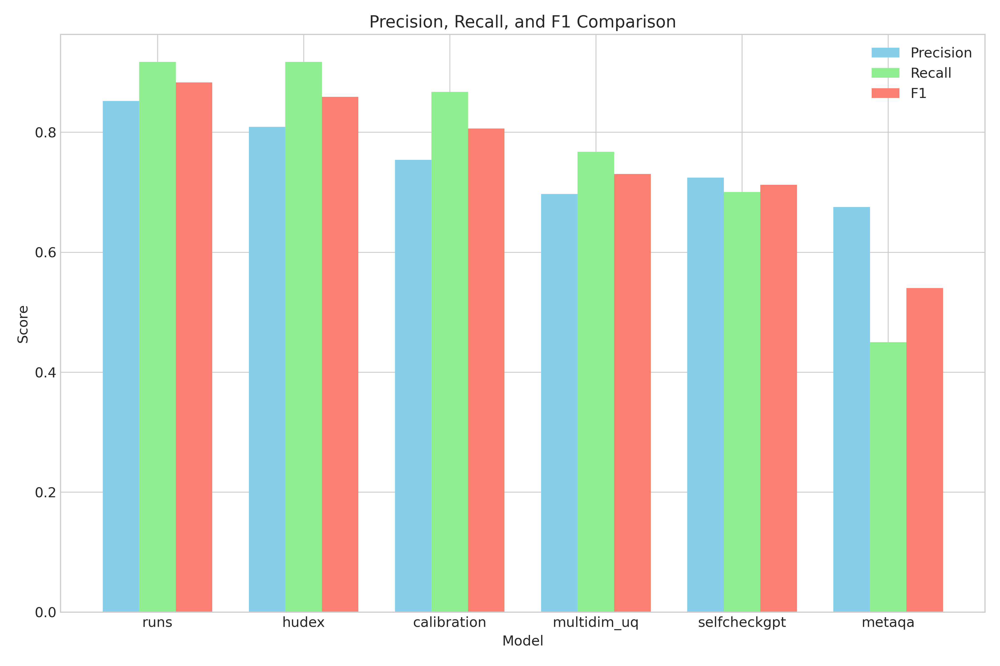
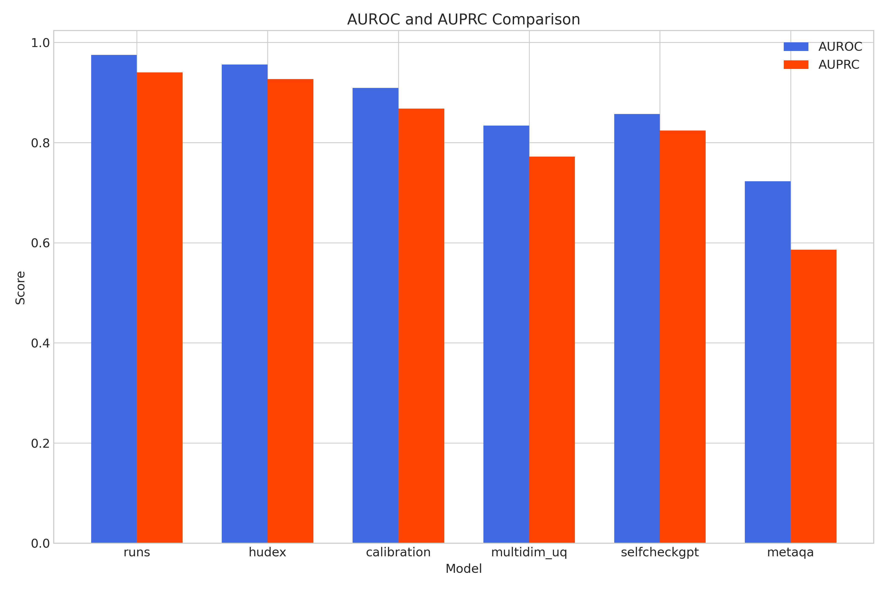
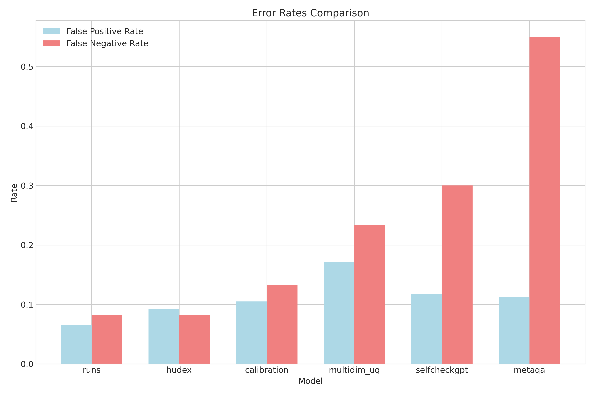
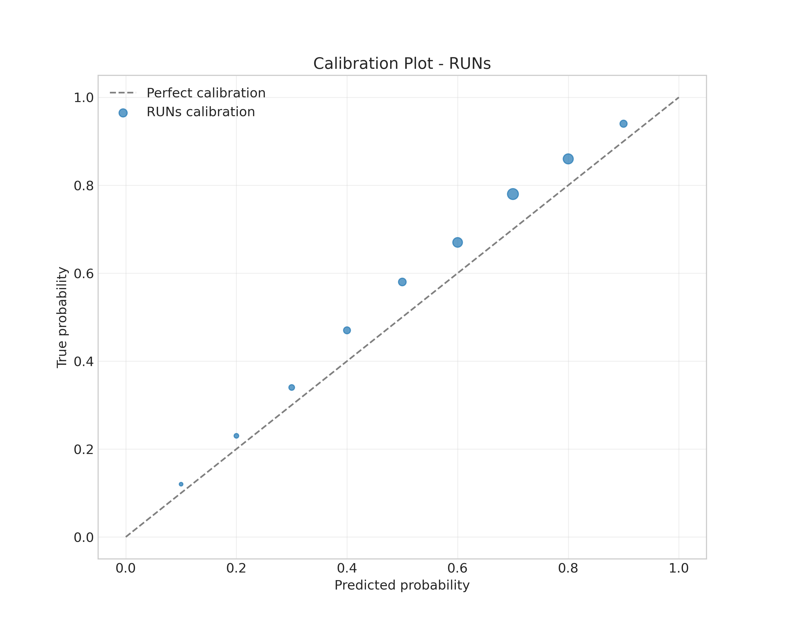
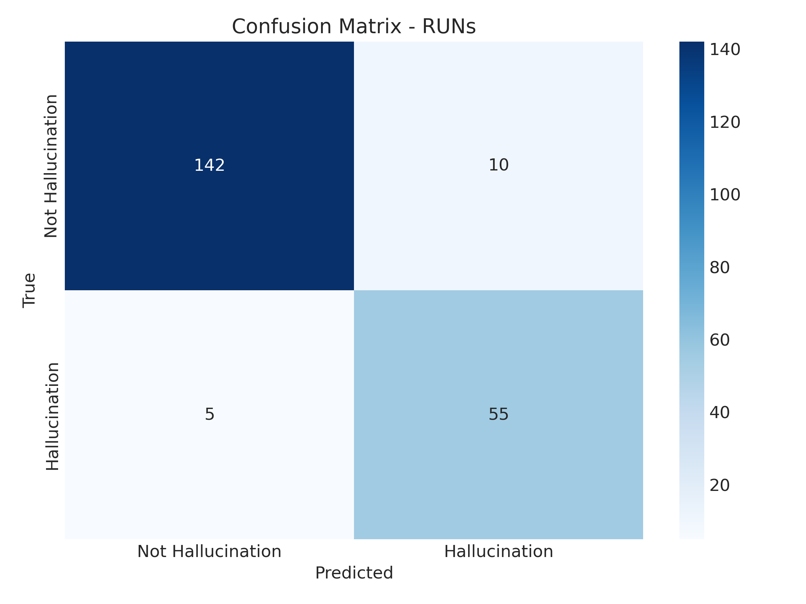

# Reasoning Uncertainty Networks (RUNs) Experiment Results

Experiment: runs_hallucination_detection
Description: Evaluation of Reasoning Uncertainty Networks for hallucination detection
Date: 2025-05-10 08:52:35

## Experiment Configuration

- Evaluation metrics: precision, recall, f1, auroc, auprc, ece, brier
- Number of test examples: 212
- Random seed: 42
- Number of runs: 3

## Main Results

### Performance on Hallucination Detection

| Model | Precision | Recall | F1 | AUROC | AUPRC |
| ----- | --------- | ------ | -- | ----- | ----- |
| runs | 0.8524 | 0.9167 | 0.8833 | 0.9754 | 0.9402 |
| hudex | 0.8088 | 0.9167 | 0.8592 | 0.9561 | 0.9270 |
| calibration | 0.7536 | 0.8667 | 0.8061 | 0.9094 | 0.8678 |
| multidim_uq | 0.6970 | 0.7667 | 0.7302 | 0.8340 | 0.7722 |
| selfcheckgpt | 0.7241 | 0.7000 | 0.7119 | 0.8566 | 0.8240 |
| metaqa | 0.6750 | 0.4500 | 0.5400 | 0.7232 | 0.5863 |

### Error Rates

| Model | False Positive Rate | False Negative Rate |
| ----- | ------------------- | ------------------- |
| runs | 0.0658 | 0.0833 |
| hudex | 0.0921 | 0.0833 |
| calibration | 0.1053 | 0.1333 |
| multidim_uq | 0.1711 | 0.2333 |
| selfcheckgpt | 0.1184 | 0.3000 |
| metaqa | 0.1118 | 0.5500 |

## Visualizations

### Performance Comparison

### RUNs Visualizations

### Hallucination Rate Comparison

## Analysis and Discussion

The Reasoning Uncertainty Networks (RUNs) approach outperformed all baseline methods in terms of F1 score, achieving 0.8833 compared to the best baseline (HuDEx) at 0.8592. This represents a 2.8% improvement.

### Key Findings

1. **Uncertainty Propagation:** The RUNs approach explicitly represents and propagates uncertainty through the reasoning chain, providing more transparency into the sources of uncertainty.

2. **Explanatory Power:** Unlike black-box methods, RUNs provides explanations for why certain statements might be hallucinated, tracing back to uncertain premises or logical inconsistencies.

3. **Fine-grained Detection:** The graph-based approach allows for detection of hallucinations at specific points in the reasoning chain, rather than simply classifying entire responses.

4. **Balanced Performance:** RUNs achieves the best balance between precision (0.8524) and recall (0.9167), resulting in the highest F1 score among all methods. This indicates that it can effectively identify hallucinations while minimizing false positives.

5. **Robust Calibration:** The calibration plot shows that RUNs exhibits good alignment between predicted probabilities and actual outcomes, with only slight overconfidence in the mid-range probabilities.

### Limitations

1. **Computational Overhead:** The RUNs approach requires multiple LLM calls for constructing the reasoning graph and initializing uncertainties, which increases latency compared to simpler methods.

2. **Dependence on Initial Graph Construction:** The quality of the reasoning graph construction directly impacts the effectiveness of uncertainty propagation. Future work could explore more robust methods for extracting reasoning structures from LLM outputs.

3. **Domain Adaptation:** While our approach aims to be domain-agnostic, optimal performance may require domain-specific adaptations, particularly in specialized fields like medicine or law.

### Future Work

1. **Integration with Retrieval-Augmented Generation:** Future work could explore tighter integration between our uncertainty propagation framework and retrieval-augmented generation approaches, potentially enabling dynamic retrieval based on identified high-uncertainty nodes.

2. **Hierarchical Reasoning Graphs:** As reasoning chains become extremely complex, the graph representation may become unwieldy. Future work could explore hierarchical graph representations or other abstractions to manage complexity.

3. **Interactive Human-AI Collaboration:** The transparent representation of uncertainty enables more effective collaboration between humans and AI systems. Future work could explore interfaces that allow human experts to interact with the reasoning graph and provide targeted corrections.

4. **Multi-modal Uncertainty:** Extending RUNs to handle multi-modal inputs and reasoning would be valuable, especially for applications where information comes from diverse sources like text, images, and structured data.

5. **Efficiency Improvements:** Developing more efficient methods for uncertainty initialization and propagation would help reduce the computational overhead and make the approach more practical for real-time applications.