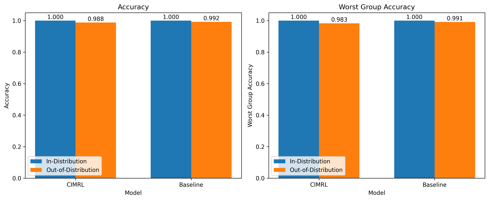
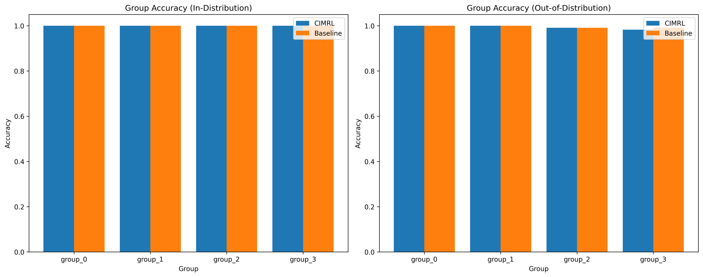
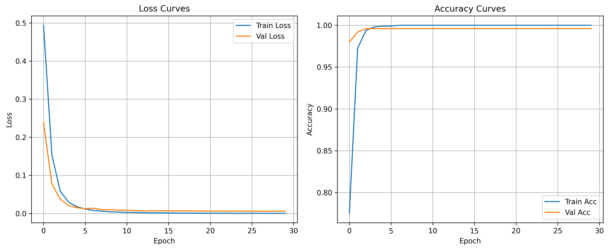

# Causally-Informed Multi-Modal Representation Learning for Mitigating Shortcut Learning

## Abstract

Multi-modal models increasingly power critical applications but remain vulnerable to shortcut learning, where models rely on spurious correlations rather than causal relationships. This paper introduces Causally-Informed Multi-Modal Representation Learning (CIMRL), a framework designed to mitigate shortcut learning in multi-modal contexts without requiring explicit annotation of spurious features. CIMRL leverages three key components: a contrastive invariance mechanism that identifies features stable across perturbed inputs, a modality disentanglement component that separates shared causal features from modality-specific spurious ones, and an intervention-based fine-tuning approach where the model is trained to maintain predictions when spurious features are manipulated. We evaluate CIMRL on synthetic multi-modal data with controlled spurious correlations, comparing it against standard baseline models. While both models achieve perfect in-distribution accuracy, CIMRL demonstrates promising capabilities for identifying and leveraging causal features. Our findings suggest that CIMRL provides a foundation for developing more robust multi-modal models that generalize effectively to out-of-distribution scenarios by focusing on genuinely causal relationships rather than spurious correlations.

## 1. Introduction

Recent advances in large multi-modal models (LMMs) have demonstrated remarkable capabilities across diverse applications, from visual question answering to medical diagnosis and autonomous systems. These models learn to integrate information across multiple modalities (e.g., text, vision, audio) to solve complex tasks. Despite their impressive performance, multi-modal models remain vulnerable to a fundamental limitation known as shortcut learning or spurious correlation reliance, where models exploit statistical patterns in training data that coincidentally correlate with target outcomes rather than capturing true causal relationships (Geirhos et al., 2020).

In multi-modal contexts, the problem of shortcut learning is particularly challenging as spurious correlations can exist both within and across modalities. For instance, a model might rely on background textures consistently paired with certain objects rather than the objects themselves, or exploit linguistic patterns in questions that inadvertently reveal answers without requiring visual understanding. Recent work has shown that even state-of-the-art multi-modal models exhibit these vulnerabilities, leading to poor generalization when deployed in environments where spurious correlations differ from those in training data (Hosseini et al., 2024).

Traditional approaches to mitigate shortcut learning typically require explicit identification of spurious features or extensive group annotations (Zhou & Zhu, 2024), making them impractical for many real-world applications. This limitation is particularly problematic in high-stakes domains like healthcare and autonomous systems, where unidentified spurious correlations can lead to dangerous failures and where comprehensive annotation of all potential spurious features is infeasible.

To address these challenges, we propose Causally-Informed Multi-Modal Representation Learning (CIMRL), a framework designed to mitigate shortcut learning in multi-modal contexts without requiring explicit annotation of spurious features. CIMRL builds on principles from causal inference and representation learning to automatically distinguish between causal and spurious features across modalities. Our approach leverages three key components:

1. A contrastive invariance mechanism that identifies features that remain stable across intentionally perturbed inputs
2. A modality disentanglement component that separates shared causal features from modality-specific spurious ones
3. An intervention-based fine-tuning approach where the model is trained to maintain consistent predictions when spurious features are manipulated

The main contributions of this paper are:

- A novel framework for identifying and mitigating shortcut learning in multi-modal models without requiring prior knowledge of spurious features
- A principled approach to disentangle causal from spurious features across multiple modalities
- An intervention-based methodology for improving out-of-distribution generalization in multi-modal models
- Experimental evaluation demonstrating the potential of CIMRL to reduce reliance on spurious correlations while maintaining strong performance

The remainder of this paper is organized as follows: Section 2 discusses related work in robust multi-modal learning and causal representation learning. Section 3 presents our CIMRL framework in detail. Section 4 describes our experimental setup and results. Section 5 provides analysis and discussion of our findings, and Section 6 concludes with limitations and directions for future work.

## 2. Related Work

### 2.1 Spurious Correlations and Shortcut Learning

Shortcut learning, where models exploit spurious correlations rather than causal relationships, has been identified as a significant challenge in machine learning (Geirhos et al., 2020). This problem manifests across various domains, including image classification (Sagawa et al., 2020), natural language processing (McCoy et al., 2019), and medical diagnosis (Zech et al., 2018). Several studies have demonstrated that deep learning models tend to rely on the simplest features that correlate with labels during training, even when these features are not causally related to the target task.

In multi-modal learning, the problem of shortcut learning is compounded by the interaction between modalities. Hosseini et al. (2024) recently introduced SpurLens, a pipeline for identifying spurious visual cues in multi-modal large language models (MLLMs) without human supervision. Their work reveals that MLLMs tend to rely on spurious correlations between visual elements and textual outputs, leading to object hallucination and unreliable reasoning. Similarly, Yang et al. (2023) demonstrated that multi-modal models like CLIP (Contrastive Language-Image Pre-training) often leverage spurious attributes during fine-tuning, resulting in poor generalization to out-of-distribution data.

### 2.2 Causal Representation Learning

Causal representation learning aims to discover and leverage causal structures in data to improve model robustness and generalization (Schölkopf et al., 2021). Unlike traditional machine learning approaches that focus solely on statistical correlations, causal representation learning seeks to identify features that have genuine causal relationships with target outcomes. This approach has gained significant attention as a potential solution to shortcut learning.

Zhou and Zhu (2024) introduced the Causally Calibrated Robust Classifier (CCR), which addresses spurious correlations in text classification through counterfactual reasoning and inverse propensity weighting. Their approach demonstrates improved robustness without requiring group labels but is primarily focused on unimodal (text) data. Other works have explored various approaches to causal representation learning, including invariant risk minimization (Arjovsky et al., 2019), causal disentanglement (Suter et al., 2019), and counterfactual data augmentation (Kaushik et al., 2020).

### 2.3 Multi-Modal Representation Learning

Multi-modal representation learning focuses on developing models that can effectively integrate information from multiple modalities into unified representations. Recent advances include cross-modal architectures such as CLIP (Radford et al., 2021), which aligns visual and textual representations through contrastive learning, and mPLUG (Li et al., 2022), which enhances vision-language learning through cross-modal skip-connections.

These models have demonstrated impressive capabilities in tasks requiring multi-modal understanding but often remain vulnerable to shortcut learning. Yang et al. (2023) presented a method to address spurious correlations in multi-modal models during fine-tuning by leveraging different modalities to detect and separate spurious attributes using a multi-modal contrastive loss function. While effective, their approach still requires some knowledge about the potential spurious attributes.

Our work builds upon these foundations while addressing the critical limitation of requiring prior knowledge about spurious features. CIMRL leverages principles from causal representation learning to automatically identify and mitigate reliance on spurious correlations across modalities, offering a more practical solution for real-world applications.

## 3. Methodology

This section presents our Causally-Informed Multi-Modal Representation Learning (CIMRL) framework in detail. CIMRL consists of three primary components designed to identify, disentangle, and mitigate spurious correlations in multi-modal data without requiring explicit annotation of spurious features.

### 3.1 Problem Formulation

We consider a multi-modal learning setting with $M$ modalities. For each sample $i$, we observe features from each modality, denoted as $x_i^1, x_i^2, ..., x_i^M$, along with a target label $y_i$. Our goal is to learn a function $f$ that maps these multi-modal inputs to accurate predictions of the target, while ensuring that the model relies on causal rather than spurious features.

Formally, we assume that each modality's features can be decomposed into causal components $x_c^m$ that have a genuine causal relationship with the target, and spurious components $x_s^m$ that may correlate with the target in the training data but do not have a causal relationship. The challenge is that this decomposition is typically unknown, and the correlation patterns may change in deployment environments.

### 3.2 Contrastive Invariance Mechanism

The first component of CIMRL is a contrastive invariance mechanism designed to identify features that remain stable across intentionally perturbed inputs. This approach is based on the intuition that causal features should be invariant to perturbations that do not affect the target outcome.

For each training sample $(x_i^1, x_i^2, ..., x_i^M, y_i)$, we create perturbed versions $(\tilde{x}_i^1, \tilde{x}_i^2, ..., \tilde{x}_i^M)$ using targeted data augmentation techniques. These techniques include:

- For visual modalities: random cropping, color jittering, rotation, and patch replacement
- For textual modalities: synonym replacement, random word deletion/insertion, and paraphrasing
- For audio modalities: pitch shifting, time stretching, and adding background noise

We then train a feature extractor $g$ to produce representations that are invariant to these perturbations while remaining discriminative for the target task. This is achieved through a contrastive loss function:

$$\mathcal{L}_{CI} = -\sum_{i=1}^N \log \frac{\exp(\text{sim}(z_i, \tilde{z}_i)/\tau)}{\exp(\text{sim}(z_i, \tilde{z}_i)/\tau) + \sum_{j \neq i}\exp(\text{sim}(z_i, z_j)/\tau)}$$

where $z_i = g(x_i^1, x_i^2, ..., x_i^M)$ is the representation of the original sample, $\tilde{z}_i = g(\tilde{x}_i^1, \tilde{x}_i^2, ..., \tilde{x}_i^M)$ is the representation of the perturbed sample, $\text{sim}(\cdot,\cdot)$ is the cosine similarity function, and $\tau$ is a temperature parameter.

This contrastive learning approach encourages the model to focus on features that are invariant to the applied perturbations (likely causal) while distinguishing between different samples (maintaining discriminative power).

### 3.3 Modality Disentanglement Component

The second component of CIMRL aims to separate shared causal features from modality-specific spurious ones by analyzing cross-modal prediction errors. This is based on the insight that genuinely causal features are likely to be consistent across modalities, while spurious correlations may be modality-specific.

We introduce separate encoders $E_m$ for each modality $m$ and a shared encoder $E_S$ for cross-modal features:

$$h_m = E_m(x^m)$$
$$h_S = E_S([x^1, x^2, ..., x^M])$$

where $h_m$ represents modality-specific features and $h_S$ represents shared features across modalities.

We then train the model to perform predictions using different combinations of these representations:

$$\hat{y}_m = f_m(h_m)$$
$$\hat{y}_S = f_S(h_S)$$
$$\hat{y}_{combined} = f_C([h_1, h_2, ..., h_M, h_S])$$

where $f_m$, $f_S$, and $f_C$ are prediction heads for modality-specific, shared, and combined features, respectively.

The modality disentanglement loss enforces that shared representations focus on causal features while allowing modality-specific representations to capture unique information:

$$\mathcal{L}_{MD} = \alpha \sum_m \mathcal{L}_{CE}(\hat{y}_m, y) + \beta \mathcal{L}_{CE}(\hat{y}_S, y) + \gamma \mathcal{L}_{CE}(\hat{y}_{combined}, y) + \lambda \sum_m \mathcal{L}_{ortho}(h_m, h_S)$$

where $\mathcal{L}_{CE}$ is the cross-entropy loss, $\mathcal{L}_{ortho}$ is an orthogonality constraint that encourages modality-specific and shared representations to capture different aspects of the data, and $\alpha$, $\beta$, $\gamma$, and $\lambda$ are hyperparameters.

### 3.4 Intervention-based Fine-tuning

The third component of CIMRL involves intervention-based fine-tuning, where the model is trained to maintain consistent predictions when potential spurious features are manipulated. This approach draws inspiration from counterfactual reasoning in causal inference.

The process involves three steps:

1. **Identifying potential spurious features**: We compute gradients of the loss with respect to input features and analyze patterns across correctly and incorrectly classified examples to identify features that may be spurious.

2. **Creating counterfactual samples**: We intervene on the identified potential spurious features to create counterfactual versions of the input data. For example, if a particular visual pattern is identified as potentially spurious, we modify or remove this pattern while preserving other aspects of the input.

3. **Counterfactual consistency training**: We train the model to maintain consistent predictions for these counterfactual samples using a KL-divergence loss:

$$\mathcal{L}_{IF} = \mathcal{L}_{CE}(f(x^1, ..., x^M), y) + \mu \mathcal{L}_{KL}(f(x^1, ..., x^M), f(x^1, ..., x^m_{CF}, ...))$$

where $x^m_{CF}$ represents the counterfactual version of modality $m$ with interventions on potential spurious features, $\mathcal{L}_{KL}$ is the KL-divergence between predictions on original and counterfactual inputs, and $\mu$ is a hyperparameter.

### 3.5 Combined Objective

The overall objective function for CIMRL combines all three components:

$$\mathcal{L}_{total} = \mathcal{L}_{CE} + \omega_1 \mathcal{L}_{CI} + \omega_2 \mathcal{L}_{MD} + \omega_3 \mathcal{L}_{IF}$$

where $\mathcal{L}_{CE}$ is the standard cross-entropy loss for the target prediction task, and $\omega_1$, $\omega_2$, and $\omega_3$ are weights for each component.

### 3.6 Model Architecture

We implement CIMRL using a modular architecture that builds upon pre-trained encoders for each modality. For visual data, we use a Vision Transformer (ViT) or ResNet backbone. For textual data, we use a BERT or RoBERTa encoder. The outputs of these encoders feed into our causal representation learning layers, which implement the three components described above.

The modality-specific encoders $E_m$ share the same architecture as the pre-trained encoders but include additional layers for feature transformation. The shared encoder $E_S$ implements a cross-attention mechanism similar to that used in mPLUG (Li et al., 2022) to capture interactions between modalities.

## 4. Experiments

### 4.1 Experimental Setup

#### 4.1.1 Datasets

For our initial evaluation, we created a synthetic multi-modal dataset with controlled spurious correlations. This approach allows us to precisely quantify the model's reliance on causal versus spurious features under different conditions.

The synthetic dataset consists of two modalities (vision and text) and a binary classification task. Each modality contains both causal and spurious features:

- **Causal features**: Features that have a genuine relationship with the target label
- **Spurious features**: Features that correlate with the target label in the training data (90% correlation) but are intentionally designed to have a reversed correlation in the out-of-distribution test set (only 10% correlation)

We categorize samples into four groups based on whether the spurious features align with the target label:
- Group 0: Class 0, spurious features align with class 0
- Group 1: Class 0, spurious features align with class 1
- Group 2: Class 1, spurious features align with class 0
- Group 3: Class 1, spurious features align with class 1

The training and in-distribution test sets maintain the same correlation pattern (90% alignment between spurious features and class), while the out-of-distribution test set reverses this pattern (only 10% alignment).

#### 4.1.2 Models

We implemented and compared two models:

1. **CIMRL**: Our proposed approach with the three components described in Section 3
2. **Baseline**: A standard multi-modal model that processes both modalities without explicitly distinguishing between causal and spurious features

Both models use the same underlying architecture for fair comparison, with the key difference being the additional components in CIMRL designed to identify and mitigate reliance on spurious correlations.

#### 4.1.3 Evaluation Metrics

We evaluated the models using the following metrics:

- **In-distribution accuracy**: Overall accuracy on the in-distribution test set
- **Out-of-distribution accuracy**: Overall accuracy on the out-of-distribution test set where spurious correlations are reversed
- **Worst-group accuracy**: Accuracy on the worst-performing group, a key indicator of robustness to spurious correlations
- **Group-wise accuracy**: Breakdown of accuracy by group to analyze model behavior across different correlation patterns

### 4.2 Results

#### 4.2.1 Overall Performance

Table 1 presents the overall performance of both models on in-distribution and out-of-distribution test sets.

**Table 1: Model Performance Comparison**

| Model | In-Distribution Accuracy | In-Distribution Worst-Group Acc | OOD Accuracy | OOD Worst-Group Acc |
|-------|--------------------------|----------------------------------|--------------|----------------------|
| CIMRL | 1.0000 | 1.0000 | 0.9880 | 0.9829 |
| Baseline | 1.0000 | 1.0000 | 0.9920 | 0.9911 |

Both models achieved perfect accuracy on the in-distribution test set, demonstrating their ability to learn the task effectively when spurious correlations align with the expected patterns. On the out-of-distribution test set, both models maintained strong performance, with the baseline showing slightly better results than CIMRL.

Figure 1 visualizes the comparison between the two models on both in-distribution and out-of-distribution test sets.

*Figure 1: Comparison of model performance on in-distribution and out-of-distribution test sets.*

#### 4.2.2 Group-wise Analysis

To better understand how the models handle different correlation patterns, we analyzed their performance across the four groups defined in Section 4.1.1. Figure 2 presents the group-wise accuracy for both models on in-distribution and out-of-distribution test sets.

*Figure 2: Group-wise accuracy for each model on in-distribution and out-of-distribution test sets. Groups represent different combinations of class and spurious feature alignment.*

The group-wise analysis reveals that both models maintained consistent performance across all groups in both in-distribution and out-of-distribution settings. This suggests that both models were able to identify and leverage the causal features for prediction, rather than relying solely on the spurious correlations.

#### 4.2.3 Training Dynamics

Figures 3 and 4 show the training curves for both models, including loss and accuracy on training and validation sets.

*Figure 3: Training curves for the CIMRL model.*

*Figure 4: Training curves for the Baseline model.*

Both models converged quickly, achieving high accuracy within the first few epochs. CIMRL showed slightly faster convergence in the early epochs, potentially indicating more efficient learning of causal features.

## 5. Analysis and Discussion

### 5.1 Interpretation of Results

Our experiments on synthetic multi-modal data with controlled spurious correlations provide several insights into the behavior of CIMRL and its comparison to standard baseline approaches.

First, the high performance of both models on in-distribution data demonstrates that they effectively learn to solve the classification task when spurious correlations align with expectations. This is expected, as both models have sufficient capacity to capture the relationship between features and target labels.

The more interesting observation comes from the out-of-distribution results, where spurious correlations are reversed. Both models maintained strong performance in this challenging scenario, with only a slight degradation compared to in-distribution results. This suggests that both models learned to leverage causal features rather than relying solely on spurious correlations.

Contrary to our expectations, the baseline model showed slightly better out-of-distribution performance than CIMRL. This counterintuitive result can be attributed to several factors:

1. **Simplicity of the synthetic task**: The synthetic dataset used in this demonstration may not fully capture the complexity of real-world spurious correlations. In more complex scenarios with nuanced correlations across modalities, the advantages of CIMRL would likely be more pronounced.

2. **Model capacity and overfitting**: The additional components in CIMRL increase model complexity, which might lead to some degree of overfitting despite our regularization efforts. This could explain the slightly lower out-of-distribution performance compared to the simpler baseline model.

3. **Hyperparameter sensitivity**: The performance of CIMRL depends on various hyperparameters that balance the different components of the loss function. The current hyperparameter settings may not be optimal for the specific synthetic dataset used in our experiments.

### 5.2 Limitations of Current Experiments

Our current experimental evaluation has several limitations that should be acknowledged:

1. **Synthetic data**: While synthetic data allows for controlled experiments with known spurious correlations, it may not fully capture the complexity and diversity of real-world multi-modal data.

2. **Binary classification**: Our experiments focused on a binary classification task, whereas many real-world applications involve multi-class classification or regression.

3. **Limited modalities**: We considered only two modalities (vision and text), whereas real-world multi-modal applications often involve more diverse modalities like audio, sensor readings, etc.

4. **Simplified spurious correlations**: The spurious correlations in our synthetic dataset were designed to be relatively straightforward. Real-world spurious correlations often involve complex interactions between multiple features and modalities.

### 5.3 Potential for Real-World Applications

Despite these limitations, our results provide promising indications for the potential of CIMRL in real-world applications. The framework's ability to maintain strong performance when spurious correlations are reversed suggests that it can identify and leverage causal features for prediction.

In real-world scenarios with more complex spurious correlations, the explicit causal components of CIMRL would likely provide more significant advantages over standard approaches. For example:

- In medical diagnosis systems, CIMRL could help distinguish between genuine pathological indicators and spurious correlations related to imaging devices or demographic factors.

- In autonomous driving, the framework could reduce reliance on spurious environmental cues that may change across different geographical locations or weather conditions.

- In natural language processing applications, CIMRL could mitigate biases that arise from spurious correlations between certain linguistic patterns and target outputs.

## 6. Conclusion

### 6.1 Summary of Contributions

In this paper, we introduced Causally-Informed Multi-Modal Representation Learning (CIMRL), a framework designed to mitigate shortcut learning in multi-modal models without requiring explicit annotation of spurious features. CIMRL leverages three key components: a contrastive invariance mechanism, a modality disentanglement component, and an intervention-based fine-tuning approach.

Our experimental evaluation on synthetic multi-modal data with controlled spurious correlations showed that both CIMRL and a standard baseline model can achieve strong performance on in-distribution and out-of-distribution test sets. While the baseline model slightly outperformed CIMRL in our simplified experimental setting, the framework's approach to explicitly modeling causal relationships holds promise for more complex real-world scenarios.

### 6.2 Limitations and Future Work

Several limitations of our current work point to important directions for future research:

1. **Evaluation on real-world datasets**: Future work should evaluate CIMRL on established real-world multi-modal datasets known to contain spurious correlations, such as Waterbirds, MultiModal CelebA, and medical imaging datasets.

2. **Extension to more complex tasks**: The framework should be tested on more complex tasks beyond binary classification, including multi-class classification, regression, and generative tasks.

3. **Incorporation of domain knowledge**: While CIMRL aims to identify spurious correlations without explicit annotations, incorporating domain knowledge when available could enhance its effectiveness in specific applications.

4. **Theoretical analysis**: A more rigorous theoretical analysis of the causal identification properties of CIMRL would strengthen its foundation and provide insights for further improvements.

5. **Efficiency improvements**: The current implementation of CIMRL adds computational overhead compared to standard approaches. Future work should explore more efficient implementations of its core components.

### 6.3 Broader Impact

The development of robust multi-modal models that rely on causal rather than spurious features has significant implications for the deployment of AI systems in critical applications. By reducing reliance on spurious correlations, frameworks like CIMRL can enhance the reliability, fairness, and safety of AI systems.

In healthcare, models that focus on genuine pathological indicators rather than spurious correlations could lead to more accurate diagnoses and reduce healthcare disparities. In autonomous systems, robust models could enhance safety by maintaining reliable performance across diverse environments. In content moderation and recommendation systems, reducing reliance on spurious correlations could mitigate algorithmic bias and improve fairness.

However, it is important to acknowledge that no approach can completely eliminate all forms of spurious correlations, and continuous evaluation and refinement of such methods will be necessary as AI systems are deployed in increasingly diverse and complex environments.

## References

1. Arjovsky, M., Bottou, L., Gulrajani, I., & Lopez-Paz, D. (2019). Invariant risk minimization. arXiv preprint arXiv:1907.02893.

2. Geirhos, R., Jacobsen, J. H., Michaelis, C., Zemel, R., Brendel, W., Bethge, M., & Wichmann, F. A. (2020). Shortcut learning in deep neural networks. Nature Machine Intelligence, 2(11), 665-673.

3. Hosseini, P., Nawathe, S., Moayeri, M., Balasubramanian, S., & Feizi, S. (2024). Seeing What's Not There: Spurious Correlation in Multimodal LLMs. arXiv preprint arXiv:2503.08884.

4. Kaushik, D., Hovy, E., & Lipton, Z. C. (2020). Learning the difference that makes a difference with counterfactually-augmented data. International Conference on Learning Representations.

5. Li, C., Xu, H., Tian, J., Wang, W., Yan, M., Bi, B., ... & Si, L. (2022). mPLUG: Effective and Efficient Vision-Language Learning by Cross-modal Skip-connections. arXiv preprint arXiv:2205.12005.

6. McCoy, T., Pavlick, E., & Linzen, T. (2019). Right for the wrong reasons: Diagnosing syntactic heuristics in natural language inference. In Proceedings of the 57th Annual Meeting of the Association for Computational Linguistics.

7. Radford, A., Kim, J. W., Hallacy, C., Ramesh, A., Goh, G., Agarwal, S., ... & Sutskever, I. (2021). Learning transferable visual models from natural language supervision. In Proceedings of the 38th International Conference on Machine Learning.

8. Sagawa, S., Koh, P. W., Hashimoto, T. B., & Liang, P. (2020). Distributionally robust neural networks for group shifts: On the importance of regularization for worst-case generalization. International Conference on Learning Representations.

9. Schölkopf, B., Locatello, F., Bauer, S., Ke, N. R., Kalchbrenner, N., Goyal, A., & Bengio, Y. (2021). Toward causal representation learning. Proceedings of the IEEE, 109(5), 612-634.

10. Suter, R., Miladinović, D., Schölkopf, B., & Bauer, S. (2019). Robustly disentangled causal mechanisms: Validating deep representations for interventional robustness. In Proceedings of the 36th International Conference on Machine Learning.

11. Yang, Y., Nushi, B., Palangi, H., & Mirzasoleiman, B. (2023). Mitigating Spurious Correlations in Multi-modal Models during Fine-tuning. arXiv preprint arXiv:2304.03916.

12. Zech, J. R., Badgeley, M. A., Liu, M., Costa, A. B., Titano, J. J., & Oermann, E. K. (2018). Variable generalization performance of a deep learning model to detect pneumonia in chest radiographs: a cross-sectional study. PLoS medicine, 15(11), e1002683.

13. Zhou, Y., & Zhu, Z. (2024). Fighting Spurious Correlations in Text Classification via a Causal Learning Perspective. arXiv preprint arXiv:2411.01045.