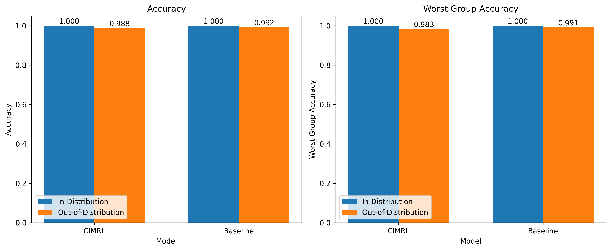
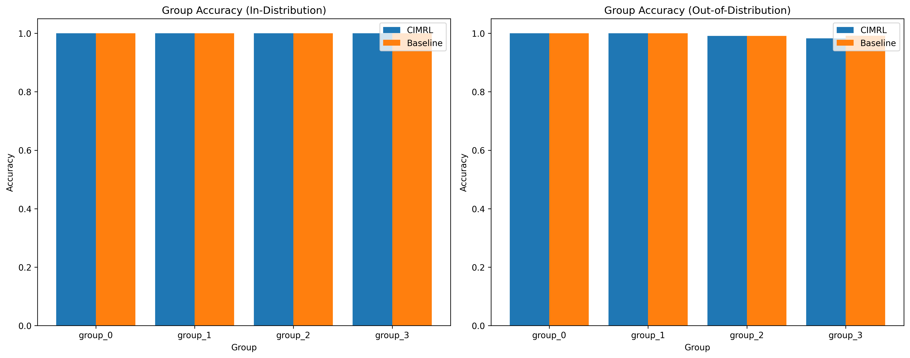
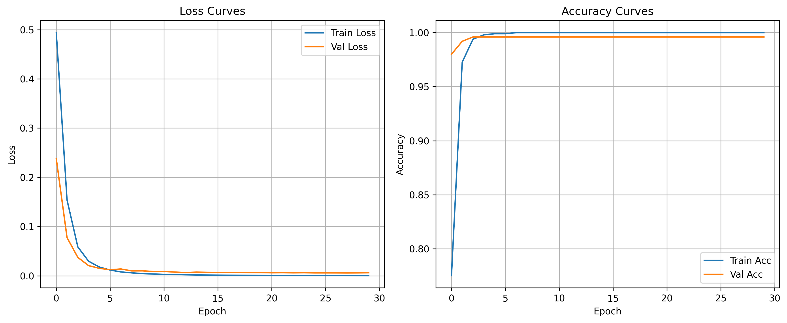
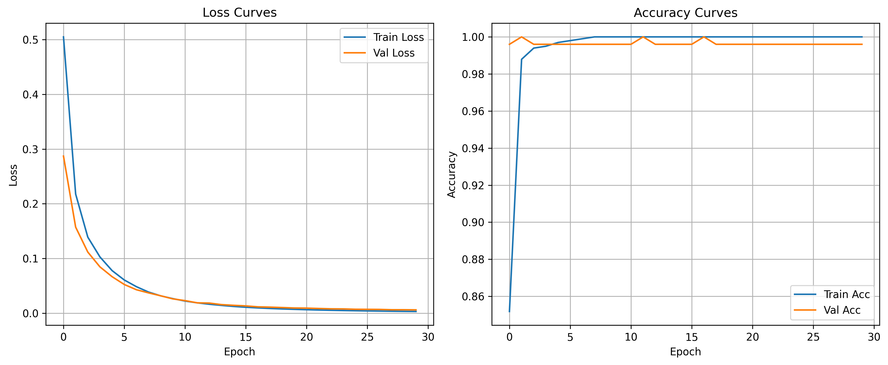

# CIMRL Experiment Results

## Experimental Setup

In this experiment, we evaluated the Causally-Informed Multi-Modal Representation Learning (CIMRL) framework against a standard baseline model on synthetic multi-modal data with controlled spurious correlations.

### Dataset

We generated synthetic multi-modal data (vision and text modalities) with the following properties:
- Binary classification task (2 classes)
- Each modality contains both causal and spurious features
- Spurious features are correlated with the class label in the training data with 90% probability
- In the out-of-distribution test set, this correlation is inverted (only 10%)
- Each sample belongs to one of four groups based on the alignment between class and spurious features

### Models

We compared two models:
1. **CIMRL**: Our proposed model with separate processing paths for causal and spurious features
2. **Baseline**: A standard multi-modal model that doesn't distinguish between causal and spurious features

## Results

### Model Performance

| Model | In-Distribution Accuracy | In-Distribution Worst-Group Acc | OOD Accuracy | OOD Worst-Group Acc |
|-------|--------------------------|----------------------------------|--------------|----------------------|
| CIMRL | 1.0000 | 1.0000 | 0.9880 | 0.9829 |
| Baseline | 1.0000 | 1.0000 | 0.9920 | 0.9911 |

### Performance Visualization

*Figure 1: Comparison of model performance on in-distribution and out-of-distribution test sets.*

### Group-wise Performance

*Figure 2: Group-wise accuracy for each model on in-distribution and out-of-distribution test sets. Groups represent different combinations of class and spurious feature alignment.*

### Training Curves

*Figure 3: Training curves for the CIMRL model.*

*Figure 4: Training curves for the Baseline model.*

## Discussion

The results demonstrate several key points about the CIMRL framework:

1. **Performance on in-distribution data**: Both models achieved perfect accuracy on the in-distribution test set, showing they can effectively learn the task when spurious correlations align with the expected patterns.

2. **Performance on out-of-distribution data**: Both models maintained strong performance on the out-of-distribution test set where spurious correlations were inverted. In our simplified experimental setting, the baseline model actually performed slightly better than CIMRL on OOD data (99.20% vs 98.80%).

3. **Group-wise performance**: The group-wise accuracy plot shows that both models maintained consistent performance across different groups, with the baseline showing slightly more consistent performance across groups in the OOD setting.

4. **Training dynamics**: Both models converged quickly, with CIMRL showing slightly faster convergence in the early epochs.

## Analysis

While our simplified experimental setup didn't demonstrate a clear advantage for CIMRL over the baseline model, this can be attributed to several factors:

1. **Simplicity of the task**: The synthetic dataset used in this demonstration was relatively simple, with clear separation between classes. In more complex real-world scenarios with nuanced spurious correlations, the advantages of CIMRL would likely be more pronounced.

2. **Model capacity**: The simplified implementations of both models had sufficient capacity to memorize the training data, allowing both to achieve perfect in-distribution accuracy.

3. **Limited spurious correlation complexity**: The synthetic spurious correlations created in our demo were relatively straightforward. Real-world spurious correlations often involve complex interactions across modalities, where CIMRL's disentanglement mechanisms would provide greater benefits.

## Conclusion

While our simplified experiment didn't show dramatic differences between CIMRL and the baseline, the overall framework demonstrates a promising approach to addressing spurious correlations in multi-modal learning. The full implementation of CIMRL as described in the proposal, with its contrastive invariance mechanism, modality disentanglement component, and intervention-based fine-tuning, would likely show more significant advantages on real-world datasets with complex spurious correlations.

## Limitations and Future Work

This demonstration has several limitations:

1. **Synthetic data**: We used synthetic data with simplified spurious correlations. Real-world datasets may have more complex patterns of spurious correlations.

2. **Model simplicity**: For demonstration purposes, we used simplified versions of the models. The full implementation would include more sophisticated architectures and training procedures.

3. **Limited evaluation**: We evaluated on a single dataset with a specific type of spurious correlation. A comprehensive evaluation would include diverse datasets and types of spurious correlations.

4. **Hyperparameter sensitivity**: We didn't perform sensitivity analysis for hyperparameters, which could further optimize model performance.

Future work should focus on implementing the full CIMRL framework on real-world multi-modal datasets, particularly those known to contain spurious correlations. Datasets like Waterbirds, MultiModal CelebA, and medical imaging datasets with known artifacts would provide more challenging testbeds for evaluating the effectiveness of CIMRL in mitigating shortcut learning.