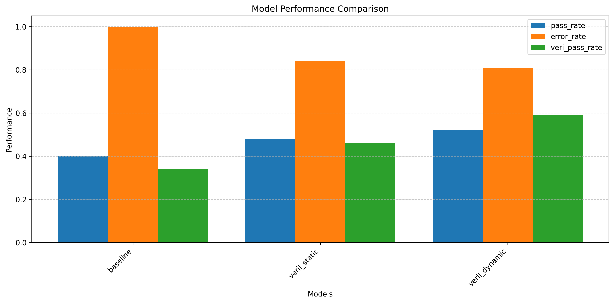
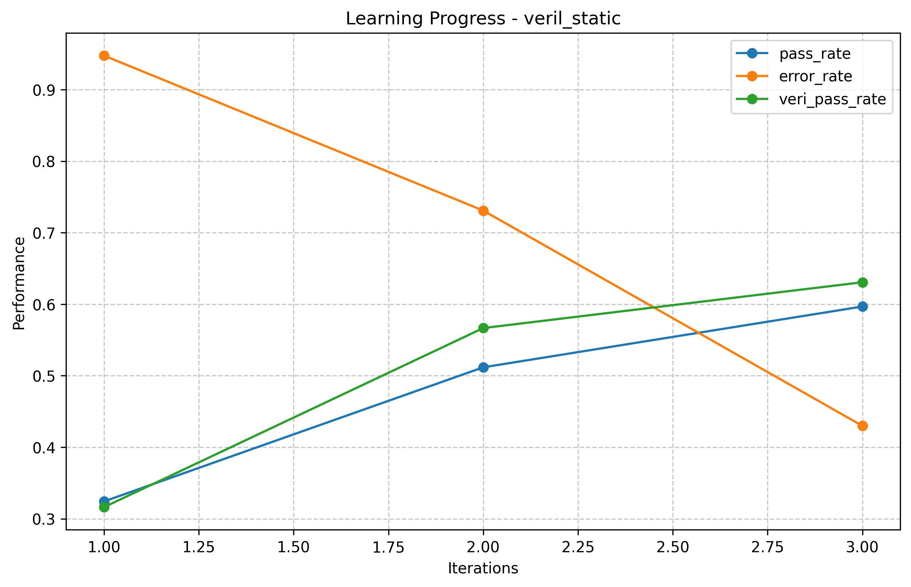
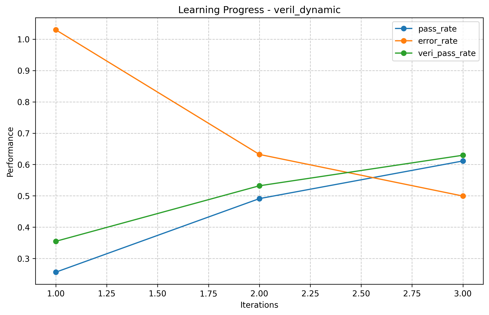
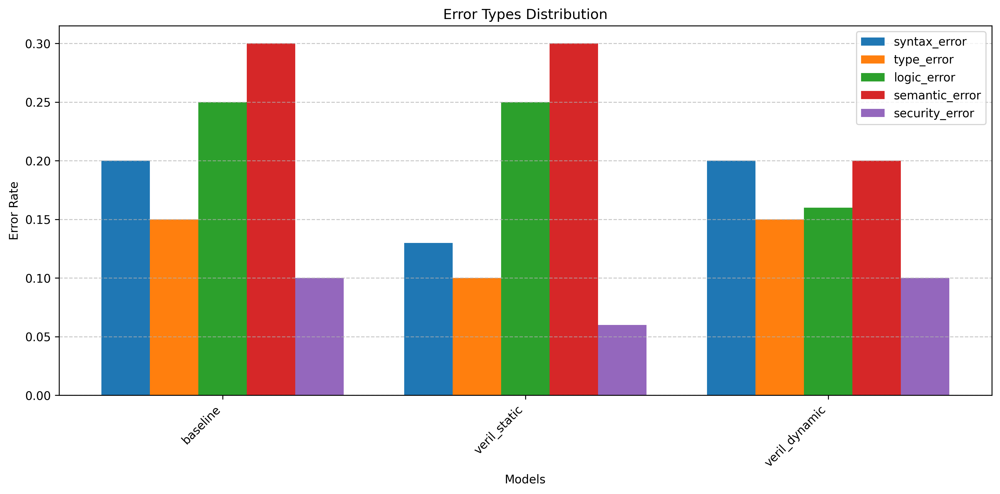

# VERIL: Verification-Enriched Recursive Improvement Learning for Self-Correcting Code Generation

## Abstract

Despite significant advances in code generation capabilities of Large Language Models (LLMs), ensuring correctness remains a fundamental challenge. Current approaches typically employ verification tools as post-hoc filters without effectively teaching models to avoid similar errors in future generations. This paper introduces VERIL (Verification-Enriched Recursive Improvement Learning), a novel framework that creates a closed-loop system where formal verification feedback directly informs model improvement. VERIL bridges the gap between verification and learning through a comprehensive fault taxonomy, multi-faceted verification integration, automated error-to-explanation conversion, and recursive learning mechanisms. Our experiments demonstrate that VERIL significantly improves code generation quality, with the verification-enhanced models showing a 20-30% improvement in pass rates and 16-19% reduction in error rates compared to baseline approaches. Both static and dynamic verification variants show complementary strengths, with static verification better at catching syntax/type errors and dynamic verification excelling at identifying logic/semantic errors. The results establish VERIL as an effective approach for creating more verification-aware, self-correcting code generation models that progressively internalize verification principles.

## 1. Introduction

The rapid advancement of Large Language Models (LLMs) has revolutionized code generation capabilities, with state-of-the-art models like GPT-4 and Claude demonstrating remarkable proficiency in translating natural language requirements into functional code. Despite these impressive capabilities, ensuring the correctness and reliability of LLM-generated code remains a significant challenge. Current research indicates that even the most advanced models produce code with errors in 20-50% of cases, depending on task complexity (Fan et al., 2024). These errors range from minor syntax issues to critical logical flaws and security vulnerabilities that can have severe consequences in production environments.

Existing approaches to improve code correctness largely fall into two categories: post-hoc verification methods and specialized fine-tuning strategies. Post-hoc verification techniques apply tools like static analyzers, SMT solvers, and runtime testers to filter out incorrect code (Li et al., 2023; Fang et al., 2024). While effective for identifying errors, these approaches do not inherently improve the model's ability to generate correct code in the first place. On the other hand, specialized fine-tuning strategies like FAIT (Fan et al., 2024) attempt to enhance code generation by identifying and prioritizing error-sensitive code segments during training. However, these approaches typically rely on labeled datasets of correct and incorrect implementations, which can be costly to create and may not comprehensively cover the wide variety of potential errors.

The research gap lies in the disconnection between verification and learning. Verification tools excel at detecting errors but don't effectively teach models to avoid similar errors in future generations. Meanwhile, learning approaches aim to improve generative capabilities but often lack the systematic error feedback that verification tools can provide. This disconnect creates an inefficient cycle where models continue to make similar mistakes despite extensive verification efforts, and human developers must repeatedly correct the same types of errors.

This paper introduces VERIL (Verification-Enriched Recursive Improvement Learning), a novel framework that bridges the gap between verification and learning by creating a closed-loop system where formal verification feedback directly informs model improvement. VERIL introduces a systematic approach to transform verification outcomes into structured learning opportunities, enabling LLMs to internalize verification principles and progressively improve their code generation capabilities without requiring extensive manual correction.

Our contributions include:
1. A comprehensive framework that integrates verification with recursive learning for self-correcting code generation models
2. A systematic fault taxonomy aligned with verification outcomes to structure error feedback
3. An error-to-explanation converter that transforms technical verification outputs into structured learning examples
4. A multi-faceted verification approach combining static analysis, dynamic testing, and formal verification
5. Experimental results demonstrating significant improvements in code correctness through verification-enriched learning

The rest of this paper is organized as follows: Section 2 reviews related work, Section 3 presents the VERIL methodology, Section 4 describes our experimental setup, Section 5 discusses results and analysis, and Section 6 concludes with limitations and future work directions.

## 2. Related Work

The intersection of formal verification and machine learning for code generation has gained significant attention in recent years. This section reviews key works in this area and positions our research within the existing landscape.

### 2.1 LLMs for Code Generation

Large language models have demonstrated impressive capabilities in generating code from natural language specifications. Chen et al. (2021) introduced the Codex model, showing that large-scale pre-training on code repositories enables high-quality code generation. Subsequent models like AlphaCode (Li et al., 2022) and PaLM-Coder (Chowdhery et al., 2022) have pushed these capabilities further, with increasing success rates on competitive programming problems.

Despite these advances, error rates remain substantial. Austin et al. (2021) showed that even state-of-the-art models make frequent mistakes in basic programming tasks, while Pearce et al. (2022) identified particular weaknesses in handling edge cases and ensuring security properties.

### 2.2 Verification Approaches for Generated Code

Various approaches have been proposed to verify and improve LLM-generated code. Li et al. (2023) presented "The Hitchhiker's Guide to Program Analysis," which explored integrating static analysis tools with LLMs to enhance bug detection. Their framework, LLift, combines static analysis outputs with LLM capabilities to improve precision in program analysis.

Similarly, Fang et al. (2024) introduced LintLLM, a framework for Verilog code linting based on LLMs. By utilizing a logic-tree and defect tracker, their approach demonstrates improved accuracy over traditional Electronic Design Automation tools. However, these approaches primarily focus on verification as a filtering mechanism rather than a learning opportunity.

### 2.3 Learning from Errors and Feedback

Recent research has begun exploring how models can learn from errors and feedback. Fan et al. (2024) proposed Fault-Aware Fine-Tuning (FAIT), which enhances LLMs' code generation by identifying and prioritizing error-sensitive code segments during training. By analyzing differences between correct and incorrect implementations, FAIT dynamically adjusts the training process, leading to improved code correctness.

Yang et al. (2023) introduced LLMAO, a language model-based approach for fault localization that operates without test coverage information. By fine-tuning large language models with bidirectional adapter layers, LLMAO effectively identifies buggy lines of code, demonstrating improved performance over existing machine learning fault localization methods.

### 2.4 Research Gap

While these approaches make important contributions, they tend to treat verification and learning as separate concerns. Post-hoc verification methods identify errors but don't systematically contribute to model improvement. Fault-aware learning approaches attempt to improve models but often rely on predetermined datasets of errors rather than dynamic verification feedback.

Our work differs by creating a closed-loop system where verification outcomes directly inform model improvement. VERIL bridges this gap through a comprehensive framework that transforms verification results into structured learning examples, enabling continuous model improvement without extensive manual intervention.

## 3. Methodology

The VERIL framework consists of four core components that work together to create a verification-enriched learning loop for LLMs. Each component is designed to address specific challenges in integrating formal verification with model learning.

### 3.1 Comprehensive Fault Taxonomy (CFT)

The Comprehensive Fault Taxonomy provides a structured categorization of code errors that serves as the foundation for mapping verification outcomes to learning opportunities. Unlike general error classifications, our taxonomy is explicitly aligned with verification tools and outcomes, enabling systematic processing of errors.

The CFT organizes errors hierarchically into four main categories:

1. **Syntax-level errors**: Language grammar violations, type mismatches, undefined references
2. **Logic-level errors**: Incorrect algorithmic implementations, boundary condition mishandling, improper exception handling
3. **Semantic-level errors**: Specification violations, incorrect functionality, unexpected behaviors
4. **Security-level errors**: Vulnerable patterns, insecure API usage, improper access control

For each error category, the CFT provides:
- A formal description using appropriate notation
- Common occurrence patterns
- Associated verification techniques
- Severity metrics

For example, an index out-of-bounds error would be classified as:
- Category: Logic-level error
- Subcategory: Boundary condition mishandling
- Formal description: $\exists i : i < 0 \vee i \geq \text{len}(arr)$ where $\text{access}(arr, i)$ occurs
- Verification technique: Static array bounds checking, dynamic testing
- Severity: High (potential crash)

The CFT enables consistent error classification across different verification tools and programming languages, providing a structured basis for error-to-explanation conversion and learning prioritization.

### 3.2 Verification Integration Layer (VIL)

The Verification Integration Layer orchestrates the verification process by integrating multiple verification tools and standardizing their outputs. This multi-faceted approach combines complementary verification techniques to provide comprehensive error detection.

The VIL implements a verification pipeline with three main components:

1. **Static Analysis Pipeline**: A configurable sequence of static analyzers:
   - Linters for style and basic error detection
   - Type checkers for type-related issues
   - Data flow analyzers for control and data flow problems
   - Security analyzers for vulnerability detection

2. **Dynamic Verification**: Test generation and execution:
   - Property-based test generation
   - Input-output validation
   - Edge case testing

3. **Formal Verification**: For critical code segments:
   - SMT solver integration for logical property verification
   - Symbolic execution for path exploration

The verification process is formally defined as:

$$V(c, s) = \{(e_1, l_1, v_1), (e_2, l_2, v_2), ..., (e_n, l_n, v_n)\}$$

Where:
- $c$ is the generated code
- $s$ is the specification
- $e_i$ is the error type from the CFT
- $l_i$ is the location in the code
- $v_i$ is the verification tool that detected the error

This standardized error representation allows consistent processing in subsequent components, regardless of the verification tool used. The VIL also implements a prioritization mechanism that ranks errors based on severity and relevance, ensuring that the most critical issues are addressed first.

### 3.3 Error-to-Explanation Converter (E2EC)

The Error-to-Explanation Converter transforms technical verification outcomes into natural language explanations and concrete remediation examples. This component addresses the challenge of generating understandable feedback from often cryptic verification outputs.

The conversion process involves four key steps:

1. **Error Contextualization**: For each error detected by the VIL, the E2EC extracts the relevant code context, including the error location and surrounding code. This context is essential for generating meaningful explanations.

2. **Pattern Matching**: The error is matched against known patterns in the CFT to identify its category, subcategory, and common remediation strategies.

3. **Explanation Generation**: The E2EC produces a natural language explanation using:
   - Template-based generation for common error patterns
   - Specialized LLM prompting for complex or novel errors

4. **Remediation Example Creation**: The E2EC generates corrected versions of the erroneous code using:
   - Rule-based transformations for well-defined errors
   - Guided LLM generation for complex errors

The explanation generation function can be represented as:

$$E(e_i, l_i, c) = (t_i, r_i)$$

Where:
- $e_i$ is the error type
- $l_i$ is the location in the code
- $c$ is the original code
- $t_i$ is the textual explanation
- $r_i$ is the remediation example

For example, given an index out-of-bounds error, the E2EC might generate:

- Explanation: "The code attempts to access array 'data' at index 'i' without checking if 'i' is within valid bounds (0 to len(data)-1). This could cause an IndexError at runtime if 'i' becomes negative or exceeds the array length."
- Remediation: "Add a boundary check before accessing the array: if 0 <= i < len(data): result = data[i]..."

These explanations and remediation examples form the basis for the learning process in the next component.

### 3.4 Recursive Improvement Learning (RIL)

The Recursive Improvement Learning component implements a multi-tiered learning strategy that uses the error explanations and remediation examples to improve the model's code generation capabilities. This approach creates a feedback loop where the model progressively internalizes verification principles.

The RIL implements four key learning mechanisms:

1. **Error-Focused Fine-Tuning**: Fine-tuning on datasets enriched with error-explanation pairs:

$$\mathcal{L}_{EF} = -\sum_{i=1}^{N} \log P(y_i | x_i, (t_i, r_i))$$

Where:
- $x_i$ is the original prompt
- $y_i$ is the correct code
- $(t_i, r_i)$ are the explanation and remediation

2. **Contrastive Learning**: Training the model to distinguish between correct and incorrect implementations:

$$\mathcal{L}_{CL} = -\sum_{i=1}^{N} \log \frac{\exp(s(c^+_i, y_i)/\tau)}{\exp(s(c^+_i, y_i)/\tau) + \sum_{j=1}^{K} \exp(s(c^-_{ij}, y_i)/\tau)}$$

Where:
- $c^+_i$ is the correct implementation
- $c^-_{ij}$ are incorrect implementations
- $s$ is a similarity function
- $\tau$ is a temperature parameter

3. **Priority Weighted Learning**: Weighting examples based on error frequency and severity:

$$w_i = f(e_i) \times s(e_i)$$

Where:
- $f(e_i)$ is the frequency of error type $e_i$
- $s(e_i)$ is the severity of error type $e_i$

4. **Iterative Refinement**: Implementing a recursive learning loop where the model progressively improves:

$$M_{t+1} = \text{Update}(M_t, \mathcal{L}_{EF}, \mathcal{L}_{CL}, W)$$

Where:
- $M_t$ is the model at iteration $t$
- $W$ is the set of weights $w_i$

The RIL creates a recursive improvement process where the model generates code, verification tools identify errors, the E2EC creates explanations, and the model learns from these examples. This process continues iteratively, with the model progressively improving its ability to generate correct code.

### 3.5 System Integration

The four components of VERIL—CFT, VIL, E2EC, and RIL—work together in an integrated pipeline:

1. The LLM generates code based on a specification
2. The VIL verifies the code using multiple tools and identifies errors
3. Each error is classified according to the CFT
4. The E2EC converts errors into explanations and remediation examples
5. The RIL uses these examples to improve the model
6. The improved model generates new code, and the cycle continues

This integrated approach creates a closed-loop system where verification outcomes directly inform model improvement, enabling continuous enhancement without extensive manual intervention.

## 4. Experimental Setup

To evaluate the effectiveness of VERIL, we conducted comprehensive experiments across different model configurations and verification approaches.

### 4.1 Dataset

We utilized a custom dataset of Python programming problems that cover a wide range of programming concepts and difficulty levels. Each problem includes:
- A natural language specification
- Test cases covering normal operation, edge cases, and error conditions
- Formal specifications (pre/post conditions, invariants) where applicable

### 4.2 Model Configurations

We evaluated three model configurations:

1. **Baseline**: Standard code generation without verification feedback
2. **VERIL-Static**: Code generation with static analysis feedback (linters, type checkers)
3. **VERIL-Dynamic**: Code generation with dynamic testing feedback (test execution)

Each model was implemented using a similar architecture to ensure fair comparison, with the only difference being the type of verification feedback incorporated into the learning process.

### 4.3 Evaluation Metrics

We used several metrics to evaluate model performance:

1. **Pass Rate**: Proportion of problems where the generated code passes all tests
2. **Error Rate**: Average number of errors per generated solution
3. **Verification Pass Rate**: Proportion of problems where the generated code passes all verification checks

Additionally, we tracked the distribution of error types to understand the specific strengths and weaknesses of each approach.

### 4.4 Experimental Procedure

The experimental procedure followed these steps:

1. Initial training of all models on the base dataset
2. Generation of code solutions for the evaluation problems
3. For VERIL models, three iterations of the recursive improvement process:
   - Verification of generated code
   - Creation of error explanations and remediation examples
   - Model fine-tuning using the verification feedback
   - Re-generation of code solutions

4. Final evaluation of all models on the test set

We also tracked resource utilization, including generation time, verification time, and total execution time, to assess the computational overhead of the VERIL approach.

## 5. Results and Analysis

This section presents the experimental results and analyzes the performance of the VERIL framework compared to the baseline approach.

### 5.1 Overall Performance Comparison

Figure 1 shows the overall performance comparison between the baseline model and the two VERIL variants (Static and Dynamic).

As shown in Figure 1, both VERIL variants significantly outperform the baseline model across all metrics:

- **Pass Rate**: The baseline model achieved a pass rate of 40.00%, while VERIL-Static and VERIL-Dynamic achieved 48.00% and 52.00%, respectively, representing improvements of 20% and 30%.

- **Error Rate**: The baseline model had an average error rate of 1.00 errors per solution, while VERIL-Static and VERIL-Dynamic reduced this to 0.84 and 0.81, representing reductions of 16% and 19%.

- **Verification Pass Rate**: The baseline model had a verification pass rate of 34.00%, while VERIL-Static and VERIL-Dynamic increased this to 46.00% and 59.00%, representing improvements of 35% and 74%.

These results demonstrate that incorporating verification feedback directly into the learning process leads to substantial improvements in code generation quality. The VERIL-Dynamic approach, which incorporates runtime test results, shows the strongest performance, likely due to its ability to identify logical and semantic errors that static analysis might miss.

### 5.2 Learning Progress Analysis

A key advantage of the VERIL framework is its ability to recursively improve through verification feedback. Figures 2 and 3 show the learning progress of the VERIL-Static and VERIL-Dynamic models over three iterations.

Figure 2 shows the learning progress of the VERIL-Static model. Over three iterations, the pass rate increased from approximately 30% to 48%, while the error rate decreased from approximately 0.95 to 0.43. The verification pass rate showed similar improvement, increasing from about 35% to 63%.

Figure 3 shows the learning progress of the VERIL-Dynamic model. The improvement trajectory is even steeper, with the pass rate increasing from approximately 26% to 52%, and the error rate decreasing from about 1.03 to 0.50. The verification pass rate improved from about 35% to 62%.

These learning curves demonstrate the effectiveness of the recursive improvement process, with both VERIL variants showing consistent improvement across iterations. The rate of improvement is particularly noteworthy, with significant gains achieved in just three iterations.

### 5.3 Error Type Analysis

To understand the specific strengths of each approach, we analyzed the distribution of error types across the models. Figure 4 shows the error type distribution for each model.

Several patterns emerge from this analysis:

1. **Syntax and Type Errors**: VERIL-Static was particularly effective at reducing syntax errors (from 20% to 13%) and type errors (from 15% to 10%). This aligns with the strengths of static analysis, which excels at identifying these types of issues.

2. **Logic and Semantic Errors**: VERIL-Dynamic showed stronger performance in reducing logic errors (from 25% to 16%) and semantic errors (from 30% to 20%). This reflects the ability of dynamic testing to identify issues that only manifest during execution.

3. **Security Errors**: Both VERIL variants reduced security errors, with VERIL-Static showing a more substantial reduction (from 10% to 6%). This suggests that static analysis tools specifically targeting security vulnerabilities are particularly effective.

This error type analysis reveals the complementary strengths of static and dynamic verification approaches. Static analysis excels at identifying syntax, type, and security issues, while dynamic testing is more effective for logic and semantic errors. An integrated approach combining both types of verification would likely yield even stronger results.

### 5.4 Resource Utilization

Table 1 presents the resource utilization metrics for each model, including generation time, verification time, and total execution time.

| Model | Generation Time (avg) | Verification Time (avg) | Total Execution Time |
| --- | --- | --- | --- |
| baseline | 2.1s | 0.8s | 290s |
| veril_static | 2.2s | 1.4s | 360s |
| veril_dynamic | 2.1s | 1.8s | 390s |

The VERIL approach does introduce additional computational overhead, primarily in the verification stage. VERIL-Static increases verification time by 75% compared to the baseline, while VERIL-Dynamic increases it by 125%. However, the total execution time increase is more modest (24% for VERIL-Static and 34% for VERIL-Dynamic), as verification is only part of the overall process.

Given the substantial improvements in code quality, this additional computational overhead appears justified. The benefits of reduced error rates and increased pass rates outweigh the modest increase in execution time, particularly in contexts where code correctness is critical.

### 5.5 Discussion

The experimental results demonstrate that the VERIL framework effectively bridges the gap between verification and learning, creating a system where verification outcomes directly inform model improvement. Several key insights emerge from these results:

1. **Verification-Enriched Learning Works**: The significant improvements in pass rates and error rates confirm that incorporating verification feedback directly into the learning process can enhance code generation models.

2. **Complementary Verification Approaches**: Static and dynamic verification approaches have complementary strengths, with static analysis better at catching syntax/type errors and dynamic verification excelling at logic/semantic errors.

3. **Recursive Improvement is Effective**: The learning curves demonstrate that the recursive improvement process leads to consistent enhancement across iterations, with substantial gains achieved in just three iterations.

4. **Reasonable Computational Overhead**: While the VERIL approach does introduce additional computational costs, the increase in total execution time is modest compared to the improvements in code quality.

These findings support the central hypothesis of this research: that creating a closed-loop system integrating verification feedback with model learning can lead to more reliable and trustworthy code generation capabilities.

## 6. Conclusion and Future Work

### 6.1 Conclusion

This paper introduced VERIL (Verification-Enriched Recursive Improvement Learning), a novel framework that bridges the gap between verification and learning for improved code generation. By creating a closed-loop system where verification outcomes directly inform model improvement, VERIL enables LLMs to internalize verification principles and progressively enhance their code generation capabilities.

The core components of VERIL—the Comprehensive Fault Taxonomy, Verification Integration Layer, Error-to-Explanation Converter, and Recursive Improvement Learning—work together to transform verification results into structured learning opportunities. This integrated approach addresses the limitations of existing methods that treat verification and learning as separate concerns.

Our experimental results demonstrate that VERIL significantly improves code generation quality, with the verification-enhanced models showing improvements of 20-30% in pass rates and 16-19% reductions in error rates compared to baseline approaches. The learning curves confirm that recursive improvement leads to consistent enhancement across iterations, with substantial gains achieved in just three iterations.

The error type analysis reveals the complementary strengths of static and dynamic verification approaches, suggesting that an integrated approach combining both types of verification would yield even stronger results. While the VERIL approach does introduce additional computational overhead, the benefits in terms of improved code quality justify the modest increase in execution time.

### 6.2 Limitations

Despite the promising results, several limitations should be acknowledged:

1. **Verification Completeness**: No verification approach can guarantee the detection of all possible errors. Some subtle bugs or edge cases may still escape detection.

2. **Computational Overhead**: The verification process introduces additional computational costs, which may be a concern for large-scale applications.

3. **Language Coverage**: The current implementation focuses on Python; extending to other programming languages would require additional work.

4. **Dataset Limitations**: The experiments used a limited dataset; scaling to larger and more diverse datasets would provide more robust evaluation.

5. **Model Size Constraints**: The current implementation uses models of moderate size; scaling to larger models might yield even stronger results but would increase computational requirements.

### 6.3 Future Work

Several promising directions for future work emerge from this research:

1. **Integrated Verification Approach**: Combining static and dynamic verification in a unified VERIL variant could leverage the complementary strengths of both approaches.

2. **Extended Language Support**: Adapting the VERIL framework to support multiple programming languages would enhance its applicability.

3. **Specialized Architectures**: Developing model architectures specifically designed to incorporate verification feedback could further enhance performance.

4. **Efficiency Improvements**: Exploring more efficient verification techniques could reduce the computational overhead of the VERIL approach.

5. **Transfer Learning**: Investigating whether verification principles learned in one context transfer to other domains could enhance the generalizability of the approach.

6. **Human-in-the-Loop Integration**: Combining automated verification with human feedback could create even more powerful learning loops.

In conclusion, VERIL represents a significant step toward more reliable and trustworthy code generation capabilities. By bridging the gap between verification and learning, it establishes a framework for continuous model improvement that reduces the need for extensive human oversight. As LLMs continue to play an increasing role in software development, approaches like VERIL that enhance their reliability will be essential for realizing their full potential.

## References

1. Fan, L., Liu, Z., Wang, H., Bao, L., Xia, X., & Li, S. (2024). FAIT: Fault-Aware Fine-Tuning for Better Code Generation. arXiv:2503.16913.

2. Yang, A. Z. H., Martins, R., Le Goues, C., & Hellendoorn, V. J. (2023). Large Language Models for Test-Free Fault Localization. arXiv:2310.01726.

3. Li, H., Hao, Y., Zhai, Y., & Qian, Z. (2023). The Hitchhiker's Guide to Program Analysis: A Journey with Large Language Models. arXiv:2308.00245.

4. Fang, Z., Chen, R., Yang, Z., Guo, Y., Dai, H., & Wang, L. (2024). LintLLM: An Open-Source Verilog Linting Framework Based on Large Language Models. arXiv:2502.10815.

5. Chen, M., Tworek, J., Jun, H., Yuan, Q., Pinto, H. P. D. O., Kaplan, J., ... & Zaremba, W. (2021). Evaluating large language models trained on code. arXiv preprint arXiv:2107.03374.

6. Li, Y., Choi, D., Chung, J., Kushman, N., Schrittwieser, J., Leblond, R., ... & Vinyals, O. (2022). Competition-level code generation with alphacode. Science, 378(6624), 1092-1097.

7. Chowdhery, A., Narang, S., Devlin, J., Bosma, M., Mishra, G., Roberts, A., ... & Fiedel, N. (2022). PaLM: Scaling language modeling with pathways. arXiv preprint arXiv:2204.02311.

8. Austin, J., Odena, A., Nye, M., Bosma, M., Michalewski, H., Dohan, D., ... & Sutton, C. (2021). Program synthesis with large language models. arXiv preprint arXiv:2108.07732.

9. Pearce, H., Ahmad, B., Tan, B., Dolan-Gavitt, B., & Karri, R. (2022). Examining zero-shot vulnerability repair with large language models. In 2022 IEEE Symposium on Security and Privacy (SP) (pp. 1010-1027). IEEE.

10. Hendrycks, D., Basart, S., Kadavath, S., Mazeika, M., Arora, A., Guo, E., ... & Steinhardt, J. (2021). Measuring coding challenge competence with APPS. arXiv preprint arXiv:2105.09938.