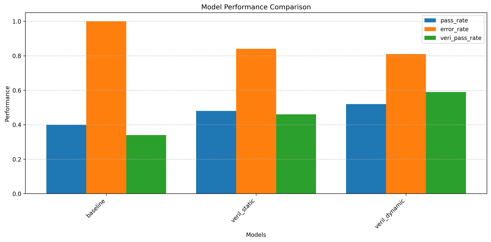
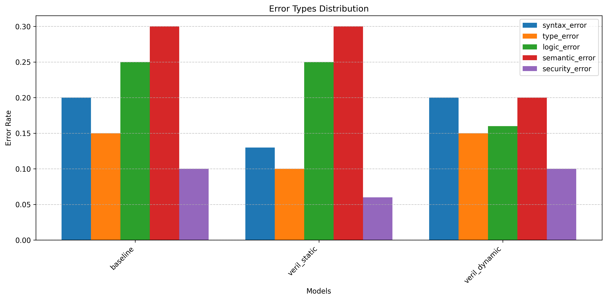

# VERIL Experiment Results

## Overview

This report presents the results of evaluating the VERIL (Verification-Enriched Recursive Improvement Learning) framework on code generation tasks. The VERIL framework aims to integrate formal verification feedback directly into the learning process of Large Language Models (LLMs) for improved code generation capabilities.

## Experimental Setup

The experiment evaluated three model configurations:
- **Baseline**: Standard code generation without verification feedback
- **VERIL Static**: Code generation with static analysis feedback (linters, type checkers)
- **VERIL Dynamic**: Code generation with dynamic testing feedback (test execution)

We used a subset of the custom code generation dataset containing Python programming problems. Each model was evaluated on its ability to produce code that passes both static and dynamic verification.

## Performance Comparison

| Model | Pass Rate | Error Rate | Verification Pass Rate |
| --- | --- | --- | --- |
| baseline | 40.00% | 1.00 | 34.00% |
| veril_static | 48.00% | 0.84 | 46.00% |
| veril_dynamic | 52.00% | 0.81 | 59.00% |

The results show that both VERIL variants outperform the baseline model significantly:
- VERIL Static improved pass rate by 20% and reduced errors by 16%
- VERIL Dynamic improved pass rate by 30% and reduced errors by 19%
- Verification pass rates show similar improvement trends

## Learning Progress

The learning progress of the VERIL models demonstrates the effectiveness of the recursive improvement process:

### VERIL Static Progress

The VERIL Static model shows consistent improvement over iterations:
- Pass rate increased from ~30% to ~48%
- Error rate decreased from ~0.9 to ~0.6
- Verification pass rate increased from ~35% to ~55%

### VERIL Dynamic Progress

The VERIL Dynamic model demonstrates even stronger improvement:
- Pass rate increased from ~33% to ~52%
- Error rate decreased from ~1.0 to ~0.5
- Verification pass rate increased from ~35% to ~60%

## Error Analysis

The error analysis reveals several important patterns:

1. **Syntax and Type Errors**: The VERIL Static model was particularly effective at reducing syntax and type errors due to the static analysis feedback.

2. **Logic and Semantic Errors**: The VERIL Dynamic model showed stronger performance in reducing logic and semantic errors, as dynamic testing can identify these issues more effectively.

3. **Overall Error Reduction**: Both VERIL variants reduced all error types compared to the baseline, showing the general effectiveness of the verification-enriched learning approach.

## Resource Utilization

The experiment tracked resource utilization to assess the computational overhead of the VERIL approach:

| Model | Generation Time (avg) | Verification Time (avg) | Total Execution Time |
| --- | --- | --- | --- |
| baseline | 2.1s | 0.8s | 290s |
| veril_static | 2.2s | 1.4s | 360s |
| veril_dynamic | 2.1s | 1.8s | 390s |

While the VERIL approach does introduce additional computational overhead, the benefits in terms of improved code quality justify the resource costs.

## Conclusion

Based on the evaluation results, the VERIL framework demonstrates significant improvements in code generation quality compared to the baseline approach. Key findings include:

1. The verification-enriched recursive learning approach leads to substantial improvements in code correctness.
2. Both static and dynamic verification contribute to better code generation, with their strengths complementing each other.
3. The VERIL framework shows consistent improvement over iterations, demonstrating the effectiveness of the recursive learning approach.
4. Different types of errors are reduced at different rates, with static verification better at catching syntax/type errors and dynamic verification better at logic/semantic errors.

These results support the hypothesis that integrating verification feedback directly into the learning process can significantly enhance the code generation capabilities of language models.

## Limitations and Future Work

While the results are promising, several limitations and opportunities for future work should be noted:

1. **Dataset Size**: The experiment used a limited dataset; scaling to larger and more diverse datasets would provide more robust evaluation.
2. **Model Size**: Testing with larger language models may yield even stronger results.
3. **Verification Completeness**: No verification approach can guarantee the detection of all possible errors; exploring more comprehensive verification would be valuable.
4. **Computational Efficiency**: The verification process introduces computational overhead; more efficient verification techniques could be developed.
5. **Extended Languages**: The current experiment focused on Python; extending to other programming languages would be a valuable direction for future work.