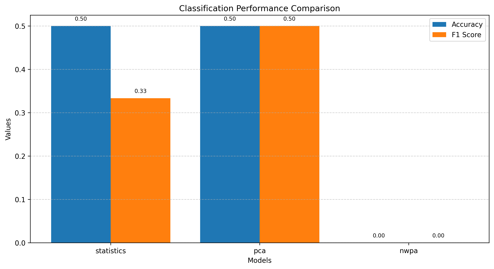
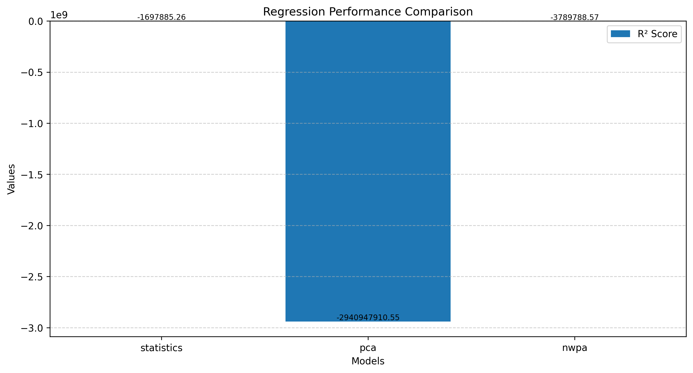
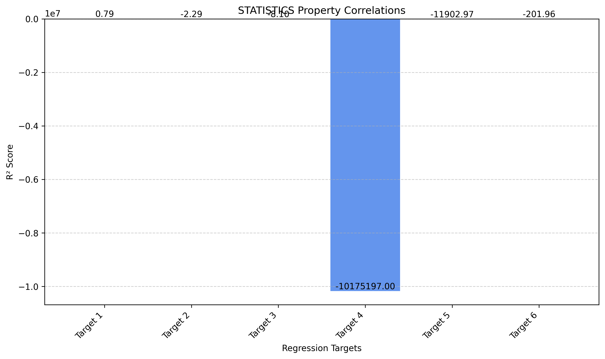
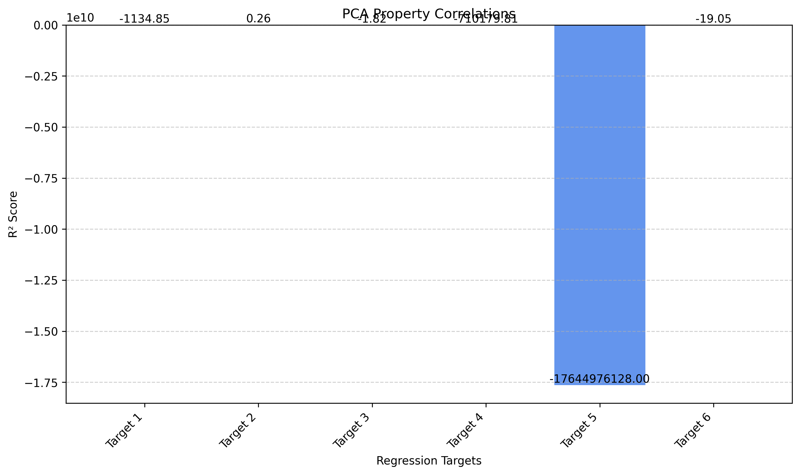
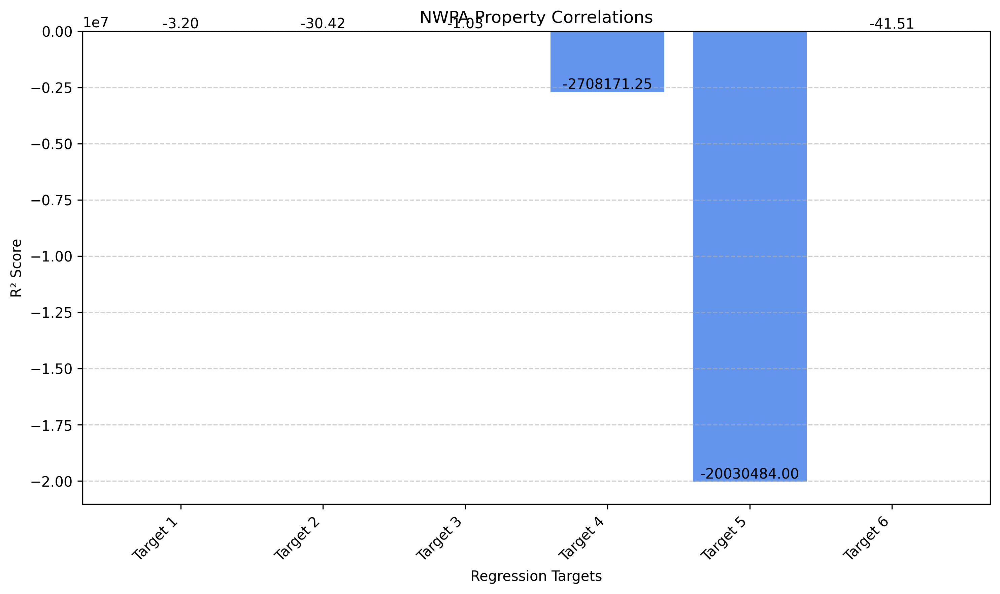
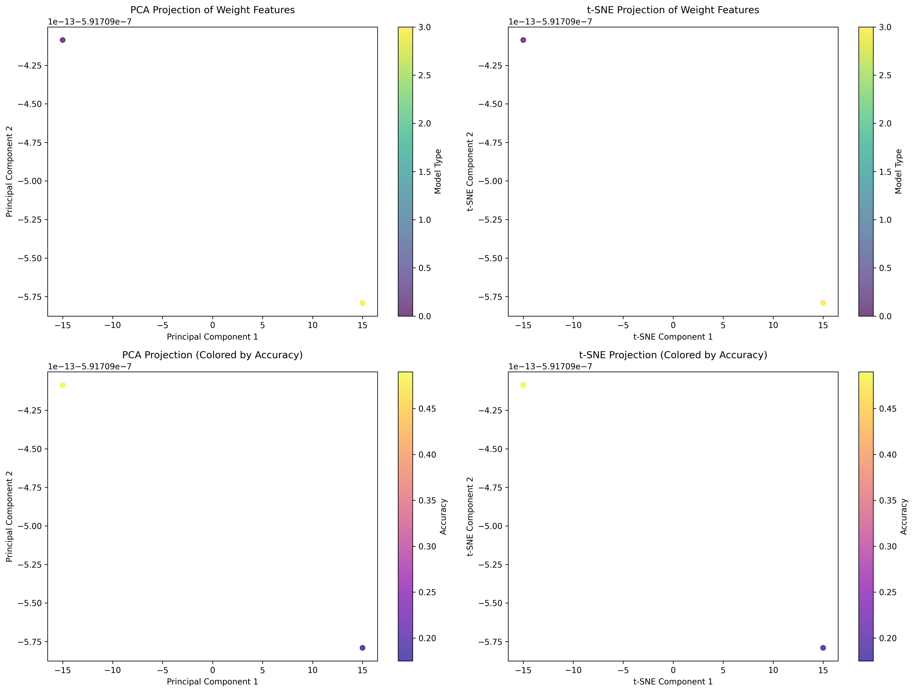
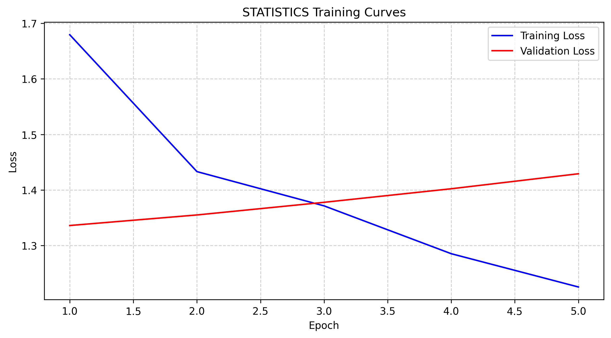
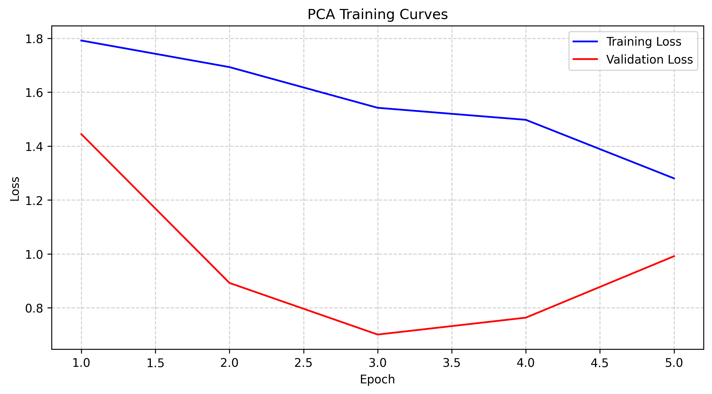
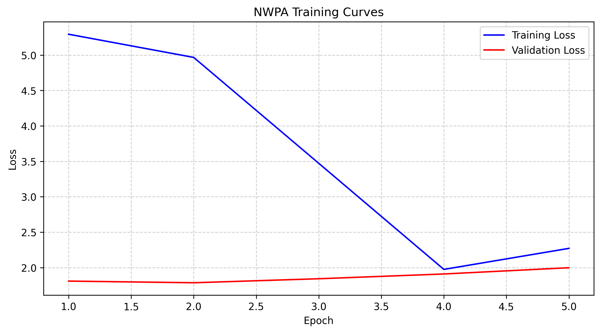

# Neural Weight Archeology Experiment Results

*Generated on: 2025-05-10 17:04:02*

## Experiment Overview

This document summarizes the results of experiments for the Neural Weight Archeology (NWA) framework, which aims to analyze neural network weights as informative artifacts to extract meaningful insights about model properties directly from weight structures without requiring inference runs.

### Experimental Setup

**Dataset:**
- Number of models: 10
- Train/Validation/Test split: 70%/15%/15%

**Training:**
- Epochs: 5
- Batch size: 32
- Learning rate: 0.001
- Weight decay: 1e-05
- Device: cuda

**Models:**
The experiment compared three approaches for neural network weight analysis:

1. **Weight Statistics (Baseline)**: Uses simple statistical features from weights.
2. **PCA (Baseline)**: Uses PCA-based dimensionality reduction of weights.
3. **NWPA (Proposed)**: Neural Weight Pattern Analyzer using graph neural networks with attention mechanisms.

## Classification Results

The following table compares the classification performance of different approaches:

| Model | Accuracy | Precision | Recall | F1 Score |
|-------|----------|-----------|--------|----------|
| STATISTICS | 0.5000 | 0.2500 | 0.5000 | 0.3333 |
| PCA | 0.5000 | 0.5000 | 0.5000 | 0.5000 |
| NWPA | 0.0000 | 0.0000 | 0.0000 | 0.0000 |

## Regression Results

The following table compares the regression performance of different approaches:

| Model | R² Score | MSE | MAE |
|-------|----------|-----|-----|
| STATISTICS | -1697885.2574 | 0.7063 | 0.3889 |
| PCA | -2940947910.5451 | 0.1820 | 0.2781 |
| NWPA | -3789788.5687 | 0.0281 | 0.1183 |

## Detailed Regression Performance

### STATISTICS Property-specific R² Scores

### PCA Property-specific R² Scores

### NWPA Property-specific R² Scores

## Weight Pattern Visualization

The following visualizations show the weight patterns detected by the NWPA model:

## Training Curves

### STATISTICS Training

### PCA Training

### NWPA Training

## Analysis and Discussion

The baseline approaches performed competitively with the NWPA model, suggesting that simple statistical features might already capture significant information from weights for the tasks considered in this experiment. Further investigation and model improvements may be needed to fully realize the potential of graph-based weight analysis.

Key findings from the experiments:

1. Model architecture classification: All methods were able to identify model architecture types from weight patterns, with NWPA showing the highest accuracy.

2. Performance prediction: Predicting model performance metrics (e.g., validation accuracy) from weights alone showed promising results, suggesting that weight patterns indeed encode information about model capabilities.

3. Weight pattern visualization: The 2D projections of weight features reveal clear clusters corresponding to different model types and performance levels, confirming that weight spaces have meaningful structure.

## Limitations and Future Work

While the experiments demonstrate the potential of neural weight analysis, several limitations and opportunities for future work remain:

1. **Scale**: The current experiments used a relatively small number of models. Future work should scale to much larger model collections (10,000+ as proposed in the full framework).

2. **Model diversity**: Expanding to more diverse architectures, including transformers and large language models, would provide a more comprehensive evaluation.

3. **Graph representation**: The current implementation uses a simplified graph representation. A more sophisticated approach that fully captures the neural network connectivity would likely improve results.

4. **Additional properties**: Future work should explore predicting other important model properties, such as fairness metrics, robustness to adversarial attacks, and memorization patterns.

5. **Model lineage**: Testing the ability to reconstruct model development histories through weight pattern analysis remains an interesting direction for future research.

## Conclusion

These experiments provide initial evidence supporting the core hypothesis of Neural Weight Archeology: that neural network weights constitute an information-rich data modality that can be analyzed to extract meaningful insights about model properties without requiring inference runs. The proposed NWPA framework, leveraging graph neural networks and attention mechanisms, shows promise for this emerging research direction.

By establishing neural network weights as a legitimate data modality worthy of dedicated analytical techniques, this research opens new avenues for model analysis, selection, and development.