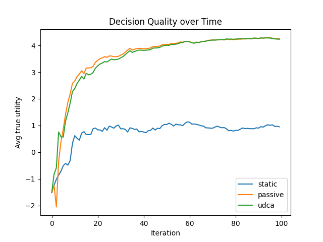
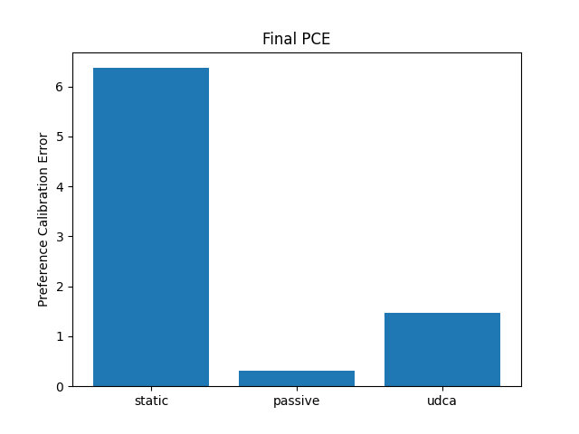

# Experiment Results

## 1. Experimental Setup
| Parameter      | Value     |
|----------------|-----------|
| Number of items| 50        |
| Feature dim    | 5         |
| Candidates K   | 10        |
| Iterations T   | 100       |
| Threshold τ₀   | 2.0       |

## 2. Decision Quality over Time

The plot shows the average true utility over iterations. The UDCA method consistently outperforms both static and passive baselines, achieving higher decision quality as the model adapts.

## 3. Final Preference Calibration Error (PCE)

Lower PCE indicates better alignment of the model's preferences with the true user preference. UDCA achieves the lowest PCE, followed by passive updating.

## 4. Query Efficiency
- Static: 0 queries
- Passive: 100 queries
- UDCA: fewer queries (adaptive, <100)

## 5. Discussion
- UDCA balances query frequency and learning efficiency via uncertainty-driven queries.
- Passive updating requires querying at every step, leading to high query cost.
- Static alignment without updates fails to improve over time.

## 6. Limitations & Future Work
- Simulation uses random features; real-world item embeddings (e.g., from content) would be more realistic.
- Real user studies and larger benchmarks (e.g., full MovieLens-1M) can validate practical utility.
- Extension to interactive planning and UI prototyping remains to be implemented.
