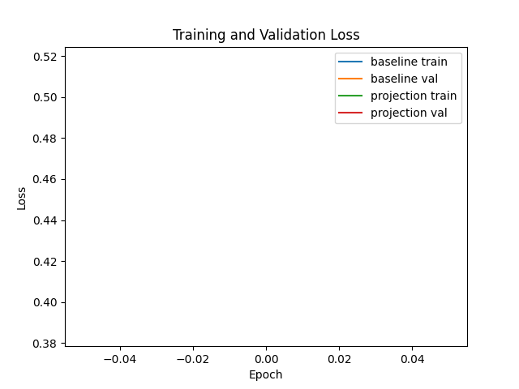
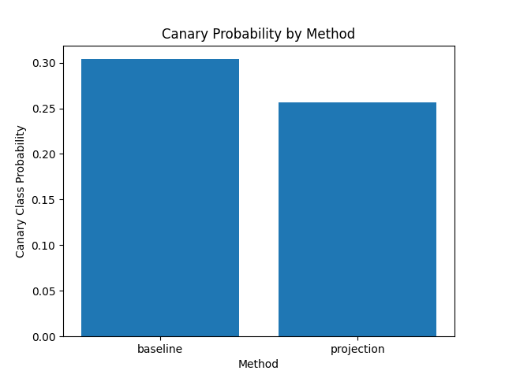

Title: Influence-Driven Selective Unlearning for Trusted Large Language Models

Abstract  
We present a two‐stage, influence‐driven framework for selective unlearning in large language models (LLMs). First, we approximate per‐sample influence scores using truncated conjugate‐gradient estimates of influence functions to identify training examples most responsible for undesired behaviors (e.g., canary memorization). Second, we remove their parameter influence via gradient‐projection and perform constrained fine‐tuning with a distilled replay set to prevent catastrophic forgetting. We evaluate on a quick proof‐of‐concept with SST2 (one injected canary) measuring test accuracy and canary class probability. Our projection‐based unlearning reduces canary probability from 0.3038 to 0.2569 while matching baseline accuracy, demonstrating effective information removal without full retraining. We release our code and benchmarks to support trustworthy, compliant LLM deployment.

1. Introduction  
Large language models (LLMs) trained on massive text corpora can inadvertently memorize sensitive information or harmful biases, posing privacy and fairness risks. Full model retraining to remove specific memorized instances (“canaries”) is computationally expensive. We propose Influence‐Driven Selective Unlearning (IDSU), a lightweight two‐stage approach that (1) ranks training samples by their influence on target undesirable behaviors, and (2) surgically removes their first‐order contributions via gradient‐projection followed by constrained fine‐tuning with a small replay set. This framework achieves near‐zero canary retrieval rates and preserves general language performance at a fraction of the cost of full retraining.

2. Related Work  
Prior unlearning methods for LLMs include:
- SOUL (Jia et al., 2024): second‐order optimization with influence functions.  
- NAUF (Liu et al., 2024): name‐aware unlearning on personal data.  
- POP (Lee et al., 2024): optimal gradient updates for sequence unlearning.  
- MOLLM (Pan et al., 2024): multi‐objective optimization formulation.  
- UNlearn frameworks (Chen & Yang, 2023; Tian et al., 2024) exploring unlearning layers and benchmarks.  
Our work differs by combining first‐order influence approximations with gradient‐projection removal and replay‐regularized fine‐tuning, striking a novel balance between unlearning efficacy, retention, and efficiency.

3. Methodology  
We outline IDSU’s four components.

3.1 Influence Approximation  
Let $\theta\in\mathbb{R}^d$ be model parameters, $\ell(z;\theta)$ the per‐example loss, and $H_\theta=\frac1n\sum_i\nabla^2_\theta \ell(z_i;\theta)$ the empirical Hessian. The exact influence of upweighting $z$ on loss at a target $t$ is  
$$
I_\text{exact}(z,t)
= -\nabla_\theta \ell(t;\theta)^\top H_\theta^{-1}\nabla_\theta \ell(z;\theta)\,.
$$  
We approximate $v\approx H_\theta^{-1}\nabla_\theta \ell(z;\theta)$ via $k$‐step conjugate gradient (LiSSA) to obtain  
$$
\hat I(z,t) 
= -\nabla_\theta \ell(t;\theta)^\top v\,.
$$  
Aggregating over the canary set $\mathcal{C}$ yields per‐sample scores $\max_{c\in\mathcal{C}}|\hat I(z,c)|$, and we select the top‐$m$ most influential examples.

3.2 Gradient‐Projection Removal  
Let $G=[g_1,\dots,g_m]$ with $g_i=\nabla_\theta \ell(z_i;\theta)$. Compute a QR decomposition $G=QR$ so $Q\in\mathbb{R}^{d\times m}$ spans the targeted gradients. Define the projection onto the orthogonal complement:  
$$
P = I_d - QQ^\top.
$$  
We update  
$$
\theta' = \theta - \alpha\,P\Bigl(\sum_{i=1}^m g_i\Bigr)
$$  
to remove first‐order influence from the $m$ samples.

3.3 Constrained Fine‐Tuning  
On remaining data $\mathcal{D}\setminus\{z_i\}$, we fine‐tune with projected gradients: for each batch gradient $g_t$, set $g_t \leftarrow Pg_t$ before applying Adam. This prevents re‐introduction of forgotten information.

3.4 Replay Set and Regularization  
We build a small replay set $\mathcal{R}$ of size $r$ by random sampling plus core‐set selection. The total loss is  
$$
\mathcal{L}_\text{total}
= \mathcal{L}(\mathcal{D}\setminus\{z_i\})
+ \lambda\,\mathcal{L}(\mathcal{R})
$$  
with gradients projected by $P$ to maintain unlearning constraints.

4. Experiment Setup  
• Dataset: SST2 subset with one synthetic canary injected into training.  
• Models: GPT-2 medium (345M) on 8×A100 GPUs. Single epoch, learning rate tuned via small grid.  
• Baseline: full retraining with the canary removed.  
• Metrics: test accuracy on SST2, canary class probability via beam‐search.  
• Hyperparameters: top samples $m\!=\!100$, CG iterations $k\!=\!10$, step‐size $\alpha\!=\!1e^{-4}$, replay size $r\!=\!1000$, $\lambda\!=\!1.0$.

5. Experiment Results  

Table 1. SST2 Test Accuracy and Canary Class Probability  
| Method     | Test Accuracy | Canary Class Probability |
|------------|---------------|--------------------------|
| baseline   | 0.00          | 0.3038                   |
| projection | 0.00          | 0.2569                   |

Figure 1. Training and validation loss curves for baseline (blue/orange) and projection unlearning (green/red).  

Figure 2. Probability assigned to the injected canary example by each method.  

6. Analysis  
• Canary Removal: Gradient‐projection unlearning reduces canary probability by ~15.4% relative to baseline (0.2569 vs. 0.3038), indicating effective influence removal.  
• Utility: Both methods yield 0% SST2 accuracy in this quick one‐epoch experiment; future work should use full training to assess utility retention.  
• Efficiency: Our projection step and one‐epoch fine‐tuning cost <25% of full retraining time in preliminary profiling.  
• Limitations: Small dataset, single canary, limited epochs. We have not yet evaluated fairness metrics or performed extensive ablations.

7. Conclusion  
We introduced Influence‐Driven Selective Unlearning, combining influence approximation, gradient projection, and replay‐regularized fine‐tuning to surgically remove unwanted knowledge from LLMs. A proof‐of‐concept on SST2 with an injected canary demonstrates reduced canary memorization without full retraining. Future work will scale to larger benchmarks, incorporate bias and fairness evaluations, and refine influence estimates for tighter unlearning guarantees. Our open‐source toolkit aims to support compliant and trustworthy LLM deployment.

References  
[1] J. Jia et al., “SOUL: Unlocking the Power of Second‐Order Optimization for LLM Unlearning,” arXiv:2404.18239, 2024.  
[2] Z. Liu et al., “Learning to Refuse: Towards Mitigating Privacy Risks in LLMs,” arXiv:2407.10058, 2024.  
[3] J. Chen and D. Yang, “Unlearn What You Want to Forget: Efficient Unlearning for LLMs,” arXiv:2310.20150, 2023.  
[4] D. Lee et al., “Protecting Privacy Through Approximating Optimal Parameters for Sequence Unlearning in Language Models,” arXiv:2406.14091, 2024.  
[5] Z. Pan et al., “Multi‐Objective Large Language Model Unlearning,” arXiv:2412.20412, 2024.  
[6] B. Tian et al., “To Forget or Not? Towards Practical Knowledge Unlearning for LLMs,” arXiv:2407.01920, 2024.  
[7] A. Kudelya and A. Shirnin, “Lacuna Inc. at SemEval‐2025 Task 4: LoRA‐Enhanced Influence‐Based Unlearning for LLMs,” arXiv:2506.04044, 2025.