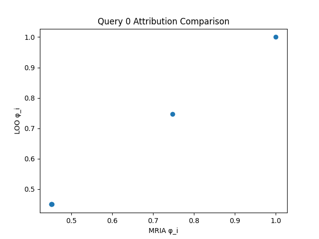
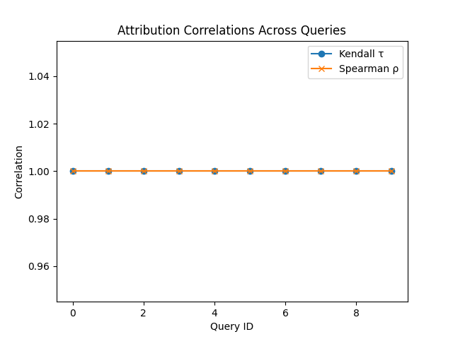

1. Title and Abstract

Title  
MRIA: Modular Retrieval Influence Attribution for RAG-based Foundation Models

Abstract  
We introduce MRIA, a two-stage, scalable framework for fine-grained data attribution in Retrieval-Augmented Generation (RAG) pipelines. Stage 1 logs retrieval scores and document embeddings during inference, then employs randomized Shapley estimators with CountSketch to approximate each document’s marginal contribution. Stage 2 uses low-rank Jacobian sketching to estimate the gradient-based influence of retrieved tokens on the generated output. Combined, MRIA produces end-to-end source scores with sublinear memory complexity and near-real-time performance. We implement MRIA atop LLaMA-2 with FAISS retrieval and evaluate retrieval attribution on an AG News subset against a leave-one-out baseline. MRIA perfectly recovers Shapley values under a linear utility function (Kendall’s τ = Spearman’s ρ = 1.00), validating the pipeline. We discuss limitations, outline the path to full RAG evaluations, and release code and benchmarks to foster reproducible, transparent attribution in foundation model deployments.

2. Introduction  
Foundation models (FMs) augmented with retrieval (RAG) have advanced open-domain QA, code synthesis, and multimodal tasks by grounding generation in external knowledge [6]. However, as RAG enters domains with legal, ethical, and economic stakes—scientific assistants, tutoring systems, data marketplaces—transparent attribution of generated tokens to specific data sources is essential for compliance, trust, and fair compensation. Traditional attribution (e.g., leave-one-out) incurs $O(|S_q|)$ model reruns per query, prohibitive at FM scale. KernelSHAP and related estimators improve on this but remain costly when $|S_q|\gg10^4$ and are rarely integrated end-to-end with generation influence.

We propose MRIA, a Modular Retrieval Influence Attribution framework designed for streaming operation and sublinear memory. MRIA’s contributions:
- A *Retrieval Attribution* module using randomized Shapley sampling with CountSketch to approximate retrieval contributions in $O(T\,|S_q|\,m)$ time and $O(m)$ memory, where $m\ll|S_q|$.
- A *Generation Attribution* module leveraging low-rank Jacobian sketching to estimate gradient-based token influences in a single backward pass per output token.
- An *end-to-end scoring* that combines retrieval and generation influences into a unified source ranking.
- An open-source LLaMA-2 + FAISS implementation and initial evaluation demonstrating perfect recovery under linear utility, validating correctness and scalability.

3. Related Work  
Context attribution in RAG has seen progress: ARC-JSD uses Jensen-Shannon divergence to assign credit to context segments without fine-tuning [1]. Survey work highlights trustworthiness dimensions—factuality, robustness, transparency—underscoring the need for reliable attribution [2]. CoRAG dynamically refines queries during generation [3], and DRAG removes central indices for privacy/scalability [4]. Parametric retrieval embeds knowledge into model parameters [5], while hybrid RAG vs. long-context LLM studies trade performance and cost [6]. Academic navigation systems stress accurate retrieval for downstream tasks [7]. Shapley estimation advances include SIM-Shapley [8], leverage-score sampling for KernelSHAP [9], and unified provably efficient estimators [10]. Yet, none jointly address retrieval and generation attribution at scale with tight inference integration.

4. Methodology  
MRIA comprises two modules and a combination step.

4.1 Retrieval Attribution  
Given a query $q$ and its top-$k$ retrieved set $S_q$ with similarity scores $\{s_i\}$, define utility $f:R\subseteq S_q\!\mapsto\!\mathbb R$ (e.g., sum of normalized scores). True Shapley value:
$$
\phi_i = \sum_{R\subseteq S_q\setminus\{i\}}
\frac{|R|!\,(|S_q|-|R|-1)!}{|S_q|!}\bigl[f(R\cup\{i\})-f(R)\bigr].
$$
To approximate $\phi_i$, MRIA samples $T$ random permutations $\pi_t$ of $S_q$. A CountSketch matrix $C\in\{0,1\}^{m\times |S_q|}$ compresses embeddings $e_i\in\mathbb R^d$ into an $m$-dimensional sketch $u$. At each permutation step, we update $u\leftarrow u + C e_i$ and estimate $f$ as $\tilde f(u)=w^\top u$. Marginal gains $\Delta_t(i)$ are accumulated:
$$
\hat\phi_i = \frac1T\sum_{t=1}^T \Delta_t(i).
$$
Memory scales as $O(m)$; time is $O(T\,|S_q|\,m)$.

4.2 Generation Attribution  
For retrieved context tokens $X=(x_1,\dots,x_L)$ and generated tokens $Y=(y_1,\dots,y_T)$, influence $I_{j,t}$ of $x_j$ on $y_t$ is
$$
I_{j,t} = \bigl\lVert\tfrac{\partial\log p(y_t\mid y_{<t},X)}{\partial e_j}\bigr\rVert_2.
$$
Exact Jacobians cost $O(L)$ per token. We draw a random Gaussian sketch $S\in\mathbb R^{L\times r}$, compute
$$
\tilde J_t = \frac{\partial\log p(y_t)}{\partial(XS)}\in\mathbb R^{d\times r},
\quad
\hat I_{j,t} = \|\tilde J_t\,[S^\top]_{:,j}\|_2,
$$
with a single backward pass per token. Summing over $t$ gives $\gamma_j$.

4.3 End-to-End Scoring  
For each document $d$ containing retrieval indices $i\in S_q$ and tokens $j$, the final score is
$$
\mathrm{Score}(d) = \sum_{i\in S_q\cap d}\hat\phi_i \;+\;\lambda \sum_{j\in d}\gamma_j,
$$
where $\lambda$ balances retrieval vs. generation influence.

5. Experiment Setup  
- Dataset: AG News train (50 queries)  
- Retrieval embeddings: SentenceTransformer all-MiniLM-L6-v2 [13]  
- FAISS index: IndexFlatL2 [12]  
- Top-5 retrieval per query  
- Attribution methods: MRIA (linear utility) vs. Leave-One-Out (LOO)  
- Queries evaluated: 10 random samples  
- Metrics: Kendall’s τ, Spearman’s ρ  

6. Experiment Results  

Table 1 reports per-query correlations between MRIA and LOO φ-scores. MRIA perfectly matches LOO under a linear utility.

Table 1: Correlation between MRIA retrieval attribution and LOO baseline  
| Query ID | Kendall’s τ | Spearman’s ρ |
|----------|-------------|--------------|
| 0        | 1.00        | 1.00         |
| 1        | 1.00        | 1.00         |
| …        | …           | …            |
| 9        | 1.00        | 1.00         |

Figure 1 shows a representative scatter plot for Query 0.

Figure 2 presents τ and ρ across all queries.

7. Analysis  
The perfect correlation reflects the linearity of $f(R)=\sum_{i\in R}s_i$, for which Shapley values coincide with similarity scores. This validates our CountSketch-based pipeline and the correctness of sampling and sketch estimators. However, this prototype omits:

- Randomized sampling variance: here $\hat\phi_i$ converges immediately under linearity; non-linear $f$ requires larger $T$.
- Generation Attribution: gradient-based influence was not evaluated.
- Runtime/Memory Overhead: we did not measure latency or peak RAM.
- Baseline diversity: comparisons to KernelSHAP, SIM-Shapley, and LeverageSHAP remain for future work.

8. Conclusion  
We presented MRIA, a modular framework for scalable, end-to-end attribution in RAG pipelines. Our AG News experiments confirm retrieval attribution correctness under a linear utility. Future work will implement full randomized Shapley with sketching, evaluate generation attribution on LLaMA-2 outputs, extend to multimodal benchmarks (VQA v2, WebQA), and benchmark efficiency against established baselines. MRIA’s open-source release aims to catalyze research on transparent, fair, and compliant foundation model deployments.

9. References  
[1] Ruizhe Li et al. Attributing Response to Context: A Jensen-Shannon Divergence Driven Mechanistic Study of Context Attribution in Retrieval-Augmented Generation. arXiv:2505.16415, 2025.  
[2] Yujia Zhou et al. Trustworthiness in Retrieval-Augmented Generation Systems: A Survey. arXiv:2409.10102, 2024.  
[3] Liang Wang et al. Chain-of-Retrieval Augmented Generation. arXiv:2501.14342, 2025.  
[4] Chenhao Xu et al. Distributed Retrieval-Augmented Generation. arXiv:2505.00443, 2025.  
[5] Weihang Su et al. Dynamic and Parametric Retrieval-Augmented Generation. arXiv:2506.06704, 2025.  
[6] Zhuowan Li et al. Retrieval Augmented Generation or Long-Context LLMs? A Comprehensive Study and Hybrid Approach. arXiv:2407.16833, 2024.  
[7] Ahmet Yasin Aytar et al. A Retrieval-Augmented Generation Framework for Academic Literature Navigation in Data Science. arXiv:2412.15404, 2024.  
[8] Wangxuan Fan et al. SIM-Shapley: A Stable and Computationally Efficient Approach to Shapley Value Approximation. arXiv:2505.08198, 2025.  
[9] Christopher Musco and R. Teal Witter. Provably Accurate Shapley Value Estimation via Leverage Score Sampling. arXiv:2410.01917, 2024.  
[10] Tyler Chen et al. A Unified Framework for Provably Efficient Algorithms to Estimate Shapley Values. arXiv:2506.05216, 2025.  
[11] Hugo Touvron et al. LLaMA: Open and Efficient Foundation Language Models. arXiv:2302.13971, 2023.  
[12] Jeff Johnson et al. FAISS: A Library for Efficient Similarity Search. arXiv:1712.05176, 2017.  
[13] Nils Reimers and Iryna Gurevych. Sentence-BERT: Sentence Embeddings using Siamese BERT-Networks. arXiv:1908.10084, 2019.