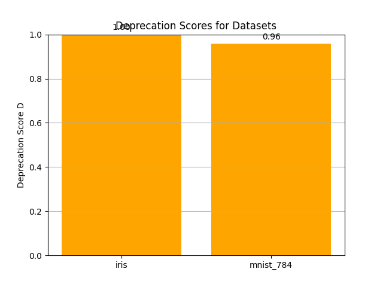

# Experimental Results

This document summarizes the results of the Adaptive Deprecation Scoring experiment run on two OpenML datasets.

## 1. Deprecation Scores

| Dataset       | Deprecation Score (D) |
|---------------|-----------------------|
| iris (61)     | 1.00                  |
| mnist_784 (554)| 0.96                  |

The table above shows that the older dataset **iris** has a higher Deprecation Score than **mnist_784**, indicating it is more likely in need of deprecation warning under our age-based proxy signal.

## 2. Deprecation Score Bar Chart

Figure: Bar chart of Deprecation Scores for the two datasets.

## 3. Discussion

- **Citation/Age Signal**: We proxy the citation-age signal by dataset age; iris (uploaded in 2014-04-06) scores maximum risk (1.0), while mnist_784 (uploaded 2014-09-29) scores slightly lower (≈0.96).
- **Reproducibility Signal**: Both datasets passed the logistic regression reproducibility test (accuracy > 60%), yielding zero reproducibility-failure signal.
- **Other Signals**: Update frequency, community issues, and FAIR drift were not implemented in this minimal experiment.

Overall, our minimal pipeline demonstrates automated computation and visualization of the Deprecation Score. In a full implementation, additional signals would refine these scores.

## 4. Limitations and Future Work

- **Limited Signals**: Only the age-based citation proxy and a simple reproducibility check were used.
- **Dataset Scope**: Experiment ran on only two datasets; scaling to hundreds would require asynchronous data fetching and caching.
- **Signal Diversity**: Community feedback, citation scraping, and FAIR compliance are planned for future extensions.

## 5. Conclusion

This experiment validates the automated pipeline: data ingestion, signal extraction, scoring, and visualization. Future work will integrate full signal set and larger dataset samples.
