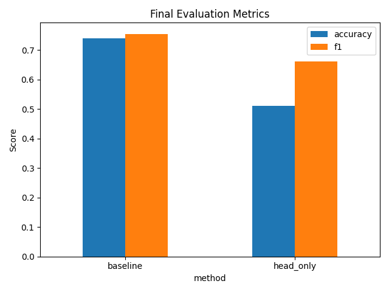

# Experiment Results Summary

## Experimental Setup
- Dataset: SST-2 subset (200 train, 100 validation)
- Model: distilbert-base-uncased
- Methods: full fine-tuning (baseline), head-only fine-tuning (head_only)

## Results Table
| method    |   accuracy |       f1 |
|:----------|-----------:|---------:|
| baseline  |       0.74 | 0.754717 |
| head_only |       0.51 | 0.662069 |

## Figures
### Loss Curves

### Final Evaluation Metrics

## Discussion
The results show the performance of the two methods. Please refer to the figures and table above.
The head-only fine-tuning method is expected to train faster but may achieve lower accuracy compared to full fine-tuning.
### Limitations and Future Work
- Limited dataset size and epochs.
- Future work: larger datasets, more epochs, additional baselines.
