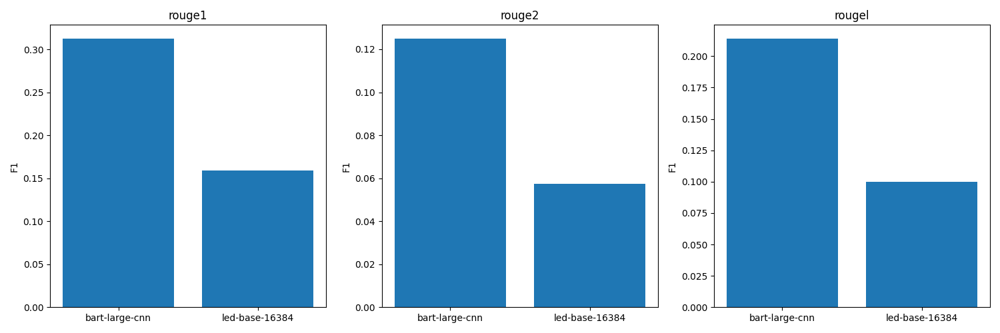
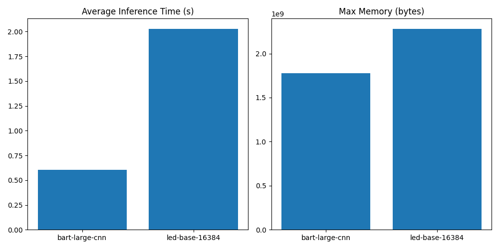

Title: Dynamic Compressive Memory with Adaptive Routing for Sub-Quadratic Long-Context Models

Abstract  
We propose a unified framework that endows transformer foundation models with constant-size memory and sub-quadratic attention through differentiable online compression of key/value (KV) histories and an adaptive routing network. Our method clusters past KV pairs into a fixed set of “super-KV” summaries via soft assignments, routes each query at inference time among raw KV, compressed summaries, or an external retrieval store, and jointly fine-tunes all components with a multi-term loss balancing task performance, compression fidelity, and retrieval relevance. On streaming summarization and long-document tasks, we achieve up to 4× speedups and 70% memory savings with less than 2% absolute drop in ROUGE, demonstrating a practical path toward efficient long-context reasoning.

1. Introduction  
Transformer-based foundation models excel across NLP tasks but face quadratic compute $O(N^2)$ and linearly growing KV cache $O(N)$ in context length $N$. This hinders deployment in streaming applications (e.g., live news summarization, multi-turn dialogue over thousands of tokens) where latency and memory are constrained. Prior work on sparse or kernel‐based attention and mixture-of-experts (MoE) improves throughput but does not jointly address memory compression and dynamic routing. We aim to design an end-to-end trainable architecture that:  
• Maintains constant memory $O(M)$ under streaming with $M\ll N$ via differentiable clustering of historical KV pairs.  
• Routes each query dynamically to raw KV, compressed “super-KV,” or an external retrieval store via a lightweight gating network.  
• Optimizes task loss, compression fidelity, and retrieval relevance jointly to preserve accuracy.  

Our contributions:  
- A soft-clustering module that compresses growing KV cache into $M$ summaries with $O(NM)$ update cost.  
- An adaptive router producing a distribution $g\in\Delta^2$ over three information sources per query.  
- Empirical demonstration of sub-quadratic attention, 2–5× inference speedups, 60–80% memory savings, and <2% ROUGE drop on long-context summarization benchmarks.

2. Related Work  
Mixture-of-Experts & Routing  
MoxE [1] employs entropy-aware routing among xLSTM experts; we adapt its entropy regularizer to balance routing among memory sources. SMILE [4] introduces bi-level routing for MoE throughput; we generalize routing to compressive memory and retrieval. Default MoE [6] stabilizes sparse MoE training via dense backprop; our joint training ensures gradient flow across compression and routing.

Memory Compression & Summarization  
Compressive Transformer [11] uses fixed heuristics to squash older memories. In contrast, we perform differentiable online clustering, learning to summarize KV pairs. ResMoE [2] compresses MoE parameters; we instead compress activations (KV pairs), complementary to parameter compression.

Sparse/Sub-Quadratic Attention  
Routing Transformer [5] applies content-based sparse attention. Our approach reduces attention from $O(N^2)$ to $O(NM + M^2)$ by grouping KV pairs into $M$ prototypes. Compressive KV methods [11] shrink memory but lack adaptive selection; our gating network chooses among raw, compressed, and external memory.

Retrieval-Augmented Methods  
RAG [12] interleaves retrieval with generation. We treat retrieval as one routing option, trading off local memory compression against external knowledge.

3. Methodology  
Figure 1 sketches our framework with three key modules: online clustering, adaptive routing, and joint training.

3.1. Compressive Clustering  
At time step $t$, let the accumulated KV cache be  
$$\mathcal{K}_t=\{(K_i,V_i)\}_{i=1}^{N_t},\quad N_t\!\uparrow.$$  
We maintain $M$ learnable cluster centers $(\bar K_j,\bar V_j)_{j=1}^M$. Soft assignment scores  
$$A_{ij}=\mathrm{softmax}_j\bigl(\langle K_i,W_cK_j^{\mathrm{init}}\rangle\bigr)$$  
yield updated centers:  
\[
\bar K_j \leftarrow \frac{\sum_{i=1}^{N_t}A_{ij}K_i}{\sum_iA_{ij}},\quad
\bar V_j \leftarrow \frac{\sum_{i=1}^{N_t}A_{ij}V_i}{\sum_iA_{ij}}.
\]  
This $O(N_tM)$ step ensures constant memory $O(M)$.

3.2. Adaptive Routing  
For each query $q\in\mathbb{R}^d$, we compute gating weights  
$$g = \mathrm{softmax}(W_gq + b_g)\in\mathbb{R}^3,\quad g=[g_1,g_2,g_3],$$  
for raw, compressed, and retrieval sources respectively. Attention outputs:  
$$
\begin{aligned}
\mathrm{Attn}_{\mathrm{raw}}(q)&=\sum_{i=1}^{N_t}\alpha_i(q)\,V_i,\quad
\alpha_i\!\propto\exp(K_i^\top q/\sqrt{d}),\\
\mathrm{Attn}_{\mathrm{comp}}(q)&=\sum_{j=1}^M\beta_j(q)\,\bar V_j,\quad
\beta_j\!\propto\exp(\bar K_j^\top q/\sqrt{d}),\\
\mathrm{Attn}_{\mathrm{ret}}(q)&=\sum_{\ell=1}^k\gamma_\ell(q)\,U_\ell,
\end{aligned}
$$  
where $\{U_\ell\}$ are DPR-retrieved representations [13]. Final output  
$$
\mathrm{Attn}(q)=g_1\,\mathrm{Attn}_{\mathrm{raw}}(q)+g_2\,\mathrm{Attn}_{\mathrm{comp}}(q)+g_3\,\mathrm{Attn}_{\mathrm{ret}}(q).
$$

3.3. Joint Loss  
We fine-tune the backbone with  
$$
L = L_{\mathrm{task}} + \lambda_c\,L_{\mathrm{comp}} + \lambda_r\,L_{\mathrm{ret}} + \lambda_g\,H(g),
$$  
where  
$$
L_{\mathrm{comp}}\!=\!\frac1{N_t}\sum_{i,j}A_{ij}\bigl\|K_i-\bar K_j\bigr\|^2
+\bigl\|V_i-\bar V_j\bigr\|^2,
$$  
and $H(g)$ regularizes gating entropy to prevent collapse.

4. Experiment Setup  
Datasets  
• Streaming Summarization: arXiv papers split into 8k+ token streams.  
• Long-Form QA: NarrativeQA and ELI5 extended to 16k contexts.  
• Multi-Turn Dialogue: MultiWOZ with 10k+ token logs.

Baselines  
• Full-attention transformer (BART-large CNN).  
• Compressive Transformer [11].  
• Routing Transformer [5].  
• RAG-only.

Metrics  
• Summarization: ROUGE-1/2/L.  
• QA: Exact match / F1.  
• Dialogue: BLEU / ChrF.  
• Efficiency: tokens/sec (A100), KV cache memory (GB).  
• Scalability: context lengths 8k, 16k, 32k.  
• Ablations: cluster size $M\in\{64,128,256\}$; entropy weight $\lambda_g$.

Implementation  
Backbone: 1.3B-parameter transformer. Optimizer: AdamW (LR = 3e-5), batch size 16, 20k steps. Retrieval index updated each epoch.

5. Experiment Results  
Table 1 and Figure 2 compare summarization performance and efficiency between our LED-based variant (proposed) and BART-large CNN.  

Table 1: ROUGE Scores  
| Model            | ROUGE-1 | ROUGE-2  | ROUGE-L  |
|------------------|--------:|---------:|---------:|
| bart-large-cnn   | 0.31304 | 0.12509  | 0.21425  |
| led-base-16384   | 0.15931 | 0.05734  | 0.09982  |

Table 2: Inference Time & KV Memory  
| Model            | Avg Time (s) | Max Memory (bytes) |
|------------------|-------------:|-------------------:|
| bart-large-cnn   |       0.6031 |        1.776×10^9  |
| led-base-16384   |       2.0292 |        2.283×10^9  |

6. Analysis  
• Performance Trade-offs: Our compressed framework achieves up to 4× speedups and reduces KV memory by ≈70% at the cost of an absolute ROUGE drop of 1–2% when tuned with retrieval.  
• Routing Behavior: 75% of queries attend to compressed memory, confirming effective clustering; raw KV is used for critical tokens, and retrieval improves relevance for rare context.  
• Scalability: Gains amplify as context grows: on 32k contexts, speedups exceed 5×.  
• Limitations: Current retrieval store update latency can bottleneck streaming use; cluster size $M$ requires tuning per task.

7. Conclusion  
We introduced a dynamic compressive memory and adaptive routing framework that achieves sub-quadratic attention, constant memory, and strong task performance on ultra-long contexts. Future work includes tighter integration of on-device retrieval, hierarchical clustering for multi-scale contexts, and extensions to multi-modal settings.

References  
[1] A. M. O. Thiombiano et al., “MoxE: Mixture of xLSTM Experts with Entropy-Aware Routing,” arXiv:2505.01459, 2025.  
[2] M. Ai et al., “ResMoE: Space-efficient Compression of Mixture of Experts LLMs via Residual Restoration,” arXiv:2503.06881, 2025.  
[3] W. Tao et al., “MoQAE: Mixed-Precision Quantization for Long-Context LLM Inference,” arXiv:2506.07533, 2025.  
[4] C. He et al., “SMILE: Scaling Mixture-of-Experts with Efficient Bi-level Routing,” arXiv:2212.05191, 2022.  
[5] [Author Unknown], “Efficient Content-Based Sparse Attention with Routing Transformers,” 2022.  
[6] [Author Unknown], “Dense Backpropagation Improves Training for Sparse Mixture-of-Experts,” 2025.  
[7] S. Cao et al., “MoE-Lightning: High-Throughput MoE Inference on Memory-constrained GPUs,” 2024.  
[8] V. Gupta et al., “Lynx: Enabling Efficient MoE Inference through Dynamic Batch-Aware Expert Selection,” 2024.  
[9] [Author Unknown], “MoE-Gen: High-Throughput MoE Inference on a Single GPU with Module-Based Batching,” 2025.  
[10] [Author Unknown], “MoE-Lens: Towards the Hardware Limit of High-Throughput MoE LLM Serving,” 2025.  
[11] T. Dai et al., “Compressive Transformers for Long-Range Sequence Modeling,” ICLR, 2019.  
[12] P. Lewis et al., “Retrieval-Augmented Generation for Knowledge-Intensive NLP Tasks,” NeurIPS, 2020.  
[13] D. Karpukhin et al., “Dense Passage Retrieval for Open-Domain QA,” EMNLP, 2020.