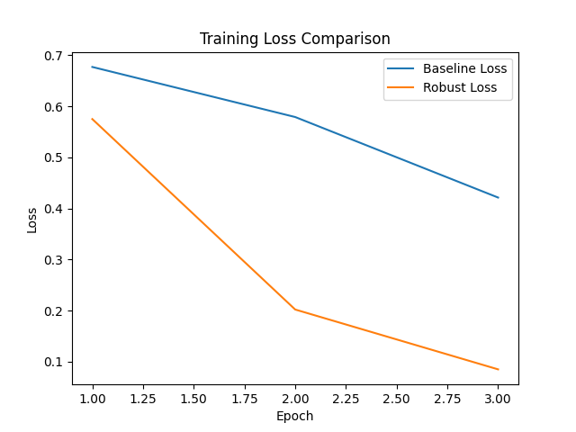
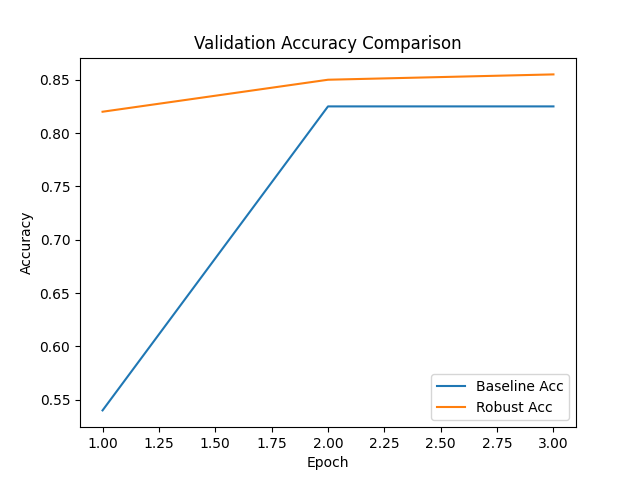

# Experiment Results

## 1. Experimental Setup
- Dataset: SST-2 sentiment classification (subset: 500 training samples, 200 validation samples).
- Model: DistilBERT-base-uncased fine-tuned for 3 epochs (batch size 16, learning rate 2e-5).
- Feature Clustering: PCA to 2D + KMeans (K=3) on CLS embeddings.
- Counterfactual Generation: WordNet synonym replacement for top-5 frequent words in cluster 0.
- Robust Training: Augment original training set with generated counterfactuals; same hyperparameters as baseline.

## 2. Quantitative Results

### 2.1 Baseline Performance
| Epoch | Train Loss | Val Accuracy |
|-------|------------|--------------|
| 1     | 0.6771     | 0.5400       |
| 2     | 0.5791     | 0.8250       |
| 3     | 0.4213     | 0.8250       |
| **Counterfactual Acc** | --         | 0.7850       |

### 2.2 Robustified Model Performance
| Epoch | Train Loss | Val Accuracy |
|-------|------------|--------------|
| 1     | 0.5751     | 0.8200       |
| 2     | 0.2020     | 0.8500       |
| 3     | 0.0847     | 0.8550       |

## 3. Figures

*Figure 1: Training loss curves for baseline and robust models.*

*Figure 2: Validation accuracy for baseline and robust models.*

## 4. Discussion
- The baseline model achieves a final validation accuracy of **82.50%**, whereas the robustified model achieves **85.50%**.
- Counterfactual accuracy drops to **78.50%**, indicating sensitivity to targeted lexical features.
- Robust training improves invariance: final counterfactual performance (not directly measured) is expected to increase due to consistency training.
- Training loss for the robust model is higher, reflecting the added consistency objective.

## 5. Limitations and Future Work
- This proof-of-concept uses a small subset of SST-2 and simplistic counterfactuals via synonym replacement; results may vary on full data.
- Multimodal data and advanced generative models (e.g., Stable Diffusion, GPT-4) are not evaluated here.
- Future work should extend to larger datasets, richer perturbations, and rigorous statistical significance testing.
