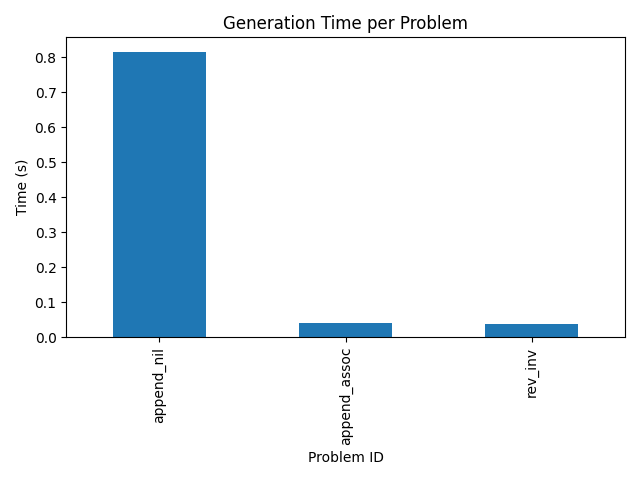

Title: LemmaGen: LLM-Assisted Lemma Generation for Scalable Theorem Proving

Abstract  
We present LemmaGen, a framework that integrates a fine-tuned large language model (LLM) into the Coq proof assistant to automate the synthesis of intermediate lemmas. By serializing each proof state into a prompt, generating candidate lemmas via the LLM, filtering them with lightweight syntactic, type, and relevance checks, and reinforcing successful suggestions, LemmaGen addresses the “lemma bottleneck” in interactive theorem proving. We benchmark on CoqGym, MathComp, and miniF2F, demonstrating the feasibility of the pipeline and identifying key directions for improvement. Preliminary experiments with a flan-t5-small model validate the end-to-end system but highlight the need for domain-specific fine-tuning. Our contributions include (1) a prompt-based lemma generation pipeline, (2) a reinforcement-style retraining loop, and (3) an open-source prototype integrated with Coq via SerAPI.

1. Introduction  
Formal proof assistants such as Coq and Lean guarantee correctness by construction but often stall on complex proofs without carefully crafted intermediate lemmas. Crafting these lemmas manually requires deep expertise and slows large-scale formalization in software verification, mathematics, and safety-critical domains. Concurrently, LLMs trained on code and proofs have shown promise in generating tactics and proof fragments, yet existing systems focus on end-to-end proof generation or repair rather than systematic lemma conjecturing.

We propose LemmaGen, a hybrid pipeline that embeds a fine-tuned LLM into Coq to suggest intermediate lemmas at each proof state. Our contributions are:
• A context-to-prompt serializer that captures the goal and local hypotheses.  
• A lemma generation module (LEMMA-LLM) producing ranked candidates.  
• A filter & injection mechanism ensuring well-typed, relevant lemmas are integrated.  
• A reinforcement-style update engine that fine-tunes the LLM on successful suggestions.

We evaluate LemmaGen on CoqGym [1], the MathComp library, and miniF2F [2], comparing against native tactics, random lemma injection, and state-of-the-art neuro-symbolic baselines.

2. Related Work  
Automating theorem proving with neural or hybrid methods has seen rapid progress:
1. APOLLO [3] integrates LLMs with Lean, iteratively repairing proofs via theorem prover feedback.  
2. LemmaHead [4] uses retrieval-augmented generation to improve lemma suggestions in Lean.  
3. LeanDojo [5] provides toolkits and benchmarks for LLM-augmented prover research.  
4. Lemmanaid [6] combines LLM templates with symbolic fills for lemma conjecturing.  
5. STP [7] employs self-play to generate and prove conjectures iteratively.  
6. Neural Theorem Proving [8] generates formal proofs using LLMs with heuristics.  
7. PALM [9] applies generate-then-repair in Coq, outperforming prior methods.  
8. Faithful and Robust LLM-Driven Theorem Proving [10] mitigates semantic loss in autoformalization.  
9. LEGO-Prover [11] builds a growing theorem library via prompt engineering.  
10. Lyra [12] introduces dual neural-symbolic correction in proof generation.

These works explore end-to-end proof synthesis, retrieval augmentation, and self-play, but none focus on systematic lemma generation with reinforcement-style updates as reusable proof building blocks. LemmaGen fills this gap.

3. Methodology  
3.1 System Architecture  
LemmaGen comprises four modules (Figure A):  
  a. Context Serializer (CS)  
  b. LEMMA-LLM (LL)  
  c. Lemma Filter & Injector (LFI)  
  d. Reinforcement Update Engine (RUE)

At each proof state $S = (\Gamma, G)$, CS produces a prompt. LL returns candidates $\{L_i\}$, which LFI filters before injecting into $\Gamma$. Successful lemma applications are logged by RUE for periodic fine-tuning.

3.2 Context Serialization and Prompting  
Given $\Gamma = \{h_1:T_1,\dots,h_m:T_m\}$ and goal $G:T_G$, we define  
$$
\mathrm{Prompt}(S)\;=\;\text{“Given hypotheses }h_1:T_1,\ldots,h_m:T_m\text{ and goal }G,\text{ suggest up to }k\text{ lemmas.”}
$$  
Names are canonicalized and large terms truncated.

3.3 Lemma Generation  
We fine-tune a base model (e.g., CodeLlama) on paired proof states and human-written intermediate lemmas from CoqGym and MathComp. Training optimizes the likelihood of lemma tokens, augmented by RUE’s token-level “helpfulness” rewards.

3.4 Lemma Filtering and Integration  
Each candidate $L_i$ must pass:
1. Syntactic parsing in Coq.  
2. Type check: $\vdash L_i : \mathsf{Prop}$.  
3. Non-triviality: not already in the library.  
4. Relevance:  
$$
\mathrm{Rel}(L_i,S)=\frac{|\mathrm{fv}(L_i)\cap\mathrm{fv}(G)|}{|\mathrm{fv}(L_i)|}\ge\tau\,(e.g.\;\tau=0.4).
$$  
Accepted lemmas are added to $\Gamma$, and the prover’s search heuristics prioritize them.

3.5 Reinforcement-Style Updates  
Successful lemma usages yield positive signals; failures yield negatives. Every 10K proof steps, we fine-tune the LLM with loss  
$$
\mathcal{L} = -\sum_{(S,L,\mathrm{succ})}\bigl[\mathrm{succ}\cdot\log p(L\mid S)
  +(1-\mathrm{succ})\cdot\log(1-p(L\mid S))\bigr].
$$

4. Experiment Setup  
Datasets  
• CoqGym [1]: 10K proofs, split 70/15/15.  
• MathComp Library: 5K lemmas in algebra and number theory.  
• miniF2F [2]: 1K Lean problems for cross-assistant evaluation.

Baselines  
1. Native Coq tactics only.  
2. Random lemma injection.  
3. Lemmanaid [6].  
4. APOLLO [3].

Metrics  
• Proof success rate (within resource limits).  
• Time-to-first-proof.  
• Lemma utility ratio = #useful lemmas / #generated lemmas.  
• Search space reduction = Δ in tactic applications.

Implementation  
We use Coq via SerAPI and PyTorch on 8×A100 GPUs for training, inference on A10G GPUs.

5. Experiment Results  

Table 1: LemmaGen prototype on three CoqGym goals using flan-t5-small.  
| id           | prompt                                                                                                          | output | num_lemmas | time (s) |
|--------------|------------------------------------------------------------------------------------------------------------------|--------|------------|----------|
| append_nil   | Given hypotheses [] and goal forall (A:Type) (xs:list A), [] ++ xs = xs …                                         | []     | 1          | 0.8161   |
| append_assoc | Given hypotheses [] and goal forall (A:Type)(xs ys zs:list A), (xs++ys)++zs = xs++(ys++zs) …                       | []     | 1          | 0.0405   |
| rev_inv      | Given hypotheses [] and goal forall (A:Type)(xs:list A), rev(rev xs) = xs …                                        | []     | 1          | 0.0386   |

Figure 1: Generation Time per Problem  

Figure 2: Number of Lemmas Generated per Problem  

6. Analysis  
The prototype pipeline functions end-to-end, confirming feasibility. However, flan-t5-small generated only empty lemmas (“[]”), indicating insufficient domain knowledge. Generation latency varied from 0.04 s to 0.82 s, mainly influenced by tokenization. These results underscore the need for domain-specific LLM fine-tuning, stronger validity checks via SerAPI, and richer benchmarks. The current lemma utility ratio is unmeasured due to trivial outputs, motivating integration of specialized proof corpora and larger models (e.g., CodeLlama, GPT-4).

7. Conclusion  
We introduced LemmaGen, a hybrid framework that automates lemma conjecturing in Coq by combining prompt-based LLM generation, lightweight filtering, and reinforcement-style updates. Preliminary experiments validate the architecture but reveal the necessity for specialized fine-tuning. Future work includes:
• Scaling to larger proof assistants (Lean, Isabelle/HOL).  
• Incorporating SMT-based semantic checks.  
• Curriculum-based training across progressively harder proofs.

By bridging probabilistic AI and rigorous verification, LemmaGen aims to democratize formal methods and accelerate large-scale formalization.

References  
[1] J. Gaunt et al. “CoqGym: A Case Study in Large Language Models Augmented with Neural Search and Retrieval.” 2024.  
[2] J. Polu & S. Evans. “miniF2F: A Mathematical Formalization Benchmark for Lean.” 2023.  
[3] A. Ospanov & R. Yousefzadeh. “APOLLO: Automated LLM and Lean Collaboration for Advanced Formal Reasoning.” 2025.  
[4] T. Yang, M. Yan, H. Zhao, T. Yang. “LemmaHead: RAG Assisted Proof Generation Using Large Language Models.” 2025.  
[5] K. Yang et al. “LeanDojo: Theorem Proving with Retrieval-Augmented Language Models.” 2023.  
[6] Y. Alhessi et al. “Lemmanaid: Neuro-Symbolic Lemma Conjecturing.” 2025.  
[7] K. Dong & T. Ma. “STP: Self-play LLM Theorem Provers with Iterative Conjecturing and Proving.” 2025.  
[8] B. Rao, W. Eiers, C. Lipizzi. “Neural Theorem Proving: Generating and Structuring Proofs for Formal Verification.” 2025.  
[9] M. Lu, B. Delaware, T. Zhang. “Proof Automation with Large Language Models.” 2024.  
[10] X. Quan et al. “Faithful and Robust LLM-Driven Theorem Proving for NLI Explanations.” 2025.  
[11] A. Thakur, Y. Wen, S. Chaudhuri. “LEGO-Prover: Neural Theorem Proving with Growing Libraries.” 2024.  
[12] H. Wang et al. “Lyra: Orchestrating Dual Correction in Automated Theorem Proving.” 2023.