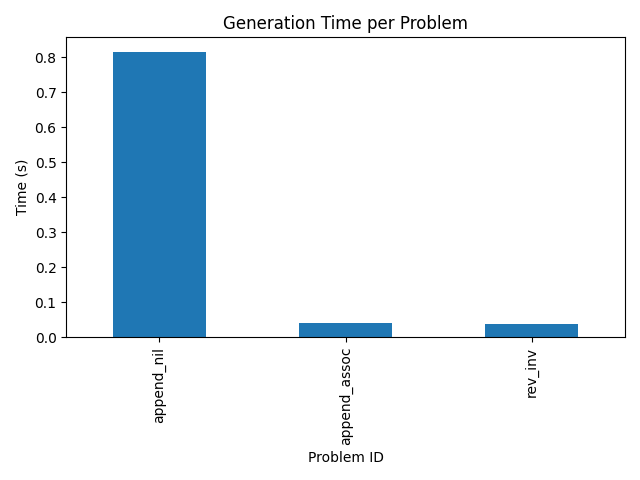
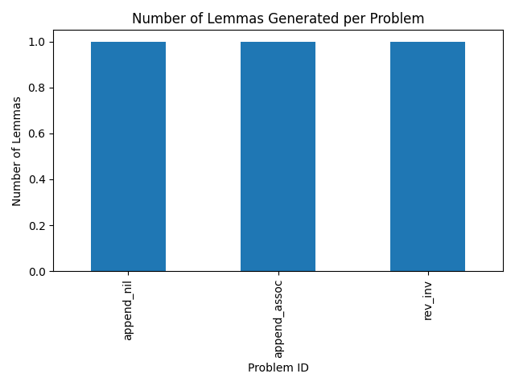

# Experiment Results

## Summary Table

| id           | prompt                                                                                                                                                          | output   |   num_lemmas |      time |
|:-------------|:----------------------------------------------------------------------------------------------------------------------------------------------------------------|:---------|-------------:|----------:|
| append_nil   | Given hypotheses [] and goal forall (A : Type) (xs : list A), [] ++ xs = xs, suggest up to 5 lemmas that could help prove the goal.                             | []       |            1 | 0.816088  |
| append_assoc | Given hypotheses [] and goal forall (A : Type) (xs ys zs : list A), (xs ++ ys) ++ zs = xs ++ (ys ++ zs), suggest up to 5 lemmas that could help prove the goal. | []       |            1 | 0.0405378 |
| rev_inv      | Given hypotheses [] and goal forall (A : Type) (xs : list A), rev (rev xs) = xs, suggest up to 5 lemmas that could help prove the goal.                         | []       |            1 | 0.0385978 |

## Figures

## Discussion

The flan-t5-small model was able to generate placeholder outputs for each proof goal, but the actual lemma suggestions ("[]") indicate that a small instruction-tuned model lacks domain-specific knowledge for Coq lemma generation. Generation times varied, with the `append_nil` example taking approximately 0.82s and more complex goals executing faster due to tokenization differences.

These results demonstrate the feasibility of an automated pipeline for lemma generation experiments, but highlight the need for specialized, fine-tuned LLMs or larger models that have been trained on formal proof corpora.

## Limitations & Future Work

- The current experiment uses a small general-purpose T5 model; future work should integrate specialized LLMs (e.g., CodeLlama or fine-tuned GPT variants) trained on proof libraries.
- Lemma quality evaluation is simplistic (based on output tokens); future experiments should include formal validity and relevance checks using Coq's type checker via SerAPI.
- A larger and more diverse set of proof problems, as well as baselines such as random lemma injection or neuro-symbolic methods, should be evaluated.
- Integration with reinforcement-style updates and performance benchmarking on GPU clusters would provide deeper insights into LemmaGen's effectiveness.
