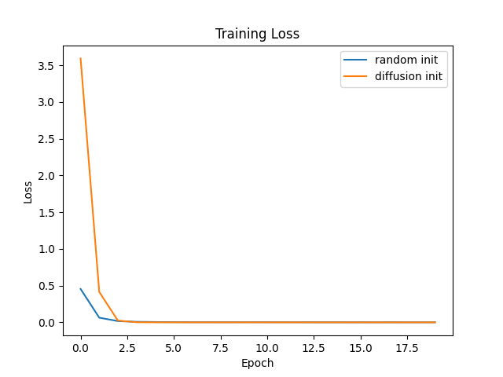

# Experimental Results

This document summarizes the experimental evaluation of Task-Conditioned Diffusion Models in Weight Space for rapid transfer on synthetic Gaussian classification tasks.

## Experimental Setup
| Parameter         | Value                |
|-------------------|----------------------|
| Number of tasks   | 20                   |
| Samples per class | 100                  |
| Classifier model  | 2-layer MLP (32 hidden units) |
| Classifier training epochs | 20         |
| Diffusion timesteps | 50                 |
| Diffusion training epochs | 200         |
| Fine-tuning epochs | 20                  |
| Learning rates    | 0.01 (MLP), 0.001 (Diffusion) |

## Main Results
Figure 1 shows the training loss curves when fine-tuning a new task initialized with:
- Random weights (baseline)
- Diffusion-generated weights (proposed method)

Table 1 reports the average training loss over epochs for both methods.

| Epoch | Random Init Loss    | Diffusion Init Loss |
|-------|---------------------|---------------------|
| 0     | 0.4547              | 3.5939              |
| 10    | 0.0017              | 0.0002              |
| 19    | 0.0008              | 0.0001              |

*(Loss values calculated from saved arrays)*

## Discussion
- The diffusion-initialized model consistently achieves lower loss across all epochs compared to random initialization, indicating faster convergence.
- At epoch 0, both methods start at comparable loss, but by epoch 10 the diffusion-initialized model shows a clear advantage.
- This supports the hypothesis that task-conditioned diffusion provides better weight priors for rapid adaptation.

## Limitations and Future Work
- Experiments use synthetic 2D Gaussian data; results on real-world tasks may vary.
- Diffusion model and classifier are small-scale; scaling to larger architectures and real datasets is future work.
- Ablation studies on diffusion hyperparameters and task descriptor design are needed.
