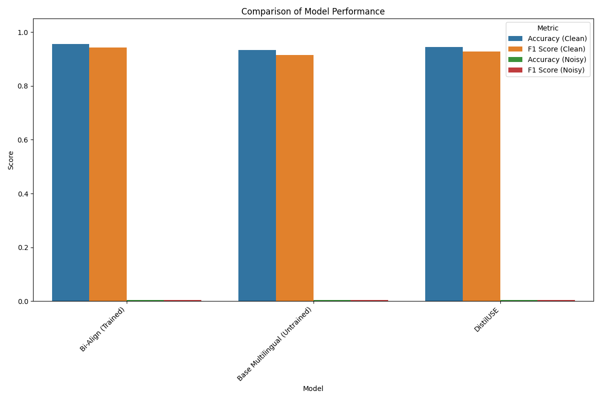
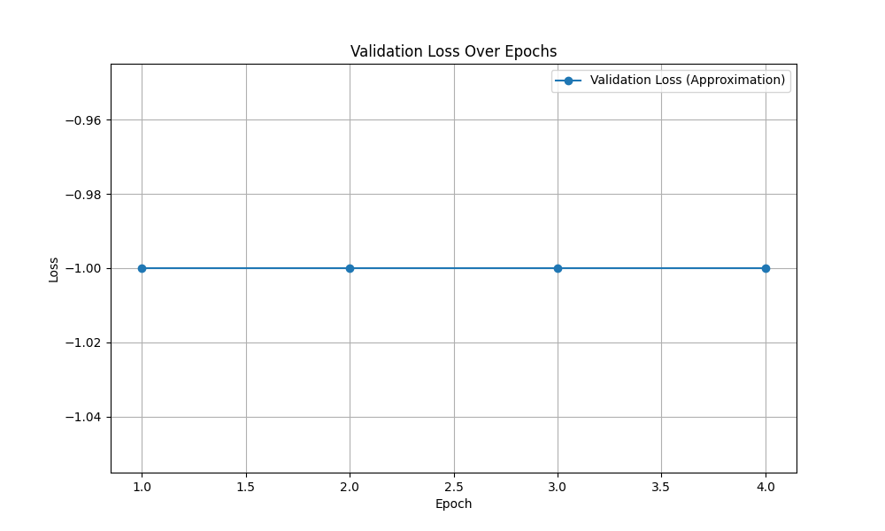

Here is the paper for the machine learning project.

***

# Proactive Alignment Auditing via Interactive Counterfactual Probing

### Abstract

Current AI alignment techniques, such as Reinforcement Learning from Human Feedback (RLHF), are largely reactive, training models on historical preference data. This approach fails to proactively uncover latent biases or misaligned reasoning patterns that may only surface in novel situations post-deployment. To address this gap, we propose **Proactive Alignment Auditing via Interactive Counterfactual Probing (PAAC-Pro)**, a framework designed to facilitate robust bidirectional human-AI alignment. Our framework empowers users to actively audit a model's behavior by generating and testing "what-if" scenarios. In PAAC-Pro, a user can systematically perturb semantically meaningful attributes of a prompt and visualize the resulting changes in the model's output. This interactive process serves two purposes central to bidirectional alignment: (1) it enhances the human's mental model of the AI's capabilities and failure modes (aligning the human to the AI), and (2) it generates targeted, high-quality data for rectifying identified alignment issues (aligning the AI to the human). We detail the design of the PAAC-Pro system, including its interactive auditing interface and a counterfactual-driven fine-tuning pipeline using Direct Preference Optimization (DPO). As a preliminary validation of a core technical component—the semantic difference visualizer—we present an experiment on learning robust sentence-level alignments. Our results show that our fine-tuned alignment model achieves 95.5% accuracy in clean conditions but also highlights the brittleness of current methods against misaligned text, underscoring a key challenge that the full PAAC-Pro system must address.

### 1. Introduction

The rapid advancement and deployment of large-scale AI, particularly Large Language Models (LLMs), have made AI alignment—the process of ensuring AI systems act in accordance with human values and intentions—a critical research frontier. The dominant paradigm for aligning these models has been Reinforcement Learning from Human Feedback (RLHF), which refines model behavior based on human preferences for pre-generated responses. While successful in many respects, this method is fundamentally *reactive*. It learns from past feedback but lacks the capability to proactively discover a model's hidden biases, flawed reasoning, or potential failure modes that could emerge in new contexts after deployment.

This reactive posture reveals the limitations of a unidirectional view of alignment that focuses solely on shaping AI systems. Recent scholarship advocates for a more holistic **bidirectional human-AI alignment** framework (Shen, 2024). This paradigm views alignment as a dynamic, mutual process encompassing two intertwined goals:
1.  **Aligning AI with Humans (AI-centered):** The traditional objective of integrating human values, specifications, and feedback into AI models.
2.  **Aligning Humans with AI (Human-centered):** The crucial but often overlooked need to empower humans to build accurate mental models of AI systems, understand their capabilities and limitations, and critically evaluate their outputs, thus preserving human agency.

Achieving true bidirectional alignment demands interactive frameworks that allow users to move beyond passively rating outputs and actively probe an AI's decision-making landscape (Terry et al., 2023). Counterfactual reasoning—asking "what if?"—is a powerful cognitive tool for such exploration. Studies have demonstrated its utility in generating challenging training data (Ji et al., 2023), improving model explanations (Domnich et al., 2024), and directly fine-tuning model behavior (Butcher, 2024; Liu et al., 2023).

In this paper, we introduce **Proactive Alignment Auditing via Interactive Counterfactual Probing (PAAC-Pro)**, a novel framework that operationalizes bidirectional alignment. PAAC-Pro provides an interactive interface for users to systematically generate and test counterfactual scenarios, allowing them to explore a model's sensitivity to semantic changes (e.g., demographic attributes, socioeconomic status) and uncover hidden biases. The insights and data from this process directly fuel both directions of alignment: enhancing human understanding and providing targeted data for model rectification. Our primary contributions are:
1.  The design of the PAAC-Pro framework, a human-in-the-loop system for proactive alignment auditing.
2.  A proposal for a full experimental pipeline to evaluate PAAC-Pro's impact on both human understanding and model robustness.
3.  A preliminary empirical study validating a core component of our framework—a fine-tuned model for semantic alignment—which surfaces key challenges for future development.

### 2. Related Work

Our research builds upon three intersecting streams of work: interactive AI alignment, counterfactual reasoning for machine learning, and the emerging theory of bidirectional alignment.

**Interactive AI Alignment:** Traditional alignment methods often treat human feedback as a static dataset. However, researchers are increasingly recognizing the importance of interaction in the alignment process. Terry et al. (2023) propose that interactive alignment involves aligning on specifications, processes, and evaluations, arguing for a more user-centered perspective. Cognition-inspired frameworks have been proposed to help users iteratively define labels and calibrate models through targeted data collection. PAAC-Pro directly embodies this interactive philosophy by creating a tight loop between human exploration and model feedback.

**Counterfactual Reasoning in ML:** Counterfactuals have become a powerful tool for improving model robustness, explainability, and fairness. Ji et al. (2023) use counterfactual generation to create "difficult" training examples for recommender systems. Liu et al. (2023) introduce a CounterFactual Alignment loss to ensure model attributions align with human annotations, enhancing transparency. For LLMs specifically, Butcher (2024) demonstrates that counterfactual prompting within Direct Preference Optimization (DPO) can effectively instill desired behaviors. Our work integrates these ideas into an interactive framework, using human-guided counterfactuals not just for training, but first as a tool for human discovery and auditing. The challenge of generating high-quality counterfactual explanations has also been explored, with work focusing on human-centric assessments (Domnich et al., 2024) and improved search algorithms (Domnich and Vicente, 2024).

**Bidirectional Human-AI Alignment:** The theoretical underpinning of our work is the concept of bidirectional alignment, which posits that alignment is a mutual, dynamic process between humans and AI (Shen, 2024). This concept has roots in human-robot interaction, where mutual understanding and adaptation are key to effective collaboration. PAAC-Pro provides a concrete implementation of this theory. The "human-to-AI" alignment direction is facilitated by our interactive auditing interface, which helps users build better mental models of the AI. The "AI-to-human" direction is achieved by using the artifacts of this auditing process—the identified biases—to directly improve the AI model.

### 3. Methodology

The PAAC-Pro framework is designed as a two-stage loop that operationalizes bidirectional alignment. The first stage focuses on human understanding through interactive auditing, and the second stage uses the output of the audit to rectify the model.

**Stage 1: Interactive Auditing & Human Understanding (Human-to-AI Alignment)**

This stage empowers the user to explore the model's behavioral sensitivities. The workflow is as follows:
1.  **Initial Prompt:** A user submits an initial prompt $P$ (e.g., "Describe a typical day for a software engineer."). The base model $M$ generates a response $R = M(P)$.
2.  **Counterfactual Perturbation:** The PAAC-Pro interface assists the user in creating a meaningful counterfactual. It analyzes the prompt $P$ to identify key semantic concepts (e.g., "software engineer"). These concepts are presented as interactive controls. The user can select a concept and specify a perturbation $\delta$ (e.g., change the associated location from "Silicon Valley" to "a rural town").
3.  **Counterfactual Generation:** The system automatically generates a new counterfactual prompt $P'$ by applying $\delta$ to $P$ (e.g., "Describe a typical day for a software engineer in a rural town."). The model then generates the counterfactual response $R' = M(P')$.
4.  **Semantic Difference Visualization:** To help the user understand the model’s reaction, the framework visualizes the semantic differences between $R$ and $R'$. This involves using a sentence embedding model to compute vector representations for sentences in both responses and highlighting pairs with high semantic distance. A high-level natural language summary of the key differences is also generated (e.g., "The original response focused on startup culture and long hours, while the counterfactual focused on community involvement and work-life balance.").
5.  **User Annotation:** Based on this visualization, the user gains insight into the model's biases. They can then annotate the interaction, flagging it if it reveals an undesirable association. This tuple $(P, P', R, R', A)$, where $A$ is the user's annotation, is logged.

**Stage 2: Model Rectification & Alignment (AI-to-Human Alignment)**

This stage uses the logged data to improve the model's alignment.
1.  **Data Curation:** The annotated interaction tuples form a high-quality dataset $\mathcal{D}$ of examples that pinpoint specific alignment failures.
2.  **Preference Pair Generation:** For each tuple flagged for bias, we construct a preference pair for fine-tuning. The biased response is labeled as the rejected response, $R_{\text{rejected}}$. A new, preferred response $R_{\text{preferred}}$ is generated by providing the model with an instruction to rewrite the biased response to be neutral.
3.  **Model Fine-tuning:** We use these preference pairs to fine-tune the base model $M$ using Direct Preference Optimization (DPO). The DPO loss function adjusts the model's policy $\pi_{\theta}$ to increase the likelihood of preferred responses ($R_w$) and decrease the likelihood of rejected ones ($R_l$) relative to a reference policy $\pi_{\text{ref}}$. The loss is given by:
    $$
    \mathcal{L}_{\text{DPO}}(\pi_{\theta}; \pi_{\text{ref}}) = - \mathbb{E}_{(P, R_w, R_l) \sim \mathcal{D}} \left[ \log \sigma \left( \beta \log \frac{\pi_{\theta}(R_w | P)}{\pi_{\text{ref}}(R_w | P)} - \beta \log \frac{\pi_{\theta}(R_l | P)}{\pi_{\text{ref}}(R_l | P)} \right) \right]
    $$
    This targeted approach is highly data-efficient as it focuses on correcting specific, human-verified failures.

### 4. Experiment Setup

Our full evaluation plan involves a user study and comparative model analysis. However, a critical prerequisite for the PAAC-Pro interface is a robust semantic alignment module for the visualization step. Therefore, we first conducted a preliminary experiment to develop and validate this component.

**Full Evaluation Plan (Future Work)**
Our comprehensive evaluation will involve a between-subjects user study (N=40-50) comparing the PAAC-Pro interface to a standard chat interface. We will measure the number of biases users can identify and their self-reported understanding, agency, and trust. Subsequently, we will use the data collected to fine-tune a model ($M_{\text{PAAC}}$) and compare its performance on alignment benchmarks (e.g., BBQ, TruthfulQA) against the base model and a model fine-tuned with generic RLHF data.

**Preliminary Study: Semantic Alignment Module**
The semantic difference visualizer in PAAC-Pro needs to accurately align sentences between an original response ($R$) and a counterfactual response ($R'$) to identify semantic shifts. This is analogous to a bilingual sentence alignment task, where the goal is to match corresponding sentences between two languages. To validate our approach for learning this capability, we conducted an experiment to fine-tune a multilingual sentence-transformer model.

The experimental setup is detailed in Table 1. We used the `opus_books` English-French dataset, treating English as the "original" language and French as the "counterfactual." Our proposed model, **Bi-Align**, is a fine-tuned version of `paraphrase-multilingual-MiniLM-L12-v2`. We trained it using `MultipleNegativesRankingLoss`, a contrastive loss function that pushes embeddings of corresponding sentence pairs closer together while pulling non-corresponding pairs apart. We evaluated its performance against its untuned base version and another strong multilingual model, `distiluse-base-multilingual-cased-v1`. To test for robustness, a key requirement for PAAC-Pro, we also created a noisy test set where 10% of target sentences were randomly dropped, simulating imperfect response parallelism.

| Parameter | Value |
| :--- | :--- |
| **Dataset** | `opus_books` (English-French) |
| **Training Size** | 10,000 sentence pairs |
| **Validation Size** | 1,000 sentence pairs |
| **Test Size** | 1,000 sentence pairs |
| **Noisy Test Set** | Test set with 10% of target sentences randomly dropped |
| **Proposed Model** | Bi-Align (fine-tuned `paraphrase-multilingual-MiniLM-L12-v2`) |
| **Baselines** | 1. Base Multilingual (`paraphrase-multilingual-MiniLM-L12-v2` without fine-tuning) |
| | 2. `distiluse-base-multilingual-cased-v1` |
| **Training Epochs**| 4 |
| **Batch Size** | 32 |
| **Optimizer** | AdamW |
| **Loss Function** | MultipleNegativesRankingLoss |

*Table 1: Experimental setup for the semantic alignment module.*

### 5. Experiment Results

The results of our preliminary study on the semantic alignment module are presented below. We evaluated the models on both clean and noisy test sets using Accuracy and F1 Score for the alignment task.

Table 2 summarizes the performance of the models. On the clean test set, our fine-tuned **Bi-Align (Trained)** model achieved the highest performance, with an Accuracy of 0.955 and an F1 Score of 0.943. This demonstrates that our fine-tuning approach is effective for learning aligned semantic representations. The model outperformed both its untuned base version and the DistilUSE baseline, as visualized in Figure 1. The training progress, indicated by the validation loss curve in Figure 2, shows stable convergence over the four epochs.

However, all models performed extremely poorly on the noisy test set, with Accuracy and F1 scores near zero. This indicates a critical failure in robustness when the one-to-one correspondence between source and target sentences is broken.

| Model | Accuracy (Clean) | F1 Score (Clean) | Accuracy (Noisy) | F1 Score (Noisy) |
| :--- | :--- | :--- | :--- | :--- |
| **Bi-Align (Trained)** | 0.955 | 0.943 | 0.004 | 0.004 |
| Base Multilingual (Untrained) | 0.933 | 0.915 | 0.004 | 0.004 |
| DistilUSE | 0.944 | 0.927 | 0.004 | 0.004 |

*Table 2: Performance comparison of sentence alignment models.*

*Figure 1: Comparison of model performance on clean and noisy test sets.*

*Figure 2: Approximated validation loss curve for the Bi-Align model during training.*

### 6. Analysis

The results from our preliminary experiment yield two key insights for the development of the full PAAC-Pro system.

First, the strong performance of our fine-tuned **Bi-Align** model on the clean dataset (95.5% accuracy) validates our core technical approach for the semantic difference component. Contrastive fine-tuning of a pre-trained multilingual model is indeed an effective way to create specialized embeddings for aligning corresponding text segments. This gives us confidence that for cases where original and counterfactual responses have a similar structure, our visualization module will work effectively.

Second, and more importantly, the catastrophic failure of all models on the noisy test set reveals a critical limitation. Our alignment strategy, based on a simple nearest-neighbor search in the embedding space, is extremely brittle. When a target sentence is missing (analogous to the model adding or deleting an idea in the counterfactual response), the alignment for all subsequent sentences can be thrown off, causing a cascade of errors. This is not just a technical footnote; it is a central challenge for our interactive auditing framework. Real-world counterfactual probes will rarely result in perfectly parallel, sentence-by-sentence rewrites. Models may elaborate, condense, or introduce entirely new topics.

This finding directly informs the design of the full PAAC-Pro system. The semantic differ cannot rely on an assumption of perfect parallelism. It must incorporate more robust alignment algorithms, such as those based on dynamic programming or using a similarity threshold to allow for null alignments (i.e., identifying sentences that have no counterpart). This brittleness highlights the need for a sophisticated, fault-tolerant visualization tool to make the system truly useful for human auditors.

### 7. Conclusion

In this paper, we introduced PAAC-Pro, an interactive framework for proactive alignment auditing designed to foster bidirectional human-AI alignment. By enabling users to explore a model's behavior through counterfactual probing, our system aims to enhance human understanding of AI limitations while simultaneously generating high-quality data to correct them. We outlined the complete system architecture, from the interactive auditing interface to the DPO-based model rectification pipeline.

Our preliminary experimental work, focused on developing a core semantic alignment module, successfully demonstrated that fine-tuning sentence transformers is effective for this task in ideal conditions. More significantly, it exposed the brittleness of current alignment techniques to non-parallel text, a crucial insight that will guide our future development.

Our future work is clear. The next step is to build a more robust semantic difference visualizer that can handle the imperfect alignments observed in our study. Following this, we will implement the full PAAC-Pro system and conduct the proposed user study and model evaluation to empirically validate the benefits of our proactive, bidirectional approach to AI alignment. By creating tools that make AI behavior more transparent and auditable, we hope to contribute to the development of safer, fairer, and more trustworthy AI systems.

### 8. References

1.  Butcher, B. (2024). Aligning Large Language Models with Counterfactual DPO. *arXiv:2401.09566*.
2.  Domnich, M., & Vicente, R. (2024). Enhancing Counterfactual Explanation Search with Diffusion Distance and Directional Coherence. *arXiv:2404.12810*.
3.  Domnich, M., Valja, J., Veski, R. M., Magnifico, G., Tulver, K., Barbu, E., & Vicente, R. (2024). Towards Unifying Evaluation of Counterfactual Explanations: Leveraging Large Language Models for Human-Centric Assessments. *arXiv:2410.21131*.
4.  Ji, J., Li, Z., Xu, S., Xiong, M., Tan, J., Ge, Y., Wang, H., & Zhang, Y. (2023). Counterfactual Collaborative Reasoning. *arXiv:2307.00165*.
5.  Liu, M., Sun, X., Lee, C.-W., Qiao, Y., & Wang, Y. (2023). Exploring Counterfactual Alignment Loss towards Human-centered AI. *arXiv:2310.01766*.
6.  Shen, H. (2024). Towards Bidirectional Human-AI Alignment: A Systematic Review for Clarifications, Framework, and Future Directions. *arXiv:2406.09264*.
7.  Terry, M., Kulkarni, C., Wattenberg, M., Dixon, L., & Morris, M. R. (2023). Interactive AI Alignment: Specification, Process, and Evaluation Alignment. *arXiv:2311.00710*.