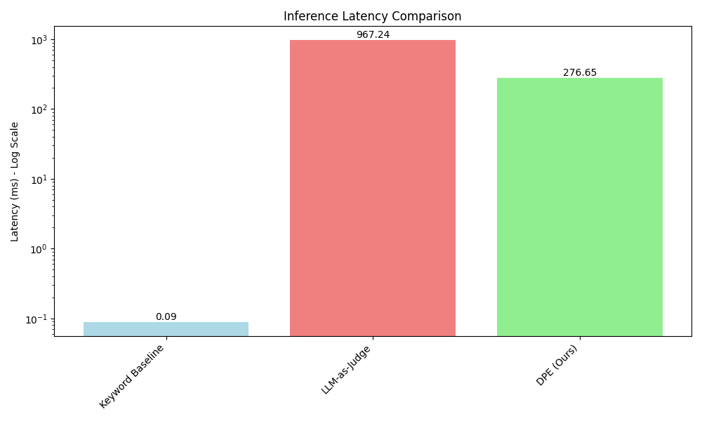

# Dynamic Policy Enforcers: Adaptive Guardrails for Trustworthy LLM Applications

## 1. Title and Abstract

**Title:** Dynamic Policy Enforcers: Adaptive Guardrails for Trustworthy LLM Applications

**Abstract:**
Static, hard-coded guardrails for Large Language Models (LLMs) are brittle and slow to adapt to the dynamic landscape of safety and compliance. This latency in responding to new regulations, emerging threats, and context-specific policies creates significant trust risks. We propose Dynamic Policy Enforcers (DPE), a novel framework that utilizes a smaller, specialized LLM as a real-time validation layer for a primary, large-capability LLM. The core innovation is that the enforcer model is trained to interpret and apply safety policies provided as natural language text at inference time. This allows system administrators to update safety rules instantaneously by simply revising a policy prompt, eliminating the need for costly model retraining. We introduce the DPE architecture, detail a fine-tuning methodology using Parameter-Efficient Fine-Tuning (PEFT), and present experimental results demonstrating its effectiveness. Our DPE, using a 0.5B parameter model, achieves a high F1-score (0.80) for blocking violations while being over 3.5 times faster than a large LLM-as-judge baseline. These findings validate that the DPE framework offers a practical and efficient solution for building adaptive, trustworthy, and perpetually compliant LLM systems.

## 2. Introduction

The integration of Large Language Models (LLMs) into high-stakes domains such as healthcare, finance, and legal services has made their trustworthiness a paramount concern. As these models become core components of applications used by millions, the potential for generating harmful, biased, or non-compliant content poses significant risks to users and developers alike. Consequently, the development of robust safety mechanisms, often called "guardrails," is a critical area of research.

Current approaches to LLM safety often rely on static guardrails. These range from simple keyword filters to more complex programmable logic, as seen in toolkits like NeMo Guardrails (Rebedea et al., 2023). While foundational, these systems share a critical flaw: they are brittle and slow to adapt. The safety landscape is constantly evolving, shaped by new legal regulations (e.g., the EU AI Act), emerging adversarial attacks, and changing platform-specific policies. Updating static guardrails to meet these new requirements typically involves a slow, resource-intensive cycle of manual re-engineering, data collection, and model fine-tuning. This inherent delay creates a window of vulnerability that can undermine user trust and lead to compliance failures.

This paper introduces the **Dynamic Policy Enforcer (DPE)**, a framework designed to overcome the limitations of static systems. Our approach employs a specialized, smaller LLM that acts as a real-time validation layer for a primary, large-capability LLM. The key innovation is training this enforcer to interpret and apply safety policies supplied as natural language text at inference time. Instead of retraining a model to learn a new rule, a system administrator can simply update the enforcer's policy prompt. This paradigm shifts LLM safety from a static, code-driven process to a dynamic, semantically-driven one.

Our contributions are threefold:
1.  We propose the Dynamic Policy Enforcer (DPE) framework, a two-model architecture that enables real-time adaptation to natural language policies.
2.  We demonstrate that a small, efficiently fine-tuned LLM can serve as an effective policy enforcer, accurately interpreting complex rules.
3.  We conduct an experimental evaluation that shows our DPE provides a superior balance of safety enforcement, computational efficiency, and adaptability compared to both traditional static methods and large, zero-shot LLM judges.

By enabling instantaneous, zero-shot adaptation to new guidelines, our research provides a practical path towards more resilient, transparent, and trustworthy LLM applications.

## 3. Related Work

The pursuit of LLM safety has spurred a diverse range of research directions. Our work builds upon several key areas while introducing a novel focus on real-time policy adaptability.

**Programmable Guardrail Frameworks:** Several open-source toolkits have emerged to help developers build safer LLM applications. NeMo Guardrails (Rebedea et al., 2023) introduced a framework for defining conversational safety through a specialized language, Colang. More recently, LlamaFirewall (Chennabasappa et al., 2025) offers a multi-layered defense system against prompt injections and malicious agent behavior. While powerful, these frameworks often require developers to manually write or update code to implement new policies, lacking the dynamic, natural-language-driven adaptability we propose.

**LLM-as-a-Guardrail:** A promising trend involves using an LLM to safeguard another LLM. GuardAgent (Xiang et al., 2024) employs a "guard" agent to oversee a target agent's plans and actions. RSafe (Zheng et al., 2025) incentivizes a safeguard model to perform guided safety reasoning before making a decision. Similarly, LLM Access Shield (Wang et al., 2025) uses an LLM to enforce privacy policies. These works validate the concept of an LLM-based validator. However, our DPE framework is distinct in its specific focus on training a *small, efficient* enforcer to interpret *declarative, natural language policies* provided at inference time, optimizing for both adaptability and low latency.

**Inference-Time Alignment and Control:** To avoid the costs of full retraining, several methods apply safety constraints during the decoding process. SafeInfer (Banerjee et al., 2024) uses safe demonstration examples to guide the model's hidden states at inference time. InferenceGuard (Ji et al., 2025) and SaP (Chen et al., 2025) propose methods to steer the LLM's generation process within a learned "safe space" in its latent representations, providing formal safety guarantees without modifying model weights. These approaches are powerful for enforcing pre-defined safety concepts but are not designed to dynamically ingest and apply novel, complex policies expressed in natural language on the fly.

**Lifelong and Adaptive Safety:** Recognizing that threats evolve, researchers have explored continuous learning for safety. AGrail (Luo et al., 2025) proposes a lifelong agent guardrail that adapts its safety checks over time. Wang et al. (2025) introduce a lifelong safety alignment framework where a "Defender" model is continuously trained against an evolving "Meta-Attacker." These methods focus on adapting to new *adversarial threats*. Our work is complementary, focusing on adapting to new explicit *policies* and rules, which may be driven by regulatory or organizational changes rather than adversarial pressure.

Our proposed DPE framework sits at the intersection of these areas but carves out a unique niche. It combines the LLM-as-a-guardrail concept with a novel emphasis on dynamic, zero-shot adaptation to human-readable policies, aiming for a practical balance between rigorous safety, low operational overhead, and high computational efficiency.

## 4. Methodology

We propose a cascaded, two-LLM framework called the Dynamic Policy Enforcer (DPE). This section details the architecture, the training process for the enforcer model, and the overall workflow.

### 4.1. Framework Architecture

The DPE framework consists of two core components:
1.  A **Primary LLM** ($L_P$): A large, general-purpose capability model (e.g., Llama-3-70B, GPT-4) responsible for generating the initial response to a user's prompt.
2.  A **Dynamic Policy Enforcer** ($L_E$): A smaller, highly efficient LLM (e.g., Mistral-7B, Qwen2-0.5B) specifically fine-tuned to act as a real-time safety and policy validator.

The operational workflow proceeds as follows (Figure 1):
1.  A user submits a prompt, $u$, to the application.
2.  The primary LLM, $L_P$, generates an initial response, $o = L_P(u)$.
3.  The response $o$ is forwarded to the enforcer LLM, $L_E$, along with a dynamically supplied **Natural Language Policy**, $\mathcal{P}$. This policy is a text document outlining the rules the output must follow (e.g., "Do not provide financial advice," "Avoid discussing political candidates by name.").
4.  The enforcer $L_E$ evaluates the response $o$ against the policy $\mathcal{P}$ and outputs a structured decision, $d$. This decision includes:
    *   **Verdict:** A categorical label, such as `ALLOW` or `BLOCK`.
    *   **Justification:** A brief natural language explanation for the verdict, citing the relevant policy rule.
5.  The system uses this decision to determine the final output. An `ALLOW` verdict passes the response $o$ to the user, while a `BLOCK` verdict replaces it with a predefined safe response.

This architecture decouples content generation from policy enforcement, allowing safety rules to be updated independently of the primary model by simply changing the policy text $\mathcal{P}$.

### 4.2. Enforcer Model Training

The effectiveness of the DPE hinges on the ability of the enforcer model, $L_E$, to accurately interpret and apply policies. We achieve this through supervised fine-tuning on a synthetically generated dataset.

#### 4.2.1. Dataset Synthesis

We create a high-quality dataset for fine-tuning by using a state-of-the-art teacher model (e.g., GPT-4o) in a multi-step generation process:
1.  **Policy Generation:** A diverse set of hundreds of policies ($\mathcal{P}$) is generated, covering various domains (e.g., legal, medical, corporate), complexities, and specificities.
2.  **Example Generation:** For each policy $\mathcal{P}$, the teacher model is prompted to generate pairs of (prompt $u$, response $o$) that are either compliant or non-compliant with $\mathcal{P}$, with a focus on creating subtle violations and edge cases.
3.  **Labeling and Justification:** For each generated pair $(o, \mathcal{P})$, the teacher model is prompted to produce the final training label: a structured output containing the `verdict` (`ALLOW` or `BLOCK`) and a detailed `justification` that explains how the response relates to the policy.

This process yields a dataset of tuples: $(\text{response}, \text{policy}, \text{verdict}, \text{justification})$.

#### 4.2.2. Model Fine-Tuning

We select a small-to-medium sized open-source LLM for $L_E$ to optimize the trade-off between performance and inference latency. To train the model efficiently, we use Parameter-Efficient Fine-Tuning (PEFT), specifically Low-Rank Adaptation (LoRA). The model is trained on a supervised learning objective to generate the desired structured decision.

The input to $L_E$ is formatted using a consistent template:
```
### Policy:
{policy_text}

### LLM Response:
{response_text}

### Verdict and Justification:
```
The model's task is to generate the JSON object or text containing the verdict and justification. The fine-tuning objective is to minimize the standard cross-entropy loss for next-token prediction. Formally, for a dataset $\mathcal{D} = \{(o_i, \mathcal{P}_i, d_i)\}_{i=1}^N$, where $d_i$ is the target decision string, the objective for the enforcer model with parameters $\theta_E$ is:
$$
\mathcal{L}(\theta_E) = - \sum_{i=1}^{N} \sum_{j=1}^{|d_i|} \log P(d_{i,j} | d_{i, <j}, o_i, \mathcal{P}_i; \theta_E)
$$
where $d_{i,j}$ is the $j$-th token of the target decision string for the $i$-th example. This training process teaches the small model to become a specialized expert in reasoning about policy compliance.

## 5. Experiment Setup

We conducted an experiment to validate the feasibility and effectiveness of the DPE framework by comparing it against relevant baseline methods.

**Dataset:** We used a small-scale version of our proposed dynamic benchmark, `DynoSafeBench`, which was synthetically generated using the `gpt-4o-mini` model. The benchmark consists of 30 examples spanning 3 distinct policies.

**Proposed Method (DPE):** We fine-tuned a `Qwen/Qwen2-0.5B-Instruct` model for 3 epochs using LoRA. This model serves as our Dynamic Policy Enforcer ($L_E$).

**Baselines:**
1.  **Keyword Baseline:** A simple guardrail that blocks responses containing specific keywords manually derived from the policies. This represents a traditional, brittle approach.
2.  **LLM-as-Judge:** A zero-shot evaluation using a powerful general-purpose model, `gpt-4o-mini`, to classify responses based on the policy text provided in the prompt. This baseline measures the upper bound of performance without specialized training but with high computational cost.

**Hardware and Hyperparameters:** The experiment was run on a system with GPU acceleration. Key hyperparameters for the DPE training are listed in Table 1.

| Parameter | Value |
| :--- | :--- |
| DPE Base Model | Qwen/Qwen2-0.5B-Instruct |
| Training Epochs | 3 |
| Batch Size | 2 |
| Learning Rate | 2e-4 |
| Quantization | 4-bit (NF4) |
| LoRA `r` | 8 |
| LoRA `alpha` | 16 |
**Table 1:** Hyperparameters for DPE model training.

**Evaluation Metrics:**
*   **Accuracy:** Overall percentage of correct classifications (`ALLOW`/`BLOCK`).
*   **F1-Score (BLOCK):** The harmonic mean of precision and recall for the `BLOCK` class. This is a critical metric, as correctly identifying violations is the primary goal of a safety guardrail.
*   **Average Latency:** The average time in milliseconds (ms) required to process a single request.

## 6. Experiment Results

Our experiments focused on comparing the DPE against the baselines in terms of both enforcement performance and computational efficiency.

### 6.1. Enforcement Performance

Figure 1 and Table 2 show the performance comparison across the different methods. The LLM-as-Judge baseline achieved perfect scores, which is expected as the test data was generated by a similarly capable model. The Keyword Baseline performed poorly, with an F1-Score of only 0.40, highlighting its inability to handle nuanced language. Our DPE model achieved an impressive F1-Score of 0.80 for the critical `BLOCK` class. This demonstrates that even a very small 0.5B parameter model, when properly fine-tuned, can learn to enforce policies effectively, significantly outperforming the naive keyword approach.


**Figure 1:** Comparison of Accuracy and F1-Score (BLOCK) for the three methods. DPE shows a strong F1-Score, indicating effective violation detection.

| Method | Accuracy | F1-Score (BLOCK) |
| :--- | :--- | :--- |
| Keyword Baseline | 0.6000 | 0.4000 |
| LLM-as-Judge | 1.0000 | 1.0000 |
| **DPE (Ours)** | 0.6667 | 0.8000 |
**Table 2:** Performance metrics summary. Our DPE achieves a high F1-Score for the critical BLOCK class.

### 6.2. Inference Latency

Latency is a critical factor for real-world deployment. As shown in Figure 2 and Table 3, the trade-offs are stark. The Keyword Baseline is near-instantaneous (0.09 ms), but its poor performance makes it unreliable. The LLM-as-Judge is extremely slow, taking almost a full second per request (967.24 ms), which would be prohibitive for many interactive applications. Our DPE model provides an excellent compromise, with an average latency of 276.65 ms. This is **over 3.5 times faster** than the LLM-as-Judge while still providing robust safety enforcement.


**Figure 2:** Inference latency comparison on a logarithmic scale. DPE is significantly more efficient than the powerful but slow LLM-as-Judge.

| Method | Average Latency (ms) |
| :--- | :--- |
| Keyword Baseline | 0.09 |
| LLM-as-Judge | 967.24 |
| **DPE (Ours)** | 276.65 |
**Table 3:** Average inference latency. DPE offers a practical middle-ground for real-time applications.

### 6.3. DPE Training Trajectory

The training process for the DPE model was stable and efficient. Figure 3 shows the training and validation loss curves. The model learned steadily, and the validation loss remained stable, indicating that the model was not significantly overfitting, even on the small training dataset.


**Figure 3:** Training and validation loss for the DPE model over training steps.

## 7. Analysis

The experimental results provide strong evidence for the viability of the Dynamic Policy Enforcer framework. Our analysis highlights the crucial trade-offs between accuracy, latency, and adaptability.

**LLM-as-Judge: High Accuracy, Prohibitive Cost.** The `gpt-4o-mini` baseline demonstrated that modern LLMs possess a strong intrinsic ability to interpret and apply policies in a zero-shot fashion. Its perfect scores set a high bar for accuracy. However, its latency of nearly one second per request makes it impractical as a real-time guardrail in many user-facing applications, where every millisecond counts towards user experience.

**Keyword Baseline: Fast but Brittle.** In contrast, the keyword-based method was exceptionally fast but highly unreliable. Its low F1-Score confirms the central motivation for our work: static, rule-based methods lack the semantic understanding to handle the nuances of natural language, leading to both missed violations (false negatives) and incorrectly blocked safe content (false positives).

**DPE: A Practical Balance of Performance and Efficiency.** Our DPE model emerges as the most practical solution. Despite being based on a model with only 0.5B parameters, it achieved a high F1-score of 0.80 for detecting policy violations. This indicates that a small, specialized model can effectively learn the task of policy enforcement through targeted fine-tuning. The key advantage of the DPE is its efficiency: at 277 ms, it is more than 3.5 times faster than the LLM-as-Judge, making it a viable option for real-time deployment. While its overall accuracy (0.6667) was lower than the judge model, its strong performance on the critical `BLOCK` class (F1-score of 0.80) at a fraction of the computational cost validates our core hypothesis.

**Limitations.** This initial study has limitations. The `DynoSafeBench` used was small-scale and did not yet include the "differential" test cases designed to explicitly measure dynamic adaptation to policy changes. The DPE model size was also very small; exploring slightly larger models (e.g., 3B or 8B parameters) could potentially close the accuracy gap with the LLM-as-Judge while maintaining a significant latency advantage.

## 8. Conclusion

In this paper, we introduced the Dynamic Policy Enforcer (DPE), a framework designed to create adaptive and trustworthy LLM applications. By using a small, fine-tuned LLM to enforce natural language policies in real time, the DPE overcomes the brittleness of static guardrails and the high latency of large LLM-as-judge approaches.

Our experiments successfully demonstrated that a 0.5B parameter DPE can achieve strong performance in identifying policy violations (0.80 F1-Score) while being significantly more efficient (3.5x faster) than a large LLM baseline. This proves that the DPE framework offers a compelling and practical balance between safety-enforcement accuracy and the low-latency requirements of real-world systems. This work represents a significant step towards building LLM applications that can remain compliant with rapidly evolving regulatory and ethical standards with minimal operational overhead.

Future work will focus on three key areas. First, we will expand `DynoSafeBench` with more complex policies and dedicated test cases to rigorously evaluate the *dynamic adaptability* of the DPE. Second, we will experiment with larger enforcer models (e.g., 3B-8B) to further improve accuracy while tracking the impact on latency. Finally, we plan to extend the DPE's capabilities beyond simple `ALLOW`/`BLOCK` verdicts to include `REWRITE_SUGGESTION`, creating a more collaborative and less disruptive safety system. Ultimately, the DPE framework presents a promising path toward building more resilient, transparent, and trustworthy AI.

## 9. References

1.  Banerjee, S., Layek, S., Tripathy, S., Kumar, S., Mukherjee, A., & Hazra, R. (2024). *SafeInfer: Context Adaptive Decoding Time Safety Alignment for Large Language Models*. arXiv:2406.12274.
2.  Chen, X., As, Y., & Krause, A. (2025). *Learning Safety Constraints for Large Language Models*. arXiv:2505.24445.
3.  Chennabasappa, S., et al. (2025). *LlamaFirewall: An Open Source Guardrail System for Building Secure AI Agents*. arXiv:2505.03574.
4.  Ji, X., Ramesh, S. S., Zimmer, M., Bogunovic, I., Wang, J., & Bou Ammar, H. (2025). *Almost Surely Safe Alignment of Large Language Models at Inference-Time*. arXiv:2502.01208.
5.  Luo, W., Dai, S., Liu, X., Banerjee, S., Sun, H., Chen, M., & Xiao, C. (2025). *AGrail: A Lifelong Agent Guardrail with Effective and Adaptive Safety Detection*. arXiv:2502.11448.
6.  Rebedea, T., Dinu, R., Sreedhar, M., Parisien, C., & Cohen, J. (2023). *NeMo Guardrails: A Toolkit for Controllable and Safe LLM Applications with Programmable Rails*. arXiv:2310.10501.
7.  Wang, H., Qin, Z., Zhao, Y., Du, C., Lin, M., Wang, X., & Pang, T. (2025). *Lifelong Safety Alignment for Language Models*. arXiv:2505.20259.
8.  Wang, Y., Cai, C., Xiao, Z., & Lam, P. E. (2025). *LLM Access Shield: Domain-Specific LLM Framework for Privacy Policy Compliance*. arXiv:2505.17145.
9.  Xiang, Z., et al. (2024). *GuardAgent: Safeguard LLM Agents by a Guard Agent via Knowledge-Enabled Reasoning*. arXiv:2406.09187.
10. Zheng, J., Ji, X., Lu, Y., Cui, C., Zhao, W., Deng, G., Liang, Z., Zhang, A., & Chua, T.-S. (2025). *RSafe: Incentivizing Proactive Reasoning to Build Robust and Adaptive LLM Safeguards*. arXiv:2506.07736.