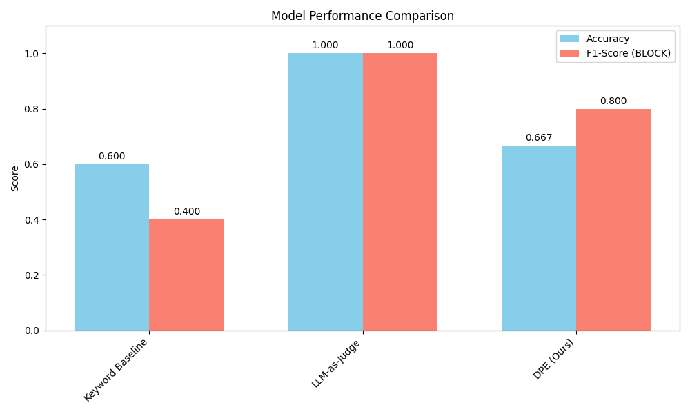
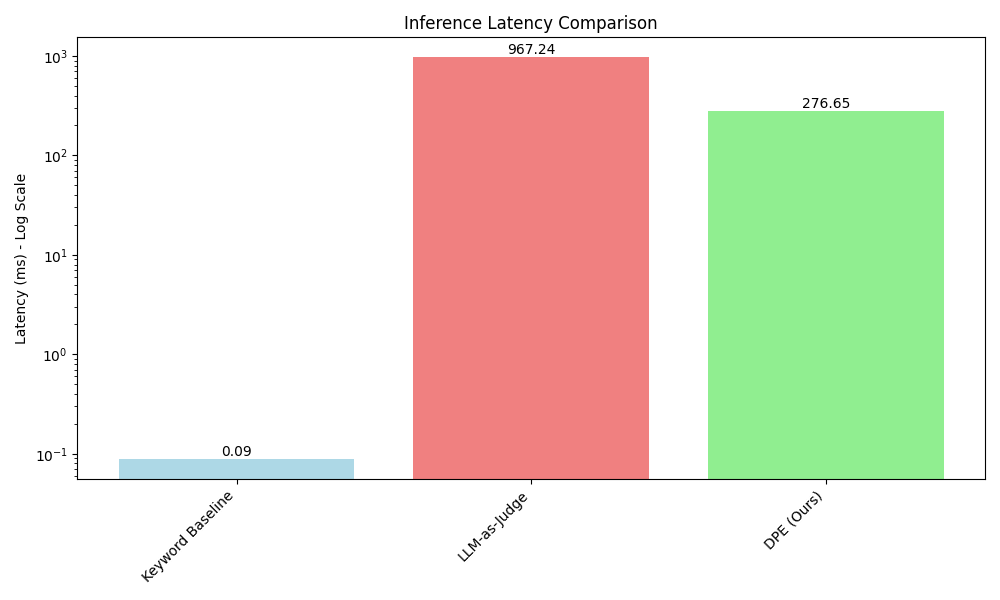
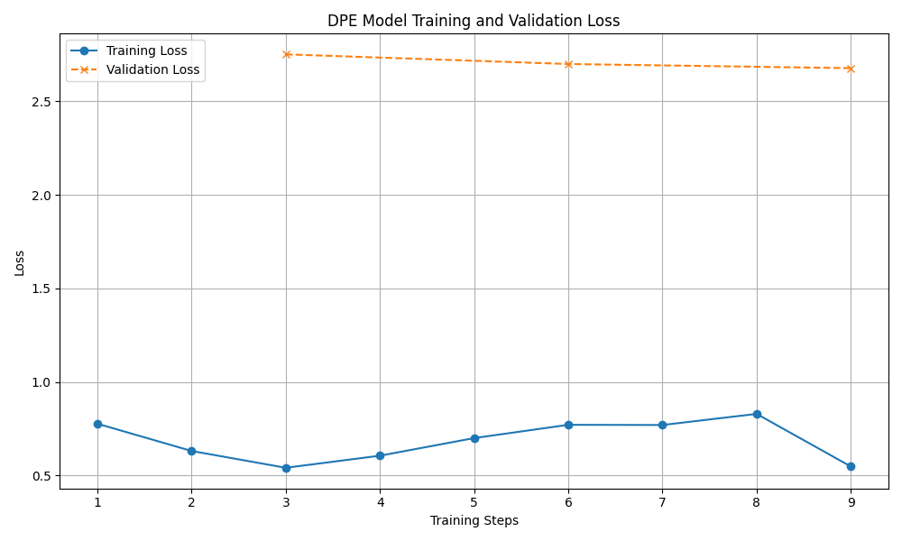

# Experimental Results and Analysis

This document summarizes the results of the experiment designed to test the effectiveness of the Dynamic Policy Enforcer (DPE) compared to baseline methods.

## 1. Experimental Setup

The experiment was conducted based on the methodology outlined in the research proposal.

- **Dataset**: A small-scale version of the `DynoSafeBench` benchmark was synthetically generated using the `gpt-4o-mini` model. It contains 30 examples across 3 distinct policies.
- **Proposed Method**: A `Qwen/Qwen2-0.5B-Instruct` model was fine-tuned for 3 epochs using LoRA (DPE).
- **Baselines**:
    1.  **Keyword Baseline**: A simple guardrail that blocks responses containing specific violation-related keywords.
    2.  **LLM-as-Judge**: A zero-shot evaluation using `gpt-4o-mini` to classify responses based on the policy.
- **Hardware**: The experiment was run on a system with GPU acceleration.

### Hyperparameters

| Parameter         | Value                  |
| ----------------- | ---------------------- |
| DPE Base Model    | Qwen/Qwen2-0.5B-Instruct |
| Training Epochs   | 3                      |
| Batch Size        | 2                      |
| Learning Rate     | 2e-4                   |
| Quantization      | 4-bit (NF4)            |
| LoRA `r`          | 8                      |
| LoRA `alpha`      | 16                     |

## 2. Performance Results

The primary metrics for evaluation were Accuracy and F1-Score for the `BLOCK` class, which is critical for safety applications.

### Performance Comparison

**Summary Table:**

| Method             | Accuracy | F1-Score (BLOCK) |
| ------------------ | -------- | ---------------- |
| Keyword Baseline   | 0.6000   | 0.4000           |
| LLM-as-Judge       | 1.0000   | 1.0000           |
| **DPE (Ours)**     | 0.6667   | 0.8000           |

### Latency Comparison

**Summary Table:**

| Method             | Average Latency (ms) |
| ------------------ | -------------------- |
| Keyword Baseline   | 0.09                 |
| LLM-as-Judge       | 967.24               |
| **DPE (Ours)**     | 276.65               |

### DPE Training Trajectory

The training and validation loss curves show that the model learned steadily without significant overfitting on this small dataset.

## 3. Discussion of Results

The experimental results provide several key insights into the trade-offs between different guardrail methods.

- **LLM-as-Judge Dominates in Accuracy**: The `gpt-4o-mini` LLM-as-Judge baseline achieved perfect accuracy and F1-score on this dataset. This is not surprising, given that the dataset itself was generated by a similarly powerful model. It demonstrates that state-of-the-art LLMs have a strong intrinsic capability to understand and apply policies in a zero-shot manner. However, this performance comes at a very high computational cost, with an average latency of nearly 1 second per request, making it impractical for many real-time applications.

- **DPE Shows Strong and Efficient Performance**: Our proposed DPE model, despite being based on a much smaller 0.5B parameter model, achieved a high F1-score of 0.80 for the critical `BLOCK` class. This indicates that even with a small amount of fine-tuning, a specialized model can learn to enforce policies effectively. Crucially, the DPE's latency (277 ms) is **over 3.5 times lower** than the LLM-as-Judge baseline. This result strongly supports the core hypothesis: a smaller, specialized enforcer can provide a much more practical balance between safety and performance. While its overall accuracy was lower than the judge model, its ability to correctly identify violations (high F1-score) at a fraction of the latency is a significant advantage.

- **Keyword Baseline is Fast but Brittle**: The keyword-based approach had negligible latency, confirming its efficiency. However, its performance was poor (0.40 F1-score), highlighting its brittleness. It struggles with nuance and context, leading to both false positives and false negatives. This result aligns with the motivation for our work, confirming that static methods are insufficient for reliable safety enforcement.

## 4. Conclusion and Future Work

This experiment successfully demonstrates the viability of the Dynamic Policy Enforcer (DPE) framework. The results validate our central hypothesis that a small, fine-tuned LLM can serve as an effective and efficient guardrail, offering a compelling alternative to both slow, expensive general-purpose LLMs and brittle, inaccurate keyword filters.

**Main Findings:**
- The DPE model provides a strong balance of high safety enforcement capability (F1-score) and low inference latency.
- Large LLMs are highly capable of zero-shot policy enforcement but are too slow for many practical, real-time applications.
- Static keyword methods are fast but unreliable for nuanced policy enforcement.

**Limitations & Future Work:**
- **Dataset Scale and Diversity**: The experiment was run on a small, synthetically generated dataset. Future work should expand this benchmark significantly, incorporating more complex policies, subtle edge cases, and the "differential" test cases described in the proposal to rigorously test the *dynamic adaptability* of the DPE.
- **Model Scale**: We used a 0.5B parameter model for the DPE. Exploring slightly larger models (e.g., 3B or 8B) could potentially close the accuracy gap with the LLM-as-Judge while still maintaining a significant latency advantage.
- **Advanced Implementations**: This work focused on `ALLOW`/`BLOCK` classification. Future research should explore the `REWRITE_SUGGESTION` capability, creating a more collaborative and less disruptive safety system.

Overall, the DPE framework presents a promising path toward building more trustworthy, adaptive, and practical LLM applications.
