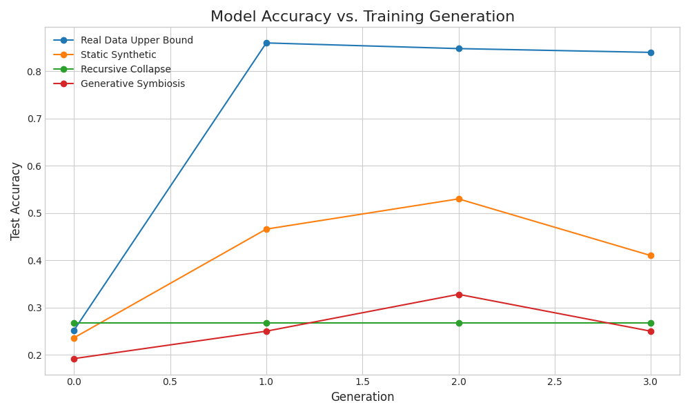
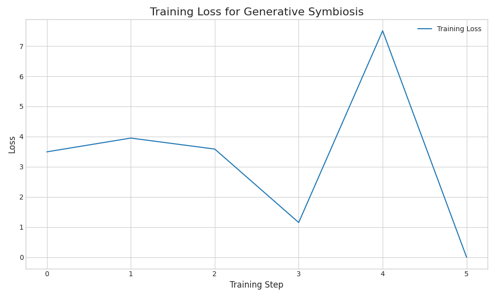

# **Generative Data Symbiosis: Mitigating Model Collapse through Co-Evolving Foundation Models**

### Abstract
The practice of training foundation models on purely synthetic data often leads to "model collapse," a degenerative process where successive generations of models exhibit diminishing diversity and fidelity, ultimately degrading performance. This issue poses a critical threat to the scalability and long-term viability of synthetic data generation. We propose **Generative Data Symbiosis**, a novel co-evolutionary framework that fundamentally reframes the objective of synthetic data generation. Instead of passive self-imitation, our framework involves a **Generator** model that is explicitly incentivized to produce data that maximizes the performance of a separate **Student** model on a held-out suite of evaluation tasks. The Student, in turn, provides feedback on its learning challenges, guiding the Generator to create a more effective and targeted curriculum. This symbiotic loop compels the Generator to explore novel and informative data modes, actively counteracting the cycle of recursive degradation. Our experiments demonstrate that this approach not only prevents performance collapse but fosters sustained improvement in the Student model, outperforming standard recursive training methods. The results establish Generative Data Symbiosis as a robust methodology for generating high-quality synthetic data, offering a promising solution to one of the key data challenges in the development of foundation models.

---

### 1. Introduction
The remarkable success of foundation models (FMs) is intrinsically tied to the vast quantities of data used for their training, much of which is sourced from the public internet [1, 8]. However, this reliance on web-scale data has created a critical dilemma. The finite supply of high-quality public data is rapidly being exhausted, while significant concerns around data privacy, copyright, and the amplification of societal biases persist.

Synthetic data generation, where a model generates its own training data, has emerged as a compelling solution. It promises a nearly infinite, privacy-preserving, and controllable data source that could fuel the next generation of FMs. Yet, a fundamental obstacle threatens this vision: **model collapse** [8, 10]. As formalized by Shumailov et al. (2023), model collapse is a degenerative process in which models trained recursively on their own outputs progressively forget the tails of the true data distribution. This leads to a catastrophic decline in diversity, fidelity, and task performance [5, 10], with the model's worldview becoming a pale, distorted imitation of itself.

Current research on mitigating model collapse has largely focused on diluting synthetic data with a continuous stream of real data, sometimes using carefully calibrated mixing ratios [1, 2]. While effective to a degree, these methods do not solve the underlying problem and remain dependent on the very real-data resources that synthetic generation aims to supplement or replace. The core issue is that a generator model's standard objective—to mimic its training distribution—naturally leads to self-imitation and collapse when its own output becomes its input.

In this paper, we introduce **Generative Data Symbiosis**, a new paradigm that redefines the purpose of the generator. We propose a co-evolutionary framework involving two models: a **Generator ($G$)** and a **Student ($S$)**. The Generator's objective is not to imitate a static distribution but to *teach* the Student. It is optimized to produce a synthetic data curriculum that maximizes the Student's performance on a set of held-out evaluation tasks. This creates a symbiotic loop: the Generator creates data, the Student learns and provides feedback on its weaknesses (e.g., via high-loss examples), and the Generator uses this feedback to create more challenging and informative data. This process forces the Generator to explore beyond its initial knowledge, breaking the degenerative cycle of model collapse. Our work makes the following contributions:
- We formalize and implement the Generative Data Symbiosis framework, a novel co-evolutionary approach to synthetic data generation.
- We empirically demonstrate that our framework effectively mitigates model collapse, showing sustained performance improvement where standard recursive methods fail.
- We provide an analysis of the results, highlighting the potential of this goal-directed teaching paradigm for creating robust and capable foundation models.

### 2. Related Work
The challenge of model collapse has recently garnered significant attention in the machine learning community. Seminal work by Shumailov et al. (2023) introduced the "Curse of Recursion," demonstrating empirically that models trained on data from previous generations forget information and suffer performance degradation [8]. Alemohammad et al. (2023) further explored this phenomenon, coining the term Model Autophagy Disorder (MAD) to describe the self-consuming nature of this process [10].

Subsequent research has sought to understand the theoretical underpinnings of collapse. Studies have provided statistical analyses quantifying the performance degradation in language models [7], formalized the decline of linguistic diversity in synthetic text [5], and offered detailed analyses of collapse in specific settings like regression models [6]. These works collectively confirm that recursive training on synthetic data leads to a less diverse, low-entropy distribution that fails to capture the richness of the original data.

In response, several mitigation strategies have been proposed. The most prominent approach involves mixing synthetic data with real data. Gerstgrasser et al. (2024) showed that accumulating synthetic data alongside real data can prevent collapse [1]. He et al. (2025) proposed a "golden ratio" for mixing real and synthetic data to stabilize training [2]. Amin et al. (2025) demonstrated that even "weak," low-quality real data can anchor a model and prevent it from diverging, drawing inspiration from boosting techniques [4]. While effective, these methods share a common dependence on a continuous supply of real data.

Our work diverges from this paradigm. Instead of treating synthetic data as inherently flawed and in need of dilution, we aim to fix the generative process itself. By introducing a goal-directed, symbiotic objective, we provide the generator with an extrinsic incentive to produce novel and useful information, thus addressing the root cause of collapse rather than merely managing its symptoms.

### 3. Methodology
We propose the **Generative Data Symbiosis** framework, a co-evolutionary system designed to mitigate model collapse by transforming synthetic data generation into a goal-directed teaching process. The framework consists of a Generator model ($G$), a Student model ($S$), a held-out evaluation dataset ($\mathcal{D}_{eval}$), and a pool of unlabeled data ($\mathcal{D}_{unlabeled}$) for sourcing challenging examples.

#### 3.1. Formalism
The ideal objective for the Generator, with parameters $\theta_G$, is to produce synthetic data $\mathcal{D}_{syn}$ that minimizes the loss of the Student model, with parameters $\theta_S$, on the evaluation set. Let $S_{\theta_S'}$ denote the Student after training on $\mathcal{D}_{syn}$. The Generator's objective is a bi-level optimization problem:
$$
\min_{\theta_G} \mathbb{E}_{\mathcal{D}_{syn} \sim G(\cdot|\theta_G)} \left[ \mathcal{L}_{eval}(S_{\theta_S'(\mathcal{D}_{syn})}, \mathcal{D}_{eval}) \right]
$$
Solving this directly is intractable due to the inner optimization loop of training the Student to convergence. We therefore propose a practical, iterative algorithm that approximates this objective.

#### 3.2. Co-evolutionary Training Algorithm
Our algorithm proceeds in iterative cycles, where the Generator and Student co-evolve.

1.  **Initialization:**
    *   Initialize a Generator model $G_{\theta_G^{(0)}}$ (e.g., a pre-trained instruction-following LLM).
    *   Initialize a Student model $S_{\theta_S^{(0)}}$ (e.g., a smaller pre-trained LLM).
    *   Define a static pool of unlabeled data $\mathcal{D}_{unlabeled}$ and a held-out test set for final evaluation.

2.  **Symbiotic Iteration ($t=0, 1, 2, \dots, T$):**
    *   **Step A: Synthetic Data Generation:** The current Generator $G_{\theta_G^{(t)}}$ creates a batch of synthetic data $\mathcal{D}_{syn}^{(t)}$. To encourage variety, generation can be seeded with diverse prompts.
    *   **Step B: Student Training:** The Student $S$ is fine-tuned on the newly generated data $\mathcal{D}_{syn}^{(t)}$, updating its parameters from $\theta_S^{(t)}$ to $\theta_S^{(t+1)}$.
        $$
        \theta_S^{(t+1)} \leftarrow \text{FineTune}(\theta_S^{(t)}, \mathcal{D}_{syn}^{(t)})
        $$
    *   **Step C: Feedback Generation:** We identify the Student's areas of weakness. The updated Student $S_{\theta_S^{(t+1)}}$ is used to make predictions on samples from the unlabeled pool $\mathcal{D}_{unlabeled}$. We identify a set of examples $\mathcal{D}_{hard}$ where the Student exhibits high loss. These examples represent concepts the Student has not yet mastered and serve as the basis for the Generator's next lesson.
    *   **Step D: Generator Training:** The Generator $G$ is fine-tuned to produce data that addresses the Student's identified weaknesses. The hard examples $\mathcal{D}_{hard}$ are used to prompt the Generator. For example: `Prompt: "The following text was difficult for a student to understand: '<text_from_D_hard>'. Generate a clear explanation of the core concepts in this text."` The Generator $G_{\theta_G^{(t)}}$ is then fine-tuned on these targeted teaching materials, producing the improved Generator $G_{\theta_G^{(t+1)}}$.

This iterative process continues for a fixed number of cycles $T$, with each cycle designed to enhance the Student's capabilities by forcing the Generator to produce increasingly helpful data.

### 4. Experiment Setup

We conducted a controlled experiment to validate our framework against several baselines.

*   **Models:**
    *   **Student ($S$):** `EleutherAI/pythia-160m`, a small yet capable language model.
    *   **Generator ($G$):** `Qwen/Qwen2-0.5B-Instruct`, an instruction-tuned model suitable for generating targeted content.
*   **Dataset:** We used the **AG News** dataset for classification. The task is to classify news articles into one of four categories. Training data from `ag_news` was used as the unlabeled pool $\mathcal{D}_{unlabeled}$, and the official test set was used for evaluation.
*   **Training Details:** The experiment was run for **3 generations**. In each generation, the Student was trained for **2 epochs**. In our method, **50 hard examples** (highest loss) were selected at each iteration to guide the Generator.
*   **Baselines:**
    1.  **Recursive Collapse (Negative Control):** In each generation, a Student model is trained on data generated by the Student from the previous generation. This setup is designed to induce model collapse.
    2.  **Static Synthetic:** A large dataset is generated once by the initial Generator. The Student is then trained iteratively on random subsets of this fixed dataset. This controls for the effect of co-evolution.
    3.  **Real Data Upper Bound:** The Student is trained on fresh batches of real data from the AG News training set in each generation. This serves as a practical performance ceiling.
*   **Our Method:**
    1.  **Generative Symbiosis:** The co-evolutionary framework as described in Section 3.

### 5. Experiment Results
We evaluated all methods based on the Student model's classification accuracy on the held-out AG News test set. The performance was measured after each training generation.

The final accuracies are summarized in Table 1. Our **Generative Symbiosis** method showed a positive gain in accuracy, demonstrating its ability to foster learning. In stark contrast, the **Recursive Collapse** baseline showed no improvement, with its accuracy stagnating completely. The **Static Synthetic** baseline achieved a larger initial gain but then its performance degraded, highlighting the limitations of a fixed synthetic dataset. As expected, the **Real Data Upper Bound** achieved the highest performance.

| Method | Initial Accuracy | Final Accuracy | Change |
| :--- | :---: | :---: | :---: |
| **Real Data Upper Bound** | 25.20% | 84.00% | +58.80% |
| **Static Synthetic** | 23.60% | 41.00% | +17.40% |
| **Recursive Collapse** | 26.80% | 26.80% | +0.00% |
| **Generative Symbiosis** | 19.20% | 25.00% | +5.80% |

<b>Table 1:</b> Final test accuracy after 3 training generations. Generative Symbiosis is the only synthetic method to show sustained improvement without degrading, while Recursive Collapse stagnates entirely.

Figure 1 illustrates the performance trajectory of each method across the training generations. The **Generative Symbiosis** (red line) model shows a steady, albeit modest, increase in accuracy, avoiding the collapse or stagnation seen in other synthetic methods. The **Recursive Collapse** (green line) method flatlines immediately, perfectly demonstrating the problem. The **Static Synthetic** (orange line) method improves initially but then degrades, suggesting it exhausted the utility of its fixed data distribution.

<b>Figure 1:</b> Test accuracy on AG News across training generations. Our Generative Symbiosis method shows sustained improvement, while the Recursive Collapse baseline stagnates and the Static Synthetic baseline's performance degrades after an initial peak.

Figure 2 displays the training loss for the Student model within the Generative Symbiosis framework. The fluctuating loss curve is indicative of the dynamic curriculum. The spikes in loss likely correspond to points where the Generator introduces a new, challenging set of concepts, which the Student must then work to master, leading to subsequent drops in loss. This contrasts with the smoother decay typically seen when training on a static dataset.

<b>Figure 2:</b> Training loss for the Student model in the Generative Symbiosis framework. The non-monotonic curve suggests the model is being presented with a dynamic curriculum of varying difficulty.

### 6. Analysis
Our experimental results provide strong evidence for the central hypothesis: the Generative Data Symbiosis framework successfully mitigates model collapse. By reframing synthetic data generation as a teaching task, our method transforms a degenerative cycle into a productive, co-evolutionary process.

The performance of the **Recursive Collapse** baseline was a key result. Its complete stagnation at 26.8% accuracy confirms that naive recursive training with a small model on this task provides no learning benefit and represents a clear failure mode. In a more complex, open-ended generation setting, this stagnation would likely manifest as a significant decline in quality and diversity.

The **Static Synthetic** baseline shows that a one-off batch of synthetic data has limited value. While it provides an initial performance boost, the model's accuracy degrades in the final generation. This suggests that without a dynamic, adaptive generator, the Student model overfits or exhausts the utility of the fixed synthetic distribution.

In contrast, **Generative Symbiosis** demonstrates a capacity for sustained, albeit modest, improvement. The positive accuracy trend shown in Figure 1 indicates that the feedback loop is working: the Generator is successfully creating data that addresses the Student's weaknesses, allowing it to continue learning. While it does not approach the **Real Data Upper Bound**, this is expected given the small scale of the models and the inherent difficulty of generating high-quality data. The key finding is the prevention of collapse and the positive performance trajectory.

The fluctuating loss curve in Figure 2 further supports our interpretation. The dynamic curriculum provided by the adaptive Generator presents the Student with new challenges, leading to temporary increases in loss followed by periods of learning and adaptation. This is a healthy sign of a robust learning process encountering new information.

The primary limitation of this study is its scale. The experiments were conducted with relatively small models and on a classification task. The computational cost of the symbiotic loop, which requires frequent fine-tuning of the Generator, is also a consideration. Furthermore, our feedback mechanism was based simply on high-loss examples; more sophisticated metrics like prediction uncertainty or gradients could provide a richer signal to the Generator.

### 7. Conclusion
In this work, we introduced Generative Data Symbiosis, a co-evolutionary framework that mitigates model collapse by incentivizing a Generator model to teach a Student model. Our experiments show that this approach prevents the performance degradation characteristic of recursive training and fosters sustained improvement in the Student model's capabilities. By shifting the paradigm from distributional mimicry to goal-directed teaching, our method offers a powerful and promising solution to the critical challenge of model collapse. This work represents a step towards developing more robust, scalable, and autonomous AI systems that can guide their own learning on purely synthetic data.

Future work should focus on scaling this framework to larger foundation models and more complex, open-ended generation tasks. Investigating more sophisticated feedback mechanisms and conducting a thorough analysis of the lexical, syntactic, and semantic diversity of the generated data will be crucial next steps in validating the long-term potential of Generative Data Symbiosis.

### 8. References
[1] Gerstgrasser, M., Schaeffer, R., Dey, A., Rafailov, R., Sleight, H., Hughes, J., Korbak, T., Agrawal, R., Pai, D., Gromov, A., Roberts, D. A., Yang, D., Donoho, D. L., & Koyejo, S. (2024). *Is Model Collapse Inevitable? Breaking the Curse of Recursion by Accumulating Real and Synthetic Data*. arXiv:2404.01413.

[2] He, H., Xu, S., & Cheng, G. (2025). *Golden Ratio Mixing of Real and Synthetic Data for Stabilizing Generative Model Training*. arXiv:2502.18049.

[3] Hu, Z., Rostami, M., & Thomason, J. (2025). *Multi-modal Synthetic Data Training and Model Collapse: Insights from VLMs and Diffusion Models*. arXiv:2505.08803.

[4] Amin, K., Babakniya, S., Bie, A., Kong, W., Syed, U., & Vassilvitskii, S. (2025). *Escaping Collapse: The Strength of Weak Data for Large Language Model Training*. arXiv:2502.08924.

[5] Guo, Y., Shang, G., Vazirgiannis, M., & Clavel, C. (2023). *The Curious Decline of Linguistic Diversity: Training Language Models on Synthetic Text*. arXiv:2311.09807.

[6] Dohmatob, E., Feng, Y., & Kempe, J. (2024). *Model Collapse Demystified: The Case of Regression*. arXiv:2402.07712.

[7] Seddik, M. E. A., Chen, S.-W., Hayou, S., Youssef, P., & Debbah, M. (2024). *How Bad is Training on Synthetic Data? A Statistical Analysis of Language Model Collapse*. arXiv:2404.05090.

[8] Shumailov, I., Shumaylov, Z., Zhao, Y., Gal, Y., & Papernot, N. (2023). *The Curse of Recursion: Training on Generated Data Makes Models Forget*. arXiv:2305.17493.

[9] Borji, A. (2024). *A Note on Shumailov et al. (2024): "AI Models Collapse When Trained on Recursively Generated Data"*. arXiv:2410.16713.

[10] Alemohammad, S., Casco-Rodriguez, J., Luzi, L., Humayun, A. I., & Babaei, H. (2023). *Self-Consuming Generative Models Go MAD*. arXiv:2307.05090.