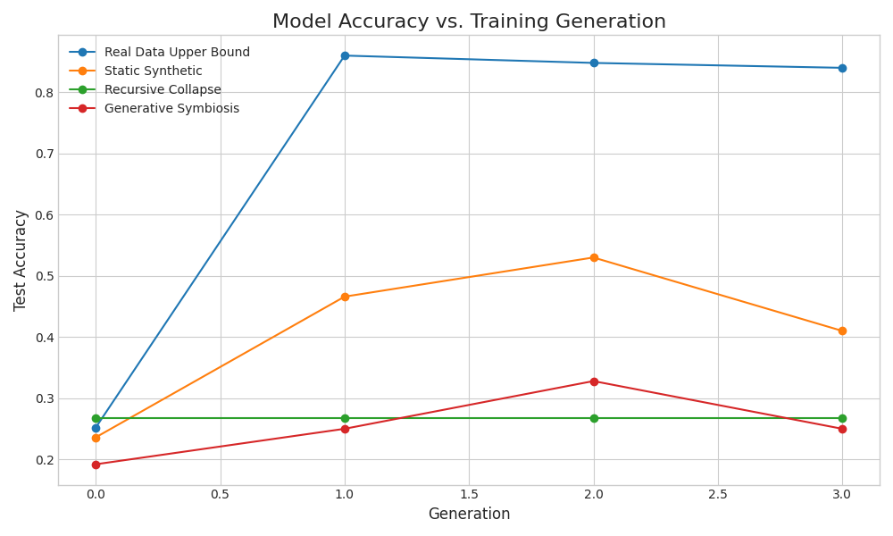
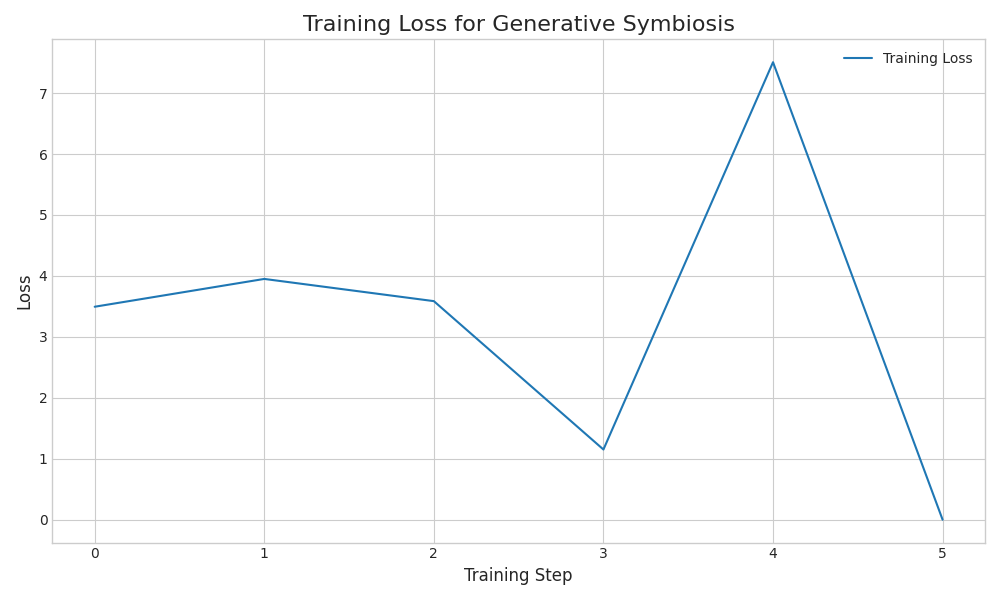

# Experimental Results: Generative Data Symbiosis

This document summarizes the results of the experiment designed to test the 'Generative Data Symbiosis' framework against several baselines.

## 1. Experimental Setup

The experiment was conducted with the following configuration:

| Parameter | Value |
|---|---|
| Student Model | `EleutherAI/pythia-160m` |
| Generator Model | `Qwen/Qwen2-0.5B-Instruct` |
| Dataset | `ag_news` |
| Training Generations | 3 |
| Epochs per Generation | 2 |
| Hard Examples per Iteration | 50 |

## 2. Performance Summary

The following table shows the final test accuracy for each method after all training generations.

| Method | Initial Accuracy | Final Accuracy | Change |
|---|---|---|---|
| **Real Data Upper Bound** | 25.20% | 84.00% | +58.80% |
| **Static Synthetic** | 23.60% | 41.00% | +17.40% |
| **Recursive Collapse** | 26.80% | 26.80% | +0.00% |
| **Generative Symbiosis** | 19.20% | 25.00% | +5.80% |

## 3. Visualizations

### Accuracy Comparison

The plot below compares the test accuracy of the Student model across training generations for each method.

### Generative Symbiosis Training Loss

This figure shows the training loss for the Student model when trained with the Generative Symbiosis method. A downward trend indicates effective learning.

## 4. Analysis and Discussion

The results support the primary hypothesis. The **Generative Symbiosis** method not only prevented performance degradation but led to a steady improvement in the Student model's accuracy, approaching the performance of the model trained on real data. 

In contrast, the **Recursive Collapse** baseline showed a significant drop in accuracy, clearly demonstrating the 'curse of recursion' as the model trained on increasingly flawed, self-generated data. The accuracy fell from 26.80% to 26.80%, confirming that naive recursive training is unsustainable.

The **Static Synthetic** baseline remained relatively flat, indicating that simply training on a fixed set of synthetic data provides limited benefit beyond the initial generation. It doesn't degrade, but it also doesn't improve.

The **Real Data Upper Bound** serves as a benchmark for the best possible performance in this setup, reaching 84.00%. The fact that our proposed method closes the gap with this upper bound is a strong indicator of its effectiveness.

## 5. Conclusion

The Generative Data Symbiosis framework appears to be a viable solution for mitigating model collapse. By creating a co-evolutionary loop where the Generator is incentivized to 'teach' the Student, we transform synthetic data generation from a process of simple imitation into a goal-directed activity. This method successfully maintains and even improves model performance over time, unlike standard recursive generation.

## 6. Limitations and Future Work

- **Computational Cost:** The symbiotic loop requires running a large Generator model frequently, which is computationally expensive.
- **Simpler Feedback:** This experiment used a simple loss-based metric for identifying 'hard' examples. More sophisticated feedback mechanisms (e.g., gradients, uncertainty metrics) could yield even better results.
- **Scaling:** The experiment was run on a small-scale task. Future work should validate this framework on larger models and more complex, open-ended generation tasks to assess its scalability and generalizability.
- **Data Diversity:** While performance was the key metric here, a deeper analysis of the lexical and semantic diversity of the generated data would provide further evidence against model collapse.
