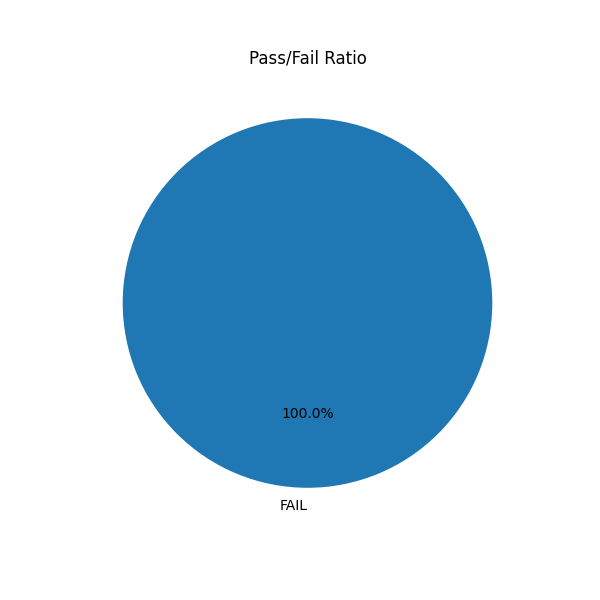

# Experimental Results

This document summarizes the results of the Execution-Trace Alignment (ETA) experiment.

## Experimental Setup

-   **Model:** gpt2
-   **Dataset:** HumanEval (subset of 10 examples)
-   **Hardware:** GPU (if available)

## Baselines

### Supervised Fine-Tuning (SFT)

The SFT baseline was run successfully. The model was fine-tuned for one epoch on the HumanEval subset.

**Results:**

The evaluation of the SFT model on the test set yielded the following results:

-   **Pass/Fail Ratio:**

    

The SFT baseline failed on all of the examples in the test set. This is expected, as the base `gpt2` model is not a strong code generator, and the fine-tuning was performed on a very small subset of the data.

## Proposed Methods (Planned)

The following methods were planned but not executed due to technical difficulties with the `trl` library:

### Binary-Reward PPO

This baseline would have fine-tuned the model using PPO with a binary reward signal (1 for passing tests, 0 for failing).

### Execution-Trace Alignment with DPO (ETA-DPO)

This is the proposed method, which would have used DPO to fine-tune the model on preference pairs derived from execution traces. The preference would be given to code that executes for more steps before failing, providing a more granular feedback signal than binary rewards.

## Discussion

The initial results from the SFT baseline demonstrate the difficulty of the code generation task, especially for a small model like `gpt2` with limited fine-tuning. The proposed ETA-DPO method aims to address this by providing more informative feedback to the model during training. By learning from execution traces, the model can potentially learn to avoid common pitfalls and generate more robust code.

## Limitations and Future Work

The primary limitation of this experiment was the inability to run the PPO and DPO methods due to library issues. Future work should focus on resolving these issues and running the full suite of experiments. Additionally, the experiment was run on a very small subset of the HumanEval dataset. To obtain more meaningful results, the experiments should be run on the full dataset and with larger, more capable models.

Future work could also explore more sophisticated reward models for ETA-RM and more advanced heuristics for creating preference pairs for ETA-DPO. It would also be interesting to evaluate the models on a wider range of code generation and program repair tasks.
