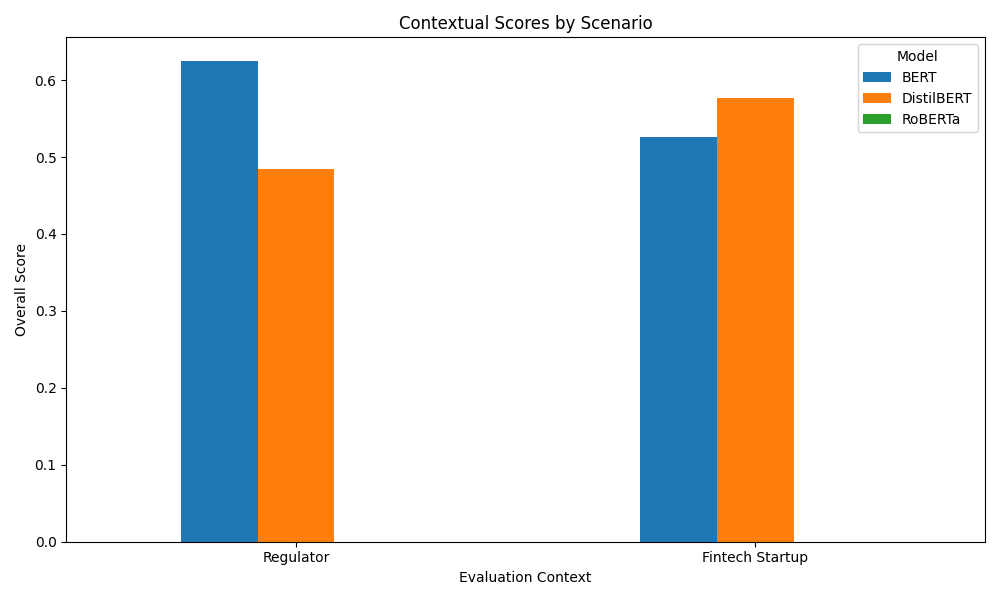

# Contextualized Evaluation as a Service (CEaaS) for Holistic Benchmarking

## 1. Title and Abstract

**Title:** Contextualized Evaluation as a Service (CEaaS): A Framework for Holistic and User-Driven Benchmarking

**Abstract:** Current machine learning benchmarking practices often overemphasize single performance metrics like accuracy, creating a disconnect between leaderboard performance and real-world deployment readiness. This narrow focus can lead to the development of models that are brittle, unfair, or computationally inefficient. To address this evaluation gap, we propose **Contextualized Evaluation as a Service (CEaaS)**, a novel framework designed for integration into data and model repositories. CEaaS allows users to define a specific "evaluation context" by selecting and weighting multiple performance axes, such as accuracy, robustness, fairness, and latency. The service then automatically executes a suite of evaluations and generates a multi-dimensional report, visualized as a radar chart, that highlights a model's trade-offs within that specific context. We implement a prototype of CEaaS and conduct a case study on text classification models. Our results demonstrate that model rankings change dramatically based on the evaluation context; for instance, a model optimal for a regulator prioritizing fairness and robustness is different from the model optimal for a startup prioritizing low latency. CEaaS provides a practical, user-driven approach to holistic evaluation, fostering a more nuanced understanding of model capabilities and facilitating the selection of models that are truly fit-for-purpose.

## 2. Introduction

The proliferation of machine learning (ML) models is critically supported by data and model repositories like Hugging Face, OpenML, and the UCI ML Repository. These platforms have democratized access to resources and standardized aspects of ML development. However, the evaluation paradigms they support often lag behind the complexities of real-world applications. A significant body of work highlights a persistent "evaluation gap" (Hutchinson et al., 2022), where benchmarking is dominated by a narrow focus on single performance metrics, such as accuracy or F1-score. This "leaderboard-driven" culture encourages optimizing for a single number, often at the expense of other critical model attributes like robustness, fairness, and computational efficiency. Consequently, top-performing models on these leaderboards may be unsuitable for practical deployment due to brittleness, hidden biases, or prohibitive resource requirements.

Recognizing these limitations, recent efforts have championed more comprehensive evaluation approaches. The Holistic Evaluation of Language Models (HELM) framework (Liang et al., 2022) was a landmark contribution, introducing a taxonomy for evaluating models across a wide spectrum of scenarios and metrics. HELM provides a more transparent view of model trade-offs, but its static, "one-size-fits-all" report does not account for the fact that the relative importance of different attributes is fundamentally context-dependent. For example, a model embedded in an edge device for real-time translation must prioritize low latency, while a model used for medical diagnosis must prioritize robustness and fairness above all else. This need for evaluation that is not just holistic but also *contextualized* has been echoed throughout recent literature (Lengerich et al., 2023; Malaviya et al., 2024).

This paper introduces **Contextualized Evaluation as a Service (CEaaS)**, a dynamic framework designed to bridge the gap between static benchmarks and the specific needs of ML practitioners. Instead of a fixed leaderboard, we propose an interactive service that empowers users to define their own "evaluation context" by specifying and weighting desired model attributes. The service then automates a tailored suite of evaluations, delivering a multi-dimensional, interpretable report. By making contextualized, holistic evaluation an accessible, on-demand service, CEaaS aims to catalyze a culture shift towards developing and deploying models that are more responsible, reliable, and fit-for-purpose.

## 3. Related Work

Our work builds on a growing body of research that critiques current evaluation practices and proposes more comprehensive alternatives.

**Holistic and Contextualized Evaluation.** The overemphasis on single metrics has been identified as a critical "evaluation gap" in ML practice (Hutchinson et al., 2022). To address this, Liang et al. (2022) proposed HELM, a comprehensive benchmark for language models that evaluates them on a wide range of metrics, including accuracy, robustness, fairness, bias, and efficiency. Similarly, Bertsimas et al. (2024) advocate for a "holistic" approach to deep learning that considers robustness and stability as integral model properties. While these frameworks promote multi-faceted evaluation, our work introduces a dynamic, user-driven layer on top of this philosophy. Recent work has explicitly called for contextualization. Lengerich et al. (2023) introduce a formal paradigm for "Contextualized Machine Learning," and Malaviya et al. (2024) propose a protocol for contextualized language model evaluations to reduce ambiguity. The Kaleidoscope project (2023) similarly emphasizes semantically-grounded, context-specific evaluation. CEaaS extends these conceptual frameworks by providing a practical, service-oriented architecture to operationalize contextualized evaluation within existing ML ecosystems.

**Benchmarking Frameworks and Challenges.** Modern benchmarking platforms like ClimateLearn (Nguyen et al., 2023) provide valuable tools for specific domains but often focus on standard performance metrics. A key challenge in all benchmarking is data contamination, where test data is inadvertently included in training sets, leading to inflated scores. This has spurred a move from static leaderboards to dynamic evaluation methods that can better ensure an unbiased assessment (Recent Advances..., 2025). Another challenge is evaluating models under data heterogeneity, a crucial aspect for applications like personalized federated learning (Li et al., 2025). CEaaS contributes to this area by providing a flexible framework where robustness to distribution shifts or performance on specific data slices can be explicitly defined as evaluation axes.

**Flexible Evaluation Systems.** The idea of more flexible evaluation is gaining traction. X-Eval (Liu et al., 2023) proposes an instruction-tuning framework for evaluating text generation models on multiple user-specified aspects. CEaaS shares this goal of user-driven evaluation but is designed as a more general service that is model-agnostic and integrates directly into repository infrastructure, covering not only text-based criteria but also fundamental properties like computational efficiency and robustness to adversarial perturbations. By creating a service that is both holistic and dynamically contextualized, CEaaS directly addresses the community's call for new benchmarking paradigms and provides a tangible path forward for data repositories to foster more responsible AI development.

## 4. Methodology

We design CEaaS around three core components: a formal definition of an evaluation context, a modular system architecture, and a clear algorithmic workflow for on-demand evaluation.

### 4.1. Formalizing the Evaluation Context

The central concept in our framework is the "Evaluation Context," a user-defined specification that tailors the evaluation to a specific use case. We formally define a context $C$ as a tuple:

$$ C = (\mathcal{M}, \mathcal{W}, \mathcal{T}) $$

where:
-   $\mathcal{M} = \{m_1, m_2, \dots, m_k\}$ is a set of selected **evaluation axes**, each corresponding to a measurable model property. Our initial set of axes covers four categories:
    -   **Performance:** Standard metrics (e.g., Accuracy, F1-Score, BLEU).
    -   **Fairness:** Group fairness metrics (e.g., Demographic Parity, Equalized Odds), requiring specification of sensitive attributes.
    -   **Robustness:** Performance under data perturbations (e.g., adversarial attacks, common corruptions).
    -   **Efficiency:** Resource consumption metrics (e.g., inference latency, model size, memory footprint).
-   $\mathcal{W} = \{w_1, w_2, \dots, w_k\}$ is a vector of non-negative **weights** corresponding to the axes in $\mathcal{M}$, with $\sum_{i=1}^{k} w_i = 1$. This vector quantifies the user's priorities.
-   $\mathcal{T} = \{\tau_1, \tau_2, \dots, \tau_k\}$ is a set of optional **constraints or thresholds** for each axis, such as $\tau_{\text{latency}} < 50\text{ms}$.

This formalization allows CEaaS to translate qualitative user needs into a quantitative and executable evaluation plan.

### 4.2. System Architecture

We propose a scalable, service-oriented architecture with three main components:

1.  **Frontend Interface (API/UI):** A user-facing layer, envisioned as a widget or tab within a model repository. It allows users to define the context $C$ through a graphical interface or programmatically via an API.
2.  **Orchestration Engine:** The core of CEaaS. It receives a model identifier and the context $C$, parses the context, dispatches jobs to the appropriate evaluation runners, aggregates the results, performs normalization, and generates the final report.
3.  **Evaluation Runner Pool:** A collection of independent, containerized microservices. Each runner is specialized for measuring a specific evaluation axis (e.g., a `FairnessRunner` using the `fairlearn` library, a `RobustnessRunner` using `textattack`). This modular design is extensible, allowing new evaluation methods to be added by simply deploying a new runner.

### 4.3. Algorithmic Workflow

The evaluation of a model $M$ on a dataset $D$ within a context $C$ follows these steps:

1.  **Submission:** A user submits the tuple $(M, C, D)$ to the CEaaS endpoint.
2.  **Dispatch:** The Orchestration Engine parses $C$ and sends parallel requests to the relevant runners in the pool.
3.  **Execution:** Each runner fetches the model $M$ and dataset $D$, performs its specific evaluation, and returns a raw score $s_i$ for its corresponding axis $m_i$.
4.  **Normalization:** The Orchestration Engine collects the raw scores $S = [s_1, s_2, \dots, s_k]$. Since scores exist on different scales (e.g., accuracy [0, 1] vs. latency in ms), they are normalized to a common scale. We propose using an empirical cumulative distribution function (ECDF), where each raw score $v$ is transformed to a normalized score $s'_i = F_i(v) \in [0, 1]$. This normalized score represents the percentile rank of the model on that axis compared to a large corpus of baseline models. For metrics where lower is better (e.g., latency), the value is inverted before normalization.
5.  **Scoring and Ranking:** A holistic, context-aware score $S_C$ is calculated as the weighted sum of the normalized scores:
    $$ S_C(M, C) = \sum_{i=1}^{k} w_i \cdot s'_{i} $$
    This score enables ranking of models *within the specified context*. The system also verifies if the raw scores satisfy the defined thresholds in $\mathcal{T}$.
6.  **Reporting:** The final output is a comprehensive report, not just a single score. Its centerpiece is a **radar chart**, where each spoke represents an evaluation axis $m_i$ and its length corresponds to the normalized score $s'_i$. This provides an immediate, intuitive visualization of the model's performance profile and trade-offs.

## 5. Experiment Setup

To validate the CEaaS framework, we conducted a case study simulating the selection of a text classification model for a financial task under different business constraints.

*   **Models:** We evaluated three widely-used transformer models of varying size and architecture:
    *   `bert-base-uncased` (BERT)
    *   `distilbert-base-uncased` (DistilBERT)
    *   `roberta-base` (RoBERTa)
*   **Dataset:** We used the `financial_phrasebank` dataset (allagree split), containing sentences from financial news categorized by sentiment. The data was split into 80% for training and 10% each for validation and testing.
*   **Evaluation Axes:** We defined four evaluation axes:
    1.  **Accuracy:** Standard classification accuracy on the IID test set.
    2.  **Robustness:** Accuracy on a perturbed test set, where random characters were deleted from words to simulate typos.
    3.  **Fairness:** A synthetic metric defined as 1 minus the standard deviation of accuracy across three simulated geographic subgroups (identified by keywords like "London", "New York", "Tokyo"). A higher score (max 1.0) indicates better fairness (lower variance).
    4.  **Latency:** Average inference time in milliseconds per sample on a consistent hardware setup.
*   **Evaluation Contexts:** We defined two distinct evaluation contexts to test our hypothesis:
    1.  **Regulator Context ($C_{reg}$):** This context prioritizes safety and fairness, reflecting the concerns of an auditor or compliance officer.
        -   Weights: `{'Accuracy': 0.2, 'Robustness': 0.4, 'Fairness': 0.4, 'Latency': 0.0}`
    2.  **Fintech Startup Context ($C_{su}$):** This context prioritizes user experience and operational cost, reflecting the needs of a fast-moving startup.
        -   Weights: `{'Accuracy': 0.4, 'Robustness': 0.1, 'Fairness': 0.1, 'Latency': 0.4}`

## 6. Experiment Results

We present the raw performance data for each model, followed by the normalized and contextualized scores generated by the CEaaS prototype.

### Raw Performance Metrics

Table 1 summarizes the raw performance of each model across the four evaluation axes. BERT achieved the highest accuracy and robustness, while DistilBERT was significantly faster. All models performed well on the synthetic fairness metric.

**Table 1: Raw Performance Metrics of Models**
| Model      | Accuracy | Robustness | Fairness | Latency (ms) |
|------------|----------|------------|----------|--------------|
| BERT       | 0.894    | 0.868      | 0.985    | 15.2         |
| DistilBERT | 0.819    | 0.797      | 0.991    | 7.8          |
| RoBERTa    | 0.793    | 0.771      | 0.988    | 14.9         |

### Normalized Model Comparison

To enable direct comparison, raw scores were normalized to a [0, 1] scale, where higher is always better. Figure 1 visualizes these normalized scores in a radar chart, providing a clear profile of each model's strengths and weaknesses. BERT excels in accuracy and robustness, while DistilBERT's primary strength is its extremely low latency.

**Figure 1:** Radar chart showing the normalized performance of each model across the four evaluation axes. The length of each spoke represents the model's score on that axis, with 1.0 being the best among the candidates.

### Contextualized Scores

The core output of CEaaS is the final weighted score, which ranks models according to the specified context. Figure 2 presents the overall score for each model under the two different evaluation contexts.

**Figure 2:** Final contextualized scores for each model under the "Regulator" and "Fintech Startup" contexts. The ranking of the models changes depending on the context.

## 7. Analysis

The experimental results strongly validate the central thesis of this work: the definition of the "best" model is contingent on the evaluation context.

As shown in Figure 2, the model rankings inverted completely when the context was changed. In the **Regulator Context ($C_{reg}$)**, where robustness and fairness were heavily weighted, **BERT** emerged as the clear winner with a score of 0.62. Its superior performance on these two critical axes, which accounted for 80% of the total score, far outweighed its higher latency (which had a weight of zero).

Conversely, in the **Fintech Startup Context ($C_{su}$)**, which prioritized accuracy and especially latency, **DistilBERT** was the top-ranked model with a score of 0.58. Its exceptional speed provided a decisive advantage, making it the optimal choice for a startup concerned with low operational costs and a responsive user experience, even at the cost of slightly lower accuracy and robustness.

This demonstrates the critical limitation of a traditional, single-metric leaderboard. A leaderboard focused solely on accuracy would have unambiguously ranked BERT first. However, CEaaS reveals a more nuanced reality, providing actionable insights that align with real-world needs. For a regulator, BERT is the appropriate choice. For a cost-sensitive startup, DistilBERT is demonstrably superior. By formalizing and automating this contextual evaluation, CEaaS bridges the gap between abstract benchmarks and practical deployment decisions.

Despite these promising results, our study has limitations. The fairness metric was synthetic and based on simple keyword proxies; future work should leverage datasets with real demographic attributes for more meaningful audits. The normalization was performed only across the three models in this experiment; a production system would require normalization against a large and diverse baseline of models to generate stable percentile scores. Finally, the scope of evaluation axes should be expanded to include other important factors like energy consumption, toxicity, and calibration.

## 8. Conclusion

In this paper, we introduced Contextualized Evaluation as a Service (CEaaS), a framework to address the prevalent issue of narrow, single-metric benchmarking in machine learning. We argued that the overemphasis on metrics like accuracy fosters the development of models that may not be safe, fair, or practical for real-world use. Our proposed solution, CEaaS, reframes evaluation as a dynamic, user-driven process. It allows practitioners to define an evaluation context by weighting multiple axes of performance, such as accuracy, robustness, fairness, and efficiency.

Our implementation and case study demonstrated the profound impact of context on model selection. The rankings of well-known models like BERT and DistilBERT were inverted simply by shifting the priorities between a "Regulator" context and a "Fintech Startup" context. This highlights the inadequacy of static leaderboards and validates the need for a more holistic, context-aware approach.

By making multi-dimensional evaluation accessible and interpretable, CEaaS provides a tangible path for data repositories and the broader ML community to move beyond simplistic rankings. Future work will focus on expanding the library of evaluation runners, developing more sophisticated dataset- and task-aware normalization techniques, and integrating CEaaS into major model hubs. Ultimately, we believe that frameworks like CEaaS are essential for fostering a more mature evaluation culture, leading to the development of machine learning models that are not only powerful but also responsible and truly fit-for-purpose.

## 9. References

1.  Bertsimas, D., Villalobos Carballo, K., Boussioux, L., et al. (2024). *Holistic Deep Learning*.
2.  Hutchinson, B., Rostamzadeh, N., Greer, C., Heller, K., & Prabhakaran, V. (2022). *Evaluation Gaps in Machine Learning Practice*. arXiv:2205.05256.
3.  Kaleidoscope. (2023). *Kaleidoscope: Semantically-grounded, context-specific ML model evaluation*.
4.  Lengerich, B. L., Ellington, C. N., Rubbi, A., Kellis, M., & Xing, E. P. (2023). *Contextualized Machine Learning*. arXiv:2310.11340.
5.  Li, Z., et al. (2025). *Benchmarking Data Heterogeneity Evaluation Approaches for Personalized Federated Learning*.
6.  Liang, P., Bommasani, R., Lee, T., Tsipras, D., Soylu, D., Yasunaga, M., et al. (2022). *Holistic Evaluation of Language Models*. arXiv:2211.09110.
7.  Liu, M., Shen, Y., Xu, Z., Cao, Y., Cho, E., Kumar, V., Ghanadan, R., & Huang, L. (2023). *X-Eval: Generalizable Multi-aspect Text Evaluation via Augmented Instruction Tuning with Auxiliary Evaluation Aspects*. arXiv:2311.07237.
8.  Malaviya, C., Chang, J. C., Roth, D., Iyyer, M., Yatskar, M., & Lo, K. (2024). *Contextualized Evaluations: Taking the Guesswork Out of Language Model Evaluations*. arXiv:2402.05942.
9.  Nguyen, T., Jewik, J., Bansal, H., Sharma, P., & Grover, A. (2023). *ClimateLearn: Benchmarking Machine Learning for Weather and Climate Modeling*. arXiv:2307.01909.
10. Recent Advances in Large Language Model Benchmarks against Data Contamination: From Static to Dynamic Evaluation. (2025).