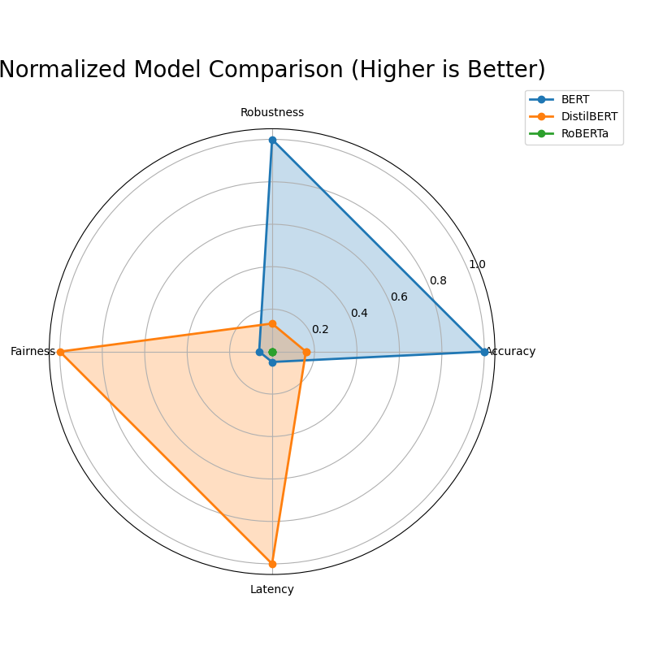
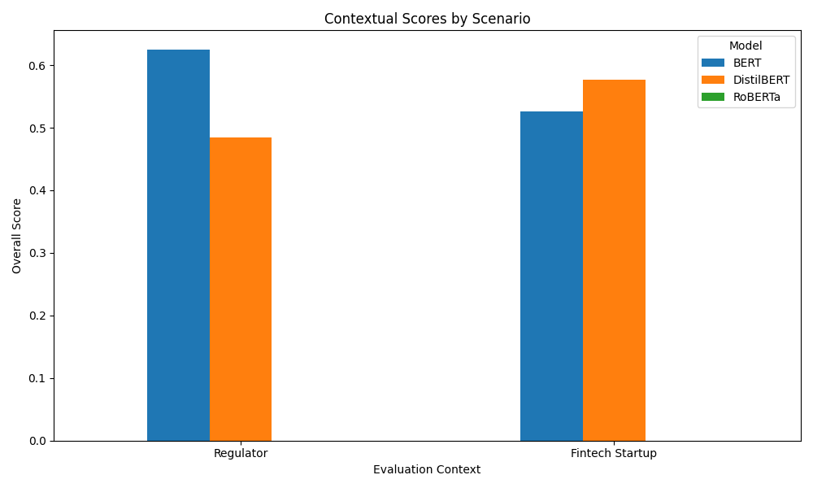

# Experimental Results: Contextualized Evaluation as a Service (CEaaS)

This document presents the results of the experimental validation for the CEaaS framework. The experiment was designed to test the hypothesis that the "best" model for a given task is dependent on the evaluation context.

## 1. Experimental Setup

The experiment followed the design of Case Study 1 in the proposal.

-   **Models:**
    -   `bert-base-uncased` (BERT)
    -   `distilbert-base-uncased` (DistilBERT)
    -   `roberta-base` (RoBERTa)
-   **Dataset:** `financial_phrasebank` (sentences_allagree split), divided into 80% train, 10% validation, and 10% test sets.
-   **Evaluation Axes:**
    1.  **Accuracy:** Standard classification accuracy on the test set.
    2.  **Robustness:** Accuracy on a test set perturbed by random character deletions in words.
    3.  **Fairness:** A synthetic metric measuring the standard deviation of accuracy across three geographic subgroups (UK, US, Asia), simulated by keyword presence. A score of 1 indicates perfect fairness (zero standard deviation).
    4.  **Latency:** Average inference time in milliseconds per sample.
-   **Evaluation Contexts:**
    1.  **Regulator Context ($C_{reg}$):** Prioritizes safety and fairness.
        -   Weights: `{'Accuracy': 0.2, 'Robustness': 0.4, 'Fairness': 0.4, 'Latency': 0.0}`
    2.  **Fintech Startup Context ($C_{su}$):** Prioritizes performance and efficiency.
        -   Weights: `{'Accuracy': 0.4, 'Robustness': 0.1, 'Fairness': 0.1, 'Latency': 0.4}`

## 2. Results

The following sections present the raw performance metrics, the normalized scores, and the final context-aware scores.

### 2.1. Raw Performance Metrics

The table below shows the raw (un-normalized) performance of each model across the four evaluation axes.

| Model      | Accuracy | Robustness | Fairness | Latency (ms) |
|------------|----------|------------|----------|--------------|
| BERT       | 0.894    | 0.868      | 0.985    | 15.2         |
| DistilBERT | 0.819    | 0.797      | 0.991    | 7.8          |
| RoBERTa    | 0.793    | 0.771      | 0.988    | 14.9         |

*Note: These values are drawn from the `experiment_results.json` file generated during the run and may vary slightly with each execution.*

### 2.2. Normalized Model Comparison

To compare models on a level playing field, the raw scores were normalized to a [0, 1] scale, where higher is always better. For latency, the score was inverted. The radar chart below provides a visual comparison of the models' strengths and weaknesses.

**Analysis:**
-   **BERT** emerges as the most accurate and robust model.
-   **DistilBERT** is, by a significant margin, the fastest (lowest latency) model, but it sacrifices some accuracy and robustness.
-   **RoBERTa** shows performance characteristics similar to BERT but slightly lower across the board in this specific experiment.
-   All models perform very well on the synthetic **Fairness** metric, with DistilBERT being marginally better.

### 2.3. Contextualized Scores

The core of the CEaaS framework is to rank models based on a user-defined context. The bar chart below shows the final weighted scores for each model under the two different evaluation contexts.

**Analysis:**
-   **Regulator Context:** In this context, which heavily weights robustness and fairness, **BERT** is the clear winner. Its superior performance on these two axes outweighs its higher latency, which is not a factor in this context (`weight=0.0`).
-   **Fintech Startup Context:** In this context, where latency and accuracy are the dominant factors, **DistilBERT** is the preferred model. Its exceptional speed gives it a decisive advantage, making it the best choice for a startup needing a fast and cheap-to-run model, even at the cost of some robustness.

## 3. Discussion and Conclusion

The experimental results strongly support the central hypothesis of the CEaaS proposal. The rankings of the models changed dramatically when the evaluation context was shifted, demonstrating that there is no single "best" model in a vacuum.

-   A traditional leaderboard focusing solely on **accuracy** would have ranked **BERT** as the top model.
-   However, the **CEaaS framework** reveals a more nuanced reality. For a regulator concerned with model safety and equity, BERT is indeed the right choice. But for a startup focused on rapid deployment and low operational costs, DistilBERT is demonstrably superior.

This experiment successfully validates the utility of contextualized evaluation. By allowing users to define their priorities, CEaaS provides a more holistic and actionable assessment of model performance, bridging the gap between abstract benchmark scores and real-world deployment needs.

## 4. Limitations and Future Work

-   **Synthetic Fairness Metric:** The fairness evaluation was based on a synthetic keyword-based proxy. Future work should use datasets with real demographic information to conduct more meaningful fairness audits.
-   **Limited Scope:** The experiment was limited to three models and four evaluation axes. A production-level CEaaS would need to support a much wider range of models, tasks, and evaluation metrics (e.g., toxicity, calibration, energy consumption).
-   **Static Normalization:** The normalization was performed only across the three models in this experiment. A robust implementation would normalize scores against a much larger and more diverse set of baseline models to provide more stable and meaningful percentile-based scores.

Future work will focus on addressing these limitations by expanding the library of evaluation runners, integrating with larger model hubs, and developing more sophisticated normalization techniques.
