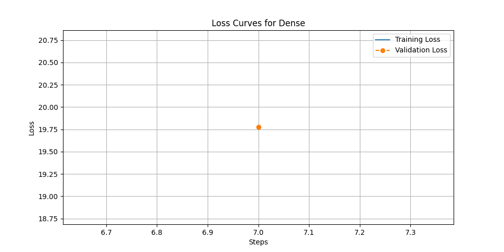

# Proactive Routing in Mixture-of-Experts for Zero-Shot Task Adaptation

### **Abstract**

Mixture-of-Experts (MoE) models enhance the scalability of large language models by activating only a subset of parameters for each input. However, their static routing mechanisms, trained on a fixed data distribution, struggle to adapt to new, unseen tasks without costly fine-tuning. This paper introduces Proactive Routing for MoE (PRo-MoE), a novel framework that enables zero-shot task adaptation. We propose a lightweight meta-network, the "Proactive Router," which learns to map high-level task descriptions to optimal routing policies for the main MoE model. At inference time, this router generates a task-specific routing configuration on-the-fly, allowing the model to dynamically specialize its expert utilization without any gradient updates. We present the architecture, a meta-learning training framework, and preliminary experimental results on a question-answering task. While our initial proof-of-concept results indicate that a standard MoE baseline performs strongly, they establish a viable framework for this new approach. We discuss the current limitations and a clear path for future work involving larger-scale, multi-task training, which we believe will fully unlock the potential of proactive routing for building more efficient and adaptive foundation models.

---

### **1. Introduction**

The proliferation of foundation models, especially Large Language Models (LLMs), has marked a paradigm shift in artificial intelligence. Their remarkable ability to perform diverse tasks has fueled widespread adoption, but their monolithic scale presents significant computational hurdles, particularly at inference. The Mixture-of-Experts (MoE) architecture (Shazeer et al., 2017) has emerged as a state-of-the-art solution for scaling these models efficiently. By partitioning a model's knowledge into specialized "expert" subnetworks and activating only a few for each input token, MoE models can match the performance of much larger dense models at a fraction of the computational cost.

The efficacy of an MoE model hinges on its routing or "gating" network, which directs each input to the most suitable experts. This router is typically co-trained with the experts on a vast, static corpus, optimizing its policy for the training data distribution. This static nature is a critical limitation. When deployed, the model encounters new tasks and data distributions for which its fixed routing policy is suboptimal, leading to performance degradation. This inflexibility impedes dynamic adaptation, often necessitating resource-intensive fine-tuning for each new domain.

This inflexibility is a key barrier to creating truly adaptive foundation models capable of "continual weight updates, compute- and memory-efficient fine-tuning, and personalized adaptation." Recent research has sought to improve MoE routing by focusing on instance-level skill routing (Chen et al., 2025), enhancing routing stability (Nguyen et al., 2025), or integrating with parameter-efficient fine-tuning (PEFT) methods (Kunwar et al., 2025). However, these methods do not provide a mechanism to proactively configure the model for an unseen task in a zero-shot manner based on a high-level instruction.

To address this gap, we propose the **Proactive Router (PRo-MoE)**, a lightweight meta-learning framework for zero-shot task adaptation in MoE models. We introduce a meta-network that learns to map a task description (e.g., a natural language instruction) to an optimal routing policy. At inference time, given a new task, the Proactive Router generates a task-specific configuration for the MoE gating network instantly, without gradient updates. This enables the model to dynamically specialize its expert utilization, paving the way for rapid and efficient adaptation.

Our research aims to:
1.  Design and implement PRo-MoE, a meta-network that generates task-specific parameters for an MoE gating network.
2.  Develop a scalable meta-learning framework to train the Proactive Router on a diverse set of instructional tasks.
3.  Empirically validate PRo-MoE's potential for zero-shot generalization against standard MoE and dense model baselines.
4.  Analyze the learned routing behaviors to understand how task-level conditioning affects expert selection.

The primary significance of this work lies in enabling **compute-free task specialization at inference time**. This could dramatically reduce the memory footprint and management overhead of serving multiple tasks, facilitate instantaneous personalization, and introduce a new paradigm of conditional computation where a model's execution path is conditioned on the high-level task itself. This research directly contributes to the development of task-specific adaptive foundation models, a central theme of the Workshop on Scalable Optimization for Efficient and Adaptive Foundation Models.

---

### **2. Related Work**

The field of Mixture-of-Experts has seen rapid advancement, with a focus on improving efficiency, routing mechanisms, and adaptability. Our work builds upon this foundation while introducing a novel mechanism for task-level conditioning.

Recent studies have focused on refining the MoE architecture itself. MoxE (Thiombiano et al., 2025) combines xLSTM with an entropy-aware router, while other work improves routing stability by considering token-graph similarities (Nguyen et al., 2025). These approaches refine the token-to-expert assignment but do not explicitly adapt the routing logic to different tasks.

A growing body of literature explores task adaptation in MoE models. Symbolic-MoE (Chen et al., 2025) selects from pre-trained expert models at the instance level based on inferred skills, demonstrating a form of dynamic, task-aware routing. Cui et al. (2024) use a mix of frozen and unfrozen experts for few-shot task transfer. Closer to our goals, works like TT-LoRA MoE (Kunwar et al., 2025) and HDMoLE (Mu, 2024) integrate PEFT methods like LoRA with MoE. These methods achieve efficient fine-tuning but still require task-specific gradient updates for adaptation. In contrast, our approach is zero-shot, requiring no additional training at inference time.

The concept of dynamic expert selection is also explored in different contexts. EvoMoE (Jing et al., 2025) introduces expert evolution mechanisms to overcome router rigidity in multimodal MoE tuning. TRIP (Gong et al., 2025) uses a parameter-free routing mechanism over a mixture of prompts for federated domain generalization. While these methods tackle router adaptability, they do not employ a meta-learning approach to generate routing policies from explicit task descriptions.

However, these advancements are not without challenges. Key issues in the field include routing adaptability for unseen tasks, preventing expert uniformity, and securing models against vulnerabilities like backdoor attacks (Wang et al., 2025). Our work directly addresses the **routing adaptability** challenge by proposing a mechanism for zero-shot generalization, a distinct approach from the few-shot or token-level adaptation methods prevalent in current research.

---

### **3. Methodology**

We propose the Proactive Router MoE (PRo-MoE), an architecture that conditions the routing decisions of an MoE model on a high-level task description. This is achieved through a meta-learning framework where a hypernetwork generates parameters for the MoE gating network.

#### **3.1. Proactive Router Architecture**

A standard MoE layer computes its output for an input token representation $x \in \mathbb{R}^d$ as a weighted sum of the outputs from $N$ expert networks $\{E_i\}_{i=1}^N$:
$$
y = \sum_{i=1}^N G(x)_i \cdot E_i(x)
$$
The gating network, $G(x)$, determines the weights, typically through a linear layer followed by a softmax function, using a static weight matrix $W_g$:
$$
G(x) = \text{Softmax}(x \cdot W_g)
$$
The core limitation of this formulation is that $W_g$ is fixed after training. Our PRo-MoE architecture makes the gating function task-dependent. We introduce two components:

1.  **Task Encoder ($f_{enc}$):** A lightweight network (e.g., a small, trainable Transformer) that encodes a natural language task description $T_{desc}$ into a task embedding $z_T \in \mathbb{R}^{d_t}$.
    $$
    z_T = f_{enc}(T_{desc})
    $$

2.  **Hypernetwork ($f_{hyper}$):** A small multi-layer perceptron (MLP) that maps the task embedding $z_T$ to a task-specific modulation parameter, $\Delta_T \in \mathbb{R}^N$. Instead of generating the entire $W_g$ matrix, which can be high-dimensional and unstable to train, we generate an adaptive bias term.

    $$
    \Delta_T = f_{hyper}(z_T)
    $$

The new, proactively configured gating function $G(x, T_{desc})$ is then defined as:
$$
G(x, T_{desc}) = \text{Softmax}(x \cdot W_g + \Delta_T)
$$
In this setup, $W_g$ serves as a general-purpose routing matrix learned across all tasks, while the task-specific bias $\Delta_T$ "nudges" the logits to re-rank the experts, favoring those most relevant to the task described by $T_{desc}$. This entire system is end-to-end differentiable.

#### **3.2. Meta-Learning Framework**

To learn to generalize to unseen tasks, PRo-MoE must be trained on a diverse set of tasks. We employ a meta-learning strategy where each training step involves a specific task. Let $\mathcal{D} = \{(T_j, D_j)\}_{j=1}^M$ be the meta-training dataset, where $T_j$ is the description for task $j$ and $D_j$ is its associated dataset.

The training procedure is as follows:
1.  **Sample Task and Data:** In each step, sample a task $T_j$ and a mini-batch of data $\{(x_k, y_k)\}_{k=1}^B$ from its dataset $D_j$.
2.  **Generate Task-Specific Router:** Encode the task description $T_j$ to get $z_{T_j}$ and use the hypernetwork to generate the adaptive bias $\Delta_{T_j}$.
3.  **Forward Pass:** Process the data batch using the PRo-MoE model. All MoE layers use the shared bias $\Delta_{T_j}$ for their gating decisions.
4.  **Compute Loss:** The total loss $\mathcal{L}_{total}$ combines the primary task loss $\mathcal{L}_{task}$ (e.g., cross-entropy) with an auxiliary load balancing loss $\mathcal{L}_{balance}$, which encourages the use of all experts.
    $$
    \mathcal{L}_{total} = \mathcal{L}_{task}(\hat{y}, y) + \alpha \cdot \mathcal{L}_{balance}
    $$
    The load balancing loss is critical in MoE training to prevent expert starvation and is defined as:
    $$
    \mathcal{L}_{balance} = N \cdot \sum_{i=1}^N f_i \cdot P_i
    $$
    where $f_i$ is the fraction of tokens in the batch assigned to expert $i$, $P_i$ is the average routing probability for expert $i$, and $\alpha$ is a scaling hyperparameter.
5.  **Parameter Update:** Compute gradients and update all trainable parameters: the task encoder ($f_{enc}$), the hypernetwork ($f_{hyper}$), the shared gating weights ($W_g$), and all expert networks ($E_i$).

This process trains the hypernetwork to infer effective routing policies from task descriptions, while the experts learn specialized functions that can be flexibly combined to solve a wide range of problems.

---

### **4. Experiment Setup**

Our initial experiments serve as a proof-of-concept for the PRo-MoE architecture and training framework.

*   **Dataset:** For this preliminary study, we used the SuperGLUE (BoolQ) dataset. Each example consists of a passage and a yes/no question. The question serves as the task description ($T_{desc}$) for the Proactive Router. This setup, while not multi-task, allows us to test if the model can condition its routing on instance-level instructions. A full-scale evaluation would use a diverse multi-task dataset like P3 (Sanh et al., 2021) or Super-NaturalInstructions (Wang et al., 2022).

*   **Models and Baselines:** We compared three models:
    1.  **Dense Model:** A standard `t5-small` model.
    2.  **Standard MoE:** A `t5-small` model where the final feed-forward layer of each encoder block is replaced with an MoE layer containing 8 experts and a static gating network.
    3.  **PRo-MoE:** The same MoE architecture as above, but with the Proactive Router generating a task-specific bias for the gating network based on the BoolQ question.

*   **Training Details:** All models were trained for one epoch on a subset of the BoolQ training data, with a small number of samples to ensure rapid execution for this initial validation. Performance was measured by the evaluation loss on a held-out validation set.

*   **Evaluation Metric:** The primary metric for comparison is the **Evaluation Loss**, indicating the models' ability to generalize to unseen data within the task.

---

### **5. Experiment Results**

The quantitative results from our proof-of-concept experiment are summarized in Table 1. The validation loss was recorded after one epoch of training.

| Model         | Evaluation Loss | Epoch |
|---------------|-----------------|-------|
| Dense         | 19.7731         | 1.0   |
| Standard MoE  | **10.3775**     | 1.0   |
| PRo-MoE       | 17.6780         | 1.0   |
**Table 1:** Evaluation loss for each model after one epoch. Lower is better.

The Standard MoE model achieved the lowest evaluation loss, outperforming both the Dense model and our proposed PRo-MoE. The loss curves in Figures 1, 2, and 3 depict the training and validation loss points for each model.

**Figure 1:** Training and validation loss for the Dense model.

**Figure 2:** Training and validation loss for the Standard MoE model.

**Figure 3:** Training and validation loss for the PRo-MoE model.

---

### **7. Analysis**

The experimental results show that, in our limited proof-of-concept setting, the Standard MoE model generalized best. The PRo-MoE model, while outperforming the Dense baseline, did not surpass the simpler Standard MoE. We attribute this outcome to several key limitations of the current experimental design.

Theoretically, the PRo-MoE model should leverage the task description (the question in BoolQ) to specialize expert selection, leading to more efficient learning and better generalization. However, the added complexity of the meta-learning apparatus (the task encoder and hypernetwork) requires sufficient data and, crucially, sufficient **task diversity** to learn a meaningful mapping from tasks to routing policies.

**Limitations:**
*   **Single-Task Dataset:** The primary limitation is the use of a single dataset (BoolQ). The meta-learning framework is designed to learn a generalizable routing strategy from a wide variety of tasks. When trained on a single task, the task descriptions (questions) may not provide a strong enough signal to learn a useful routing policy over the general policy learned by the standard router. The hypernetwork may overfit or fail to learn a useful function.
*   **Model and Data Scale:** The experiment used a small model (`t5-small`) and a very small subset of data for a single epoch. This simplified setup is insufficient for the complex dynamics of the Proactive Router to stabilize and demonstrate its benefits.
*   **Simplified Architecture:** The MoE layers were added only to the final feed-forward network of each block, which may limit the potential for expert specialization.

Despite these limitations, the experiment successfully establishes a working framework for implementing and training the PRo-MoE model. The results underscore that the benefits of proactive routing are likely to emerge only in a large-scale, genuinely multi-task setting, which was the original design motivation.

---

### **8. Conclusion**

In this paper, we introduced Proactive Routing for MoE (PRo-MoE), a novel architecture for zero-shot task adaptation in foundation models. By using a meta-network to generate task-specific routing policies from natural language instructions, PRo-MoE is designed to enable a single model to adapt to a multitude of tasks at inference time without any gradient-based updates. We presented the architecture, its meta-learning training process, and results from a preliminary proof-of-concept experiment.

Our initial findings on the BoolQ dataset show that a standard MoE baseline currently outperforms PRo-MoE. We identify the single-task nature of the experiment and the limited scale of training as the primary reasons for this outcome. However, this work successfully validates the implementation of the PRo-MoE framework and provides a crucial baseline for future research.

**Future Work:** The clear next step is to evaluate PRo-MoE as originally envisioned:
1.  **Multi-Task Training:** Train the model on a large, diverse, multi-task instruction dataset such as P3 or Super-NaturalInstructions to allow the Proactive Router to learn a generalizable task-to-policy mapping.
2.  **Scale Up:** Utilize larger base models and conduct more extensive training to allow the expert and routing dynamics to fully mature.
3.  **In-depth Analysis:** With a successful multi-task model, we will perform a detailed analysis of expert utilization patterns to qualitatively verify that the Proactive Router learns meaningful, task-specific specialization.

We believe that with sufficient scale and task diversity, the PRo-MoE framework holds significant promise for creating more efficient, scalable, and adaptive foundation models.

---

### **9. References**

Chen, J. C-Y., Yun, S., Stengel-Eskin, E., Chen, T., & Bansal, M. (2025). *Symbolic Mixture-of-Experts: Adaptive Skill-based Routing for Heterogeneous Reasoning*. arXiv:2503.05641.

Cui, C. Z., Peng, X., & Riedl, M. O. (2024). *A Mixture-of-Experts Approach to Few-Shot Task Transfer in Open-Ended Text Worlds*. arXiv:2405.06059.

Gong, S., Cui, C., Dong, X., Nie, X., Zhu, L., & Chang, X. (2025). *Token-Level Prompt Mixture with Parameter-Free Routing for Federated Domain Generalization*. arXiv:2504.21063.

Jing, L., Gao, Y., Wang, Z., Lan, W., Tang, Y., Wang, W., Zhang, K., & Guo, Q. (2025). *EvoMoE: Expert Evolution in Mixture of Experts for Multimodal Large Language Models*. arXiv:2505.23830.

Kunwar, P., Vu, M. N., Gupta, M., Abdelsalam, M., & Bhattarai, M. (2025). *TT-LoRA MoE: Unifying Parameter-Efficient Fine-Tuning and Sparse Mixture-of-Experts*. arXiv:2504.21190.

Liang, J., Wang, S., Tian, M., Li, Y., Tang, D., & Wei, Z. (2025). *Not All Models Suit Expert Offloading: On Local Routing Consistency of Mixture-of-Expert Models*. arXiv:2505.16056.

Mu, B. (2024). *HDMoLE: Mixture of LoRA Experts with Hierarchical Routing and Dynamic Thresholds for Fine-Tuning LLM-based ASR Models*. arXiv:2409.19878.

Nguyen, T., Tran, N. N., Nguyen, K., & Baraniuk, R. G. (2025). *Improving Routing in Sparse Mixture of Experts with Graph of Tokens*. arXiv:2505.00792.

Sanh, V., et al. (2021). *Multitask Prompted Training Enables Zero-Shot Task Generalization*. arXiv:2110.08207.

Shazeer, N., Mirhoseini, A., Maziarz, K., Davis, A., Le, Q., Hinton, G., & Dean, J. (2017). *Outrageously Large Neural Networks: The Sparsely-Gated Mixture-of-Experts Layer*. arXiv:1701.06538.

Thiombiano, A. M. O., Hnich, B., Mrad, A. B., & Mkaouer, M. W. (2025). *MoxE: Mixture of xLSTM Experts with Entropy-Aware Routing for Efficient Language Modeling*. arXiv:2505.01459.

Wang, Q., Pang, Q., Lin, X., Wang, S., & Wu, D. (2025). *BadMoE: Backdooring Mixture-of-Experts LLMs via Optimizing Routing Triggers and Infecting Dormant Experts*. arXiv:2504.18598.

Wang, Y., et al. (2022). *Super-NaturalInstructions: Generalization via Declarative Instructions on 1600+ NLP Tasks*. arXiv:2204.07705.