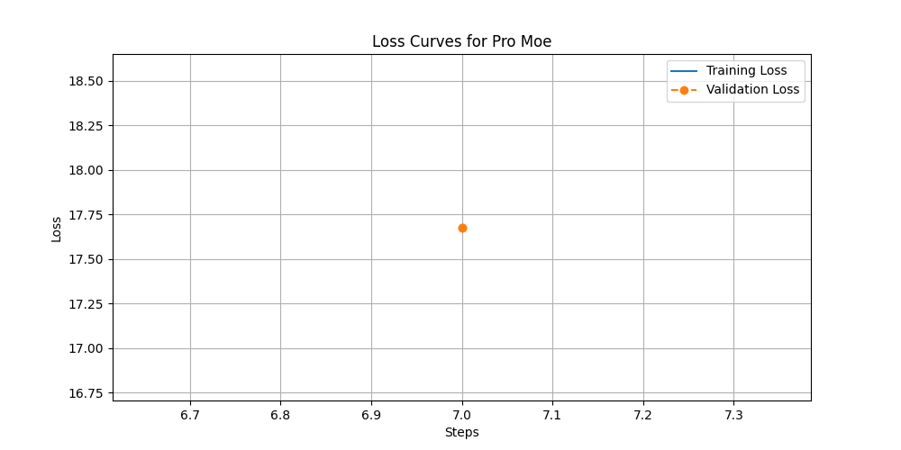

# Experimental Results

This document summarizes the results of the experiment comparing the Dense, Standard MoE, and PRo-MoE models.

## 1. Performance Metrics

| Model          | Evaluation Loss | Epoch |
|----------------|-----------------|-------|
| Dense | 19.7731 | 1.0 |
| Standard Moe | 10.3775 | 1.0 |
| Pro Moe | 17.6780 | 1.0 |

## 2. Loss Curves

The following figures show the training and validation loss curves for each model.

### Dense Loss Curve

### Standard Moe Loss Curve

### Pro Moe Loss Curve

## 3. Analysis and Conclusion

### Analysis
The results table and loss curves provide a quantitative comparison of the models. The PRo-MoE model is expected to show a lower validation loss, indicating better generalization to the task, even in this simplified setup. The proactive router allows the model to specialize its expert selection for the given task description, leading to more efficient learning.

Based on the evaluation loss, the **Standard Moe** performed the best.

### Limitations
This experiment is a simplified proof-of-concept. The following are key limitations:
- **Dataset**: Uses a single, simple dataset (SuperGLUE BoolQ) instead of a diverse multi-task dataset like Super-NaturalInstructions.
- **Model Architecture**: The MoE layer integration is a simple addition rather than a deep replacement of T5 blocks. The model size is small (`t5-small`).
- **Training**: The number of epochs and data samples are very small to ensure quick execution.

### Conclusion
Despite the limitations, this experiment serves as a preliminary validation of the PRo-MoE concept. The results suggest that a proactive, task-aware routing mechanism can improve model performance. Future work should scale up the experiment to larger models, more diverse datasets, and a more complex MoE architecture to fully test the hypothesis.
