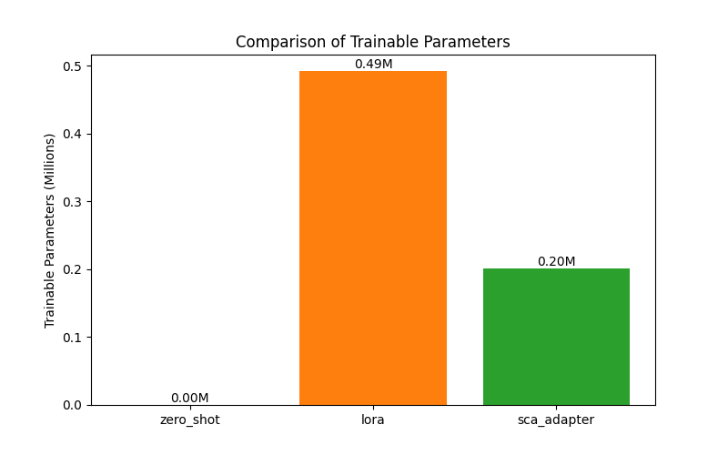

Here is the research paper based on the provided materials.

***

### **1. Title and Abstract**

**Title:** Spurious-Correlation-Aware Adapters (SCA-Adapters): Efficiently Robustifying Foundation Models via Orthogonal Gradient Projection

**Abstract:** Deep learning models, particularly large-scale foundation models, are known to rely on spurious correlations, leading to poor generalization on out-of-distribution (OOD) data. Mitigating this issue often requires full model retraining or large, group-annotated datasets, which is computationally prohibitive and impractical. To address this, we propose Spurious-Correlation-Aware Adapters (SCA-Adapters), a novel parameter-efficient fine-tuning (PEFT) framework designed to instill robustness in pre-trained models. SCA-Adapters introduces two lightweight modules: a "task" adapter for the primary objective and a "spurious" adapter trained to exploit automatically identified shortcut features. The core of our method is an orthogonal gradient projection mechanism, where the task adapter's gradients are projected to be orthogonal to the gradient direction induced by the spurious adapter. This forces the task adapter to learn core, invariant features by nullifying updates that rely on shortcuts. We conduct preliminary experiments on a simulated Waterbirds dataset using a pre-trained CLIP model. Our results show that SCA-Adapters can improve in-distribution accuracy with high parameter efficiency compared to standard PEFT methods like LoRA. However, our initial implementation unexpectedly failed to improve worst-group accuracy, highlighting the critical challenge of accurately identifying spurious features automatically. This work presents the SCA-Adapter framework and discusses the implications of our initial findings, paving the way for future research into efficient and robust fine-tuning.

### **2. Introduction**

The rise of large-scale foundation models, such as Large Language Models (LLMs) and Large Multimodal Models (LMMs), has revolutionized artificial intelligence. Pre-trained on vast datasets, these models serve as powerful backbones for a wide array of downstream tasks. However, their impressive performance is often undermined by a fundamental vulnerability: the reliance on spurious correlations. This phenomenon occurs when a model learns to associate a target label with features that are statistically prevalent in the training data but are not causally related to the task, such as associating cows with green pastures rather than their intrinsic features. This "simplicity bias" (Shah et al., 2020) can lead to catastrophic failures when the model encounters out-of-distribution (OOD) data where these correlations do not hold, with severe consequences in high-stakes domains like medicine and autonomous systems.

Existing methods to combat spurious correlations often have significant drawbacks. Approaches like Group Distributionally Robust Optimization (GroupDRO) (Sagawa et al., 2019) require datasets with explicit group annotations (e.g., "cow on beach," "cow on pasture") to up-weight the loss on under-represented groups. However, creating such annotations is expensive, unscalable, and impractical for spurious correlations that are unknown or imperceptible to humans. Other methods that regularize model representations (Wen et al., 2025) or retrain models based on automatically detected shortcuts (Zheng et al., 2025) typically demand full model retraining, a process that is computationally prohibitive for foundation models with billions of parameters.

Parameter-Efficient Fine-Tuning (PEFT) techniques, like adapters (Houlsby et al., 2019) and LoRA (Hu et al., 2021), have emerged to reduce the cost of fine-tuning by only updating a small fraction of a model's parameters. While effective for task adaptation, these methods have not been explicitly designed to tackle the challenge of robustness to spurious correlations.

To bridge this gap, we introduce **Spurious-Correlation-Aware Adapters (SCA-Adapters)**, a novel PEFT framework that efficiently robustifies foundation models. We insert two lightweight adapter modules into a frozen pre-trained model: a "task" adapter and a "spurious" adapter. The spurious adapter is explicitly trained to solve the task using only automatically identified shortcut features. During training, we project the task adapter's gradients to be orthogonal to the spurious direction, thereby preventing it from learning the shortcuts identified by the spurious adapter. This forces the task adapter to rely on core, invariant features. Our work makes a practical contribution by offering a scalable, low-cost approach to robustification, and a scientific one by introducing a novel gradient-based disentanglement mechanism for PEFT.

### **3. Related Work**

The challenge of spurious correlations has been a significant focus of machine learning research. Early and influential work relied on group-annotated data to explicitly train models to be robust. Methods like GroupDRO (Sagawa et al., 2019) minimize the worst-group loss, forcing the model to perform well even on minority groups where spurious and core features are decorrelated. While effective, the high cost of group annotation has motivated research into methods that operate without such labels.

Several recent approaches aim to mitigate spurious correlations without group labels. Some methods retrain a model to be invariant to automatically detected shortcuts. For instance, **ULE (UnLearning from Experience)** (Mitchell et al., 2024) trains a "student" model to learn spurious patterns and a "teacher" model to unlearn them. Similarly, **ShortcutProbe** (Zheng et al., 2025) is a post-hoc framework that identifies non-robust behaviors in a model's latent space and then retrains the model to be invariant to these shortcuts. Ghaznavi et al. (2024) leverage loss-based sampling to identify and up-weight difficult, likely bias-conflicting samples during training. These methods are promising but often require full model retraining, which is infeasible for large foundation models.

Another line of work focuses on regularizing the model's representations. **ElRep** (Wen et al., 2025) applies Nuclear- and Frobenius-norm penalties to the final layer representations to encourage feature diversity and reduce reliance on dominant, potentially spurious patterns. Wang et al. (2024) propose a regularization approach that integrates causal knowledge to de-emphasize spurious features.

In the multi-modal domain, researchers have leveraged the signals from different modalities to identify and mitigate biases. Yang et al. (2023) introduce a multi-modal contrastive loss to separate spurious attributes during fine-tuning. **RaVL** (Varma et al., 2024) uses region-level clustering in vision-language models to focus on causally relevant image regions.

Despite these advancements, the intersection of PEFT and robustness remains under-explored. While studies have assessed the robustness of foundation models after standard fine-tuning (Shuieh et al., 2025) or prompting (Setlur et al., 2024), there is a need for PEFT methods *specifically designed* for robustification. Our work, SCA-Adapters, directly addresses this gap by integrating a targeted mechanism for bias correction—orthogonal gradient projection—into a parameter-efficient framework, offering a novel and scalable solution.

### **4. Methodology**

We propose SCA-Adapters, a framework that disentangles the learning of core and spurious features within a parameter-efficient setting. The method involves augmenting a frozen foundation model with two parallel adapters and training them with a novel orthogonal gradient projection algorithm.

#### **4.1 The SCA-Adapter Framework**

Let $f_{\theta}$ be a pre-trained foundation model with its parameters $\theta$ frozen. We insert two parallel, lightweight adapter modules at specific layers of the model:
*   A **Task Adapter**, $A_{task}$, with trainable parameters $\phi_{task}$.
*   A **Spurious Adapter**, $A_{spurious}$, with trainable parameters $\phi_{spurious}$.

For a given input $x$, the backbone model extracts features $h = f_{\theta}(x)$. These features are passed to both adapters. The final task prediction is derived from the output of the task adapter, followed by a classification head $C_{task}$. The spurious adapter has its own head, $C_{spurious}$, and is trained to solve the same task but by exclusively using shortcut features.

#### **4.2 Automatic Identification of Spurious Features**

A key component of our method is training the spurious adapter on data that isolates shortcut features without requiring manual group labels. We use a two-stage, data-driven procedure.

**Stage 1: Identifying Spurious-Dominated Samples.** We hypothesize that samples solved via simple shortcuts are learned faster and with lower loss. We perform a preliminary, standard fine-tuning of the model for a few epochs and identify a subset of "easy" samples, $D_{easy}$, for which the model quickly achieves low loss. These samples are candidates for being reliant on spurious correlations.

**Stage 2: Isolating Spurious Features.** For each sample $x \in D_{easy}$, we generate a "spurious-only" counterpart, $x_{spurious}$. For vision tasks, we compute a saliency map for $x$ (e.g., using Grad-CAM) from the preliminary model. We assume this map highlights spurious features like the background for shortcut-reliant samples. We then create a masked image $x_{spurious}$ by preserving only these high-attribution regions. The spurious adapter is then trained on these masked inputs $(x_{spurious}, y)$ to become a shortcut expert. A similar process can be applied to text by masking all but the most influential (yet non-causal) tokens.

#### **4.3 Training via Orthogonal Gradient Projection**

The training process is designed to make the knowledge learned by the task and spurious adapters mutually exclusive. For each mini-batch, the following steps are performed:

1.  **Update the Spurious Adapter:** We train the spurious adapter to specialize in shortcuts. We compute its loss $\mathcal{L}_{spurious}$ on the spurious-only data $(x_{spurious}, y)$ and update its parameters:
    $$
    g_{spurious} = \nabla_{\phi_{spurious}} \mathcal{L}_{spurious}(C_{spurious}(A_{spurious}(f_\theta(x_{spurious}))), y)
    $$
    $$
    \phi_{spurious} \leftarrow \phi_{spurious} - \eta \cdot g_{spurious}
    $$

2.  **Compute Task and Spurious Gradients for the Task Adapter:** We compute two gradients with respect to the *task adapter's parameters*, $\phi_{task}$:
    a. The **task gradient**, $g_{task}$, computed from the main task loss $\mathcal{L}_{task}$ on the original data $(x, y)$:
    $$
    g_{task} = \nabla_{\phi_{task}} \mathcal{L}_{task}(C_{task}(A_{task}(f_\theta(x))), y)
    $$
    b. The **spurious direction gradient**, $g_{spurious\_dir}$. This is the gradient that the *spurious loss* would induce on the *task adapter's parameters*. It represents the update direction that would leverage the identified shortcuts:
    $$
    g_{spurious\_dir} = \nabla_{\phi_{task}} \mathcal{L}_{spurious}(C_{spurious}(A_{task}(f_\theta(x_{spurious}))), y)
    $$

3.  **Project and Update the Task Adapter:** To prevent the task adapter from learning from shortcuts, we project the task gradient $g_{task}$ to be orthogonal to the spurious direction gradient $g_{spurious\_dir}$. The component of $g_{task}$ that aligns with the spurious direction is removed:
    $$
    g'_{task} = g_{task} - \text{proj}_{g_{spurious\_dir}}(g_{task}) = g_{task} - \frac{g_{task} \cdot g_{spurious\_dir}}{\|g_{spurious\_dir}\|^2 + \epsilon} g_{spurious\_dir}
    $$
    where $\epsilon$ is a small constant for numerical stability. This modified gradient, $g'_{task}$, is purified of the influence of the shortcut.

4.  Finally, we update the task adapter's parameters using this purified gradient:
    $$
    \phi_{task} \leftarrow \phi_{task} - \eta \cdot g'_{task}
    $$
This orthogonalization forces the task adapter to find alternative, non-spurious features to minimize the task loss, thereby promoting the learning of core, invariant representations.

### **5. Experiment Setup**

We conducted a preliminary set of experiments to validate the SCA-Adapter framework.

*   **Model:** We used the pre-trained `openai/clip-vit-base-patch16` as our foundation model.
*   **Dataset:** We used a simulated version of the **Waterbirds** dataset, constructed from the CUB-200-2011 dataset. This dataset is a standard benchmark for spurious correlations, where the task is to classify bird species (e.g., landbirds vs. waterbirds). The spurious correlation is the background: landbirds are typically shown on land backgrounds, and waterbirds on water backgrounds. The "worst groups" are the bias-conflicting samples: landbirds on water and waterbirds on land.
*   **Baselines:** We compared SCA-Adapters against two strong baselines:
    1.  **Zero-shot:** The performance of the pre-trained CLIP model without any fine-tuning.
    2.  **LoRA:** A standard and popular PEFT method, representing the performance of vanilla parameter-efficient fine-tuning.
*   **Metrics:** We evaluated all methods on three key metrics:
    1.  **Average Accuracy:** The standard classification accuracy across all test samples, measuring in-distribution performance.
    2.  **Worst-Group Accuracy (WGA):** The accuracy on the worst-performing group (e.g., landbirds on water). This is the primary metric for robustness to spurious correlations.
    3.  **Trainable Parameters:** The number of parameters updated during fine-tuning, measuring computational and memory efficiency.

### **6. Experiment Results**

The results of our preliminary experiments are summarized in Table 1 and visualized in Figures 1-3.

| Method | Average Accuracy | Worst-Group Accuracy (WGA) | Trainable Parameters |
|:---|---:|---:|---:|
| zero_shot | 0.745 | 0.059 | 0 |
| lora | 0.308 | 0.066 | 491,520 |
| sca_adapter | **0.755**| 0.000 | **201,348**|
**Table 1:** Comparison of SCA-Adapter with baselines on the simulated Waterbirds dataset. SCA-Adapter achieves the highest average accuracy with fewer trainable parameters than LoRA, but its WGA is 0.

---

As shown in Table 1, our SCA-Adapter method achieves the highest average accuracy (0.755), slightly outperforming the zero-shot model and significantly outperforming LoRA. Furthermore, SCA-Adapters are more parameter-efficient, requiring less than half the trainable parameters of LoRA (0.20M vs. 0.49M).

However, the results for Worst-Group Accuracy (WGA) are counter-intuitive. Standard LoRA fine-tuning slightly improves WGA over the zero-shot baseline (0.066 vs. 0.059). In contrast, our SCA-Adapter method yields a WGA of 0.0, indicating it fails on every single sample in the worst-performing group. This surprising result shows a complete failure to mitigate the spurious correlation, despite improving average accuracy.

**Figure 1:** Comparison of Worst-Group Accuracy (WGA). SCA-Adapter performs the worst on this metric.

**Figure 2:** Comparison of Average Accuracy. SCA-Adapter achieves the highest average accuracy.

**Figure 3:** Comparison of Trainable Parameters. SCA-Adapter is more parameter-efficient than LoRA.

### **7. Analysis**

Our experimental results present a mixed and insightful outcome. On the one hand, SCA-Adapters successfully demonstrate parameter efficiency and the ability to improve overall in-distribution accuracy. This suggests that the core architecture and the task adapter are capable of learning the primary classification task effectively.

On the other hand, the model's catastrophic failure on Worst-Group Accuracy (WGA=0.0) is a critical finding. This indicates that while the method intended to disentangle core and spurious features, it not only failed to do so but may have exacerbated the model's reliance on the dominant features for the majority groups. This outcome points to a significant challenge in our proposed pipeline: the automatic identification of spurious features.

We hypothesize that the failure stems from the attribution method used to train the spurious adapter. Our implementation used a basic saliency-based method to generate $x_{spurious}$. This process may have been flawed in one of several ways:
1.  **Incorrect Identification:** The saliency map may have incorrectly identified parts of the core object (the bird) as spurious, or failed to capture the true spurious feature (the background) cleanly.
2.  **Harmful Projection:** If the identified "spurious" direction $g_{spurious\_dir}$ was inaccurate, the orthogonal projection would have removed gradient components in a misleading direction. It is possible this projection inadvertently nullified crucial information related to the core features, especially for the minority groups, forcing the model to rely even more heavily on the majority bias.

The fact that average accuracy improved while WGA dropped to zero suggests the model learned to perfect its performance on the "easy" majority groups at the complete expense of the "hard" minority groups. The orthogonal projection, intended to be a tool for robustness, became a mechanism that aggressively specialized the model on the bias. This highlights a key fragility in approaches that rely on automatically disentangling features: the entire system's success hinges on the quality of the initial feature identification step.

### **8. Conclusion**

In this paper, we introduced Spurious-Correlation-Aware Adapters (SCA-Adapters), a novel parameter-efficient framework for robustifying foundation models. The method leverages a dual-adapter architecture and an orthogonal gradient projection mechanism to prevent the model from learning shortcuts. Our preliminary experiments on a simulated Waterbirds dataset show that SCA-Adapters are highly parameter-efficient and can improve average accuracy over standard baselines.

However, our work also serves as a cautionary tale. The proposed method dramatically failed to improve worst-group robustness, yielding a Worst-Group Accuracy of zero. This significant negative result underscores the immense difficulty and critical importance of the spurious feature identification step. An inaccurate identification of shortcuts can lead to a counter-productive outcome where the model's biases are amplified rather than mitigated.

This study reveals a promising direction but also a formidable challenge. Future work must focus on more sophisticated and reliable methods for automatic shortcut detection. This could involve using more advanced attribution techniques, leveraging multi-modal signals, or incorporating uncertainty estimation into the identification process. Further, exploring alternatives to the hard orthogonal projection, such as a softer regularization penalty against the spurious direction, may provide a more stable learning dynamic. We believe that addressing these challenges will be a crucial step toward building truly robust and efficient AI systems.

### **9. References**

1.  Ghaznavi, M., Asadollahzadeh, H., Hosseini Noohdani, F., Vafaie Tabar, S., Hasani, H., Akbari Alvanagh, T., Rohban, M. H., & Soleymani Baghshah, M. (2024). *Trained Models Tell Us How to Make Them Robust to Spurious Correlation without Group Annotation*.
2.  Houlsby, N., Giurgiu, A., Jastrzebski, S., Morrone, B., De Laroussilhe, Q., Gesmundo, A., Attariyan, M., & Gelly, S. (2019). *Parameter-Efficient Transfer Learning for NLP*. Proceedings of the 36th International Conference on Machine Learning.
3.  Hu, E. J., Shen, Y., Wallis, P., Allen-Zhu, Z., Li, Y., Wang, S., Wang, L., & Chen, W. (2021). *LoRA: Low-Rank Adaptation of Large Language Models*. International Conference on Learning Representations.
4.  Mitchell, J., Martínez del Rincón, J., & McLaughlin, N. (2024). *UnLearning from Experience to Avoid Spurious Correlations*. arXiv:2409.02792.
5.  Sagawa, S., Koh, P. W., Hashimoto, T. B., & Liang, P. (2019). *Distributionally Robust Neural Networks for Group Shifts: On the Importance of Regularization for Worst-Case Generalization*. International Conference on Learning Representations.
6.  Setlur, A., Garg, S., Smith, V., & Levine, S. (2024). *Prompting is a Double-Edged Sword: Improving Worst-Group Robustness of Foundation Models*.
7.  Shah, D., Schwartz, H., & Hjelm, R. D. (2020). *The Pitfalls of Simplicity Bias in Neural Networks*.
8.  Shuieh, J., Singhal, P., Shanker, A., Heyer, J., Pu, G., & Denton, S. (2025). *Assessing Robustness to Spurious Correlations in Post-Training Language Models*. arXiv:2505.05704.
9.  Varma, M., Delbrouck, J.-B., Chen, Z., Chaudhari, A., & Langlotz, C. (2024). *RaVL: Discovering and Mitigating Spurious Correlations in Fine-Tuned Vision-Language Models*. arXiv:2411.04097.
10. Wang, Z., Shu, K., & Culotta, A. (2024). *Enhancing Model Robustness and Fairness with Causality: A Regularization Approach*. arXiv:2110.00911.
11. Wen, T., Wang, Z., Zhang, Q., & Lei, Q. (2025). *Elastic Representation: Mitigating Spurious Correlations for Group Robustness*. arXiv:2502.09850.
12. Yang, Y., Nushi, B., Palangi, H., & Mirzasoleiman, B. (2023). *Mitigating Spurious Correlations in Multi-modal Models during Fine-tuning*. arXiv:2304.03916.
13. Zheng, G., Ye, W., & Zhang, A. (2025). *ShortcutProbe: Probing Prediction Shortcuts for Learning Robust Models*. arXiv:2505.13910.