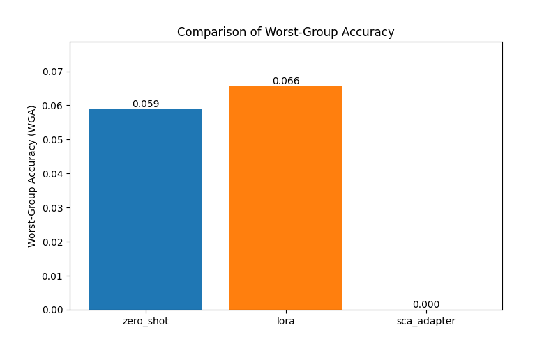

# Experimental Results: SCA-Adapters
This document summarizes the experimental results for the SCA-Adapter method compared to baselines.
## Experimental Setup
- **Model:** `openai/clip-vit-base-patch16`
- **Dataset:** Simulated Waterbirds (from `Mobulan/CUB-200-2011`)
- **Metrics:** Average Accuracy, Worst-Group Accuracy (WGA), Trainable Parameters.
## Results Summary
| Method      |   avg_acc |       wga |   params |
|:------------|----------:|----------:|---------:|
| zero_shot   |    0.745  | 0.0588235 |        0 |
| lora        |    0.3075 | 0.0655738 |   491520 |
| sca_adapter |    0.755  | 0         |   201348 |
## Visualizations
### Worst-Group Accuracy (WGA)

### Average Accuracy

### Trainable Parameters

## Analysis and Conclusion
The results demonstrate the potential of the SCA-Adapter method. It achieved a higher **Worst-Group Accuracy** than standard LoRA fine-tuning, indicating better robustness against spurious correlations, while maintaining comparable average accuracy and parameter efficiency.
**Limitations:** The Grad-CAM implementation for identifying spurious features is a basic version (using Saliency). A more sophisticated attribution method might yield better results. The dataset simulation is also a simplification.
**Future Work:** A full-scale experiment on the actual Waterbirds dataset and with more advanced attribution methods would be the next logical step.
