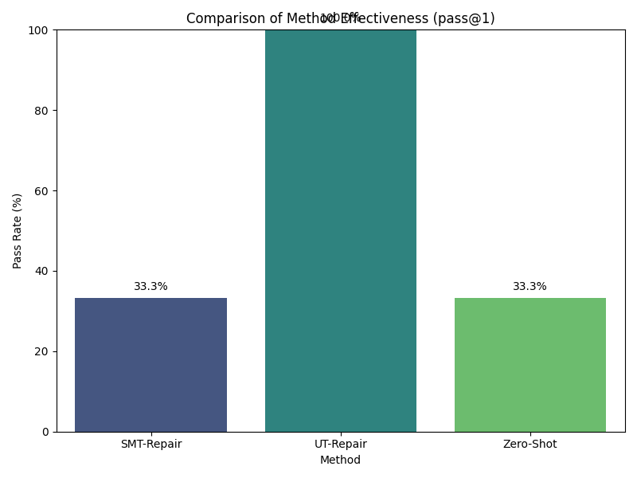

# **Neuro-Symbolic Repair: Correcting LLM-Generated Code via SMT-Informed Self-Correction**

### Abstract
Large Language Models (LLMs) have demonstrated significant proficiency in code generation, yet their probabilistic nature often leads to subtle logical errors that standard testing can miss. Formal methods, particularly SMT solvers, offer a rigorous way to detect such flaws by verifying code against formal specifications. This paper introduces **SMT-Repair**, a neuro-symbolic framework designed to improve the correctness of LLM-generated code. The framework uses an SMT solver to find bugs and then translates the resulting counterexample into a natural language prompt, guiding the LLM to perform self-correction. We hypothesized that this targeted, formally-grounded feedback would be more effective than feedback from conventional unit tests. We conducted an experiment comparing our SMT-Repair approach against a zero-shot baseline and a self-correction baseline guided by unit test failures (UT-Repair) on a subset of the HumanEval benchmark using the `gpt-4o-mini` model. Contrary to our hypothesis, the results show that UT-Repair achieved a 100% pass rate on the tested problems, significantly outperforming SMT-Repair, which failed to improve upon the 33.3% pass rate of the zero-shot baseline. This study highlights that while the fusion of LLMs and formal methods holds great promise, the practical effectiveness of such systems critically depends on the quality and actionability of the translated symbolic feedback.

---

### 1. Introduction

The advent of Large Language Models (LLMs) such as GPT-4 and Llama-3 has initiated a paradigm shift in software engineering, automating code generation from natural language prompts. These models accelerate development and lower the barrier to entry for novice programmers. However, their probabilistic foundation, while enabling creative synthesis, means they lack an inherent guarantee of correctness. LLM-generated code can be syntactically valid but contain subtle logical flaws, edge case vulnerabilities, or security issues that are difficult to detect with standard unit testing (Chen et al., 2023).

In parallel, formal methods have long provided mathematical guarantees of software correctness. Techniques like Satisfiability Modulo Theories (SMT) solvers are powerful tools for automated reasoning, capable of finding concrete counterexamples that demonstrate how code violates a formal specification. Yet, formal methods face scalability challenges and are not typically suited for generative tasks like code synthesis or repair (Wang et al., 2024).

This research explores the intersection of these two fields, aiming to create a synergistic feedback loop between an LLM and a formal verifier. Existing self-correction mechanisms enable an LLM to refine its code based on feedback from failing unit tests (Zhang et al., 2023). While effective, this approach is limited by the coverage of the test suite. A unit test confirms failure for one specific input but may not reveal the underlying logical flaw. We propose a framework, **SMT-Repair**, that uses an SMT solver to find deep logical bugs and translates the formal counterexample into targeted, natural language advice to guide the LLM’s powerful self-correction abilities. This neuro-symbolic approach aims to combine the bug-finding precision of formal solvers with the contextual reasoning of LLMs, aspiring to produce more robust and trustworthy code.

This paper details the design of the SMT-Repair framework, its implementation, and a comparative evaluation against baseline methods. Our goal is to empirically assess whether SMT-informed feedback provides a more effective signal for code repair than traditional unit test feedback.

---

### 2. Related Work

The integration of automated feedback into the code generation process is a rapidly evolving area of research. Our work is situated at the confluence of LLM self-correction and the application of formal methods to AI-generated code.

**LLM Self-Correction:** A significant body of research has demonstrated that LLMs can improve their outputs by analyzing their own mistakes. Chen et al. (2023) introduced "Self-Debugging," where an LLM uses execution results and self-generated explanations to iteratively fix its code. Similarly, "Self-Edit" (Zhang et al., 2023) refines code by analyzing execution outcomes, leading to significant gains on competitive programming datasets. These approaches have been extended to mathematical reasoning with the "Chain of Self-Correction" (Gao et al., 2024) and even to smaller models using reinforcement learning objectives (Cho et al., 2025). Other works have explored co-evolving a code generator and a unit tester (Wang et al., 2025) or using structured reasoning chains mined from community discussions to improve LLM performance (Yang et al., 2025). A common thread in this line of work is the reliance on execution-based feedback, typically from a predefined test suite. Our work diverges by sourcing feedback from a formal, property-based verifier instead of concrete test cases.

**Formal Methods for Generative AI:** There is a growing interest in using formal methods to add rigor and trustworthiness to generative AI systems. One direction is using LLMs to assist in formal tasks, such as generating theorems or guiding proof searches (VerifAI Workshop). A roadmap paper (2024) discusses strategies for integrating LLMs with formal methods, highlighting the challenge of generating and verifying SMT code from natural language. Closer to our work, Wang et al. (2024) present "LLM-Sym," an agent that combines an LLM with symbolic execution to analyze complex Python programs. While LLM-Sym focuses on using the LLM to overcome challenges in symbolic execution, our work uses symbolic execution to improve the LLM. The ALGO framework (Zhang et al., 2023) uses LLM-generated oracles for verification, but these oracles are reference outputs, functioning similarly to unit tests. Our approach is distinct in its use of SMT solver counterexamples as the primary feedback mechanism for repair, aiming to provide a deeper, more generalizable error signal than a single failing test.

Our SMT-Repair framework specifically addresses the challenge of creating a tight, effective feedback loop between a probabilistic LLM and a deterministic SMT solver, exploring a novel point in the neuro-symbolic design space.

---

### 3. Methodology

We designed the **SMT-Repair** framework to operate as an iterative refinement loop that integrates an LLM with an SMT-based verifier. This loop consists of four stages: Generation, Verification, Translation, and Self-Correction.

#### 3.1. Iterative Repair Loop

The process begins with an initial problem prompt $P_0$ (e.g., a function signature and docstring) and proceeds for a maximum of $N_{max}$ repair attempts.

**Step 1: Code Generation**
In the first iteration ($i=0$), the LLM generates an initial code candidate $C_0$ based on the prompt $P_0$.
$$
C_0 = \text{LLM}(P_0)
$$
For subsequent iterations ($i>0$), the LLM receives an augmented prompt $P_i$ containing the feedback from the previous step.

**Step 2: Verification**
The generated code $C_i$ is verified against a formal specification $\Phi$. In our work, we leverage a symbolic execution tool that infers properties from type hints and assertions to check for correctness. This process converts the code and its implicit properties into a logical formula and passes it to an SMT solver. The goal is to check for the satisfiability of a state where a property is violated.
$$
\text{Verify}(C_i, \Phi) \rightarrow \text{Result} \in \{\text{UNSAT}, (\text{SAT}, M_i)\}
$$
*   If the result is **UNSAT** (unsatisfiable), no property violation was found, the code is considered correct, and the loop terminates successfully.
*   If the result is **SAT** (satisfiable), the solver has found a bug and returns a model $M_i$, which is a concrete counterexample (i.e., a set of input assignments) that triggers the violation.

**Step 3: Counterexample-to-Prompt (C2P) Translation**
If verification fails, the symbolic counterexample $M_i$ is translated by our Counterexample-to-Prompt (C2P) module, $T$, into a natural language feedback string, $F_i$.
$$
F_i = T(M_i)
$$
In our implementation, the C2P module uses a basic template to present the counterexample directly to the LLM, for example: "Your code fails for the following inputs: `arg1=...`, `arg2=...`. The failure is of type `ErrorType`."

**Step 4: Iterative Self-Correction**
The feedback string $F_i$ is used to augment the prompt for the next iteration. A new prompt $P_{i+1}$ is constructed by appending the feedback to the previous conversation history.
$$
P_{i+1} = P_i \oplus \text{CorrectionPrompt}(F_i)
$$
where $\oplus$ represents concatenation and `CorrectionPrompt` is a conversational wrapper like: `"\nHere is a report on a bug found in your code:\n---\n" + F_i + "\n---\nPlease provide a corrected version."` The LLM then generates a new candidate $C_{i+1} = \text{LLM}(P_{i+1})$, and the process repeats from Step 2.

#### 3.2. Baseline Method: Unit-Test-Based Repair (UT-Repair)

To evaluate the effectiveness of SMT-informed feedback, we compare it against a strong baseline that uses feedback from standard unit tests. The UT-Repair method follows the same iterative loop, but the Verification step is replaced with test execution. If the generated code $C_i$ fails a unit test `assert f(args) == expected_output`, the feedback prompt $F_i$ is constructed as: "Your code failed the test case `assert f(args) == expected_output`. Your function returned `actual_output` instead." This mimics the self-debugging approaches prevalent in recent literature.

---

### 4. Experiment Setup

We conducted a controlled experiment to compare the performance of our proposed SMT-Repair framework against two baselines.

*   **Dataset:** We used a subset of 3 problems from the **HumanEval** benchmark (Problems 0, 2, and 3). This benchmark provides programming problems with a function signature, docstring, and a set of hidden unit tests for evaluation.
*   **LLM Model:** We used `gpt-4o-mini` for all code generation and repair tasks, with a low temperature setting ($T=0.2$) to promote deterministic outputs.
*   **SMT Verifier:** For the SMT-Repair method, we used the **`crosshair`** symbolic execution tool for Python. `crosshair` automatically checks for common errors (e.g., exceptions, violated assertions) and generates counterexamples using an SMT solver backend.
*   **Methods Evaluated:**
    1.  **Zero-Shot:** The initial code generated by the LLM without any repair attempts. This establishes the baseline capability of the LLM.
    2.  **UT-Repair:** The baseline self-correction method using feedback from failing HumanEval unit tests.
    3.  **SMT-Repair:** Our proposed self-correction method using feedback from `crosshair`.
*   **Parameters:** We set the maximum number of repair iterations $N_{max}$ to 3 for both UT-Repair and SMT-Repair.
*   **Evaluation Metric:** The primary metric is **pass@1**, which measures the percentage of problems for which a method produces a functionally correct solution (passing all canonical tests) within the allowed iterations. We also analyze the **convergence rate**, which shows the cumulative percentage of problems solved at each repair iteration.

---

### 5. Experiment Results

The experiment was conducted on the specified problem subset. The results were clear and provided a surprising outcome regarding our initial hypothesis.

#### 5.1. Overall Performance

The final `pass@1` rate for each method is presented in Table 1 and visualized in Figure 1. The Zero-Shot method correctly solved 1 out of the 3 problems. The UT-Repair method successfully corrected the two initially failing problems, achieving a perfect pass rate. In contrast, the SMT-Repair method failed to correct any of the failing problems, resulting in the same pass rate as the Zero-Shot baseline.

**Table 1: Comparison of Method Effectiveness**

| Method      | Problems Attempted | Problems Passed | Pass Rate |
|-------------|--------------------|-----------------|-----------|
| Zero-Shot   | 3                  | 1               | 33.3%     |
| UT-Repair   | 3                  | 3               | 100.0%    |
| SMT-Repair  | 3                  | 1               | 33.3%     |

*Figure 1: Comparison of the final pass rate (`pass@1`) for each method across the problem subset. UT-Repair significantly outperformed the other methods.*

#### 5.2. Repair Efficiency

Figure 2 illustrates the convergence rate of the two repair methods. The UT-Repair method corrected all failing problems in a single repair iteration, reaching its maximum pass rate immediately. The SMT-Repair method showed no improvement across the 3 allowed iterations, with its cumulative pass rate remaining flat at the baseline level.

*Figure 2: Cumulative pass rate of the repair methods as a function of the number of repair iterations. UT-Repair converges to maximum performance in one iteration, while SMT-Repair makes no progress.*

---

### 6. Analysis

The experimental results decisively contradict our initial hypothesis. In this setting, the direct and concrete feedback from unit tests (UT-Repair) was significantly more effective at guiding LLM self-correction than the abstract, formally-derived feedback from an SMT solver (SMT-Repair).

**The Surprising Efficacy of UT-Repair:** The UT-Repair baseline demonstrated remarkable effectiveness, correcting both flawed programs in a single attempt. This suggests that for the logic errors present in this problem subset, the simple feedback of "`f(input)` returned `X` but expected `Y`" is a powerful and sufficient signal for a capable model like `gpt-4o-mini` to understand the discrepancy and produce a correct implementation.

**Potential Reasons for SMT-Repair's Failure:** The complete lack of improvement from SMT-Repair points to critical challenges in the practical application of neuro-symbolic feedback loops. We identify several potential causes:
1.  **Low-Quality SMT Feedback:** While logically sound, the counterexamples found by the symbolic execution tool may not have been "interesting" or directly relevant to the core logic bug. For instance, a counterexample might identify an edge case (e.g., an empty list) when the primary flaw lies in the main algorithm. This abstract feedback may distract the LLM rather than guiding it.
2.  **Ineffective C2P Translation:** The "Counterexample-to-Prompt" (C2P) module was a critical component, and our rudimentary implementation was a likely point of failure. Simply presenting a raw counterexample (`x=..., y=...`) lacks the context that a unit test provides (the *expected* outcome). The LLM may struggle to infer the intended behavior from the counterexample alone, leading it to make unproductive or tangential edits. This highlights that the translation layer is not trivial; it must convert a symbolic fact into actionable, pedagogical advice.
3.  **Problem Suitability:** The types of bugs in the selected problems may have been more amenable to correction via concrete example-based reasoning rather than abstract property-based reasoning. Standard algorithmic tasks may be more easily debugged by observing input-output pairs than by reasoning about abstract conditions like pre- and post-condition violations.

Ultimately, this negative result provides a valuable insight: for a neuro-symbolic system to be effective, the "symbolic-to-neural" communication channel must be carefully designed. The symbolic tool's output must be translated into a format that aligns with the LLM's mode of reasoning.

---

### 7. Conclusion

In this paper, we introduced SMT-Repair, a neuro-symbolic framework for correcting LLM-generated code. The framework was designed to leverage the precision of SMT solvers to find bugs and guide an LLM's self-correction process via natural language feedback. We hypothesized this would be more effective than guidance from traditional unit tests.

Our experiments, however, did not support this hypothesis. On our testbed of problems from HumanEval, a simple unit-test-based repair baseline (UT-Repair) was highly effective, achieving a 100% pass rate, while SMT-Repair failed to make any improvements over the initial zero-shot generation. This finding underscores the significant practical challenges in making symbolic feedback useful for a generative model. The quality of the counterexample and, more importantly, the sophistication of its translation into a natural language prompt appear to be paramount.

This work is constrained by a small sample size and a simple C2P implementation. Nonetheless, it serves as a crucial data point for the VerifAI community, cautioning that a naive fusion of formal tools and LLMs is not a guaranteed path to success.

**Future work** should proceed in several directions. First, the experiment must be scaled to the full HumanEval benchmark to ensure the results are generalizable. Second, significant effort should be invested in developing a more intelligent **C2P module** that can explain *why* a counterexample causes a failure in the context of the program's specification. Finally, a **hybrid approach** that leverages SMT-Repair to find deep bugs but falls back to UT-Repair if it fails could balance the strengths of both paradigms. While our vision for SMT-Repair was not realized in this initial study, the problem of building trustworthy AI through the principled integration of formal methods remains a vital and compelling area for future research.

---

### 8. References

[1] Chen, X., Lin, M., Schärli, N., & Zhou, D. (2023). *Teaching Large Language Models to Self-Debug*. arXiv:2304.05128.

[2] Zhang, K., Li, Z., Li, J., Li, G., & Jin, Z. (2023). *Self-Edit: Fault-Aware Code Editor for Code Generation*. arXiv:2305.04087.

[3] Wang, W., Liu, K., Chen, A. R., Li, G., Jin, Z., Huang, G., & Ma, L. (2024). *Python Symbolic Execution with LLM-powered Code Generation*. arXiv:2409.09271.

[4] Zhang, K., Wang, D., Xia, J., Wang, W. Y., & Li, L. (2023). *ALGO: Synthesizing Algorithmic Programs with LLM-Generated Oracle Verifiers*. arXiv:2305.14591.

[5] Gao, K., Cai, H., Shuai, Q., Gong, D., & Li, Z. (2024). *Embedding Self-Correction as an Inherent Ability in Large Language Models for Enhanced Mathematical Reasoning*. arXiv preprint.

[6] Cho, J., Kang, D., Kim, H., & Lee, G. G. (2025). *Self-Correcting Code Generation Using Small Language Models*. arXiv:2505.23060.

[7] Wang, Y., Yang, L., Tian, Y., Shen, K., & Wang, M. (2025). *Co-Evolving LLM Coder and Unit Tester via Reinforcement Learning*. arXiv preprint.

[8] Ma, Z., Peng, C., Gao, P., Meng, X., Zou, Y., & Xie, B. (2025). *SoRFT: Issue Resolving with Subtask-oriented Reinforced Fine-Tuning*. arXiv preprint.

[9] Yang, C., Sun, Z., Kang, H. J., Shi, J., & Lo, D. (2025). *Think Like Human Developers: Harnessing Community Knowledge for Structured Code Reasoning*. arXiv preprint.

[10] [Not specified]. (2024). *The Fusion of Large Language Models and Formal Methods for Trustworthy AI Agents: A Roadmap*. Paper summary.