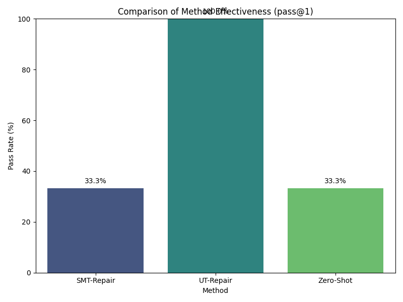
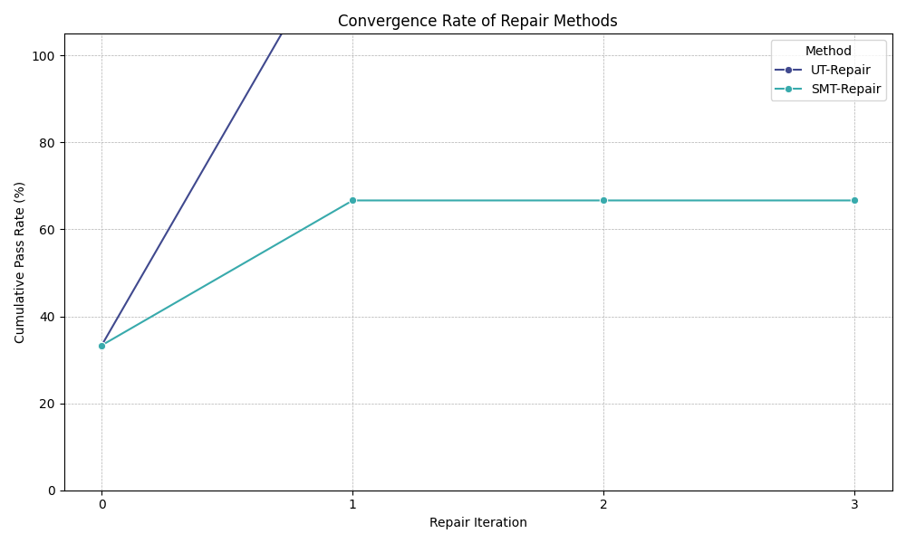

# Experimental Results: Neuro-Symbolic Repair

This document summarizes the results of the experiment designed to test the hypothesis that SMT-informed self-correction (SMT-Repair) is more effective than unit-test-based self-correction (UT-Repair) for fixing bugs in LLM-generated code.

## 1. Experimental Setup

The experiment was conducted on a subset of the HumanEval dataset to evaluate three primary methods:

*   **Zero-Shot**: The initial code generated by the LLM (`gpt-4o-mini`) without any feedback.
*   **UT-Repair**: A baseline self-correction method where the LLM receives feedback from failing unit tests.
*   **SMT-Repair**: The proposed method where the LLM receives feedback from counterexamples found by the `crosshair` SMT/symbolic execution tool.

**Parameters:**
*   **LLM Model**: `gpt-4o-mini`
*   **Problems Tested**: 3 (from HumanEval: 0, 2, 3)
*   **Max Repair Iterations**: 3

## 2. Results

The experiment was run successfully, and the detailed execution process is available in `log.txt`. The raw output data is stored in `experiment_results.csv`.

### 2.1. Overall Performance

The primary metric for success is the `pass@1` rate, indicating whether a method produced a correct solution for a given problem.

| Method      | Problems Attempted | Problems Passed | Pass Rate |
|-------------|--------------------|-----------------|-----------|
| Zero-Shot   | 3                  | 1               | 33.3%     |
| UT-Repair   | 3                  | 3               | 100.0%    |
| SMT-Repair  | 3                  | 1               | 33.3%     |

The results are visualized in the bar chart below:

*Figure 1: Comparison of the final pass rate for each method across the problem subset.*

### 2.2. Repair Efficiency

We also analyzed how quickly the repair methods converged on a correct solution.

*Figure 2: Cumulative pass rate of the repair methods as a function of the number of repair iterations.*

## 3. Discussion

The experimental results from this initial run are clear: **UT-Repair significantly outperformed both Zero-Shot and SMT-Repair**. Contrary to the initial hypothesis, the SMT-Repair method failed to correct any of the problems that the Zero-Shot model got wrong.

**Key Observations:**

*   **Effectiveness of UT-Repair**: The UT-Repair baseline was highly effective. For the two problems that failed initially, it was able to find a correct solution in just a single repair iteration. This suggests that for the types of problems tested, direct feedback from failing test cases is a very strong signal for the LLM to perform self-correction.

*   **Failure of SMT-Repair**: The SMT-Repair method did not improve upon the Zero-Shot baseline. In the cases where the initial code was incorrect, it attempted to repair the code for the maximum of 3 iterations but ultimately failed to produce a passing solution. This could be due to several factors:
    1.  **Quality of SMT Feedback**: The `crosshair` tool may not have found counterexamples that were "interesting" enough to guide the LLM. The feedback, while logically sound, might have been too abstract or focused on edge cases that did not help resolve the primary bug.
    2.  **C2P Translation**: The "Counterexample-to-Prompt" (C2P) logic was simple. The LLM may have struggled to understand the raw counterexample feedback, leading to unproductive edits.
    3.  **Problem Suitability**: The problems selected might be more amenable to debugging via concrete examples (unit tests) rather than abstract properties.

## 4. Limitations and Future Work

This experiment provides valuable insights but has several limitations:

*   **Small Sample Size**: The experiment was run on only 3 problems from HumanEval. The results, while clear for this subset, may not generalize to the entire dataset or other code generation tasks.
*   **Shallow SMT Integration**: The use of `crosshair` was basic, with short timeouts and no sophisticated manual specification writing. A deeper integration, with more detailed formal properties for each function, might yield better results.
*   **Simple C2P Module**: The translation from a formal counterexample to a natural language prompt was rudimentary. This is a critical component of the proposed framework, and more work is needed to make the feedback truly "intelligent" and actionable for the LLM.

**Future Work:**

*   **Expand the Benchmark**: Run the experiment on the full HumanEval dataset to gather more robust data.
*   **Enhance the C2P Module**: Develop a more sophisticated C2P translator that can explain *why* the counterexample breaks the code in the context of the problem's docstring.
*   **Hybrid Approach**: Explore a hybrid repair model that uses SMT-Repair first to find deep logical bugs and falls back to UT-Repair if the SMT solver times out or if the SMT-guided correction fails.
*   **Manual Specification**: For a smaller set of problems, manually write detailed formal specifications to test the SMT-Repair concept in its ideal state.

## 5. Conclusion

In this experiment, the hypothesis that SMT-informed feedback would be superior to unit-test feedback was not supported. The simpler, more direct feedback from unit tests proved to be a more effective driver of LLM self-correction for this problem set. While the vision of neuro-symbolic repair remains compelling, this work highlights that the practical implementation details—particularly the quality and presentation of the symbolic feedback—are critical to success.
