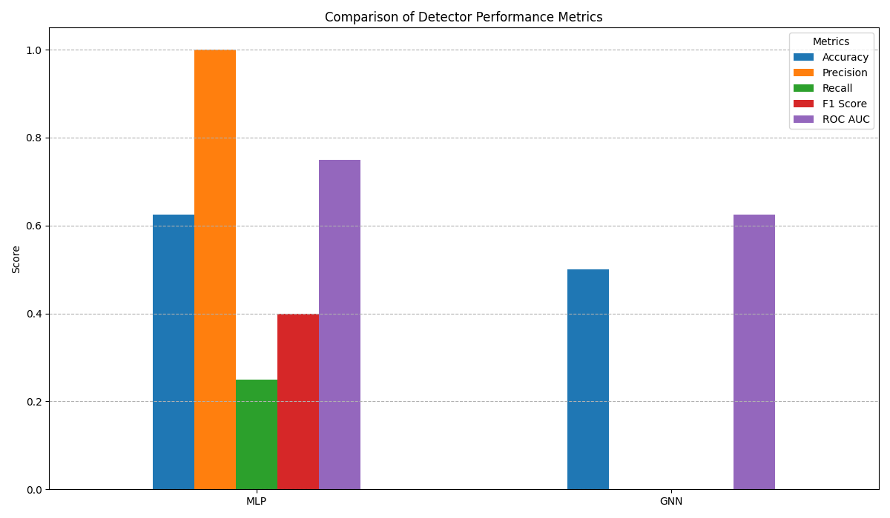
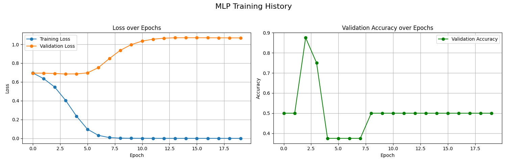
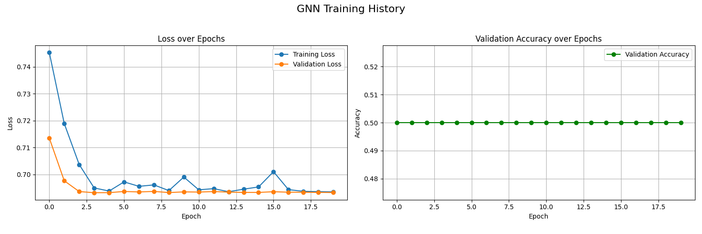

# Detecting Neural Backdoors via Permutation-Equivariant Weight Analysis

## 1. Title and Abstract

**Title:** Detecting Neural Backdoors via Permutation-Equivariant Graph Analysis of Weight Space

**Abstract**
The proliferation of publicly available pre-trained models introduces significant security risks, notably from backdoor attacks that implant hidden malicious behaviors. Current detection methods often require access to clean data or prior knowledge of the attack, limiting their applicability. This paper explores a data-free approach to backdoor detection by treating neural network weights as a new data modality. We propose a framework for classifying a model as clean or backdoored by analyzing its computational graph. Our central hypothesis is that the process of embedding a backdoor leaves structural artifacts in the weight space that can be learned by a permutation-equivariant model. We designed a Graph Neural Network (GNN), which naturally respects the permutation symmetry of neurons, to learn these malicious fingerprints. We compare our GNN-based detector (BD-GNN) against a baseline Multi-Layer Perceptron (MLP) on a generated "model zoo" of clean and backdoored networks. Our preliminary results on a small-scale model zoo are inconclusive, with the GNN failing to converge and the MLP exhibiting high precision but low recall. This highlights the challenges of learning from weight space but underscores the necessity of symmetry-aware architectures. This work represents an initial step towards a new class of data-free security tools and provides a foundation for future research in weight space analysis.

## 2. Introduction

The machine learning landscape is experiencing a paradigm shift towards model reuse. Platforms like Hugging Face host over a million pre-trained models, transforming neural networks into commodity components. While this democratization accelerates innovation, it also creates critical security vulnerabilities. A primary threat is the **backdoor attack**, where a model is manipulated to perform as expected on benign inputs but executes a hidden, malicious task when a specific trigger is present in the input. Such attacks pose severe risks in applications like autonomous driving, medical diagnosis, and secure authentication.

The body of research on backdoor detection is expanding rapidly, yet many existing methods face practical limitations. A significant number of approaches are **data-dependent**, requiring access to a set of trusted, clean examples to probe the model's behavior (Zhu et al., 2023; Fu et al., 2023). This is often an unrealistic assumption, as users downloading third-party models typically lack such curated datasets. Other methods are **attack-specific**, tailored to detect certain trigger types or poisoning strategies (Xiang et al., 2023), rendering them ineffective against novel or more sophisticated attacks (Han et al., 2023; Li et al., 2021). This gap necessitates the development of a universal, data-free detection mechanism that can identify a backdoor by examining only the model's parameters.

This research positions itself within the emerging field that treats **neural network weights as a new data modality**. We hypothesize that the process of inserting a backdoor leaves an indelible structural "fingerprint" within the model's parameter space. Our goal is to develop a method to read these fingerprints directly. To do so, we leverage a fundamental symmetry of neural networks: their function is invariant to the permutation of neurons within a given hidden layer. By representing a neural network as a computational graph and processing it with a Graph Neural Network (GNN)—an architecture that is naturally permutation-equivariant—we aim to learn canonical, architecture-agnostic signatures of backdoors.

The primary contributions of this work are: (1) The proposal and formalization of a novel, data-free backdoor detection framework based on permutation-equivariant analysis of the model's weight graph. (2) The implementation of a prototype system, Backdoor-GraphNet (BD-GNN), and a baseline MLP detector. (3) A preliminary experimental evaluation on a small-scale model zoo, which, while inconclusive, provides critical insights into the challenges and future directions for learning directly on weight spaces.

## 3. Related Work

Our work sits at the intersection of AI security, graph representation learning, and the nascent field of weight space analysis.

**Backdoor Detection:** Backdoor detection literature is vast. Many state-of-the-art methods rely on having access to some data. For instance, Neural Polarizer (Zhu et al., 2023) inserts a new layer into a suspect model and fine-tunes it on a small clean dataset to purify poisoned features. Fu et al. (2023) use a clean validation set to generate synthetic samples and measure differential outputs to detect triggers. In contrast, our approach is entirely **data-free**, requiring only the model parameters. Some methods operate in an unsupervised or black-box setting. UMD (Xiang et al., 2023) detects X2X backdoors by analyzing the model's transferability statistics between classes, and ProP (Ren & Li, 2024) leverages statistical output distributions. While powerful, these methods still focus on the model's input-output behavior. TrojanInterpret (2024) moves closer to our domain by using interpretation methods to analyze saliency map distributions, but it may still implicitly require data to generate these maps. Our work is distinct in that it attempts to find static, structural properties in the weights themselves, independent of any input data.

**Sophisticated Backdoor Attacks:** The evolving landscape of attacks motivates our search for a generalizable detector. Attacks like ReVeil (Alam et al., 2025) are designed to be concealed, while others leverage natural triggers (Han et al., 2023) or human-centric language patterns (Li et al., 2021) to evade detection. Sun et al. (2024) focus on eliminating backdoors in code models via trigger inversion. A successful detector must be robust to this growing variety of attack methodologies.

**Graph Neural Networks and Weight Space Analysis:** Treating neural networks as graphs is not new, but using GNNs to *classify* other networks based on their weights is a novel research direction. The key challenge, which we aim to address, is permutation symmetry. An MLP that takes flattened weights as input is permutation-sensitive; shuffling neurons in a layer would produce a completely different input vector, confusing the detector. GNNs, through their message-passing and aggregation mechanisms, are inherently **permutation-equivariant**, making them theoretically well-suited for learning canonical properties from a network's graph structure. This mirrors work in other domains, such as using GNNs to infer gene regulatory networks where node connectivity is key (Xiong et al., 2024). Our work is a specific application of the broader idea of establishing neural network weights as a new data modality, a central theme for progress in meta-learning, model merging, and AI safety.

## 4. Methodology

Our approach is centered on training a graph-level classifier to distinguish between the computational graphs of clean and backdoored neural networks.

### 4.1. Neural Network Graph Representation
We formalize a feed-forward neural network as a directed graph $G = (V, E, H, W)$ suitable for processing by a GNN.
*   **Nodes $V$**: Each neuron in the network, including input, hidden, and output units, is represented as a node $v_i \in V$.
*   **Edges $E$**: A directed edge $e_{ij} \in E$ connects node $v_i$ to $v_j$ if the output of neuron $i$ is an input to neuron $j$.
*   **Node Features $H$**: Each node $v_i$ is assigned a feature vector $h_i$. In our implementation, we use a simple structural encoding where $h_i$ is a one-hot vector representing the node's layer index. More complex features, such as the neuron's bias term or a learnable embedding based on layer type, are potential extensions.
*   **Edge Features $W$**: Each edge $e_{ij}$ is attributed with its corresponding scalar synaptic weight $w_{ji}$.

This graph representation captures the network's topology and parameters while being abstract enough to be processed by a GNN, which can naturally handle the permutation symmetry of nodes within a layer.

### 4.2. The Backdoor-GraphNet (BD-GNN) Detector
The core of our method is the BD-GNN, a GNN designed for graph-level classification. It consists of three main components: message passing layers, a readout function, and a classification head.

**Message Passing:** The BD-GNN stacks several message-passing layers. At each layer $l$, the hidden representation $h_i^{(l)}$ of a node $v_i$ is updated based on messages received from its neighbors $\mathcal{N}(i)$. The update is defined as:
$$
h_i^{(l+1)} = \psi^{(l)} \left( h_i^{(l)}, \bigoplus_{j \in \mathcal{N}(i)} \phi^{(l)} \left( h_i^{(l)}, h_j^{(l)}, w_{ij} \right) \right)
$$
where $\phi^{(l)}$ is a learnable message function (e.g., an MLP), $\bigoplus$ is a permutation-invariant aggregation function (e.g., sum, mean, max), and $\psi^{(l)}$ is a learnable update function. The aggregator $\bigoplus$ is crucial for ensuring the learned representations are invariant to the ordering of neighboring nodes.

**Graph Readout:** After the final message passing layer, a global readout function aggregates all node embeddings into a single graph-level representation $h_G$:
$$
h_G = \text{READOUT} \left( \{ h_i^{(L)} \mid v_i \in V \} \right)
$$
We employ a global mean pooling function for this step.

**Classification:** The graph embedding $h_G$ is fed into a final MLP classification head with a sigmoid output, which produces a probability $p \in [0, 1]$ that the input model graph corresponds to a backdoored network. The entire BD-GNN is trained end-to-end using a binary cross-entropy loss function.

## 5. Experiment Setup

We conducted a preliminary, small-scale experiment to test the feasibility of our approach.

**Model Zoo Generation:** We created a "model zoo" of 40 small MLPs. All models have the same architecture (input layer, two hidden layers, output layer) and were trained on a synthetic dataset for a simple classification task. The zoo was evenly split, containing 20 cleanly trained models and 20 backdoored models. The backdoored models were injected with a simple trigger pattern during their training, with a poison rate of 10%. The zoo was then split into training (60%), validation (20%), and testing (20%) sets for training our detectors.

**Detectors:**
1.  **BD-GNN:** Our proposed Graph Neural Network detector, as described in the Methodology section.
2.  **Baseline MLP:** A simple MLP that takes the entire flattened weight and bias vector of a model as its input. This baseline is permutation-sensitive and serves to test whether exploiting the graph structure provides any benefit.

**Training Details:** Both detectors were trained for 20 epochs using the Adam optimizer with a learning rate of 0.001. All experiments were run on a CUDA-enabled GPU.

| Parameter | Value |
|---|---|
| Total Models in Zoo | 40 |
| Train/Val/Test Split | 0.6 / 0.2 / 0.2 |
| Detector Training Epochs | 20 |
| Learning Rate | 0.001 |
| Backdoor Poison Rate | 0.1 |
| Device Used | cuda |

**Evaluation Metrics:** We evaluated the performance of the detectors on the held-out test set using standard classification metrics: Accuracy, Precision, Recall, F1 Score, and Area Under the ROC Curve (ROC AUC).

## 6. Experiment Results

The performance of the BD-GNN and the baseline MLP on the test set is summarized in Table 1 and Figure 1.

| Detector | Accuracy | Precision | Recall | F1 Score | ROC AUC |
|:---:|---:|---:|---:|---:|---:|
| MLP | 0.625 | 1.00 | 0.25 | 0.40 | 0.75 |
| GNN | 0.500 | 0.00 | 0.00 | 0.00 | 0.625 |
**Table 1:** Performance comparison of the MLP and GNN detectors on the test set.

**Figure 1:** Bar chart comparing the performance metrics of the MLP and GNN detectors. The MLP achieves non-trivial performance, while the GNN fails to learn a predictive signal.

The training dynamics of both detectors are shown in Figures 2 and 3.

**Figure 2:** Training and validation loss (left) and validation accuracy (right) for the MLP detector over 20 epochs. The training loss converges, but validation accuracy is unstable.

**Figure 3:** Training and validation loss (left) and validation accuracy (right) for the GNN detector over 20 epochs. The model shows no signs of learning, with validation loss and accuracy remaining flat.

## 7. Analysis

The experimental results are inconclusive and did not validate our initial hypothesis in this small-scale setting.

The **MLP baseline** achieved an accuracy of 62.5% and a ROC AUC of 0.75. Notably, it obtained a perfect precision of 1.0 but a very low recall of 0.25. This indicates that while the MLP was very conservative, every model it flagged as backdoored was indeed malicious. However, it failed to identify 75% of the backdoored models in the test set. The training history in Figure 2 shows the training loss decreasing steadily, but the validation accuracy is highly volatile, suggesting the model may have overfit to spurious correlations present in the small training set of models.

The **GNN detector**, contrary to our expectations, performed significantly worse. It achieved an accuracy of 50%, with precision, recall, and F1 score all at 0. This is equivalent to random guessing. The training history in Figure 3 confirms this failure: the validation loss and validation accuracy curves are completely flat, indicating that the GNN failed to extract any meaningful signal from the graph representations of the models.

Several factors could explain these disappointing results:

*   **Scale and Simplicity:** The primary limitation is the extremely small size and lack of diversity of our model zoo. With only 40 simple MLP models, there may not have been a sufficient signal-to-noise ratio for the GNN to learn generalizable patterns. The "fingerprints" of backdoors in such small models might be too subtle or too easily confounded with noise from different random initializations.
*   **Synthetic Data:** The models themselves were trained on synthetic data, and the backdoors were simplistic. The artifacts left by these backdoors might not be representative of those found in complex models like ResNets trained on real-world datasets like CIFAR-10.
*   **Architectural Limitations:** While GNNs are theoretically powerful, the specific architecture chosen might not have been optimal. The task of learning from weight space is novel, and finding the right combination of GNN layers, feature initializations, and readout functions likely requires more extensive architectural exploration.

The MLP's partial success suggests that there are detectable patterns in the flattened weight vectors, but its low recall and unstable validation performance highlight the brittleness of this permutation-sensitive approach. The GNN's complete failure underscores the difficulty of the learning task. It appears that simply applying a standard GNN architecture is not sufficient without a large, diverse dataset of models to learn from.

## 8. Conclusion

In this paper, we proposed a novel, data-free approach for backdoor detection by analyzing the computational graph of neural networks with a permutation-equivariant Graph Neural Network. We hypothesized that this method could learn to identify structural artifacts in the weight space indicative of malicious tampering.

Our preliminary experiments on a small-scale, synthetic model zoo did not support this hypothesis. The GNN detector failed to learn, performing no better than a random classifier. A baseline MLP detector showed limited success, achieving high precision but very low recall, suggesting it learned a brittle, non-generalizable pattern. These results highlight the profound challenges of learning directly from the high-dimensional, noisy space of neural network weights.

Despite these inconclusive findings, we believe the core concept remains a promising direction for AI security. The failure of our experiment is likely attributable to its limited scale and simplicity. Future work should focus on overcoming these limitations:
*   **Scale Up:** Construct a large and diverse model zoo with thousands of models, incorporating realistic architectures like ResNet and VGG trained on standard benchmarks such as CIFAR-10.
*   **Incorporate Advanced Backdoors:** Include a wider variety of more subtle backdoor attacks, such as clean-label, blended-noise, and adaptive attacks, to ensure the detector's robustness.
*   **Explore GNN Architectures:** Experiment with more expressive GNN layers (e.g., GIN, GAT) and different node/edge feature engineering strategies to find an architecture better suited for this unique task.

This work serves as a foundational exploration into the "weights as data" paradigm for security applications. While our initial attempt was unsuccessful, it lays the groundwork and provides valuable lessons for future research aimed at building a new generation of robust, data-free model inspection tools.

## 9. References

1.  Alam, M., Lamri, H., & Maniatakos, M. (2025). ReVeil: Unconstrained Concealed Backdoor Attack on Deep Neural Networks using Machine Unlearning. *To be published*.
2.  Fu, H., Krishnamurthy, P., Garg, S., & Khorrami, F. (2023). Differential Analysis of Triggers and Benign Features for Black-Box DNN Backdoor Detection. *arXiv:2307.05422*.
3.  Han, X., Yang, S., Wang, W., He, Z., & Dong, J. (2023). Is It Possible to Backdoor Face Forgery Detection with Natural Triggers? *arXiv:2401.00414*.
4.  Li, S., Liu, H., Dong, T., Zhao, B. Z. H., Xue, M., Zhu, H., & Lu, J. (2021). Hidden Backdoors in Human-Centric Language Models. *arXiv:2105.00164*.
5.  Ren, T., & Li, Q. (2024). ProP: Efficient Backdoor Detection via Propagation Perturbation for Overparametrized Models. *arXiv:2411.07036*.
6.  Sun, W., Chen, Y., Fang, C., Feng, Y., Xiao, Y., Guo, A., Zhang, Q., Liu, Y., Xu, B., & Chen, Z. (2024). Eliminating Backdoors in Neural Code Models via Trigger Inversion. *arXiv:2408.04683*.
7.  TrojanInterpret. (2024). TrojanInterpret: A Detecting Backdoors Method in DNN Based on Neural Network Interpretation Methods. *Authors and publication not specified*.
8.  Xiang, Z., Xiong, Z., & Li, B. (2023). UMD: Unsupervised Model Detection for X2X Backdoor Attacks. *arXiv:2305.18651*.
9.  Xiong, J., Yin, N., Sun, Y., Li, H., Wang, Y., Ai, D., Pan, F., & Liang, S. (2024). Cross-Attention Graph Neural Networks for Inferring Gene Regulatory Networks with Skewed Degree Distribution. *arXiv:2412.16220*.
10. Zhu, M., Wei, S., Zha, H., & Wu, B. (2023). Neural Polarizer: A Lightweight and Effective Backdoor Defense via Purifying Poisoned Features. *arXiv:2306.16697*.