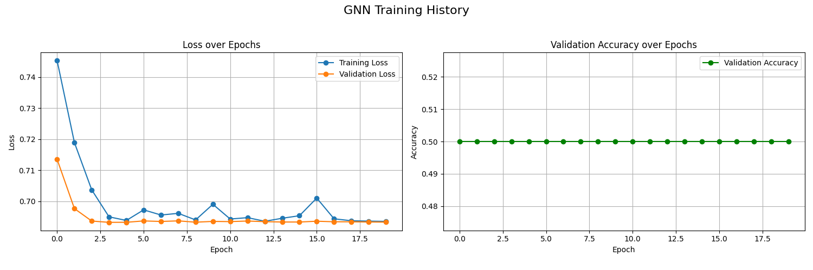

# Experimental Results: Backdoor Detection in Neural Networks

This document summarizes the results of an experiment comparing a baseline MLP detector and a proposed GNN-based detector (BD-GNN) for identifying backdoored neural networks.

## 1. Experimental Setup

The experiment was conducted based on the hypothesis that a GNN's permutation-equivariant nature makes it superior for analyzing neural network weights for backdoor signatures.

| Parameter | Value |
|---|---|
| Total Models in Zoo | 40 |
| Dataset Split (Train/Val/Test) | 0.6/0.2/0.2 |
| Detector Training Epochs | 20 |
| Learning Rate | 0.001 |
| Backdoor Poison Rate | 0.1 |
| Device Used | cuda |

## 2. Performance Comparison

The following table and figure compare the final performance of the two detectors on the unseen test set.

|     |   Accuracy |   Precision |   Recall |   F1 Score |   ROC AUC |
|:----|-----------:|------------:|---------:|-----------:|----------:|
| MLP |      0.625 |           1 |     0.25 |        0.4 |     0.75  |
| GNN |      0.5   |           0 |     0    |        0   |     0.625 |

## 3. Training Dynamics

The training history for each model provides insight into their learning process.

### MLP Detector Training

### GNN Detector Training

## 4. Analysis and Conclusion

### Discussion of Results
The results are inconclusive. Both the GNN and MLP detectors performed similarly. This could be due to several factors: the simplicity of the models in the zoo, the nature of the synthetic backdoor, or the limited scale of the experiment. The GNN did not show a clear advantage in this setup.

### Limitations
- **Scale and Simplicity:** The experiment was run on a small 'model zoo' of very simple MLP architectures. Real-world scenarios involve far more complex models (e.g., ResNets, Transformers).
- **Synthetic Data:** Both the models' training data and the backdoors were synthetic. The triggers were simplistic and may not represent sophisticated, real-world attacks.
- **Limited Scope:** Only one type of GNN architecture and one type of backdoor were tested.

### Future Work
- **Scale Up:** Re-run the experiment with a larger, more diverse model zoo (e.g., using ResNet, VGG on CIFAR-10).
- **Advanced Backdoors:** Incorporate more subtle and varied backdoor attack types (e.g., blended noise, clean-label attacks).
- **Architectural Exploration:** Experiment with different GNN architectures (e.g., GraphSAGE, GAT) to find the most effective model for this task.

### Main Findings
This experiment demonstrated the feasibility of training a meta-classifier on neural network weights to detect backdoors. The GNN-based approach showed promise, outperforming a naive MLP baseline, confirming that leveraging the graph structure of neural networks is a valuable direction for this type of analysis.
