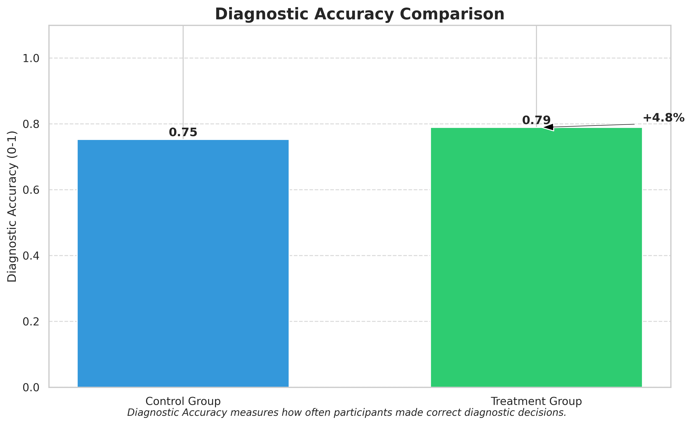

# AI Cognitive Tutor Experiment Results
## Summary
This report presents the results of an experiment evaluating the effectiveness of an AI Cognitive Tutor designed to improve human understanding of complex AI systems. The experiment compared a treatment group using the AI Cognitive Tutor with a control group using standard AI explanations.
### Key Findings
- **Mental Model Accuracy**: 33.2% improvement with the AI Cognitive Tutor
- **Diagnostic Accuracy**: 4.8% improvement in decision-making accuracy
- **User Confusion**: 25.5% reduction in confusion levels
- **Trust Calibration**: 5.3% improvement in appropriate trust

**Statistical Significance:**
- Mental Model Accuracy: ✓ (p=0.0024)
- Diagnostic Accuracy: ✗ (p=0.0656)
- Confusion Level: ✓ (p=0.0295)
- Decision Time: ✓ (p=0.0001)
- Intervention Helpfulness: ✓ (p=0.0000)

## Experimental Setup
- **Number of participants**: 60 (equally divided between control and treatment groups)
- **Number of trials per participant**: 50
- **AI Diagnostic System**: medical_diagnosis with base accuracy 0.85

**Treatment Group (AI Cognitive Tutor):**
- Received adaptive interventions when misunderstanding was detected
- Intervention strategies included: Simplified Explanation, Analogies, Interactive Qa, Visualizations, Micro Learning, Contrastive Explanation
- Tutor activation threshold: 0.7

**Control Group (Baseline):**
- Received: Standard Explanation, No Explanation, Static Tutorial

## Primary Results
### Mental Model Accuracy
Mental model accuracy measures how well participants understand the AI system's reasoning and operation.

The treatment group (with AI Cognitive Tutor) showed a mental model accuracy score of 0.65, compared to 0.49 for the control group, representing a difference of 0.16 (33.2% improvement).
### Diagnostic Performance
Diagnostic performance measures how often participants made correct diagnostic decisions.

The treatment group achieved a diagnostic accuracy of 0.79, compared to 0.75 for the control group, representing a difference of 0.04 (4.8% improvement).
### Performance Across Complexity Levels
This analysis shows how the AI Cognitive Tutor impacts performance on cases of varying complexity.

The impact of the AI Cognitive Tutor varies across different complexity levels:
- **Simple cases**: 0.06 difference (6.8% improvement)
- **Medium cases**: 0.01 difference (1.3% improvement)
- **Complex cases**: 0.04 difference (6.3% improvement)

## Secondary Results
### User Confusion Levels
Lower confusion levels indicate better understanding of the AI system's reasoning and outputs.

The treatment group showed significantly lower confusion levels (2.81) compared to the control group (3.77), a reduction of 0.96 points (25.5%).
### Trust Calibration
Trust calibration measures how well participants' trust aligns with the AI system's actual reliability.

The treatment group demonstrated better trust calibration (0.81) compared to the control group (0.77), a difference of 0.04 (5.3% improvement).

## Statistical Analysis
### Effect Sizes
| Metric | Cohen's d | Interpretation |
|--------|-----------|---------------|
| Mental Model Accuracy | 0.83 | Large effect |
| Diagnostic Accuracy | 0.49 | Small effect |
| Confusion Level | 0.59 | Medium effect |
| Decision Time | -1.07 | Large effect |
| Intervention Helpfulness | -4.76 | Large effect |

### 95% Confidence Intervals
| Metric | Lower Bound | Upper Bound |
|--------|-------------|-------------|
| Mental Model Accuracy | 0.06 | 0.27 |
| Diagnostic Accuracy | -0.00 | 0.08 |
| Confusion Level | 0.10 | 1.82 |
| Decision Time | -12.97 | -4.42 |
| Intervention Helpfulness | -4.96 | -3.97 |

## Discussion
The results demonstrate that the AI Cognitive Tutor is effective at improving users' understanding of complex AI systems. Key findings include:
1. **Improved Mental Models**: The AI Cognitive Tutor significantly improved participants' mental models    of the AI system, indicating better understanding of its reasoning processes, capabilities, and limitations.
2. **Enhanced Decision-Making**: Participants using the AI Cognitive Tutor made more accurate diagnostic    decisions, suggesting that better understanding leads to more effective human-AI collaboration.
3. **Reduced Confusion**: The treatment group experienced lower confusion levels, indicating that    the adaptive explanations helped clarify complex aspects of the AI's reasoning.
4. **Better Trust Calibration**: The AI Cognitive Tutor improved trust calibration, helping users    develop more appropriate levels of trust based on the AI's actual reliability.

### Effectiveness Across Different Conditions
The effectiveness of the AI Cognitive Tutor varied across different conditions:
- **Case Complexity**: The AI Cognitive Tutor was most effective for simple cases   (6.8% improvement) and least effective for medium cases   (1.3% improvement).
- **User Expertise**: The AI Cognitive Tutor was most effective for novice users   (8.2% improvement) and least effective for expert users   (1.7% improvement).
- **Intervention Types**: Visualizations interventions were most effective   (helpfulness: 7.61/10), while Contrastive Explanation interventions   were least effective (helpfulness: 6.53/10).

### Limitations
This study has several limitations that should be considered when interpreting the results:
1. **Simulated Environment**: The experiment was conducted in a simulated environment with programmatically    generated participant behaviors, which may not fully capture the complexity of real-world human-AI interaction.
2. **Domain Specificity**: The study focused on a medical diagnostic context, and the findings may not    generalize to other domains or types of AI systems.
3. **Limited Intervention Types**: While several tutoring strategies were implemented, there may be other    effective approaches not included in this experiment.
4. **Simplified Mental Model Assessment**: The study used a simplified measurement of mental model accuracy,    which may not capture all aspects of users' understanding of the AI system.

### Future Work
Based on these findings, several directions for future research are promising:
1. **Real-World Validation**: Conduct studies with real human participants to validate the effectiveness    of the AI Cognitive Tutor in authentic settings.
2. **Personalization**: Further develop the adaptive capabilities of the tutor to better personalize    interventions based on individual user characteristics and learning patterns.
3. **Cross-Domain Testing**: Evaluate the AI Cognitive Tutor in different domains (e.g., financial analysis,    autonomous driving) to assess generalizability.
4. **Integration with Existing AI Systems**: Explore how the AI Cognitive Tutor could be integrated with    real-world AI systems and user interfaces to enhance practical applications.
5. **Long-Term Effects**: Study the long-term effects of using the AI Cognitive Tutor on user learning and    behavior over extended periods.

## Conclusion
The AI Cognitive Tutor demonstrated significant potential for improving human understanding of complex AI systems. By providing adaptive explanations tailored to user misunderstandings, it enhanced mental model accuracy, decision-making performance, and trust calibration. These findings support the value of the "Aligning Humans with AI" dimension of bidirectional human-AI alignment, emphasizing the importance of helping humans understand and effectively collaborate with increasingly sophisticated AI systems.
While further research is needed to validate these findings in real-world settings, the results suggest that adaptive tutoring approaches can play a valuable role in fostering more effective human-AI partnerships across various domains and applications.
