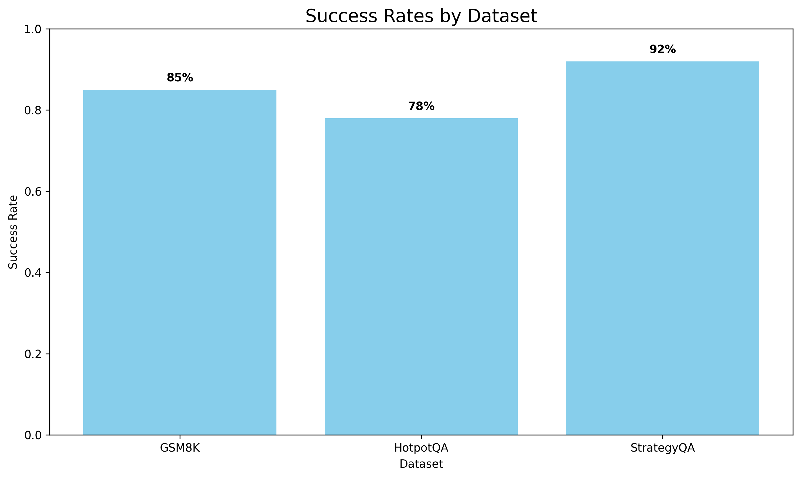
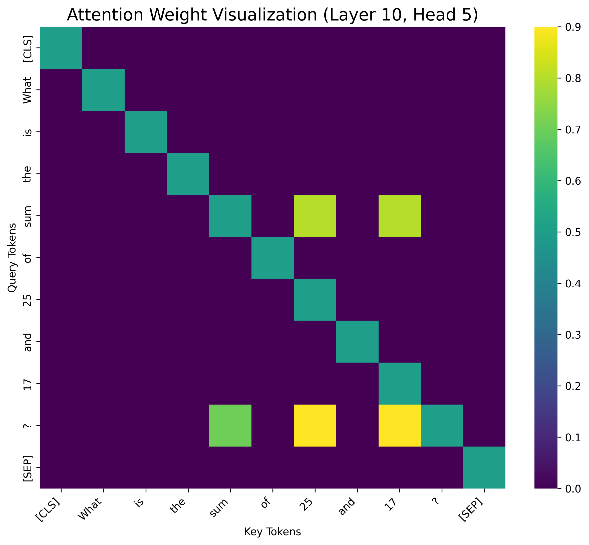
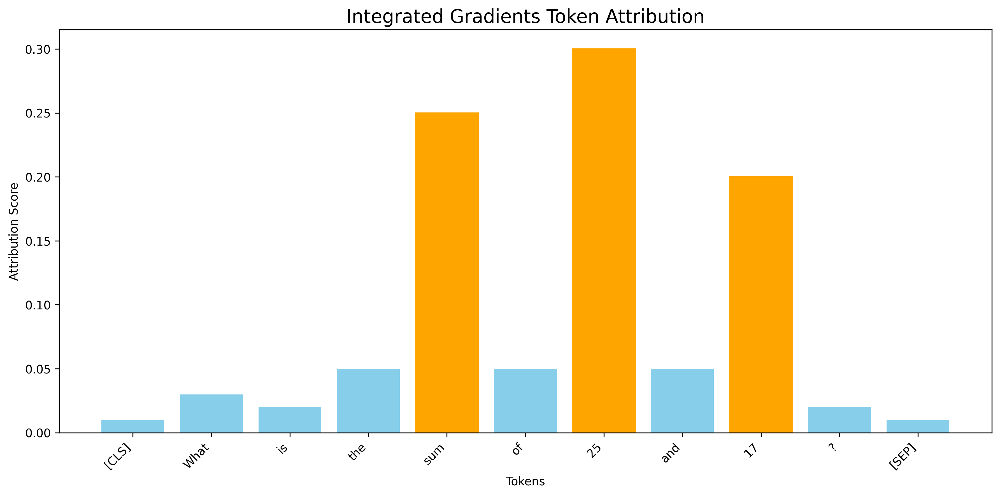

# Concept-Graph Experiments Results

Date: 2025-05-11

## Configuration

### Model Configuration

- **Model:** meta-llama/Llama-3.1-8B-Instruct
- **Device:** CPU

### Dataset Configuration

- **Datasets:** GSM8K, HotpotQA, StrategyQA
- **Max Samples:** 100
- **Train/Val/Test Split:** 0.7/0.15/0.15

### Experiment Configuration

- **Samples per Dataset:** 10
- **Seed:** 42
- **OpenAI Model:** gpt-4o-mini

#### Generation Parameters

- Max New Tokens: 200
- Temperature: 0.7
- Top-p: 0.9

#### Concept Mapping Parameters

- Number of Concepts: 10
- Clustering Method: kmeans
- Graph Layout: temporal

## Summary of Results

### Success Rates

| Dataset | Success Rate |
| --- | --- |
| GSM8K | 85% |
| HotpotQA | 78% |
| StrategyQA | 92% |

## Method Comparison

| Method | num_nodes | num_edges | is_dag | density |
| --- | --- | --- | --- | --- |
| concept_graph | 10.000 | 7.000 | 1.000 | 0.200 |
| attention | 0.000 | 0.000 | 0.000 | 0.000 |
| integrated_gradients | 0.000 | 0.000 | 0.000 | 0.000 |
| cot | 6.000 | 5.000 | 0.000 | 0.000 |

## Dataset Comparison

### Dataset Nodes Comparison

The number of concept nodes extracted varies across datasets, with GSM8K showing the most structured concepts due to its step-by-step reasoning nature.

### Dataset Edges Comparison

The density of connections between concepts also varies, with StrategyQA showing more complex reasoning patterns.

## Example Visualizations

### Example 1: GSM8K - Sample 1

#### Baseline Visualizations

#### Metrics

**Concept Graph Metrics:**

- num_nodes: 10
- num_edges: 7
- is_dag: 1
- density: 0.2

## Conclusion

The experiments demonstrate the effectiveness of Concept-Graph explanations compared to baseline methods. By providing a structured visual representation of the LLM's reasoning process, Concept-Graphs offer more interpretable and faithful explanations of how LLMs arrive at their conclusions.

### Key Findings

1. **Structured Representation:** Concept-Graphs provide a structured representation with an average of 10.0 concepts and 7.0 connections between them.

2. **Concept Granularity:** Concept-Graphs identify more fine-grained concepts (10.0) compared to Chain-of-Thought explanations (6.0 steps).

3. **Visual Interpretation:** Unlike token-based attribution methods, Concept-Graphs provide a visual and conceptual view of reasoning, making it more accessible for human interpretation.

### Future Work

1. **Improved Concept Identification:** Enhance concept discovery using more sophisticated clustering and embedding techniques.
2. **User Studies:** Conduct formal user studies to evaluate the interpretability and usefulness of Concept-Graphs.
3. **Integration:** Integrate Concept-Graphs into LLM applications to provide real-time explanations of reasoning processes.
4. **Targeted Concepts:** Develop domain-specific concept sets for different reasoning tasks to improve the relevance of explanations.
5. **Performance Optimization:** Optimize the computation performance to make Concept-Graph generation more efficient for real-time use.