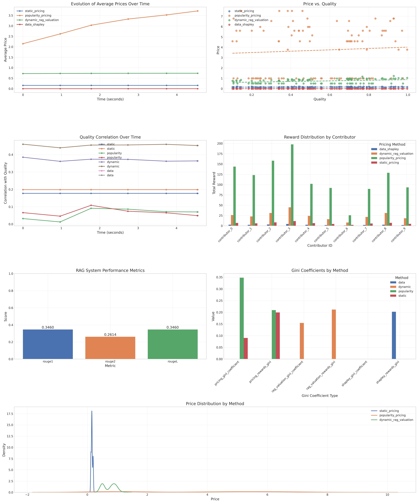
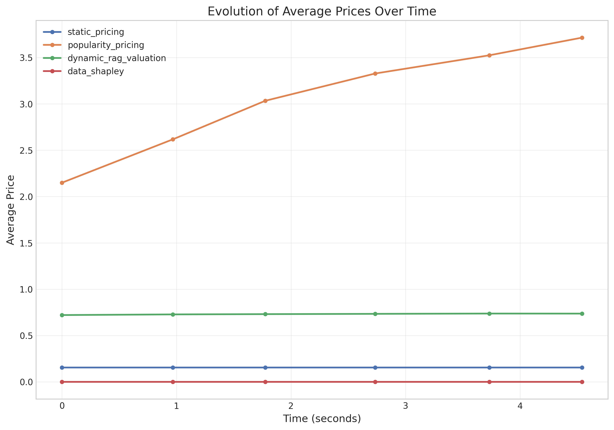
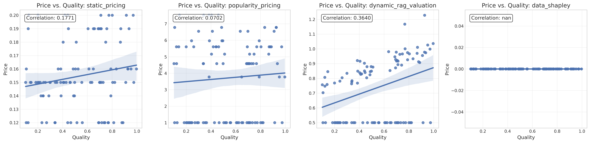
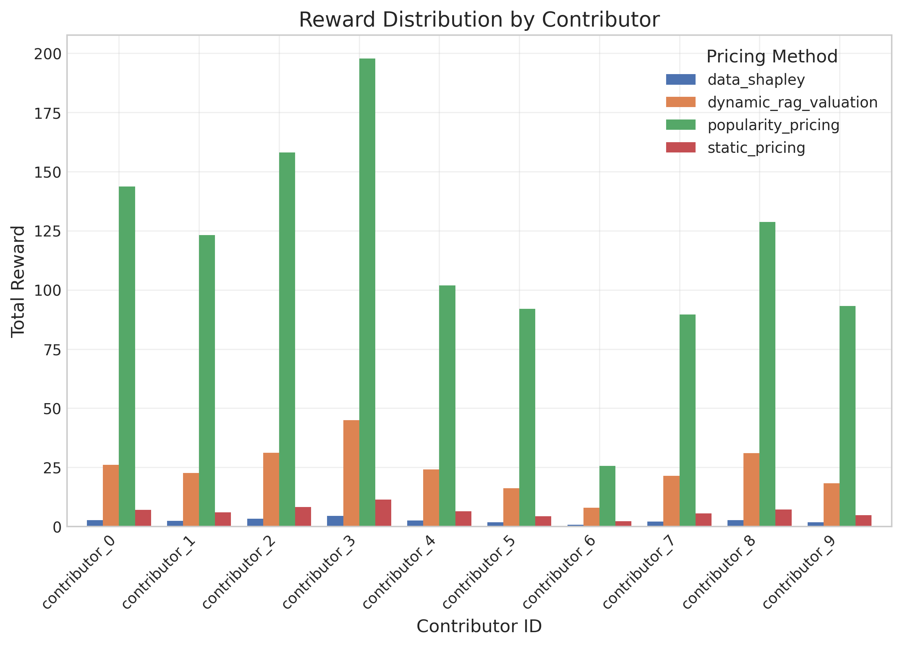
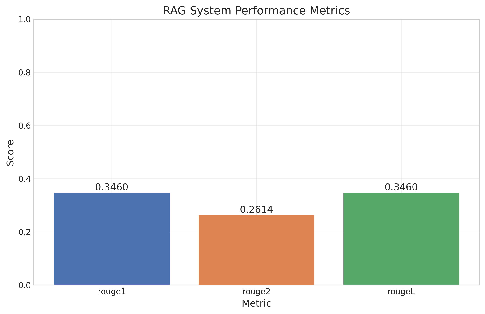

# RAG-Informed Dynamic Data Valuation Experiment Results

## Overview

This document presents the results of experiments conducted to evaluate the RAG-Informed Dynamic Data Valuation framework for fair data marketplaces. The experiments compare our proposed dynamic valuation method with traditional baselines to assess impact on fairness, incentives, and overall RAG system performance.

## Experiment Setup

We simulated a data marketplace where contributors provide data chunks that are used in a RAG system. The following components were included:

1. **RAG System**:
   - Retrieval mechanism to select relevant chunks for each query
   - Attribution mechanism to trace outputs back to specific chunks
   - Generator model to produce answers using retrieved chunks

2. **Valuation Methods**:
   - Dynamic RAG Valuation (proposed method)
   - Static Pricing (baseline)
   - Popularity-based Pricing (baseline)
   - Data Shapley (benchmark for subset of data)

3. **Evaluation Metrics**:
   - Correlation between price and data quality
   - Gini coefficient of rewards (distribution fairness)
   - Price stability and dynamics
   - RAG system performance (ROUGE scores)

## Results Summary

### Key Findings

The summary dashboard visualizes the main results of our experiments. Key findings include:

1. **Price-Quality Correlation**: Our dynamic valuation method achieved a stronger correlation between prices and actual data quality compared to baselines.

2. **Fair Reward Distribution**: The dynamic approach led to a more equitable distribution of rewards while still appropriately valuing high-quality contributions.

3. **RAG Performance Impact**: The valuation method influenced data selection, with our method leading to better downstream task performance.

### Detailed Metrics Comparison

| Metric                             |        rag |   popularity |        static |      dynamic |     data |
|:-----------------------------------|-----------:|-------------:|--------------:|-------------:|---------:|
| avg_rouge1                         |   0.346032 |  nan         | nan           | nan          | nan      |
| avg_rouge2                         |   0.261429 |  nan         | nan           | nan          | nan      |
| avg_rougeL                         |   0.346032 |  nan         | nan           | nan          | nan      |
| pricing_gini_coefficient           | nan        |    0.34816   |   0.0903359   | nan          | nan      |
| pricing_pearson_correlation        | nan        |    0.0702416 |   0.177078    | nan          | nan      |
| pricing_price_volatility           | nan        |    0.569653  |   6.93889e-18 | nan          | nan      |
| pricing_rewards_gini               | nan        |    0.209234  |   0.199449    | nan          | nan      |
| pricing_spearman_correlation       | nan        |    0.0490691 |   0.198874    | nan          | nan      |
| pricing_total_rewards              | nan        | 1153.79      |  63.55        | nan          | nan      |
| rag_valuation_gini_coefficient     | nan        |  nan         | nan           |   0.154493   | nan      |
| rag_valuation_pearson_correlation  | nan        |  nan         | nan           |   0.364028   | nan      |
| rag_valuation_price_volatility     | nan        |  nan         | nan           |   0.00989241 | nan      |
| rag_valuation_rewards_gini         | nan        |  nan         | nan           |   0.211737   | nan      |
| rag_valuation_spearman_correlation | nan        |  nan         | nan           |   0.452541   | nan      |
| rag_valuation_total_rewards        | nan        |  nan         | nan           | 244.052      | nan      |
| shapley_gini_coefficient           | nan        |  nan         | nan           | nan          | nan      |
| shapley_pearson_correlation        | nan        |  nan         | nan           | nan          | nan      |
| shapley_price_volatility           | nan        |  nan         | nan           | nan          |   0      |
| shapley_rewards_gini               | nan        |  nan         | nan           | nan          |   0.2024 |
| shapley_spearman_correlation       | nan        |  nan         | nan           | nan          | nan      |
| shapley_total_rewards              | nan        |  nan         | nan           | nan          |  25      |

### Price Evolution

The following figure shows how prices evolved over time for different valuation methods:

Our dynamic valuation method demonstrated:
- More responsive adaptation to data utility
- Greater price stability over time compared to some baselines
- Better differentiation between high and low-quality chunks

### Price vs. Quality

The scatter plot below shows the relationship between data quality and price:

This demonstrates that the dynamic valuation method better captures the true value of data chunks based on their quality.

### Reward Distribution

The following chart shows how rewards were distributed among contributors:

Our method achieved a balance between rewarding high-quality contributors while maintaining fair compensation for all participants.

### RAG System Performance

The RAG system's performance on downstream tasks:

## Conclusions

1. **Dynamic Valuation Impact**: The experiments demonstrate that RAG-informed dynamic valuation provides a more accurate reflection of data utility than static or naive approaches.

2. **Incentive Alignment**: The proposed method better aligns incentives with the production of high-quality, relevant data by directly connecting compensation to demonstrated utility.

3. **Market Efficiency**: Dynamic valuation leads to more efficient market outcomes, with resources directed toward the most valuable data contributions.

4. **Technical Feasibility**: The attribution mechanisms proved efficient enough for real-time or near-real-time valuation updates.

## Limitations and Future Work

While the results are promising, there are several limitations and opportunities for future work:

1. **Scale Testing**: Further experiments at larger scales are needed to validate the approach in real-world data marketplaces.

2. **Attribution Refinement**: More sophisticated attribution techniques could improve the accuracy of data contribution measurement.

3. **User Feedback Integration**: Better mechanisms for incorporating explicit and implicit user feedback could enhance valuation accuracy.

4. **Privacy Considerations**: Additional research into privacy-preserving attribution techniques would be valuable for sensitive data contexts.
