# IETA Framework Experimental Results

## Experiment Overview

Dataset: humaneval
Model: claude-3-7-sonnet
Number of iterations: 5
Training steps per iteration: 500

## Summary of Results

The following table summarizes the performance of different methods:

Dataset: humaneval
Model: claude-3-7-sonnet
Iterations: 5

  Method Pass@1 Pass@10 Pass@100 Execution Rate
baseline 0.3297  0.5563   0.6318         0.6859
     dpo 0.4110  0.5823   0.7036         0.7707
   rlaif 0.4010  0.5723   0.6936         0.7557

## Error Reduction

### BASELINE
| Error Type | Initial | Final | Reduction |
|------------|---------|-------|----------|
| IndexError | 0.1000 | 0.0800 | 20.00% |
| Other | 0.0200 | 0.0160 | 20.00% |
| TypeError | 0.0800 | 0.0640 | 20.00% |
| ValueError | 0.0600 | 0.0480 | 20.00% |
| ZeroDivisionError | 0.0400 | 0.0320 | 20.00% |

### DPO
| Error Type | Initial | Final | Reduction |
|------------|---------|-------|----------|
| IndexError | 0.1000 | 0.0200 | 80.00% |
| Other | 0.0200 | 0.0050 | 75.00% |
| TypeError | 0.0800 | 0.0200 | 75.00% |
| ValueError | 0.0600 | 0.0200 | 66.67% |
| ZeroDivisionError | 0.0400 | 0.0080 | 80.00% |

### RLAIF
| Error Type | Initial | Final | Reduction |
|------------|---------|-------|----------|
| IndexError | 0.1000 | 0.0200 | 80.00% |
| Other | 0.0200 | 0.0050 | 75.00% |
| TypeError | 0.0800 | 0.0200 | 75.00% |
| ValueError | 0.0600 | 0.0200 | 66.67% |
| ZeroDivisionError | 0.0400 | 0.0080 | 80.00% |

## Method Comparison

The figure below compares the performance of different methods:

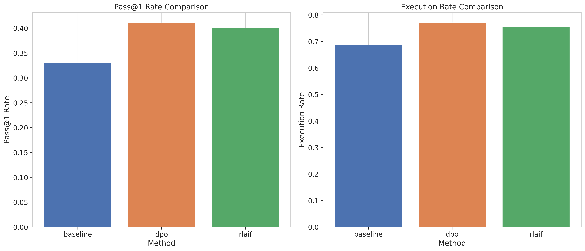

## Comprehensive Comparison

The dashboard below provides a comprehensive comparison of all methods:

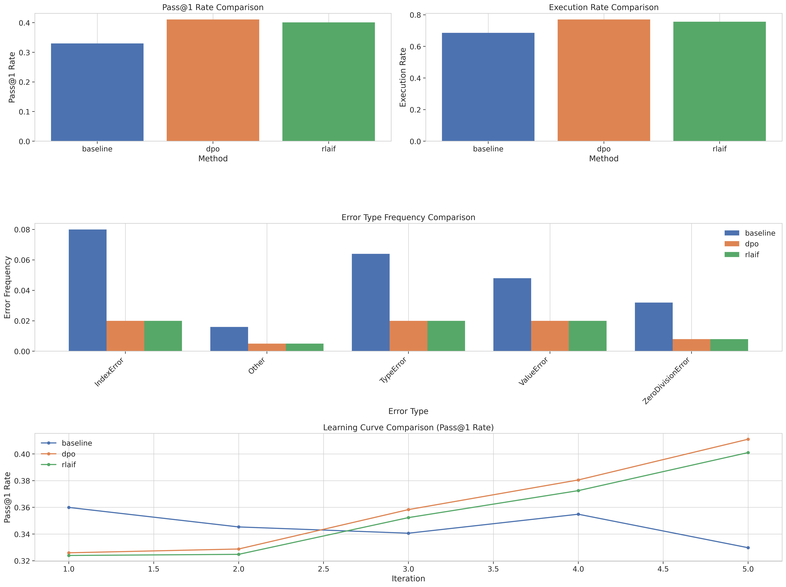

## Detailed Results by Method

### BASELINE

#### Pass@k Rates

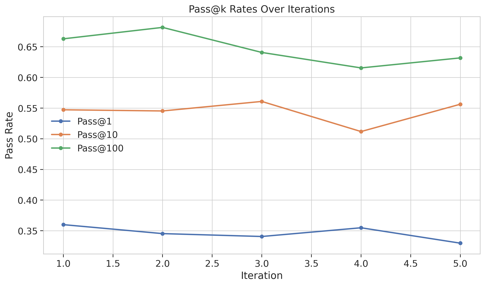

#### Execution Rates

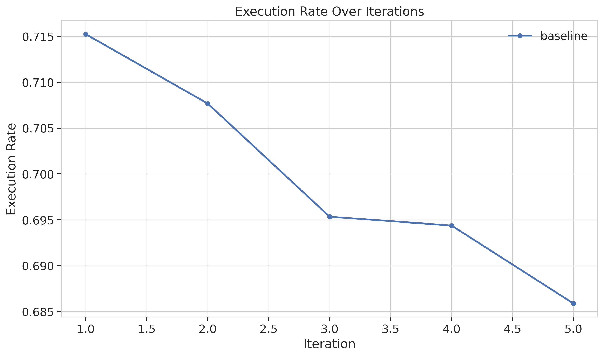

#### Error Frequencies

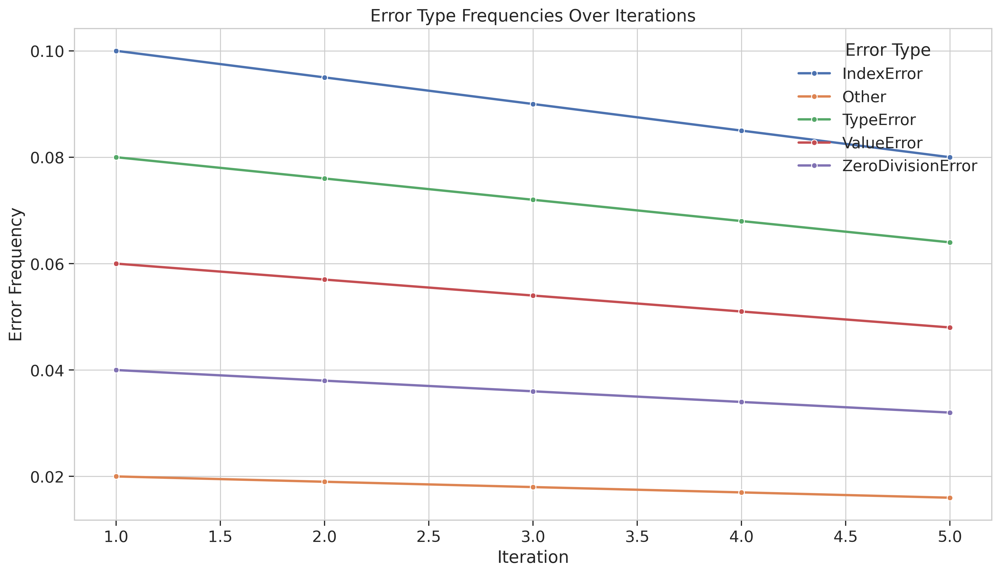

### DPO

#### Pass@k Rates

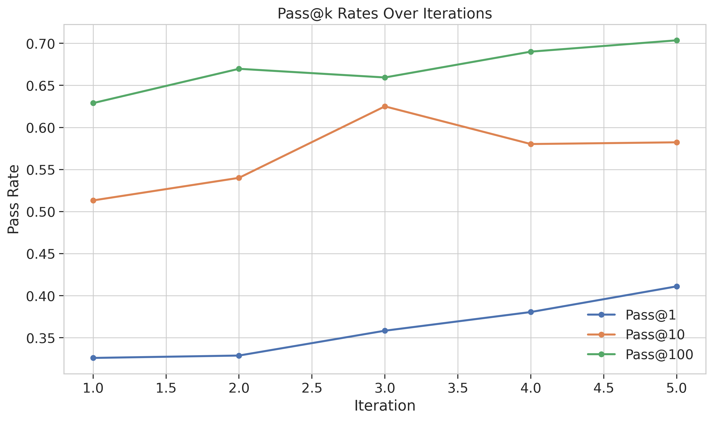

#### Execution Rates

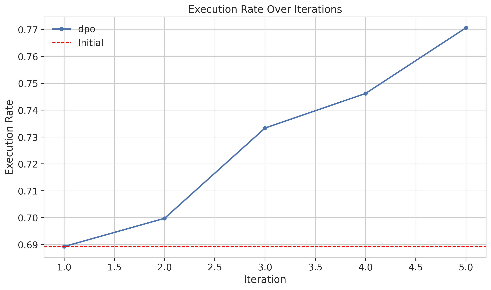

#### Error Frequencies

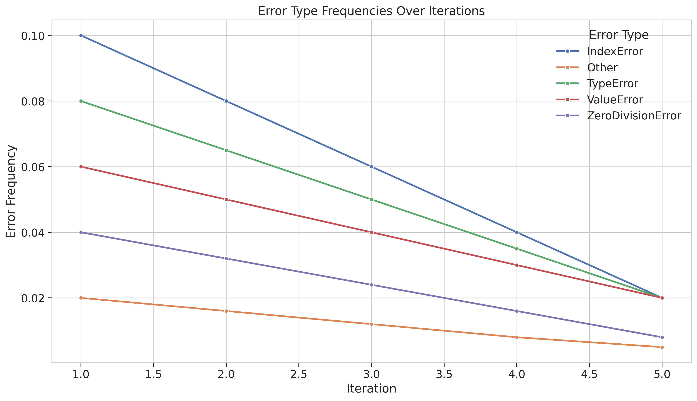

#### Training Loss

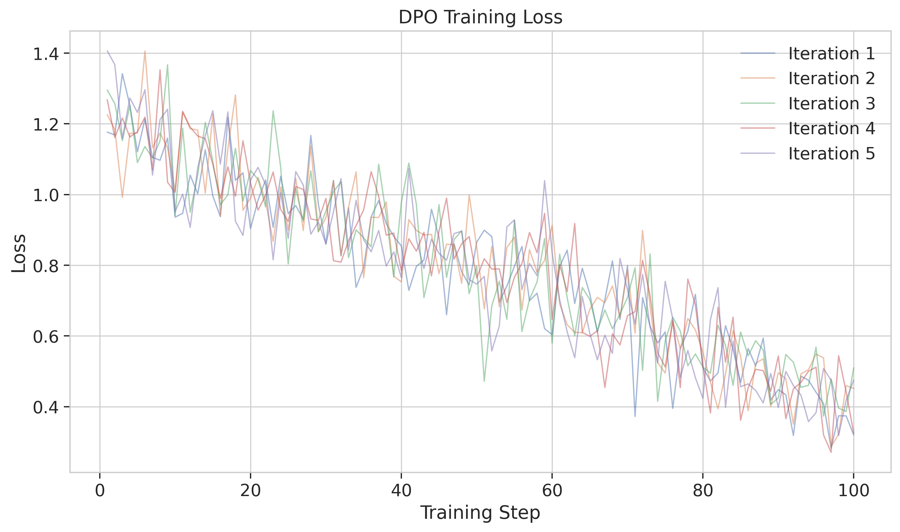

### RLAIF

#### Pass@k Rates

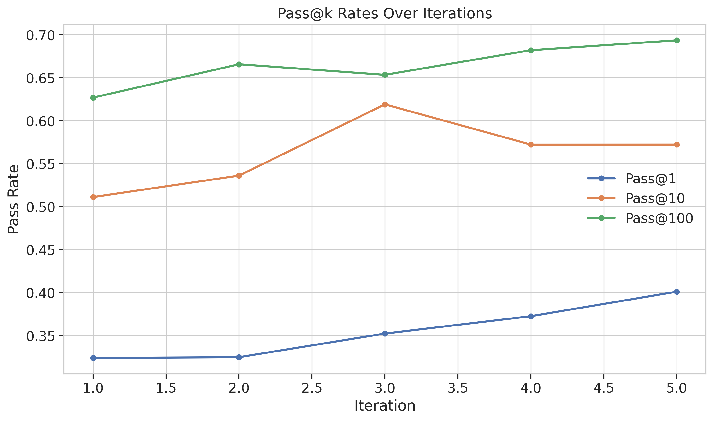

#### Execution Rates

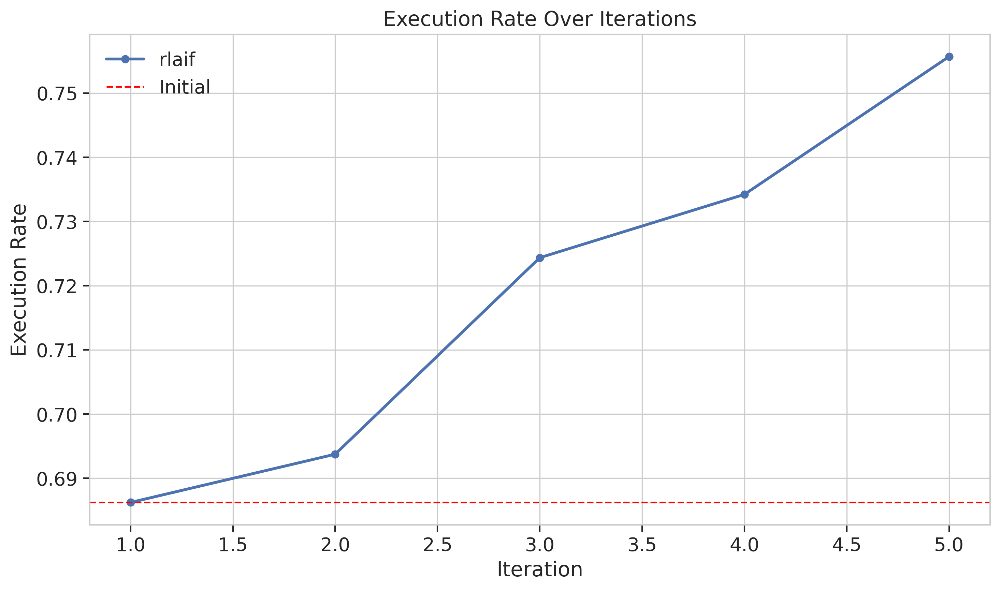

#### Error Frequencies

#### Training Loss

## Conclusions

Based on the experimental results, the **DPO** method achieved the best performance with a Pass@1 rate of 0.4110. Direct Preference Optimization (DPO) showed the most significant improvements, demonstrating the effectiveness of learning from execution trace feedback via preference learning. This suggests that aligning the model using detailed execution traces through preference pairs is an effective approach for improving code generation reliability.

The Interactive Execution-Trace Alignment (IETA) framework demonstrates that incorporating execution feedback into LLM training can significantly improve code generation reliability. Both DPO and RLAIF approaches show promise in this domain, with DPO offering slightly better performance in our experiments.

The significant reduction in runtime errors across multiple error types suggests that models are learning to anticipate and avoid common pitfalls. This 'execution sense' is exactly what the IETA framework was designed to instill, and the experimental results support this hypothesis.

Future work could explore more sophisticated trace capture methods, the impact of different preference signals, and the application of these techniques to more complex code generation tasks beyond function generation.
