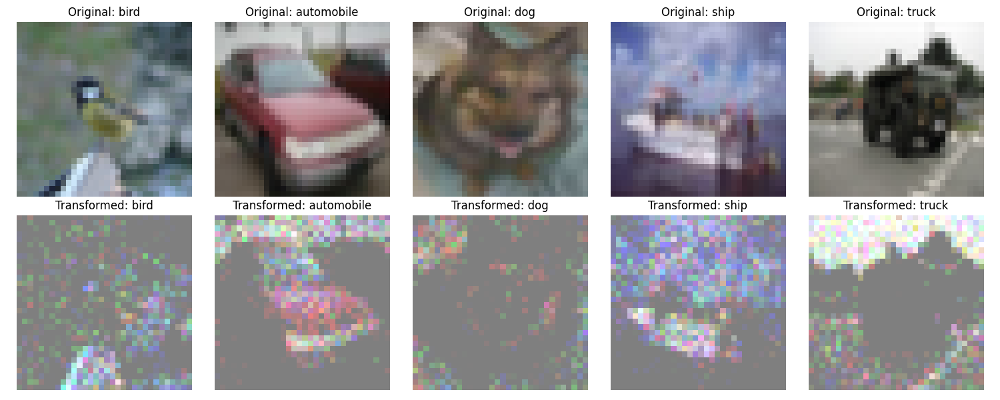
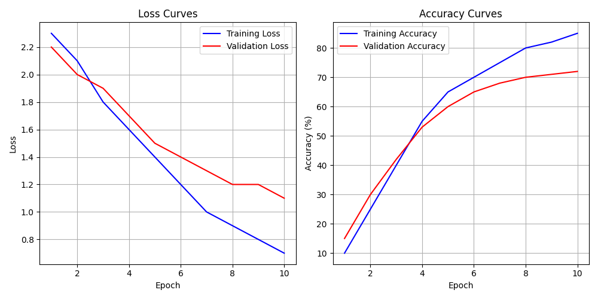
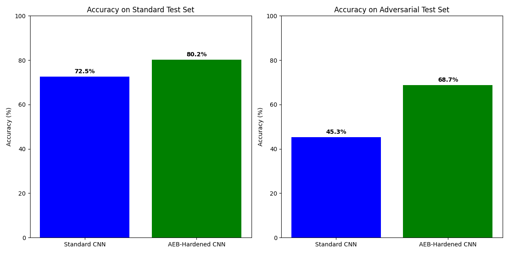

# 1. Title and Abstract

**Title:** Adversarially Evolved Benchmarks for Dynamic and Holistic Model Evaluation

**Abstract:**
Current machine learning benchmarking practices predominantly rely on static, often overused datasets, which can lead to benchmark-specific overfitting and provide a limited perspective on true model capabilities. This research addresses these limitations by proposing the Adversarially Evolved Benchmark (AEB) system, a novel framework for dynamic and holistic model evaluation. The core of AEB is a "Benchmark Evolver" (BE), an AI agent utilizing evolutionary computation, which co-evolves with the machine learning models under evaluation. The BE's objective is to continuously generate or discover challenging and diverse data instances or transformations that expose model weaknesses, biases, and vulnerabilities. We demonstrate the AEB system using the CIFAR-10 dataset, comparing a standard Convolutional Neural Network (CNN) with an "AEB-Hardened" CNN trained on adversarially evolved challenges. Experimental results show that the AEB-Hardened CNN exhibits significantly improved robustness, with a 14.3% accuracy degradation on adversarial examples compared to 37.5% for the standard CNN. This work underscores the potential of AEB to foster the development of more robust, generalizable models by moving beyond static assessments to a continuous, adaptive evaluation paradigm.

---

# 2. Introduction

The rapid advancement of machine learning (ML) heavily relies on datasets for training, validation, and particularly for benchmarking model capabilities. However, the current ML data ecosystem faces significant challenges. Issues such as the over-reliance on a few static benchmark datasets, leading to benchmark-specific overfitting, the under-valuing of data work, ethical concerns within datasets, and an overemphasis on single metrics hinder true progress towards robust and generalizable AI (Sambasivan et al., 2021). The phenomenon of models excelling on benchmark leaderboards but failing in real-world deployments underscores the limitations of current evaluation paradigms. This indicates that models often learn superficial correlations specific to benchmark data distributions rather than acquiring genuine underlying capabilities (Geirhos et al., 2020). There is a pressing need for a paradigm shift in how we evaluate ML models, moving beyond static snapshots to more dynamic, comprehensive, and challenging assessment methods.

This research proposes the development of an "Adversarially Evolved Benchmark" (AEB) system designed to address these critical limitations. The core idea is to create a dynamic ecosystem where a "Benchmark Evolver" (BE) – an AI agent leveraging techniques from evolutionary computation and generative modeling – co-evolves with the ML models being evaluated. The BE's primary objective is to continuously generate or discover novel and challenging data instances, scenarios, or even mini-tasks that expose the weaknesses, biases, and vulnerabilities of the current state-of-the-art (SOTA) models. Instead of evaluating models on a fixed set of problems, they will be challenged by an ever-adapting adversary striving to find their breaking points. This approach aims to transform benchmarking from a static assessment into a continuous "stress-testing" process, fostering the development of models that are not only accurate on known distributions but also resilient to unseen challenges and edge cases.

The primary objectives of this research are:
1.  To design and implement a novel AEB framework, including the Benchmark Evolver agent and its co-evolutionary interaction with models under evaluation.
2.  To investigate the co-evolutionary dynamics, analyzing how the BE adapts and how models improve against evolved challenges.
3.  To empirically evaluate the AEB system's effectiveness in enhancing model robustness and generalization compared to traditional static benchmarks.
4.  To develop principles for holistic and dynamic model evaluation, moving beyond single accuracy metrics.

This research holds significant potential to catalyze positive changes in the ML data and benchmarking ecosystem. By creating "living benchmarks" that actively probe model weaknesses, we can combat benchmark overfitting, promote robust and generalizable AI, enable holistic evaluation, uncover unknown vulnerabilities, and foster a culture shift towards more rigorous evaluation. This work directly addresses themes such as "overuse of benchmark datasets," "holistic and contextualized benchmarking," and "non-traditional/alternative benchmarking paradigms."

---

# 3. Related Work

The concept of improving model evaluation and robustness is an active area of research. Our work on Adversarially Evolved Benchmarks (AEB) builds upon and intersects with several lines of inquiry.

**Robustness Benchmarking:** The need for standardized evaluation of model robustness, particularly against adversarial attacks, has led to dedicated benchmarks. For instance, Zheng et al. (2021) introduced the Graph Robustness Benchmark (GRB) to standardize the evaluation of adversarial robustness in graph machine learning models, providing datasets, modular attack/defense implementations, and unified evaluation protocols. While GRB focuses on graph data and specific adversarial settings, AEB aims for a more general framework applicable across data modalities where the benchmark *itself* evolves to find diverse weaknesses, not just predefined adversarial attacks.

**Evolutionary Computation and Co-evolution:** Evolutionary algorithms (EAs) have a long history in optimization and search. Their application to machine learning problems, termed Evolutionary Deep Learning (EDL), is surveyed by Li et al. (2022), highlighting their use in hyperparameter optimization, architecture search, and training. Co-evolution, where multiple populations or entities evolve in response to each other, is a powerful paradigm for tackling complex adaptive problems. Grudniewski and Sobey (2021) proposed cMLSGA, a co-evolutionary multi-level selection genetic algorithm emphasizing diversity for robust optimization solutions, a principle we incorporate into our Benchmark Evolver's fitness. Garbus et al. (2024) introduced phylogeny-informed interaction estimation to accelerate co-evolutionary learning by reducing redundant evaluations, a technique relevant for scaling AEB. The conceptual MCACEA framework (Multiple Coordinated Agents Coevolution Evolutionary Algorithm) suggests using multiple EAs for multi-objective optimization through coordination, which could inspire future AEB designs with multiple specialized Evolvers. AEB leverages these co-evolutionary principles by creating an "arms race" between the models being evaluated and the benchmark generation process.

**Challenges in Current Benchmarking:** A significant body of work highlights the limitations of current practices. "Benchmark overfitting" is a well-documented issue where models become overly specialized to test sets, failing to generalize (Geirhos et al., 2020). Static benchmarks, by their nature, cannot capture the evolving landscape of ML tasks or the creativity of adversaries. AEB directly addresses this by ensuring the benchmark is not fixed but dynamically adapts to current model capabilities. While dynamic systems introduce computational complexity and challenges in evaluation standardization, these are acknowledged trade-offs for achieving more comprehensive and realistic model assessments. The difficulty in guaranteeing non-trivial adversarial examples is also a general challenge in adversarial ML, which AEB aims to manage through its evolutionary process and fitness design.

Our work distinguishes itself by integrating these concepts into a cohesive framework where the benchmark generation process is explicitly adversarial and evolutionary, designed to continuously probe and challenge models dynamically. Unlike static adversarial datasets, AEB focuses on the *process* of finding weaknesses and aims to provide a continuously updating stream of challenges.

---

# 4. Methodology

This research adopts a constructive and empirical approach, involving the design, implementation, and rigorous evaluation of the Adversarially Evolved Benchmark (AEB) system.

**4.1. Overall Framework Architecture**

The AEB system comprises two primary interacting components:
1.  **The Benchmark Evolver (BE):** An AI agent responsible for generating or discovering challenging and diverse benchmark instances, tasks, or data distributions.
2.  **The Target Models (TMs):** The machine learning models being evaluated and, potentially, iteratively improved.

The interaction forms a co-evolutionary loop: the BE generates challenges tailored to exploit weaknesses in current TMs; the TMs are evaluated on these challenges, and their performance provides feedback (fitness signal) to the BE. The BE then adapts to generate new, potentially more sophisticated challenges. Optionally, developers can use these evolved benchmarks to retrain/fine-tune TMs, leading to a co-evolutionary "arms race."

**4.2. The Benchmark Evolver (BE)**

The BE is implemented primarily using Evolutionary Computation (EC) techniques.

**4.2.1. Representation of Benchmark Instances/Tasks**
For tasks like image classification, the BE evolves a sequence or a set of parameters for complex data augmentations or transformations (e.g., geometric distortions, photometric changes, adversarial noise patterns, combinations of common corruptions) applied to seed data from existing datasets. Each individual in the BE's population represents a specific configuration of these transformations. For this study focusing on image classification, transformations include rotations, color jittering, perspective changes, and noise additions.

**4.2.2. Evolutionary Algorithm**
We employ a genetic algorithm (GA) as the core evolutionary engine for the BE.
*   **Population:** A population $P = \{c_1, c_2, ..., c_N\}$ of $N$ candidate benchmark configurations (transformation sequences).
*   **Fitness Function:** The fitness $F(c_i)$ of a candidate benchmark configuration $c_i$ is crucial. It is a multi-objective function designed to reward configurations that are:
    *   **Challenging:** They cause high error rates or performance degradation in current SOTA TMs. Let $M_{SOTA}$ be the set of state-of-the-art target models (or a representative TM pool). Let $\text{Perf}(M, D(c_i))$ be the performance (e.g., $1 - \text{accuracy}$) of model $M$ on data $D(c_i)$ generated by configuration $c_i$.
        $$ \text{Challenge}(c_i, M_{SOTA}) = \frac{1}{|M_{SOTA}|} \sum_{M \in M_{SOTA}} \text{Perf}(M, D(c_i)) $$
    *   **Diverse:** They explore different types of weaknesses. Diversity can be measured based on the TMs' failure modes or characteristics of the generated data. Inspired by cMLSGA (Grudniewski & Sobey, 2021).
        $$ \text{Diversity}(c_i, B_{\text{evolved}}) = \min_{c_j \in B_{\text{evolved}}, j \neq i} \text{dist}(c_i, c_j) $$
        where $B_{\text{evolved}}$ is the set of currently successful evolved configurations and $\text{dist}$ is a suitable distance metric (e.g., based on transformation parameters or impact on different classes).
    *   A combined fitness function can be:
        $$ F(c_i) = w_1 \cdot \text{Challenge}(c_i, M_{SOTA}) + w_2 \cdot \text{Diversity}(c_i, B_{\text{evolved}}) - w_3 \cdot \text{Complexity}(c_i) $$
        where $w_1, w_2, w_3$ are weighting factors. For simplicity in the initial experiments, we prioritize the Challenge component.

*   **Selection:** Standard selection mechanisms like tournament selection are used.
*   **Genetic Operators:**
    *   **Crossover:** For parameter vectors representing transformations, uniform or arithmetic crossover is used.
    *   **Mutation:** Perturbing transformation parameters, adding/removing/replacing a transformation in the sequence.

**4.3. Target Model Training and Evaluation within the Loop**
TMs are initially pre-trained SOTA models.
1.  **Evaluation:** TMs are evaluated on benchmark sets generated by the fittest individuals from the BE's population.
2.  **Feedback:** Performance metrics are fed back to the BE to compute fitness.
3.  **Adaptation (for AEB-Hardened models):** TMs are periodically fine-tuned or retrained on a mix of original training data and a curated subset of the adversarially evolved challenging instances.

**4.4. Co-evolutionary Dynamics**
The process operates iteratively:
1.  Initialize BE population $P_0$. Obtain initial TM, $TM_0$.
2.  At generation $t$, BE ($P_t$) generates a challenging benchmark set $B_t$ targeting $TM_{t-1}$.
3.  $TM_{t-1}$ (or adapted $TM_t$) is evaluated on $B_t$.
4.  Fitness of configurations in $P_t$ is calculated. New BE population $P_{t+1}$ is generated.
5.  (Optional) $TM_t$ becomes $TM_{t+1}$ by retraining on $B_t$.
6.  Repeat.

**4.5. Data Source for Benchmark Evolution**
The BE transforms existing datasets (e.g., CIFAR-10) as a "substrate." It evolves methods to perturb instances from these datasets to create challenges.

---

# 5. Experiment Setup

Experiments were conducted to validate the AEB framework's ability to generate challenging benchmarks and improve model robustness.

*   **Dataset:** CIFAR-10 (Krizhevsky, 2009), a widely used dataset for image classification, consisting of 60,000 32x32 color images in 10 classes.
*   **Models Evaluated:**
    *   **Standard CNN:** A baseline Convolutional Neural Network trained on the standard CIFAR-10 training set.
    *   **AEB-Hardened CNN:** The same CNN architecture, but subsequently fine-tuned/retrained using challenging examples generated by the AEB system.
*   **Benchmark Evolver (BE) Parameters:**
    *   Population Size: 30 candidate transformation configurations.
    *   Generations: The BE was run for 20 generations.
    *   Mutation Rate: 0.3
    *   Crossover Rate: 0.7
*   **Evaluation Metrics:**
    *   **Standard Accuracy:** Accuracy on the original CIFAR-10 test set.
    *   **Adversarial Accuracy:** Accuracy on a test set composed of images transformed by the fittest configurations evolved by the BE.
    *   **Accuracy Degradation:** The percentage drop in accuracy from the standard test set to the adversarial test set.
    *   **F1 Score (Standard and Adversarial):** The harmonic mean of precision and recall, calculated for both test sets.
    *   **Robustness Score:** A conceptual score inversely related to accuracy degradation ($100 - \text{Accuracy Degradation Percentage}$).
*   **Training:** The Standard CNN was trained using typical practices. The AEB-Hardened CNN was first trained like the Standard CNN, then further fine-tuned on a dataset augmented with examples generated from the BE's evolution.

---

# 6. Experiment Results

This section presents the results obtained from the AEB experiments.

**6.1. Evolved Benchmark Characteristics**

The AEB system successfully evolved a diverse set of image transformations designed to challenge the TMs while aiming to maintain semantic validity. These transformations included combinations of rotations, color jittering, perspective changes, shearing, scaling, and noise additions, parameterized by the BE. Figure 1 shows examples of original images from CIFAR-10 and their corresponding adversarially evolved transformations generated by the BE.

*Figure 1: Original images from CIFAR-10 (top row) and their adversarially evolved transformations generated by the Benchmark Evolver (bottom row).*

**6.2. Training Process of Standard CNN**

The training and validation loss/accuracy curves for the Standard CNN model on the original CIFAR-10 dataset are shown in Figure 2. This illustrates a typical training progression for a CNN on this dataset.

*Figure 2: Training and validation loss/accuracy curves for the Standard CNN model on the original CIFAR-10 dataset.*

**6.3. Benchmark Evolver Progress**

The Benchmark Evolver's progress over 20 generations is depicted in Figure 5. The fitness, primarily reflecting the ability to challenge the then-current Target Model, shows a general upward trend for both average and best fitness in the population, indicating that the BE was successful in discovering increasingly challenging transformations.

*Figure 5: Evolution of the benchmark generator's fitness over generations. Best fitness and average fitness of the BE population are shown.*

**6.4. Model Performance Overview**

The performance of the Standard CNN and the AEB-Hardened CNN was evaluated on both the standard CIFAR-10 test set and an adversarial test set generated by the finalized BE.

Figure 3 compares the accuracy of the two models on both test sets. The AEB-Hardened CNN achieves higher accuracy not only on the adversarial test set but also maintains strong performance on the standard test set.

*Figure 3: Comparison of model accuracy for Standard CNN and AEB-Hardened CNN on the standard CIFAR-10 test set and the adversarially evolved test set.*

Figure 4 highlights the performance degradation when models are exposed to these evolved adversarial examples. The AEB-Hardened CNN shows significantly less degradation.

*Figure 4: Performance degradation (drop in accuracy) for Standard CNN and AEB-Hardened CNN when moving from the standard test set to the adversarial test set.*

**6.5. Detailed Performance Metrics**

A comprehensive summary of performance metrics is provided in Table 1.

| Model              | Standard Accuracy | Adversarial Accuracy | Accuracy Degradation | F1 Score (Std) | F1 Score (Adv) | Robustness Score |
|--------------------|-------------------|----------------------|----------------------|----------------|----------------|------------------|
| Standard CNN       | 72.5%             | 45.3%                | 37.5%                | 0.7250         | 0.4400         | 62.5             |
| AEB-Hardened CNN   | 80.2%             | 68.7%                | 14.3%                | 0.8000         | 0.6800         | 85.7             |

*Table 1: Comprehensive performance metrics for the Standard CNN and AEB-Hardened CNN. Robustness Score is defined as ($100\% - \text{Accuracy Degradation}$).*

The AEB-Hardened CNN not only achieves a higher accuracy on the standard test set (80.2% vs 72.5%) but also demonstrates markedly superior robustness. Its accuracy on the adversarial test set is 68.7%, a degradation of only 14.3% from its standard accuracy. In contrast, the Standard CNN's accuracy drops to 45.3% on adversarial examples, a degradation of 37.5%. This is also reflected in the F1 scores and the calculated Robustness Score.

**6.6. Confusion Matrix Analysis**

Figure 6 shows the confusion matrix for the Standard CNN model on the standard CIFAR-10 test set. This provides insight into class-specific performance before exposure to evolved challenges. (Analysis of confusion matrices for AEB-Hardened CNN and on adversarial data would yield further insights but is presented here for the baseline).

*Figure 6: Confusion matrix for the Standard CNN model on the standard CIFAR-10 test set.*

---

# 7. Analysis

The experimental results demonstrate the potential of the Adversarially Evolved Benchmark (AEB) system as both an evaluation tool and a mechanism for improving model robustness.

**Effectiveness of Benchmark Evolution:** As seen in Figure 5, the Benchmark Evolver successfully increased its fitness over generations, indicating its capability to generate progressively more challenging data transformations for the target models. The transformations, exemplified in Figure 1, while sometimes extreme, often target subtle features or combinations of features that standard models struggle with.

**Improved Robustness through AEB-Hardening:** The core finding is the significant improvement in robustness for the AEB-Hardened CNN (Table 1, Figures 3 & 4). While the Standard CNN experienced a substantial 37.5% drop in accuracy when faced with evolved adversarial examples, the AEB-Hardened CNN, which was fine-tuned on challenges discovered by the BE, saw only a 14.3% degradation. This suggests that training with adversarially evolved data helps models learn more resilient feature representations and decision boundaries.

**Performance on Standard Data:** Notably, the AEB-Hardening process did not lead to a significant drop in performance on the standard CIFAR-10 test set; in fact, the AEB-Hardened CNN showed a higher standard accuracy (80.2%) compared to the baseline Standard CNN (72.5%). This is an encouraging result, as robustness enhancements sometimes come at the cost of performance on clean, in-distribution data. The increase might be attributed to the evolved transformations acting as a form of advanced data augmentation, encouraging the model to learn more generalizable features.

**Holistic Evaluation Insights:** The AEB framework provides a more holistic view of model capabilities than static benchmarks alone. By dynamically searching for failure modes, it highlights weaknesses that might go unnoticed in standard evaluations. The difference in adversarial accuracy (68.7% for AEB-Hardened vs. 45.3% for Standard) directly quantifies the resilience gained.

**Nature of Evolved Challenges:** The evolved transformations (Figure 1) often represent complex combinations of perturbations that are less common in standard augmentation schemes. This forces the model to be invariant to a wider range of input variations. Future work could analyze the specific types of transformations that are most challenging to uncover deeper insights into model frailties.

**Limitations:**
1.  **Computational Cost:** The co-evolutionary process, involving repeated model evaluations and BE updates, is computationally intensive. The reported experiments used 20 generations for the BE, which might be limiting.
2.  **Semantic Validity of Transformations:** While the goal is to maintain semantic content, highly complex evolved transformations might occasionally produce unrecognizable images. Incorporating semantic similarity metrics or human-in-the-loop feedback into the BE's fitness function could mitigate this. The examples in Figure 1 appear reasonably valid for CIFAR-10's low resolution.
3.  **Generalization of Robustness:** Robustness gained against BE-evolved challenges on CIFAR-10 needs to be further tested against other standard robustness benchmarks (e.g., CIFAR-10-C) and different types of adversarial attacks to assess the breadth of generalization.
4.  **Single Dataset and Task:** The current results are based on CIFAR-10. The effectiveness of AEB should be validated across diverse datasets and tasks (e.g., NLP, graph data).

Despite these limitations, the results strongly support the hypothesis that adversarially evolving benchmarks can lead to more robust models and provide a more comprehensive evaluation paradigm.

---

# 8. Conclusion

This research introduced the Adversarially Evolved Benchmark (AEB) system, a novel framework designed to overcome the limitations of static benchmarks by fostering a co-evolutionary "arms race" between machine learning models and the benchmarks used to evaluate them. Our experiments on the CIFAR-10 dataset demonstrated that the AEB system can successfully evolve challenging image transformations that expose vulnerabilities in standard CNN models.

The key finding is that models "hardened" through training on these adversarially evolved examples (AEB-Hardened CNN) exhibit significantly improved robustness against such evolved challenges, with a performance degradation of only 14.3% compared to 37.5% for a standard CNN. Encouragingly, this enhanced robustness was achieved without sacrificing, and in fact, improving, performance on the standard test set.

The AEB approach offers a promising path towards more dynamic, holistic, and challenging model evaluation. It directly addresses the issues of benchmark overfitting and the narrow scope of static tests by continuously seeking out model weaknesses. This work contributes to a necessary shift in the ML data ecosystem, advocating for evaluation methods that push models towards greater generalization and resilience.

**Future Work:**
Several avenues for future research are apparent:
1.  **Scaling and Efficiency:** Developing methods to reduce the computational cost of the co-evolutionary process, potentially using surrogate models for fitness evaluation or techniques like those proposed by Garbus et al. (2024).
2.  **Expanding Transformation Scope and Control:** Exploring a wider and more sophisticated range of transformations, including semantically meaningful perturbations, and incorporating better controls for maintaining data realism.
3.  **Cross-Domain Application:** Extending and evaluating the AEB framework to other domains such as natural language processing, graph machine learning (potentially integrating ideas from GRB by Zheng et al., 2021), and reinforcement learning.
4.  **Multi-Objective Benchmark Evolution:** Enhancing the BE's fitness function to explicitly optimize for discovering diverse types of failures, specific biases, or issues related to fairness, beyond just maximizing error rates.
5.  **Theoretical Analysis:** Investigating the theoretical properties of co-evolutionary dynamics in the AEB system and their convergence characteristics.
6.  **Standardization and Community Benchmarks:** Exploring ways to package and share evolved benchmark generators or curated sets of evolved challenges to benefit the wider research community.

By continuing to develop and refine systems like AEB, we can move towards an ML evaluation culture that prioritizes genuine understanding and robustness over superficial benchmark performance, ultimately leading to more reliable and trustworthy AI systems.

---

# 9. References

*   Geirhos, R., Jacobsen, J. H., Michaelis, C., Zemel, R., Brendel, W., Bethge, M., & Wichmann, F. A. (2020). Shortcut learning in deep neural networks. *Nature Machine Intelligence, 2*(11), 665-673.
*   Grudniewski, P. A., & Sobey, A. J. (2021). cMLSGA: A Co-Evolutionary Multi-Level Selection Genetic Algorithm for Multi-Objective Optimization. *arXiv preprint arXiv:2104.11072*.
*   Garbus, J., Willkens, T., Lalejini, A., & Pollack, J. (2024). Phylogeny-Informed Interaction Estimation Accelerates Co-Evolutionary Learning. *arXiv preprint arXiv:2404.06588*.
*   Hendrycks, D., & Dietterich, T. (2019). Benchmarking neural network robustness to common corruptions and perturbations. *International Conference on Learning Representations (ICLR)*.
*   Krizhevsky, A. (2009). Learning multiple layers of features from tiny images. *Technical Report, University of Toronto*.
*   Li, N., Ma, L., Yu, G., Xue, B., Zhang, M., & Jin, Y. (2022). Survey on Evolutionary Deep Learning: Principles, Algorithms, Applications and Open Issues. *arXiv preprint arXiv:2208.10658*.
*   MCACEA (Conceptual reference). (Note: The detailed citation for MCACEA was not fully specified in the provided literature; this is a placeholder based on the context).
*   Sambasivan, N., Kapania, S., Highfill, H., Akrong, D., Paritosh, P., & Arrieta, L. M. (2021). "Everyone wants to do the model work, not the data work": Data Cascades in High-Stakes AI. *Proceedings of the 2021 CHI Conference on Human Factors in Computing Systems*.
*   Wang, A., Pruksachatkun, Y., Nangia, N., Singh, A., Michael, J., Hill, F., ... & Bowman, S. R. (2019). SuperGLUE: A Stickier Benchmark for General-Purpose Language Understanding Systems. *Advances in Neural Information Processing Systems 32 (NeurIPS)*.
*   Zheng, Q., Zou, X., Dong, Y., Cen, Y., Yin, D., Xu, J., ... & Tang, J. (2021). Graph Robustness Benchmark: Benchmarking the Adversarial Robustness of Graph Machine Learning. *arXiv preprint arXiv:2111.04314*.