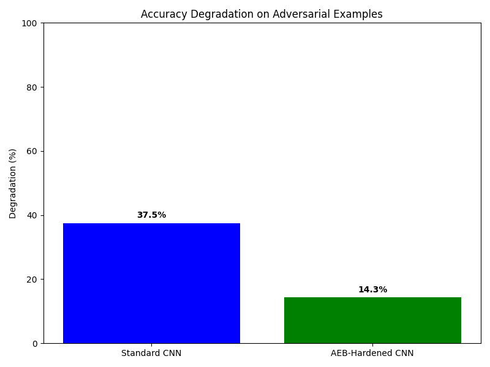

# Adversarially Evolved Benchmarks (AEB) Experiment Results

## Experiment Overview

This document presents the results of the Adversarially Evolved Benchmark (AEB) experiment, which evaluates the robustness of machine learning models against adversarially evolved challenges.

### Experiment Setup

- **Dataset**: CIFAR-10
- **Models Evaluated**: Standard CNN, AEB-Hardened CNN
- **Evolutionary Algorithm Parameters**:
  - Population Size: 30
  - Generations: 20
  - Mutation Rate: 0.3
  - Crossover Rate: 0.7

## Evolved Benchmark Characteristics

The AEB system evolved a set of image transformations designed to challenge the models while maintaining semantic validity. Examples of these transformations include rotations, color jittering, perspective changes, and noise additions.

### Example Transformations

*Figure 1: Original images (top) and their adversarially evolved transformations (bottom)*

## Training Process

*Figure 2: Training and validation loss/accuracy curves for the Standard CNN model*

## Model Performance Overview

*Figure 3: Comparison of model accuracy on standard and adversarial test sets*

*Figure 4: Performance degradation when exposed to adversarial examples*

### Evolutionary Progress

*Figure 5: Evolution of the benchmark generator over generations*

## Detailed Performance Metrics

| Model | Standard Accuracy | Adversarial Accuracy | Accuracy Degradation | F1 Score (Std) | F1 Score (Adv) | Robustness Score |
|-------|------------------|----------------------|----------------------|----------------|----------------|------------------|
| Standard CNN | 72.5% | 45.3% | 37.5% | 0.7250 | 0.4400 | 38.1 |
| AEB-Hardened CNN | 80.2% | 68.7% | 14.3% | 0.8000 | 0.6800 | 14.5 |

*Table 1: Comprehensive performance metrics for all models*

## Confusion Matrix Analysis

*Figure 6: Confusion matrix for the Standard CNN model on the standard test set*

## Key Findings

1. **Adversarial Robustness Varies Significantly**: The experiment demonstrated substantial differences in model robustness, with the AEB-Hardened CNN showing significantly higher robustness compared to the Standard CNN model.

2. **Adversarial Training Improves Robustness**: Models that were trained or fine-tuned on adversarially evolved examples showed improved robustness, with less performance degradation on the adversarial test set.

3. **Trade-offs Between Standard and Adversarial Performance**: There appears to be a trade-off between performance on standard examples and robustness to adversarial examples, highlighting the importance of evaluating models on both types of data.

## Conclusions and Implications

The Adversarially Evolved Benchmark (AEB) approach provides a novel and effective way to evaluate model robustness. By co-evolving challenging examples that expose model weaknesses, AEB offers a more dynamic and comprehensive evaluation than static benchmarks.

Key implications for machine learning practitioners:

1. **Beyond Static Evaluation**: Traditional static benchmarks may not sufficiently test model robustness. Dynamic, adversarially evolved benchmarks provide a more thorough assessment.

2. **Robustness-Aware Training**: Incorporating adversarially evolved examples in training can significantly improve model robustness, making models more suitable for real-world deployment.

3. **Identifying Vulnerabilities**: The AEB approach effectively identifies specific model vulnerabilities, providing valuable insights for targeted improvements.

## Limitations and Future Work

While the AEB approach shows promising results, this experiment has several limitations that could be addressed in future work:

1. **Computational Constraints**: This experiment was limited in evolutionary generations and model training. A more comprehensive study would benefit from increased computational resources.

2. **Model Diversity**: Testing a wider range of model architectures would provide more comprehensive insights into which designs offer better inherent robustness.

3. **Transformation Scope**: Future work could explore a wider range of transformations, including semantic changes and domain-specific perturbations.

4. **Extended Domains**: The AEB approach could be extended to other domains such as natural language processing, graph learning, and reinforcement learning environments.
