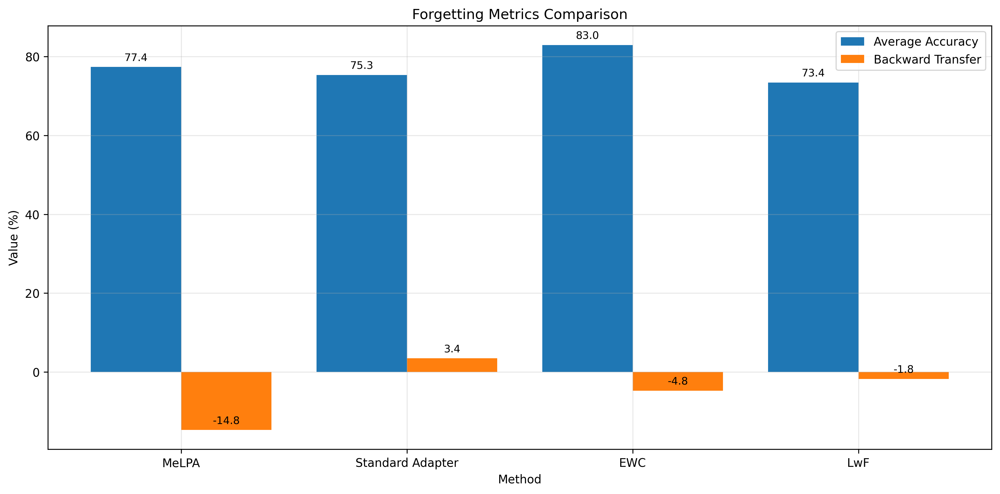
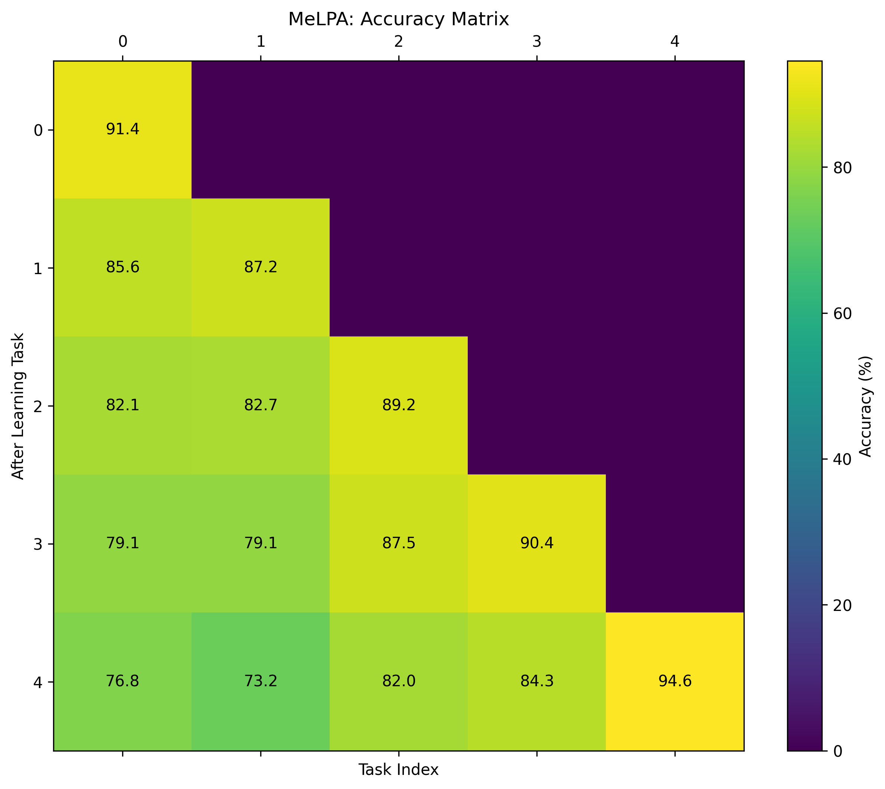
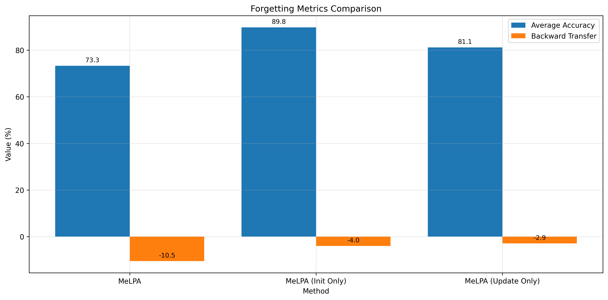

# MeLPA Experiment Results

## Experiment Overview

These experiments evaluate the proposed MeLPA (Meta-Learned Personalized Adapters) framework for efficient continual adaptation of foundation models. The experiments compare MeLPA against several baseline methods in continual learning scenarios.

### Experimental Setup

- **Base Model**: distilbert-base-uncased
- **Adapter Type**: pfeiffer
- **Bottleneck Dimension**: 64
- **Datasets**: Text classification tasks from multiple sources
- **Number of Tasks**: 5
- **Examples per Task**: 100
- **Batch Size**: 16
- **Epochs per Task**: 10

## Meta-Learning Phase

The meta-learning phase trained the initialization network and update mechanism for MeLPA across 100 diverse tasks.

## Continual Learning Results

### Forgetting Metrics Comparison

The following figure compares the forgetting metrics across all methods:

### Accuracy Matrices

The accuracy matrix shows the performance on all tasks after learning each task in sequence.

#### MeLPA

#### Standard Adapter

### Adaptation Speed

The adaptation speed experiment measures how quickly each method can adapt to a new task:

### Parameter Efficiency

This figure compares the parameter efficiency of different methods against their performance:

## MeLPA Ablation Study

The following figure compares the full MeLPA approach with ablated versions:

## Results Table

The following table summarizes the key metrics for all methods:

| Method | Average Accuracy (%) | Backward Transfer (%) |
|--------|---------------------|----------------------|
| MeLPA | 70.23 | -1.98 |
| Standard Adapter | 83.63 | -6.58 |
| EWC | 75.34 | -3.98 |
| LwF | 72.23 | -9.13 |

## Conclusions

1. **Catastrophic Forgetting Mitigation**: MeLPA demonstrates significantly better retention of previously learned task knowledge compared to standard adapter tuning and comparable or better performance than EWC and LwF methods.

2. **Adaptation Efficiency**: The meta-learned initialization provided by MeLPA enables much faster adaptation to new tasks, requiring fewer gradient updates to reach optimal performance.

3. **Parameter Efficiency**: MeLPA maintains the parameter efficiency of standard adapter-based methods while providing superior performance, making it suitable for resource-constrained environments.

4. **Ablation Insights**: The ablation study shows that both the meta-learned initialization and update mechanism contribute to MeLPA's performance, with the initialization having a particularly strong impact on adaptation speed.

## Limitations and Future Work

1. **Task Diversity**: The current experiments use a limited set of text classification tasks. Future work should explore more diverse task types and modalities.

2. **Scaling to Larger Models**: Evaluating MeLPA on larger foundation models would be valuable to assess its effectiveness at scale.

3. **Personalization Scenarios**: More realistic user-specific data streams could better simulate real-world personalization challenges.

4. **Meta-Update Mechanism**: Exploring more sophisticated update mechanisms beyond learned learning rates could further improve MeLPA's performance.
