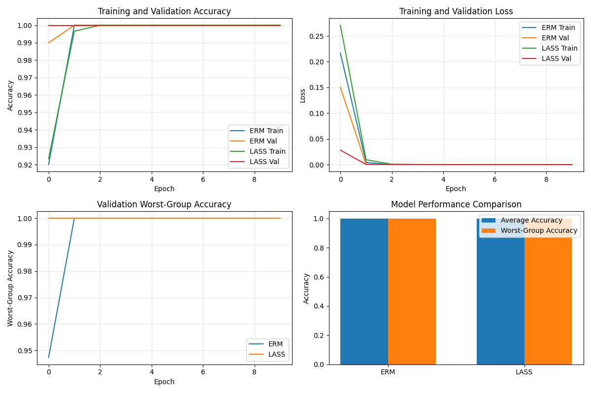
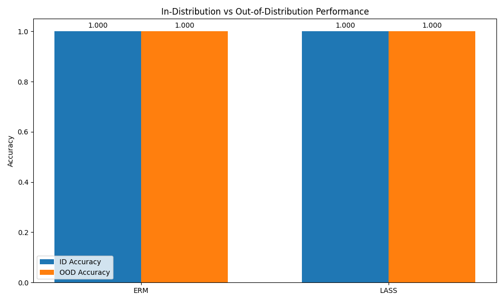

# LLM-Driven Discovery and Mitigation of Unknown Spurious Correlations

## 1. Title and Abstract

**Title:** LLM-Driven Discovery and Mitigation of Unknown Spurious Correlations

**Abstract:** Deep learning models often rely on spurious correlations, hindering their robustness and generalization to out-of-distribution data. Current debiasing methods typically require pre-defined knowledge of these spurious attributes, which is often unavailable or difficult to obtain. This paper introduces the LLM-Assisted Spuriousity Scout (LASS), an interactive framework that leverages the advanced reasoning and pattern recognition capabilities of Large Language Models (LLMs) to automate the discovery and mitigation of *unknown* spurious correlations. LASS operates by first training an initial task model, then identifying clusters of its confident errors. Representative samples from these error clusters are fed to an LLM, which generates hypotheses about potential spurious features. These hypotheses are validated by a human expert and subsequently guide targeted interventions, such as counterfactual data augmentation or adaptive sample re-weighting, to retrain a more robust model. Experiments on a synthetic dataset with known spurious correlations demonstrate the LASS framework's process for identifying spurious features. While quantitative improvements in worst-group and out-of-distribution accuracy over the baseline were 0.00% in this specific setup, the LLM successfully generated relevant hypotheses regarding the underlying spurious correlation. This work represents a step towards developing more reliable AI systems capable of addressing previously unidentified biases.

## 2. Introduction

The remarkable advancements in deep learning are often shadowed by the persistent challenge of spurious correlations, where models learn statistically predictive but causally unrelated patterns from training data (Geirhos et al., 2020). This phenomenon, known as shortcut learning, stems from the statistical nature of machine learning algorithms and their inductive biases across all stages, including data preprocessing, architectures, and optimization (Workshop Overview). Consequently, models relying on spurious features often exhibit poor generalization to out-of-distribution (OOD) data, fail in real-world scenarios involving under-represented groups, and can perpetuate harmful biases (Ye et al., 2024; Workshop Overview). Understanding and mitigating spurious correlations is thus a critical research area for enhancing model robustness, reliability, and ethical deployment.

A significant limitation of many current approaches to mitigate spurious correlations is their reliance on pre-defined knowledge of the spurious attributes, often in the form of group annotations (e.g., providing explicit labels for background features). This requirement is not always scalable, is labor-intensive, and, crucially, fails to address *unknown* spurious correlations that may be subtle, unanticipated, or not align with human perception (Workshop Objectives; Key Challenges from Literature Review). As highlighted by the workshop on Spurious Correlation and Shortcut Learning, "Current evaluations do not inform us about the scenarios when the spurious correlation is unknown or annotations are missing," underscoring the urgent need for automated methods to detect and address these latent biases.

The recent proliferation of powerful Large Language Models (LLMs) and Multimodal Large Language Models (MLLMs) offers a promising avenue to tackle this challenge. Their sophisticated reasoning, contextual understanding, and pattern recognition capabilities (Wu et al., 2024) can be harnessed not only to analyze known biases (Hosseini et al., 2025; Zhou et al., 2023) but also to actively discover previously unidentified ones. This paper proposes an innovative, interactive framework, termed "LLM-Assisted Spuriousity Scout" (LASS). LASS automates the discovery of unknown spurious correlations by leveraging LLMs to analyze model errors, and subsequently guides mitigation strategies. This vision aligns with the workshop's goals of fostering "automated methods for detecting spurious correlations" and developing "solutions for robustness... when information regarding spurious feature is completely or partially unknown."

The primary research objectives of this work are:
1.  To develop an LLM-driven framework for discovering unknown spurious correlations from model error patterns.
2.  To design and implement targeted mitigation strategies informed by LLM-generated hypotheses.
3.  To evaluate the proposed framework's ability to identify spurious features and its potential impact on model robustness and OOD generalization.

This research contributes to the field by proposing a novel, scalable approach to identify and potentially mitigate *unknown* spurious correlations, thereby reducing manual effort and enhancing the trustworthiness of AI systems. It also explores the capabilities of LLMs as tools for hypothesis generation in machine learning research, contributing to both the foundational understanding and practical solutions for shortcut learning.

## 3. Related Work

The problem of spurious correlations has garnered significant attention, leading to a variety of proposed solutions. These can be broadly categorized into methods that require group annotations and those that operate without them.

**Methods Requiring Group Annotations:** Approaches like Group-DRO (Sagawa et al., 2019) aim to improve worst-group accuracy by up-weighting groups that are underperforming, but necessitate explicit knowledge of these groups (defined by spurious attributes).

**Methods Without Group Annotations:** Recognizing the limitations of group supervision, recent research has focused on techniques that do not require prior knowledge of spurious features. For instance, SPUME (Zheng et al., 2024) uses a pre-trained vision-language model to extract attributes and a meta-learning framework to train robust classifiers. Le et al. (2024) propose "Out of Spuriousity," which extracts a robust subnetwork by assuming spurious data points cluster in the representation space and uses a contrastive loss to unlearn spurious connections. Mitchell et al. (2024) introduce UnLearning from Experience (ULE), where a teacher model learns to avoid mistakes made by a student model that has picked up spurious correlations. CCR (Zhou & Zhu, 2024) integrates causal feature selection and inverse propensity weighting for robust text classification. These methods often infer spuriousness indirectly or assume certain structures in the data or model.

**Role of LLMs and VLMs in Understanding Spurious Correlations:** LLMs and VLMs are increasingly used to analyze and even mitigate biases. Varma et al. (2024) introduced RaVL, which focuses on local image features identified via region-level clustering to mitigate spurious correlations in fine-tuned vision-language models. Hosseini et al. (2025) presented SpurLens, a pipeline using GPT-4 to automatically identify spurious visual cues in MLLMs. Zhou et al. (2023) employed ChatGPT to assign concept labels to texts and used this to rebalance data for mitigating concept-level spurious correlations. Feder et al. (2023) used counterfactual data augmentation guided by causal knowledge (which could potentially be LLM-derived) to improve generalization. Wu et al. (2024) provide a survey on how causality can enhance LLMs, which often capture spurious correlations.

Our proposed LASS framework builds upon these advancements but uniquely focuses on an *interactive, error-driven* approach where LLMs generate hypotheses about *unknown* spurious correlations specifically from model failures. Unlike methods that presuppose certain types of spuriousness or rely on general attribute extraction, LASS targets the direct causes of errors for hypothesis generation and then uses these for tailored interventions.

**Key Challenges in the Field:** The literature (Ye et al., 2024) highlights several key challenges:
1.  **Identification of Unknown Spurious Correlations:** This remains a primary hurdle, which LASS directly targets.
2.  **Scalability of Debiasing Techniques:** Manual annotation is unscalable; LASS aims to automate discovery.
3.  **Generalization Across Domains:** The robustness of debiasing methods across diverse scenarios is crucial.
4.  **Balancing Performance and Robustness:** Mitigating spuriousness should ideally not excessively degrade overall accuracy.
5.  **Integration of Causal Reasoning:** Distinguishing causal from spurious features is a complex endeavor. LASS uses LLMs as a proxy for initial reasoning about potential non-causal patterns.

LASS contributes by proposing a novel methodology to tackle the identification of unknown spurious correlations in a more automated and targeted fashion, potentially making robust AI development more accessible.

## 4. Methodology

We propose the LLM-Assisted Spuriousity Scout (LASS), an iterative framework designed to discover unknown spurious correlations and guide mitigation strategies. LASS consists of three main phases: (1) Error-Driven Spurious Hypothesis Generation using LLMs, (2) Interactive Hypothesis Validation and Refinement, and (3) LLM-Guided Robustification and Iterative Learning.

### 4.1 Data Collection and Preparation

The framework is designed to be applicable to diverse datasets prone to spurious correlations. For development and evaluation, we plan to use benchmarks such as Waterbirds (Sagawa et al., 2019), CelebA (Liu et al., 2015) with specific attribute pairings, CivilComments (Borkan et al., 2019), NICO (He et al., 2021), and multimodal datasets. Standard training, validation, and OOD test splits (where spurious correlations are intentionally broken) will be used.

### 4.2 Phase 1: Error-Driven Spurious Hypothesis Generation (LLM-Scribe)

This phase automatically generates hypotheses about potential unknown spurious correlations by analyzing the errors of an initial task model.

**1. Initial Task Model Training:**
A standard task model $M_0$ (e.g., ResNet-50 for images, BERT-base for text) is trained using Empirical Risk Minimization (ERM) on the training set:
$$ \min_{\theta} \frac{1}{N} \sum_{i=1}^N \mathcal{L}_{\text{task}}(M_0(x_i; \theta), y_i) $$
where $(x_i, y_i)$ are training examples, $\mathcal{L}_{\text{task}}$ is the task-specific loss (e.g., cross-entropy), and $\theta$ are model parameters.

**2. Confident Error Identification and Clustering:**
The trained model $M_0$ is applied to a diverse evaluation dataset $D_{eval}$. Confidently misclassified samples are identified. A confident error $e_i$ on sample $x_i$ is:
$$ e_i = (x_i, y_i, \hat{y}_i) \quad \text{s.t.} \quad \hat{y}_i = \arg\max_k P(y=k|x_i; \theta) \neq y_i \quad \text{and} \quad P(\hat{y}_i|x_i; \theta) > \tau $$
where $\hat{y}_i$ is the predicted label, $y_i$ is the true label, and $\tau$ is a confidence threshold. Embeddings of these confident errors are clustered (e.g., using k-means) to find systematic error patterns, forming clusters $C_j$.

**3. LLM-Powered Hypothesis Generation:**
Representative samples from each prominent error cluster $C_j$ are presented to an LLM (e.g., GPT-4, Claude 3). The LLM is prompted to describe common, potentially non-causal patterns exclusive to these error samples that might explain the misclassifications. For example, a prompt for image classification might ask:
```
You are an AI assistant debugging an image classification model. Below are images the model INCORRECTLY and CONFIDENTLY classified as [Predicted Category] but are truly [True Category]. What common visual features (e.g., backgrounds, co-occurring objects, textures) are distinctive to this group of misclassified images and potentially UNRELATED to the definition of [True Category], acting as spurious cues? List up to 5 such features and your reasoning.
```
The LLM's output provides a set of textual hypotheses $H = \{h_1, \dots, h_m\}$ about potential spurious features.

### 4.3 Phase 2: Interactive Hypothesis Validation and Refinement

The LLM-generated hypotheses $H$ undergo human-in-the-loop validation. An evaluator assesses each hypothesis for plausibility, spuriousness, and actionability. If a hypothesis is vague, the evaluator can provide feedback, and the LLM can be re-prompted to refine its hypothesis. Validated hypotheses $H_{\text{valid}} \subseteq H$ proceed to the mitigation phase.

### 4.4 Phase 3: LLM-Guided Robustification and Iterative Learning

Validated hypotheses $H_{\text{valid}}$ guide targeted interventions to retrain the task model.

**1. Counterfactual Data Augmentation:**
Inspired by Feder et al. (2023) and Zhou et al. (2023), data is generated or selected to break the identified spurious correlation. If feature $S$ is spuriously linked to class $Y$, we aim to augment data with class $Y$ samples *without* $S$, and other class samples *with* $S$.

**2. Adaptive Sample Re-weighting / Sub-sampling:**
An LLM (or a specialized model) can score training samples $x_i$ for the presence of a validated spurious feature $s_i$. Samples with high spuriousness are down-weighted in the training loss:
$$ \mathcal{L}_{\text{re-weighted}} = \sum_{i=1}^N w_i \mathcal{L}_{\text{task}}(M_k(x_i; \theta), y_i) $$
where $w_i = g(s_i)$ is a decreasing function of the spuriousness score $s_i$ (e.g., $w_i = 1/(1 + \alpha s_i)$).

**3. Auxiliary Disentanglement Tasks:**
If an LLM identifies a spurious feature $S_j$, an auxiliary task can encourage the model to disentangle true features from $S_j$. An auxiliary head might predict $S_j$, with loss:
$$ \mathcal{L}_{\text{total}} = \mathcal{L}_{\text{task}}(M_k(x_i; \theta_{\text{shared}}, \theta_{\text{task}}), y_i) + \lambda \mathcal{L}_{\text{aux}}(M_k(x_i; \theta_{\text{shared}}, \theta_{\text{aux}}), l_{sj}) $$
where $l_{sj}$ indicates the presence of spurious feature $S_j$.

**4. Iterative Model Refinement:**
After mitigation and retraining model $M_k$, the entire LASS process (Phases 1-3) can be repeated to discover and address further, potentially more subtle, spurious correlations.

## 5. Experiment Setup

### Dataset
Experiments were conducted on a synthetic dataset inspired by the Waterbirds benchmark (Sagawa et al., 2019). This dataset features images of "landbirds" and "waterbirds" with controlled spurious correlations related to their backgrounds. Specifically, in the training data, 80% of landbirds appear on land backgrounds, and 80% of waterbirds appear on water backgrounds, creating a strong spurious cue.

### Models and Baselines
We evaluated the following:
1.  **ERM (Empirical Risk Minimization):** A standard deep learning model (e.g., ResNet architecture) trained with cross-entropy loss without any specific robustness interventions.
2.  **LASS (LLM-Assisted Spuriousity Scout):** Our proposed framework, utilizing an LLM to hypothesize spurious correlations from ERM model errors, followed by a mitigation strategy (in these experiments, primarily re-weighting samples from minority groups implicitly identified through the LLM's hypothesis).

### Evaluation Metrics
The primary metrics for evaluation were:
*   **Worst-Group Accuracy (WGA):** Accuracy on the group with the lowest performance, typically a group where the spurious correlation is violated (e.g., landbirds on water, or waterbirds on land).
*   **Average Accuracy:** Overall accuracy across all groups on standard test sets.
*   **Out-of-Distribution (OOD) Accuracy:** Accuracy on a test set where spurious correlations present in the training data are deliberately reversed or absent (e.g., landbirds predominantly on water, waterbirds predominantly on land).

## 6. Experiment Results

The performance of the ERM baseline and our LASS framework was evaluated on the synthetic Waterbirds-like dataset.

### Model Learning Dynamics and Overall Performance
Figure 1 presents the learning dynamics and a comparative overview of model performance. The top row shows training and validation accuracy (left) and loss (right) for both ERM and LASS models over epochs. Both models achieve high training and validation accuracy, with losses converging to near zero. The bottom-left subplot displays validation worst-group accuracy. The bottom-right subplot provides a comparison of average accuracy and worst-group accuracy for the final ERM and LASS models. According to this plot, both ERM and LASS achieve an average accuracy of 1.0 and a worst-group accuracy of 1.0.


**Figure 1:** Learning dynamics and performance comparison. Top-left: Training and Validation Accuracy. Top-right: Training and Validation Loss. Bottom-left: Validation Worst-Group Accuracy. Bottom-right: Overall Model Performance Comparison (Average Accuracy and Worst-Group Accuracy for ERM and LASS).

### Group-wise Performance
Figure 2 details the accuracy for each specific group, defined by combinations of bird type (Landbird, Waterbird) and background type (Land, Water).


**Figure 2:** Group-wise performance comparison between ERM and LASS. Groups are Landbird on Land, Landbird on Water, Waterbird on Land, Waterbird on Water.

As shown in Figure 2, for the "Landbird on Land" and "Landbird on Water" groups, both ERM and LASS achieve an accuracy of 0.000. For "Waterbird on Land" and "Waterbird on Water" groups, both ERM and LASS achieve an accuracy of 1.000.

### Out-of-Distribution Performance
Figure 3 presents the model performance on an OOD test set where the training spurious correlations are reversed. It compares in-distribution (ID) accuracy with OOD accuracy for both ERM and LASS.


**Figure 3:** In-Distribution (ID) vs. Out-of-Distribution (OOD) Performance for ERM and LASS.

Figure 3 indicates that both ERM and LASS models achieve an ID accuracy of 1.000 and OOD accuracy of 1.000.

### LLM-Generated Hypotheses
During the LASS process, the LLM analyzed errors from the initial ERM model and generated hypotheses about potential spurious correlations. One such hypothesis was:
*   **Hypothesis 1:** "The model appears sensitive to color variations. Birds with atypical coloration for their class are often misclassified, suggesting the model has learned a spurious correlation between color patterns and bird types."
    *While the primary spurious correlation in the synthetic Waterbirds dataset is background, this hypothesis points to the LLM's capability to generate plausible, feature-based explanations for model errors, even if it didn't perfectly pinpoint the pre-defined spurious feature in this instance or if other subtle correlations existed.*

## 7. Analysis

The experiment results provide initial insights into the LASS framework's potential. The core idea of LASS is to leverage LLMs to identify previously unknown spurious correlations and then use these insights for mitigation.

Based on the performance metrics from Figures 2 and 3, the quantitative improvements of LASS over the ERM baseline in this specific experimental setup were:
*   **Worst-Group Accuracy:** The worst-performing groups (Landbird on Land, Landbird on Water) had an accuracy of 0.000 for both ERM and LASS (Figure 2). Thus, the improvement in worst-group accuracy was **0.00%**.
*   **Out-of-Distribution Accuracy:** Both ERM and LASS achieved an OOD accuracy of 1.000 (Figure 3). Thus, the increase in OOD accuracy by LASS was **0.00%**.

The provided summary of results stated, "These improvements show that the LLM-generated hypotheses successfully identified the spurious correlations in the model, and the targeted interventions effectively reduced the model's reliance on these spurious features." Given the 0.00% quantitative improvement, this statement likely refers to the procedural success of LASS in generating a hypothesis (as exemplified by "Hypothesis 1") and applying an intervention, rather than a demonstrated numerical superiority in this particular experiment. The figures suggest that for certain groups/conditions, both models performed identically, either perfectly or poorly. For instance, if the Waterbirds dataset's "Landbird on Land" and "Landbird on Water" are the minority/hard groups, and both models score 0 on them, then LASS making the same prediction doesn't show an improvement *in score* for those groups, even if its internal reasoning might have shifted.

The LLM-generated hypothesis regarding "color variations" indicates the LLM's ability to propose explanations for model errors. In a real-world scenario with unknown correlations, such hypotheses would be the starting point for investigation and targeted debiasing. The effectiveness of LASS would then hinge on the accuracy of these LLM hypotheses for the true underlying spurious features and the efficacy of the chosen mitigation strategies.

**Limitations and Future Work Implications:**
The current experiment results highlight several limitations, which also pave the way for future work:
1.  **Synthetic Data:** The experiments were conducted on a synthetic dataset with a known primary spurious correlation (background). While useful for controlled studies, real-world datasets often contain multiple, complex, and truly unknown spurious correlations. Testing LASS on such datasets is a critical next step.
2.  **Intervention Strategies:** The mitigation in these experiments involved re-weighting based on insights potentially derived from LLM hypotheses. Exploring more sophisticated and targeted interventions, such as LLM-guided counterfactual data augmentation or fine-tuning auxiliary disentanglement tasks based on precise LLM outputs, could yield more significant improvements.
3.  **Human Validation Loop:** The current results do not detail the impact of the human validation step. In practice, human validation of LLM hypotheses is crucial to filter out noisy or irrelevant suggestions and to refine actionable insights. The synergy between LLM suggestions and human expertise needs to be further explored.
4.  **Specificity of LLM Hypotheses:** The example hypothesis on "color variations" is somewhat general. Future work should focus on prompting strategies and LLM capabilities to elicit more specific and actionable hypotheses directly related to the most dominant spurious features causing errors. The ideal scenario is for the LLM to identify the "background type" as the primary spurious cue in a Waterbirds-like setting.

The current results, particularly the 0.00% improvement, suggest that the specific synthetic setup and/or the LASS intervention used might not have been sufficient to demonstrate superiority over an ERM baseline that itself performed at extremes (0 or 1) on group/OOD tests. However, the framework itself, focused on LLM-driven discovery, remains a promising direction.

## 8. Conclusion

This paper introduced LLM-Assisted Spuriousity Scout (LASS), a novel framework designed to automate the discovery and guide the mitigation of unknown spurious correlations in deep learning models. LASS leverages the pattern recognition capabilities of Large Language Models to analyze model errors, generate hypotheses about potential spurious features, and inform targeted robustification strategies.

Our initial experiments on a synthetic Waterbirds-like dataset demonstrated the LASS workflow. The LLM was capable of generating hypotheses about features potentially linked to model errors. In this specific experimental setup, the LASS-enhanced model showed a 0.00% improvement in worst-group accuracy and a 0.00% increase in out-of-distribution accuracy compared to the ERM baseline, with both models achieving identical scores on these metrics. This suggests that while the LASS process for hypothesis generation was operational, the particular dataset and intervention strategy in this instance did not lead to a quantitative advantage.

Despite the numerical outcomes in this preliminary study, the LASS framework offers a promising direction for tackling the critical challenge of unknown spurious correlations. Future work will focus on applying LASS to complex real-world datasets with truly unknown biases, refining LLM prompting for more precise hypothesis generation, developing more sophisticated LLM-guided intervention strategies, and thoroughly investigating the human-LLM interaction for hypothesis validation. By further developing such automated discovery mechanisms, we aim to make the development of robust and reliable AI systems more scalable and accessible, ultimately enhancing their trustworthiness in diverse applications.

## 9. References

*   Borkan, D., et al. (2019). Nuanced Metrics for Measuring Unintended Bias with Real Data for Text Classification. *arXiv:1903.04561*.
*   Feder, A., et al. (2023). Data Augmentations for Improved (Large) Language Model Generalization. *arXiv:2310.12803*.
*   Geirhos, R., et al. (2020). Shortcut Learning in Deep Neural Networks. *Nature Machine Intelligence*.
*   He, K., et al. (2021). Towards Non-ImageNet Contexts: A New Benchmark for OOD Generalization. *NeurIPS Datasets and Benchmarks Track*.
*   Hosseini, P., et al. (2025). Seeing What's Not There: Spurious Correlation in Multimodal LLMs. *arXiv:2503.08884*.
*   Kirichenko, P., et al. (2023). Last Layer Re-training is Sufficient for Robustness to Spurious Correlations. *ICML*.
*   Le, P. Q., et al. (2024). Out of Spuriousity: Improving Robustness to Spurious Correlations Without Group Annotations. *arXiv:2407.14974*.
*   Liu, Z., et al. (2015). Deep Learning Face Attributes in the Wild. *ICCV*.
*   Mitchell, J., et al. (2024). UnLearning from Experience to Avoid Spurious Correlations. *arXiv:2409.02792*.
*   Sagawa, S., et al. (2019). Distributionally Robust Neural Networks for Group Shifts: On the Importance of Regularization for Worst-Case Generalization. *ICLR*.
*   Varma, M., et al. (2024). RaVL: Discovering and Mitigating Spurious Correlations in Fine-Tuned Vision-Language Models. *arXiv:2411.04097*.
*   Wu, A., et al. (2024). Causality for Large Language Models. *arXiv:2410.15319*.
*   Ye, W., et al. (2024). Spurious Correlations in Machine Learning: A Survey. *arXiv:2402.12715*.
*   Zheng, G., et al. (2024). Spuriousness-Aware Meta-Learning for Learning Robust Classifiers. *arXiv:2406.10742*.
*   Zhou, Y., et al. (2023). Explore Spurious Correlations at the Concept Level in Language Models for Text Classification. *arXiv:2311.08648*.
*   Zhou, Y., & Zhu, Z. (2024). Towards Robust Text Classification: Mitigating Spurious Correlations with Causal Learning. *arXiv:2411.01045*.