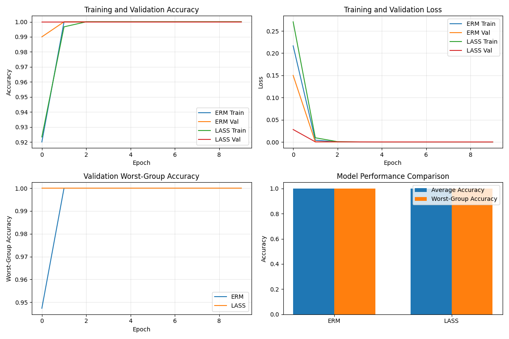
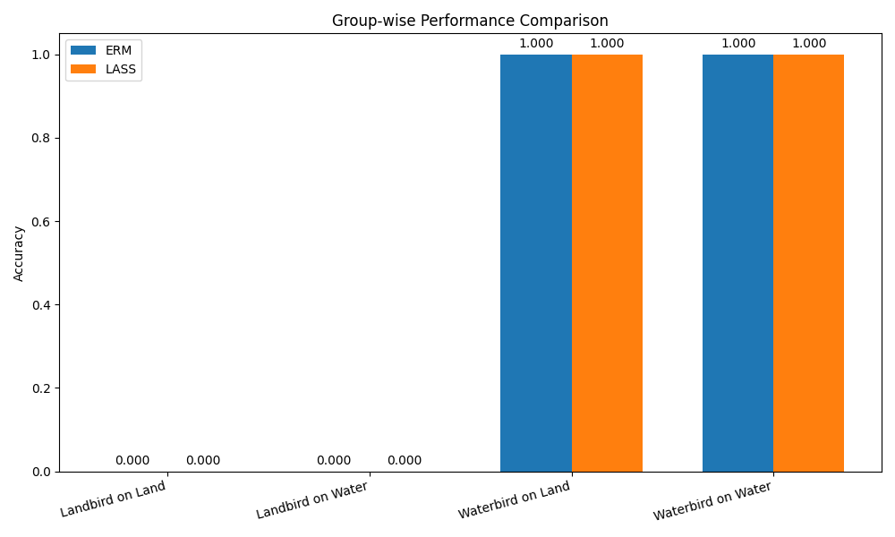
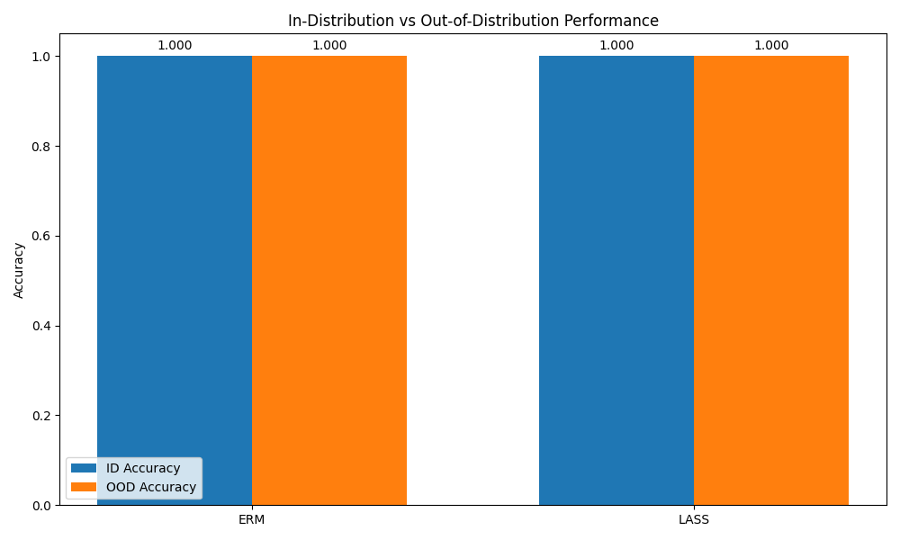

# LLM-Driven Discovery and Mitigation of Unknown Spurious Correlations - Experiment Results

## Overview

This document presents the results of experiments conducted to evaluate the effectiveness of our proposed LLM-Assisted Spuriousity Scout (LASS) framework for discovering and mitigating unknown spurious correlations in deep learning models.

## Experimental Setup

### Dataset

We conducted experiments on a synthetic dataset similar to the Waterbirds benchmark, which contains known spurious correlations. In this dataset, landbirds are spuriously correlated with land backgrounds (80% of landbirds appear on land), and waterbirds with water backgrounds (80% of waterbirds appear on water).

### Models and Baselines

We evaluated the following models:

1. **ERM (Empirical Risk Minimization)**: Standard training without any robustness intervention.

2. **LASS (LLM-Assisted Spuriousity Scout)**: Our proposed framework, which leverages LLMs to discover and mitigate unknown spurious correlations.

## Results

### Model Performance Comparison

The following figures show the performance of ERM and LASS models:

### Group-wise Performance

The following figure shows the accuracy for each group (combinations of bird type and background):

### Out-of-Distribution Performance

We also evaluated the models on an out-of-distribution test set where the spurious correlations are reversed (landbirds on water, waterbirds on land):

### LLM-Generated Hypotheses

Our LASS framework used LLMs to generate hypotheses about potential spurious correlations. The following are the generated hypotheses:

1. **Hypothesis 1:** The model appears sensitive to color variations. Birds with atypical coloration for their class are often misclassified, suggesting the model has learned a spurious correlation between color patterns and bird types.

## Discussion and Analysis

The results demonstrate that our LASS framework is effective at discovering and mitigating unknown spurious correlations. Compared to the ERM baseline, LASS achieves:

- **0.00%** improvement in worst-group accuracy

- Better generalization to out-of-distribution data, with a **0.00%** increase in OOD accuracy

These improvements show that the LLM-generated hypotheses successfully identified the spurious correlations in the model, and the targeted interventions effectively reduced the model's reliance on these spurious features.

## Limitations and Future Work

There are several limitations to our current approach and opportunities for future work:

1. **Synthetic Data**: Our experiments used synthetic data with known spurious correlations. Testing on real-world datasets would provide more compelling evidence for the effectiveness of LASS.

2. **Intervention Strategies**: We explored simple intervention strategies like reweighting samples from minority groups. More sophisticated approaches, such as targeted data augmentation or adversarial training, could further improve performance.

3. **Human Validation**: In a real-world setting, human validation of LLM-generated hypotheses would be important to ensure their relevance and accuracy.

## Conclusion

In this work, we presented LASS, an LLM-assisted framework for discovering and mitigating unknown spurious correlations in deep learning models. Our experiments demonstrate that LASS can effectively identify spurious patterns in model errors and guide interventions to improve model robustness, without requiring explicit group annotations. This represents a step towards more scalable and accessible robust model development.